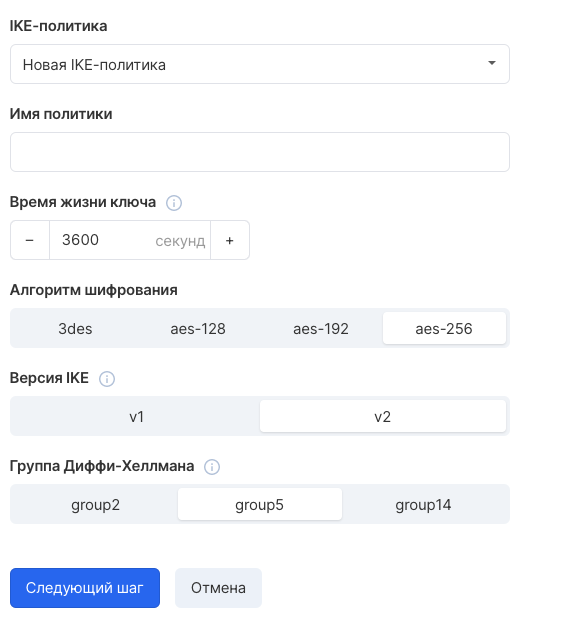
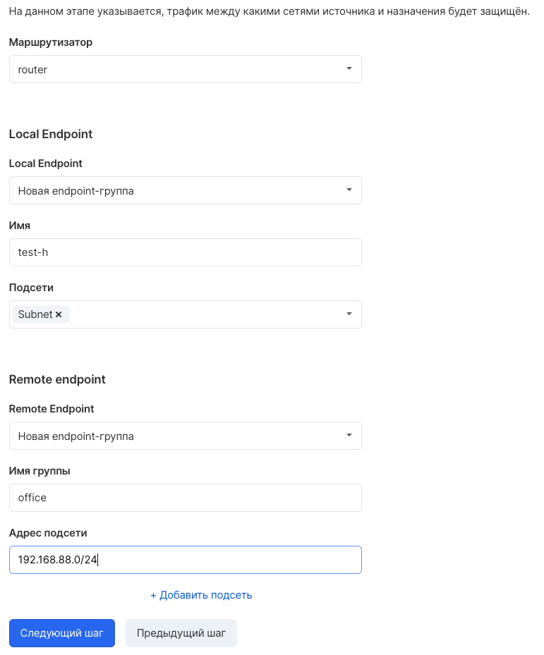
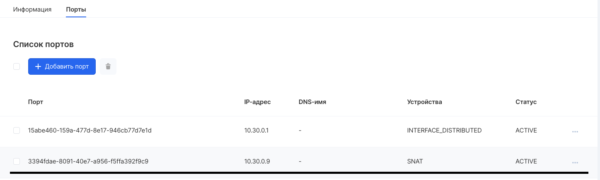
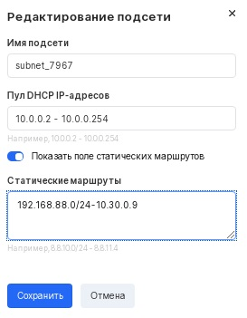

## Description

VK CS provides Site-to-Site IPsec VPN as a service that connects the client's remote network and the project's private network.

Service works for networks connected to VK CS router, based on strongSwan software.

**Information**

You can get the service log from VK CS by contacting technical support.

## Creature

To create a connection in your [VK CS account](https://mcs.mail.ru/app/services/server/vpn-tunnels/) , go to the "VPN" page of the "Virtual Networks" service and select "Add" in the top menu. The New VPN Wizard will open:

The first step is to configure the IKE connection parameters. On the service side, only main connection establishment mode is supported.

The second step requires setting the key lifetime, choosing a Diffie-Hellman group and an encryption algorithm.

At the third step, you need to select an existing router, specify the parameters of the local endpoint group from the side of the VK CS project and the remote one from the side of the client's network:

In the fourth step, the tunnel name is configured, the remote router address is the routable address of the client equipment and the PSK key:

**Allowed PSK characters:**

Capital and lowercase letters of the Latin alphabet, numbers, symbols! "# $% & () \* +, -.:; <=>? @ [] ^ \_\` {} ~

The key must contain at least one letter or number, in addition to special characters.

After clicking Create VPN Tunnel, the tunnel creation process will begin.

## Setting up routes

For the connection to work correctly, in addition to configuring the remote side equipment, it is necessary to configure routes for the client's network and the VK CS design network: traffic to the client's network from virtual machines must go through a port with an IP address corresponding to the "SNAT" router port.

1.  It is possible to find the port and its IP address in the Networks section → <private network name> → Select the required subnet → Ports (The device is designated "SNAT").
2.  After receiving the SNAT port address, specify the route in the network properties:

    In the "Networks" section, select a network, go to the settings of the required subnet. In the subnet configuration window, select the "Show static routes field" item and enter a route to the remote network in the format <network address> - <SNAT port address>:

3.  After saving the settings, renew the DHCP lease on the virtual machines on the specified subnet.

## Terraform creation

Typically, when using Terraform, it becomes necessary to establish a VPN between Terraform and other networks on the Cloud Solutions service that use the IPSec protocol.

Using Terraform, you need to create a VPN gateway and a client gateway with remote network settings as far as possible.

Then create a VPN connection and a corresponding route.

**The VPN creation code in Terraform** looks like this:

Create an IKE policy:

```
 resource "openstack_vpnaas_ike_policy_v2" "policy" {
# Ike policy name
name = "ike_policy"

# Integrity Algorithm
# Valid values are sha1, sha256, sha384, sha512.
auth_algorithm = "sha1"

# Encryption algorithm
# Valid values are 3des, aes-128, aes-192, aes-256
encryption_algorithm = "aes-256"

# Used by the Diffie-Hellman group.
# Higher numbered groups use longer key lengths, which increases security.
# Valid values are group2, group5, group14.
pfs = "group5"

# IKE version
# The version of the IKE protocol being used. Versions are incompatible.
# It is recommended to use the current version (IKEv2).
ike_version = "v2"

# IKE key lifetime (IKE SA).
# It is recommended to set the value,
# exceeding that for IPsec keys (CHILD SA ESPAH).
# Configuration may differ between participants in an IPsec connection.
# Default 3600
lifetime {
units = "seconds"
value = 3600
}
}
```

We create an IPSEC policy:

```
 resource "openstack_vpnaas_ipsec_policy_v2" "policy" {
# Ipsec policy name
name = "ipsec_policy"

# Integrity Algorithm
# Valid values are sha1, sha256, sha384, sha512.
auth_algorithm = "sha1"

# Encapsulation mode
# Valid values for tunnel and transport
encapsulation_mode = "tunnel"

# Encryption algorithm
# Valid values are 3des, aes-128, aes-192, aes-256
encryption_algorithm = "aes-256"

# Diffie-Hellman Group
# Used group Diffie-Hellman, higher numbered groups
# use long key lengths to increase security.
# Valid values are group2, group5, group14.
pfs = "group5"

# Transport protocol
# Valid values are esp, ah and ah-esp
transform_protocol = "esp"

# IKE key lifetime (IKE SA).
# It is recommended to set a value higher than that for IPsec keys (CHILD SA ESPAH).
# Configuration may differ between participants in an IPsec connection.
# Default 3600
lifetime {
units = "seconds"
value = 3600
}
}
```

Add a router that will be used as a gateway to access the project's internal network:

```
 resource "openstack_vpnaas_service_v2" "service" {
# The router to be used for routing
# to the internal network
router_id = "2068c8f6-497c-4ef4-a3b8-1229db3739f8"
# We indicate to the service that it is up
admin_state_up = "true"
}
```

Add a local endpoint group:

```
 resource "openstack_vpnaas_endpoint_group_v2" "local_group" {
# Local endpoint group name
name = "local_enpoint"
# Valid values for subnet and cidr
# The subnet is the subnet id
type = "subnet"
# List of subnets or cidr mask
endpoints = [
"01a79bc6-8fed-49b6-b94b-25c97a12ccdb",
"1cc6714e-e917-4724-a495-edf673d4b8cf",
"33bdf637-ec7d-4540-b2c2-181e4d47f44a",
"42d36b9d-1e3c-4832-9c0b-bfc87b1a9374"
]
}
```

Add a remote endpoint group:

```
 resource "openstack_vpnaas_endpoint_group_v2" "remote_group" {
# Name of the remote endpoint group
name = "remote_enpoint"
type = "cidr"
# Remote subnet address
endpoints = [
"192.168.0.0/24",
]
}
```

We create a connection:

```
 resource "openstack_vpnaas_site_connection_v2" "connection" {
# Tunnel name
name = "tunnel"
# Sharing Key (PSK)
psk = "MViK7FSyhiweGkGF"
peer_address = "192.168.0.1"
# IP address of the remote router
# Used with PSK to identify the remote gateway.
peer_id = "192.168.0.1"
ikepolicy_id = openstack_vpnaas_ike_policy_v2.policy.id
ipsecpolicy_id = openstack_vpnaas_ipsec_policy_v2.policy.id
vpnservice_id = openstack_vpnaas_service_v2.service.id
local_ep_group_id = openstack_vpnaas_endpoint_group_v2.local_group.id
peer_ep_group_id = openstack_vpnaas_endpoint_group_v2.remote_group.id
}
```
