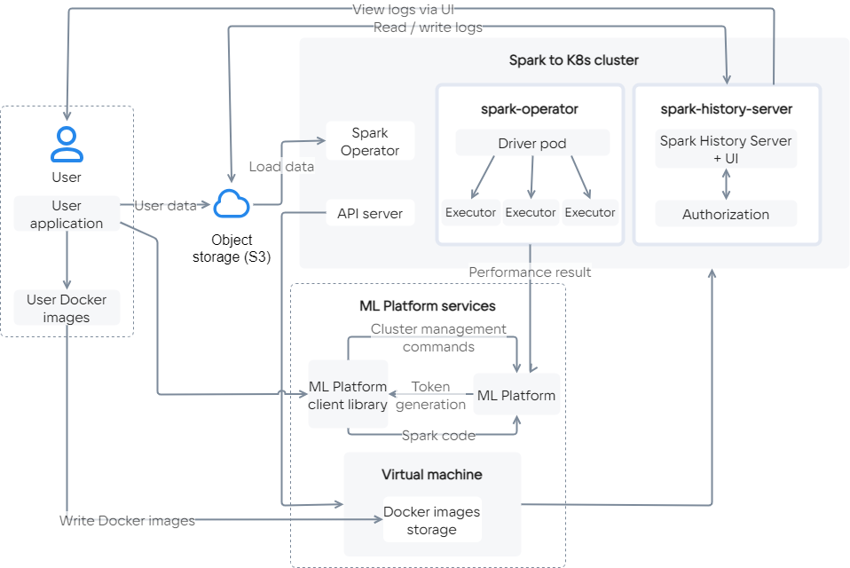

Apache Spark is a core for processing big data. It consists of APIs in Java, Scala, Python and R, as well as processing tools [Spark SQL](https://spark.apache.org/docs/latest/sql-programming-guide.html) for SQL, [pandas API](https://spark.apache.org/docs/latest/api/python/getting_started/quickstart_ps.html), [MLlib](https://spark.apache.org/docs/latest/ml-guide.html) for machine learning, [GraphX](https://spark.apache.org/docs/latest/graphx-programming-guide.html) for processing graphs and [Structured Streaming](https://spark.apache.org/docs/latest/structured-streaming-programming-guide.html) for streaming processing. Spark is most often used as part of a Hadoop cluster.

Cloud Spark — a solution based on [Apache Spark Operator](https://github.com/GoogleCloudPlatform/spark-on-k8s-operator) and [PaaS Kubernetes](/en/base/k8s) from VK Cloud. It allows you to deploy Spark inside Kubernetes using an image from Docker Registry, without using a Hadoop cluster.

## What tasks is the service suitable for?

- Distributed processing of big data.
- Reading data from S3 with their further export to the database for processing (ClickHouse / Greenplum / PostgreSQL). It is also possible to transfer data from the database to S3.
- Distributed training of ML models using big data.
- Graph calculations using the [GraphX](https://spark.apache.org/docs/latest/graphx-programming-guide.html) component.

## Service features

- Deployment of the Spark cluster inside Kubernetes.
- Automatic configuration of the master nodes of the deployed clusters.
- Connecting a pre-assembled Spark image via Docker Registry.
- Horizontal and vertical cluster scaling with autoscaling support.
- Access differentiation using tokens and a role model.
- Auto-delete or put the cluster into sleep mode according to a schedule.
- [Service Management](https://mlplatform.hb.ru-msk.vkcs.cloud/mlplatform_client.tar.gz) using the API.

## Interaction of service components

