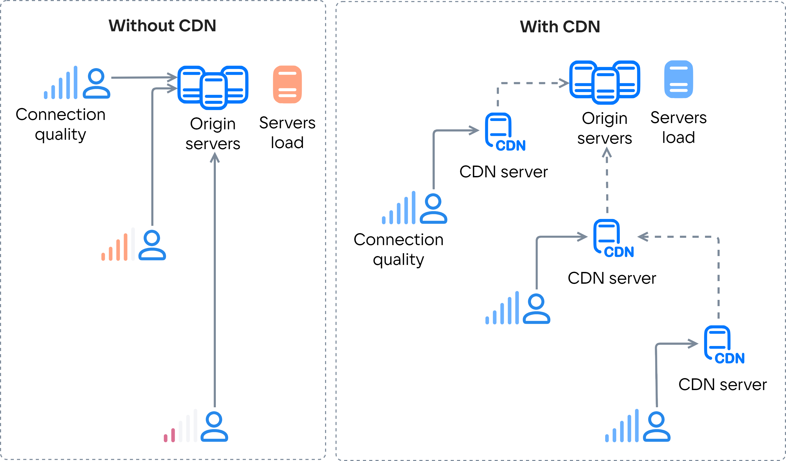

## How CDN works

CDN (Content Delivery Network) is a network of geographically distributed caching servers for content distribution.

When using a CDN, content is delivered from the CDN server closest to the user. If the necessary content is not on this server, CDN requests it from the origin servers or neighboring CDN servers. When the CDN server gets the data, the server caches it for a while. The CDN service of VK Cloud also provides the option of [preloading content](../../service-management/manage-cdn/content-settings#preloading_cache) onto CDN servers, which further reduces the load of origin servers.

The CDN service helps:

- To increase the speed and reliability of content delivery.

  Without CDN, users located far from the origin servers may have difficulties in accessing content. For example, there might be slow or unstable connection with these servers.

- To reduce the load of origin servers. There is also the capability to handle increased demand when content is requested by a lot of users.

  Without CDN, all users would send their requests to the origin servers, creating a significant load of these servers. CDN allows to transfer this load to the CDN servers and distribute it among them.

{params[noBorder=true]}

## CDN VK Cloud opportunities

- Over 46 points of presence in Europe, CIS, North and South America.
- More than 200 caching CDN servers.
- Over 700 peering partners.
- Network capacity exceeding 12 terabits per second (Tbps).
