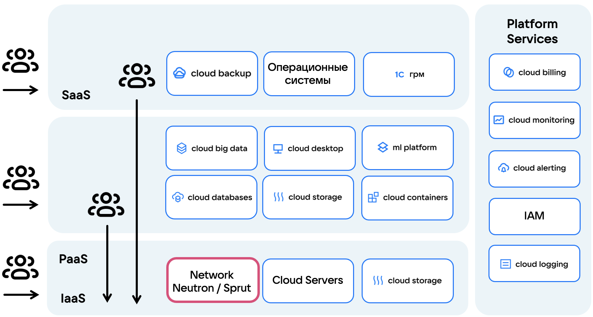
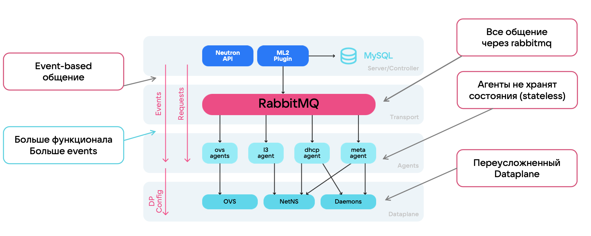

# {heading(Used SDN)[id=vnet-sdn]}

{include(/en/_includes/_translated_by_ai_en.md)}

## {heading(What is SDN)[id=vnet-sdn-concept]}

SDN (Software Defined Network, [software-defined network](https://ru.wikipedia.org/wiki/Программно-определяемая_сеть)) is an approach to network management in which the control plane is separated from the data forwarding plane.

In traditional networks, all devices (switches, routers) use their own routing tables for data transmission, whereas in SDN, the entire network is managed by a centralized controller.

This approach has the following advantages:

- Easier to manage network state and infrastructure, scale, and create fault-tolerant infrastructures.
- Easy to adapt the network to changing needs, including automating network configuration and adjustment.
- More flexible traffic processing configuration.
- Simplified inventory of network elements. For example, you can automate the removal of objects upon failure or configure network state rebalancing.
- Use of vendor-independent solutions for network management.

SDN is a tool for managing overlay networks (a virtual network on top of a physical one) and the foundation of cloud infrastructure. SDN provides routing, traffic restriction rule management, and network connectivity between services. {var(cloud)} uses its own SDN solution — {linkto(#vnet-sdn-sprut)[text=Sprut]}.

Using SDN allows for rapid configuration changes and resource migration within the infrastructure, which is a mandatory requirement for organizing a distributed infrastructure of 1000 or more servers.

SDN use cases:

- Organizing network connectivity within a project.
- Using virtual routers, networks, and subnets.
- Organizing internet access and connecting to a project from external networks.
- Managing IP addresses in a project.
- Configuring routing rules.

{params[noBorder=true]}

All services and products in the cloud architecture are connected to SDN, so it is important for {var(cloud)} to have a reliable, flexible, and fault-tolerant SDN solution.

## {heading(Sprut)[id=vnet-sdn-sprut]}

_Sprut_ is {var(cloud)}'s proprietary development, created to replace {linkto(#vnet-sdn-neutron)[text=SDN Neutron]} and fully compatible with OpenStack Neutron API. All new projects use SDN Sprut; for older projects, [migration](../../../../cases/sprut-migration) is recommended, as SDN Neutron is being deprecated.

SDN Sprut ensures stable operation of networks and network functions on top of these networks at large scales.

Distinctive features of the SDN Sprut architecture:

- Instead of a message queue, HTTP REST API is used, which ensures synchronous communication between components.
- All agents store their current state. Agents receive the target state from the SDN controller, which they must be in, and bring their state to the required one.
- A microservice architecture is implemented. Each service is responsible for its own functionality and can be deployed independently of others.
- A multi-layer architecture allowed optimizing the data plane (dataplane).
- A closed-loop control allows the system to automatically adapt for reliable operation of the cloud platform.

The diagram shows a comparison of the SDN Neutron and SDN Sprut architectures.

{params[noBorder=true]}

{note:info}
If you want to connect SDN Sprut to your project, contact [technical support](mailto:support@mcs.mail.ru).

If you want to migrate your cloud resources to SDN Sprut, use the [migration documentation](../../../../cases/sprut-migration).
{/note}

Additional materials about SDN Sprut:
  
- talk [How to choose SDN for high loads](https://www.youtube.com/watch?v=iqSXRZ8b_bk);
- articles on Habr:

  - [How we wrote SDNs at VK Cloud](https://habr.com/ru/companies/vk/articles/763760/);
  - [How cloud networks work and how they differ from On-premise](https://habr.com/ru/company/vk/blog/656797/).

## {heading(Neutron)[id=vnet-sdn-neutron]}

_Neutron_ is an SDN that is part of the OpenStack platform and integrated with its other components (VMs, storage, identity). SDN Neutron in {var(cloud)} is being deprecated and is not connected for new projects. SDN Neutron is also not used in the {linkto(../../../../intro/start/concepts/architecture#architecture-az)[text=availability zone]} `PA2`.

Features of the SDN Neutron architecture:

- Interaction between SDN components occurs asynchronously and is event-based.
- Events are processed through RabbitMQ.
- Network automation and management is done through Neutron API.
- Uses plugins that are responsible for implementing various network services and supporting different technologies ([VLAN](https://ru.wikipedia.org/wiki/VLAN), [VXLAN](https://ru.wikipedia.org/wiki/Virtual_Extensible_LAN), [GRE](https://ru.wikipedia.org/wiki/GRE_(%D0%BF%D1%80%D0%BE%D1%82%D0%BE%D0%BA%D0%BE%D0%BB)), [geneve](https://www.protokols.ru/WP/wp-content/uploads/2020/11/rfc8926.pdf), [Flat](https://opg.optica.org/jocn/abstract.cfm?uri=jocn-9-3-b90)).
- Information about network objects and configuration is stored in a database.
- Uses various agents for data forwarding.

By default, the following network services are available in SDN Neutron:

- virtual routers;
- load balancers;
- VPN;
- DNS;
- security groups.

The diagram shows the architecture and workflow of SDN Neutron.

{params[noBorder=true]}

For a long time, {var(cloud)} used only SDN Neutron, which created the following problems and limitations:

- The Neutron architecture is difficult to scale and does not allow efficient expansion of the cloud infrastructure.
- The number of events grows due to the overly complex data plane (dataplane).
- Due to the large volume, events are lost in the RabbitMQ queue.
- It is difficult or impossible to add new functionality.
- Many agents do not store their state and are poorly synchronized.
- SDN Neutron handles large network rebuilds (full-sync) poorly.

The solution to the scalability and reliability problems of SDN Neutron was the development of the proprietary {linkto(#vnet-sdn-sprut)[text=SDN Sprut]}.