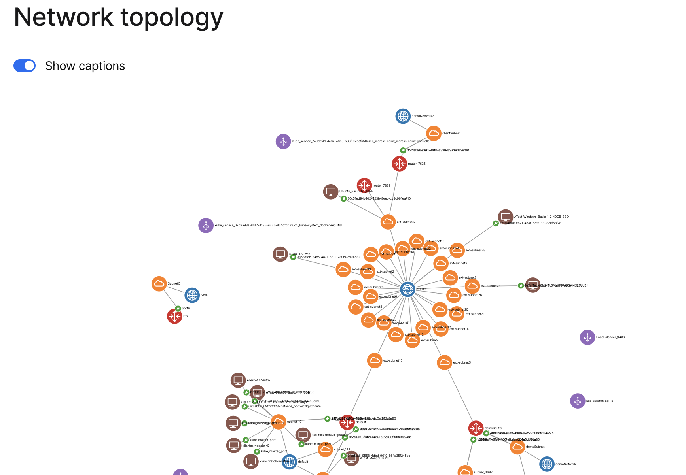

A network topology is a diagram of the network connectivity of virtual machines. It shows the following elements, as well as all the links between them:

- networks;
- subnets;
- routers;
- virtual machines.

To view the network topology of an individual project:

1. Go to VK Cloud [personal account](https://msk.cloud.vk.com/app/en).
1. Select the project.
1. Go to **Virtual networks** → **Network topology**.

## Topology management

Available network topology operations:

- *Move*. Use the arrows in the upper right corner or hold the left mouse button and move the diagram in the required direction.
- *Scaling*. Use **+** and **-** in the upper right corner of the diagram or scroll with the mouse wheel.
- *Hide or show signatures*. Use the **Show labels** switch in the upper left corner of the diagram.
- *View item details*. Click on the schematic element with the left mouse button. Options will be displayed:

  - **Name** — name of the selected element.
  - **ID** — element identifier in the system.
  - **Type** — type of the selected element:

    - network;
    - subnet;
    - instance;
    - router;
    - balancer;
    - port.

  - **Status** — state of the selected element. Not shown for subnet. <!-- todo fill in possible statuses-->

  - Additional options depending on the element type.
  - Link to go to the item in your account. Not displayed for ports.
