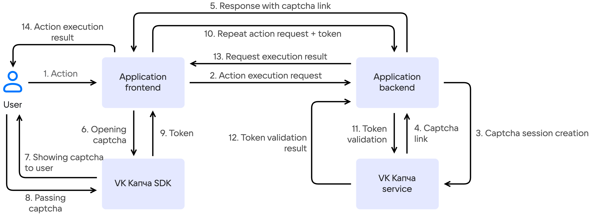

# {heading(About the service)[id=captcha-concepts-about]}

{include(/en/_includes/_translated_by_ai_en.md)}

VK Капча is a service that determines in real time whether an application user is a human. The service protects key interaction points with users — authorization, registration, API endpoints — from automated attacks. Such attacks include:

- mass registration of fake accounts;
- brute force password attacks;
- automated message submission via web forms;
- content scraping;
- application-layer DDoS attacks.

The service filters out bots and accurately verifies legitimate users with minimal user effort. The service infrastructure includes SDKs for web applications, iOS, and Android, as well as a backend API.

## {heading(How the service works)[id=captcha-about-how-it-works]}

{params[noBorder=true]}

1. The user performs an action in the application.

1. The application frontend sends a request to execute this action to the backend.

1. The application backend checks whether a captcha needs to be shown for this request. If yes, the backend calls {linkto(../../../../tools-for-using-services/api/api-spec/captcha-api#api-spec-captcha)[text=VK Капча API]} to create a captcha session.

1. The VK Капча service returns a link to launch the captcha widget on the application frontend.

1. The application backend sends the received link to the frontend.

1. The application frontend passes the link to {linkto(../reference-sdk#captcha-concepts-reference-sdk)[text=VK Капча SDK]} to display the captcha widget to the user.

1. {linkto(../reference-sdk#captcha-concepts-reference-sdk)[text=VK Капча SDK]} displays the captcha widget to the user.

1. The user passes the verification. During the captcha process, the service analyzes the user's behavior and evaluates the {linkto(#captcha-about-trust-score)[text=user trust level]} (trust score).

1. After successful captcha completion, {linkto(../reference-sdk#captcha-concepts-reference-sdk)[text=VK Капча SDK]} returns a `success-token` to the frontend — a cryptographically secured token confirming that the user has passed the verification. If the user fails the captcha, an error is returned instead of the token.

1. The application frontend sends a repeated request to the backend to execute the user action, containing the `success-token`.

1. The application backend sends the `success-token` to {linkto(../../../../tools-for-using-services/api/api-spec/captcha-api#api-spec-captcha)[text=VK Капча API]} for verification.

1. The VK Капча service confirms the token validity.

1. The application backend processes the original user action and sends the result to the frontend.

1. The user is shown the result of the action execution.

## {heading(Captcha types)[id=captcha-about-types]}

Three captcha types are available in the VK Капча service:

- Checkbox — one-click verification. Minimal interaction, suitable for most scenarios.
- Slider — a visual task on an image grid that requires human perception and logic.
- Audio (sound) — an audio task: listen to an audio track and enter the recognized word.

The captcha type can be specified when creating a captcha session, or it can be selected automatically based on the user trust level assessment.

With automatic captcha selection, if the service evaluates the user as trusted, a checkbox captcha will be offered. Otherwise, the service escalates the difficulty and offers a slider captcha or an audio captcha.

## {heading(User trust level)[id=captcha-about-trust-score]}

The VK Капча service determines the user trust level in real time by combining several groups of signals:

- Behavioral signals.

  ML models analyze user behavior: cursor trajectories, click patterns, reaction speed, chronology and sequence of actions. Based on this data, a digital user profile (fingerprint) is formed, which persists between sessions. Bots imitating humans leave distinctive attributes that the ML model recognizes.

- Intensity and environment signals.

  The service examines the intensity of user request transmission and the execution environment on the user's side: device characteristics, browser configuration, available APIs. By analyzing the received data, the service identifies automated environments: headless browsers, emulators, virtual machine farms.

The final trust level assessment determines the {linkto(#captcha-about-types)[text=captcha type]} that the user needs to pass.

## {heading(System requirements)[id=captcha-about-requirements]}

{include(../../../../_includes/_captcha-requirements.md)[tags=captcha-req-browser]}

iOS:

{include(../../../../_includes/_captcha-requirements.md)[tags=captcha-req-ios]}

Android:

{include(../../../../_includes/_captcha-requirements.md)[tags=captcha-req-android]}