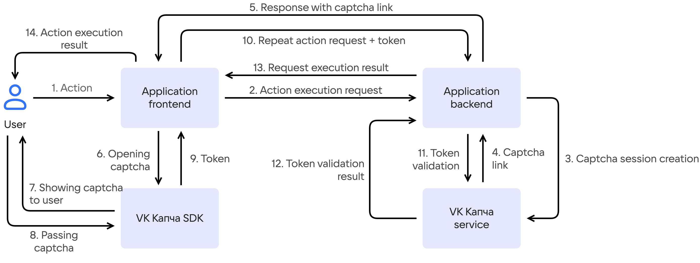
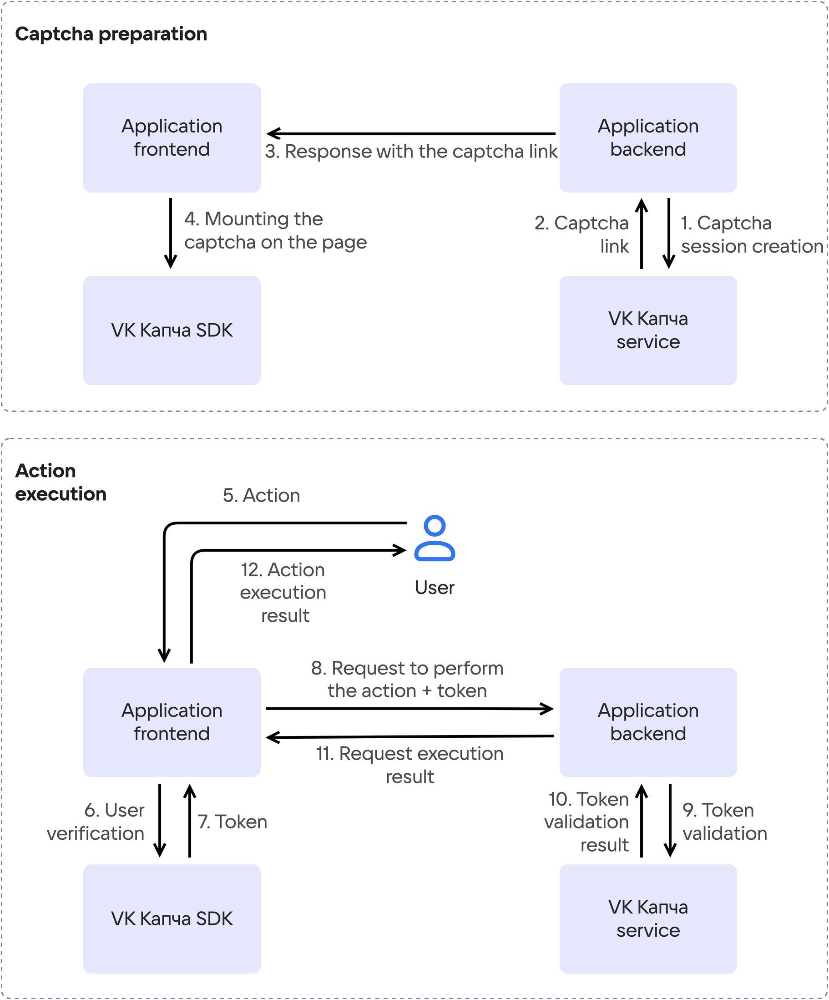

# {heading(About the service)[id=captcha-concepts-about]}

{include(/en/_includes/_translated_by_ai_en.md)}

VK Капча is a service that determines in real time whether an application user is human. The service protects key user interaction points — authorization, registration, API endpoints — from automated attacks. Such attacks include:

- mass registration of fake accounts;
- brute force password attacks;
- automated message submission via web forms;
- content scraping;
- application-level DDoS attacks.

The service filters out bots and verifies legitimate users with minimal involvement on their part. The service infrastructure includes SDKs for web applications, iOS, and Android, as well as a backend API. Verification can be initiated either by the backend or by the application frontend.

## {heading(How the service works)[id=captcha-about-how-it-works]}

The service supports two integration scenarios: {linkto(#captcha-about-backend-first)[text=backend-initiated verification]} and {linkto(#captcha-about-frontend-first)[text=frontend-initiated verification]}.

### {heading(Backend-initiated captcha)[id=captcha-about-backend-first]}

This is a scenario for services where the backend decides whether verification is needed: the user performs an action, the backend responds that a captcha is required, and the frontend starts verification in the handler for that response. After successful verification, the action request is sent to the backend again, but with a token of successful captcha completion.

{params[align=center; noBorder=true]}

1. The user performs an action in the application.

1. The application frontend sends a request to perform this action to the backend.

1. The application backend checks whether a captcha needs to be shown for this request. If it does, the backend calls the {linkto(../../../../tools-for-using-services/api/api-spec/captcha-api#api-spec-captcha)[text=VK Капча API]} to create a captcha session.

1. The VK Капча service returns a link for launching the captcha widget on the application frontend.

1. The application backend sends the received link to the frontend.

1. The application frontend passes the link to the {linkto(../reference-sdk#captcha-concepts-reference-sdk)[text=VK Капча SDK]} to display the captcha widget to the user.

1. The {linkto(../reference-sdk#captcha-concepts-reference-sdk)[text=VK Капча SDK]} displays the captcha widget to the user.

1. The user completes the verification. While the captcha is being completed, the service analyzes the user's behavior and evaluates the {linkto(#captcha-about-trust-score)[text=user trust level]} (trust score).

1. After successful captcha completion, the {linkto(../reference-sdk#captcha-concepts-reference-sdk)[text=VK Капча SDK]} returns the `success-token` to the frontend — a cryptographically secured token confirming that the user has passed the verification. If the user fails the captcha, an error is returned instead of the token.

1. The application frontend sends a repeated request to the backend to perform the user action, containing the `success-token`.

1. The application backend sends the `success-token` to the {linkto(../../../../tools-for-using-services/api/api-spec/captcha-api#api-spec-captcha)[text=VK Капча API]} for verification.

1. The VK Капча service confirms the token validity.

1. The application backend processes the original user action and sends the result to the frontend.

1. The user is shown the result of the action execution.

### {heading(Frontend-initiated captcha)[id=captcha-about-frontend-first]}

This is a scenario for services where the frontend starts verification: the link for launching the captcha widget is obtained in advance, before the user's target action. Verification is performed before the action request is sent, so the token is sent along with that request right away — no repeated request is required. This scenario is available only for web applications and supports the {linkto(#captcha-about-types)[text=invisible captcha]}.

{params[align=center; width=70%; noBorder=true]}

1. The application backend calls the {linkto(../../../../tools-for-using-services/api/api-spec/captcha-api#api-spec-captcha)[text=VK Капча API]} to create a captcha session.

1. The VK Капча service returns a link for launching the captcha widget to the backend.

1. The application backend sends the received link to the frontend.

1. The application frontend passes the link to the {linkto(../reference-sdk#captcha-concepts-reference-sdk)[text=VK Капча SDK]}, which mounts the captcha widget on the page. For the invisible captcha, verification runs in the background.

1. The user performs the target action.

1. The user completes the verification. While the captcha is being completed, the service analyzes the user's behavior and evaluates the {linkto(#captcha-about-trust-score)[text=user trust level]} (trust score).

1. After successful captcha completion, the {linkto(../reference-sdk#captcha-concepts-reference-sdk)[text=VK Капча SDK]} returns the `success-token` to the frontend — a cryptographically secured token confirming that the user has passed the verification. If the user fails the captcha, an error is returned instead of the token.

1. The application frontend sends a request to the backend to perform the user action, containing the `success-token`.

1. The application backend sends the `success-token` to the {linkto(../../../../tools-for-using-services/api/api-spec/captcha-api#api-spec-captcha)[text=VK Капча API]} for verification.

1. The VK Капча service confirms the token validity.

1. The application backend processes the user action and sends the result to the frontend.

1. The user is shown the result of the action execution.

## {heading(Captcha types)[id=captcha-about-types]}

The VK Капча service offers visible and invisible captchas.

The invisible captcha is available only in web applications and works in the {linkto(#captcha-about-frontend-first)[text=frontend-initiated captcha]} scenario. In this case, verification takes place in the background. If the service considers the user suspicious, the invisible captcha will be automatically replaced with a visible one.

The visible captcha works both in the {linkto(#captcha-about-frontend-first)[text=frontend-initiated captcha]} scenario and in the {linkto(#captcha-about-backend-first)[text=backend-initiated captcha]} scenario. Three types of visible captcha are available:

- Checkbox — one-click confirmation. Minimal interaction, suitable for most scenarios.
- Slider — a visual task on an image grid that requires human perception and logic.
- Sound — an audio task: listen to an audio track and enter the recognized word.

The visible captcha type can be specified when creating a captcha session, or it can be selected automatically based on the user trust level assessment. With automatic captcha selection, if the service considers the user trusted, a checkbox captcha will be offered. Otherwise, the service escalates the difficulty and offers a slider captcha or an audio captcha.

## {heading(User trust level)[id=captcha-about-trust-score]}

The VK Капча service determines the user trust level in real time by combining several groups of signals:

- Behavioral signals.

  ML models analyze user behavior: cursor trajectories, click patterns, reaction speed, chronology and sequence of actions. Based on this data, a digital user profile (fingerprint) is formed that persists between sessions. Bots imitating a human leave characteristic attributes that the ML model recognizes.

- Intensity and environment signals.

  The service examines the intensity of user requests and the execution environment on the user side: device characteristics, browser configuration, available APIs. By analyzing the collected data, the service detects an automated environment: headless browsers, emulators, virtual machine farms.

The final trust level assessment determines the {linkto(#captcha-about-types)[text=captcha type]} that the user needs to complete.

## {heading(System requirements)[id=captcha-about-requirements]}

{include(../../../../_includes/_captcha-requirements.md)[tags=captcha-req-browser]}

iOS:

{include(../../../../_includes/_captcha-requirements.md)[tags=captcha-req-ios]}

Android:

{include(../../../../_includes/_captcha-requirements.md)[tags=captcha-req-android]}

## {heading(Feedback)[id=captcha-about-feedback]}

If you have any remaining questions about the service operation or suggestions for its development, email us at [captcha@corp.vk.com](mailto:captcha@corp.vk.com).