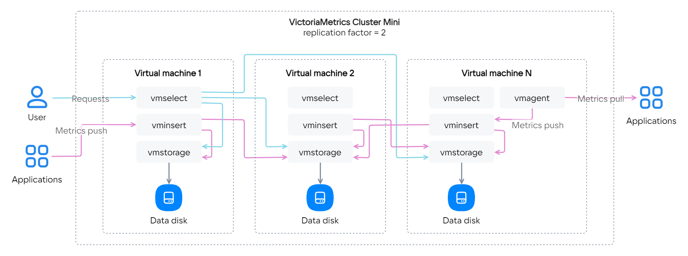

You can collect, store and analyze metrics in the time series database using the [VictoriaMetrics service](https://msk.cloud.vk.com/app/en/services/marketplace/v2/apps/service/f260ad2b-bdc1-4ccc-a35f-2f440681e0f6/latest/info/).

The instructions will help you deploy the VictoriaMetrics service (using the example of version 1.93.9) on a VM in VK Cloud and configure the collection of metrics.

By using VictoriaMetrics, you agree to the [Marketplace](/ru/additionals/start/legal/marketplace "change-lang") and [VictoriaMetrics](https://victoriametrics.com/assets/VM_EULA.pdf) license agreements.

To deploy the VictoriaMetrics service in a project:

1. [Register](/en/additionals/start/account-registration) at VK Cloud.
1. [Create](/en/networks/vnet/operations/manage-net#creating_a_network) a network, if one has not been created earlier.
1. In the [settings of the subnet](/en/networks/vnet/operations/manage-net#editing_a_subnet) where one or more servers with the deployed service will be located, disable the **Private DNS** option.
1. [Deploy](../../instructions/pr-instance-add/) service in the project by choosing the appropriate tariff plan (**Single**, **Cluster Mini**, **Cluster Maxi**):

   

    
Learn more about configurations for tariff plans

   <tabs>
   <tablist>
   <tab>Single</tab>
   <tab>Cluster Mini</tab>
   <tab>Cluster Maxi</tab>
   </tablist>
   <tabpanel>

   One server responsible for receiving, storing and processing metrics. The service is deployed on a single VM, supports vertical scaling (increasing CPU and RAM).

   

   </tabpanel>
   <tabpanel>

   A cluster of several nodes with [components](https://docs.victoriametrics.com/Cluster-VictoriaMetrics.html#architecture-overview):

   - `vminsert` — receiving metrics in various formats;
   - `vmselect` — executing queries for metrics stored within `vmstorage`;
   - `vmstorage` — storing metrics on disk.

   Additionally, you can configure [vmagent](https://docs.victoriametrics.com/vmagent.html) on any node, the executable file is included in the delivery.

   An instance of the service is deployed on a given number of nodes, each node includes all three components. All nodes in the cluster are equivalent. [Configuration type](/en/base/iaas/concepts/vm-concept#flavors) and the disk size is set to be the same for all nodes in the cluster. Supports vertical (increasing CPU and RAM) and horizontal (adding nodes) scaling.

   

   </tabpanel>
   <tabpanel>

   A cluster of several nodes with [components](https://docs.victoriametrics.com/Cluster-VictoriaMetrics.html#architecture-overview):

   - `vminsert` — receiving metrics in various formats;
   - `vmselect` — executing queries for metrics stored within `vmstorage`;
   - `vmstorage` — storing metrics on disk.

   Additionally, you can configure [vmagent](https://docs.victoriametrics.com/vmagent.html) on any node, the executable file is included in the delivery.

   An instance of the service is deployed on a specified number of nodes, each node includes only one of the components. [Configuration type](/en/base/iaas/concepts/vm-concept#flavors) and the disk size is set individually for each node of the cluster. Supports vertical (increasing CPU and RAM) and horizontal (adding nodes) scaling.

   

   </tabpanel>
   </tabs>

   

   <tabs>
   <tablist>
   <tab>Single</tab>
   <tab>Cluster Mini</tab>
   <tab>Cluster Maxi</tab>
   </tablist>
   <tabpanel>

   1. At the “Настройки VictoriaMetrics” step:

      - **Резервное копирование**: select the `no` option to not save data to the object storage [Cloud Storage](/en/base/s3). With the `yes` option, the data for the last 7 days will be copied.
      - **Сколько хранить все метрики**: specify the storage time of the metrics with the appropriate suffix: `h` (hour), `d` (day), `w` (week), `y` (year). If you do not specify a suffix, months are used as the unit of measurement. The minimum value is `24h` (`1d`), the default is `12` (12 months).
      - **Параметры дедупликаци**: specify the frequency of deleting the same metrics, use the suffixes `ms`, `s`, `m`, `h`. A metric is a collection of the metric itself and its metadata. For example, the metrics `cpu{host=hostname1}` and `cpu{host=hostname2}` are considered different. The default value is `1ms`.

   1. Click the **Next step** button.
   1. At the “Параметры сервера” step:

      - **Сеть**: select the previously created network and subnet.
      - **Availability zone**: select which of the data centers the VM will be running in.
      - **Type of virtual machine**: select the preset VM configuration. For more information, see [Cloud Servers service overview](/en/base/iaas/concepts/vm-concept#flavors).
      - For the system disk and data disk:

        - **Disk size**: specify the desired VM disk size in gigabytes.
        - **Disk Type**: select one of the values — HDD, SSD or High-IOPS SSD. For more information, see [Cloud Servers service overview](/en/base/iaas/concepts/vm-concept#disks).

   1. Click the **Next step** button.
   1. At the “Confirmation” step, review the calculated cost of the service and click **Connect the tariff**.

   </tabpanel>
   <tabpanel>

   1. At the “Настройки VictoriaMetrics” step:

      - **Резервное копирование**: select the `no` option to not save data to the object storage [Cloud Storage](/en/base/s3). With the `yes` option, the data for the last 7 days will be copied.
      - **Replication factor**: specify the number of copies of metrics that will be recorded in `vmstorage` on different VMs.
      - **Сколько хранить все метрики**: specify the storage time of the metrics with the appropriate suffix: `h` (hour), `d` (day), `w` (week), `y` (year). If you do not specify a suffix, months are used as the unit of measurement. The minimum value is `24h` (`1d`), the default is `12` (12 months).
      - **Параметры дедупликаци**: specify the frequency of deleting the same metrics, use the suffixes `ms`, `s`, `m`, `h`. A metric is a collection of the metric itself and its metadata. For example, the metrics `cpu{host=hostname1}` and `cpu{host=hostname2}` are considered different. The default value is `1ms`.

   1. Click the **Next step** button.
   1. At the “Параметры серверов” step:

      - **Количество серверов**: specify the number of VMs to deploy in the cluster.
      - **Сеть**: select the previously created network and subnet.
      - **Availability zone**: select which of the data centers the VM will be running in.
      - **Type of virtual machine**: select the preset VM configuration. For more information, see [Cloud Servers service overview](/en/base/iaas/concepts/vm-concept#flavors).
      - For the system disk and data disk:

        - **Disk size**: specify the desired VM disk size in gigabytes.
        - **Disk Type**: select one of the values — HDD, SSD or High-IOPS SSD. For more information, see [Cloud Servers service overview](/en/base/iaas/concepts/vm-concept#disks).

   1. Click the **Next step** button.
   1. At the “Confirmation” step, review the calculated cost of the service and click **Connect the tariff**.

   </tabpanel>
   <tabpanel>

   1. На шаге «Настройки Кластера»:

      - **Резервное копирование**: select the `no` option to not save data to the object storage [Cloud Storage](/en/base/s3). With the `yes` option, the data for the last 7 days will be copied.
      - **Replication factor**: specify the number of copies of metrics that will be recorded in `vmstorage` on different VMs.
      - **Сколько хранить все метрики**: specify the storage time of the metrics with the appropriate suffix: `h` (hour), `d` (day), `w` (week), `y` (year). If you do not specify a suffix, months are used as the unit of measurement. The minimum value is `24h` (`1d`), the default is `12` (12 months).
      - **Параметры дедупликаци**: specify the frequency of deleting the same metrics, use the suffixes `ms`, `s`, `m`, `h`. A metric is a collection of the metric itself and its metadata. For example, the metrics `cpu{host=hostname1}` and `cpu{host=hostname2}` are considered different. The default value is `1ms`.

   1. Click the **Next step** button.
   1. At the “Общие параметры” step:

      - **Сеть**: select the previously created network and subnet.
      - **Availability zone**: select which of the data centers the VM will be running in.
      - **Disk size**: specify the desired VM disk size in gigabytes.
      - **Disk Type**: select one of the values — HDD, SSD or High-IOPS SSD. For more information, see [Cloud Servers service overview](/en/base/iaas/concepts/vm-concept#disks).

   1. Click the **Next step** button.
   1. At the “Параметры компонентов” step:

      - For each of the `vmselect`, `vminsert` and `vmstorage` components, specify the number of deployed VMs in the cluster and [the type of virtual machine](/en/base/iaas/concepts/vm-concept#flavors).
      - For the data disk for `vmstorage`:

        - **Disk size**: specify the desired VM disk size in gigabytes.
        - **Disk Type**: select one of the values — HDD, SSD or High-IOPS SSD. For more information, see [Cloud Servers service overview](/en/base/iaas/concepts/vm-concept#disks).

   1. At the “Confirmation” step, review the calculated cost of the service and click **Connect the tariff**.

   </tabpanel>
   </tabs>

   After the installation is completed, a one-time link with access will be sent to your email.

1. Follow the link from the email.
1. Save the data to access VictoriaMetrics.

   <info>

   If you have not saved the access data, [generate](../../instructions/pr-instance-manage#updating_access_to_a_service_instance) new one.

   </info>

1. (Optional) Configure the collection of metrics depending on the selected configuration:

   - **Single**: use the [instructions from the official documentation](https://docs.victoriametrics.com/Single-server-VictoriaMetrics.html#how-to-scrape-prometheus-exporters-such-as-node-exporter).
   - **Cluster Mini** and **Cluster Maxi**: use the [vmagent](https://docs.victoriametrics.com/vmagent.html) utility.

   For the extended configuration of the service, use the official instructions [VictoriaMetrics](https://docs.victoriametrics.com/guides/).
