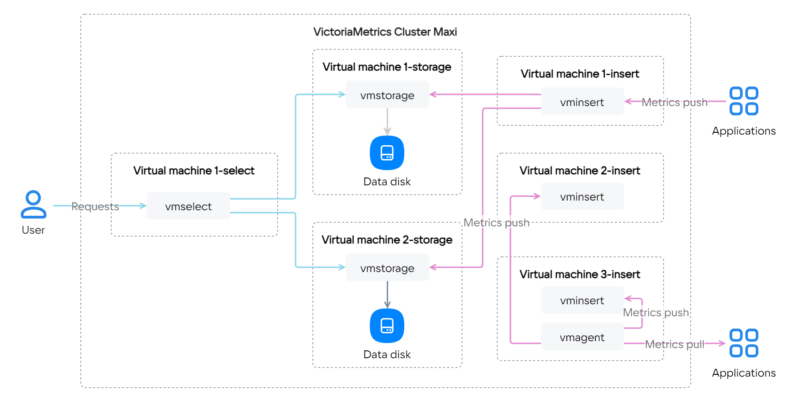

{include(/kz/_includes/_translated_by_ai.md)}

[VictoriaMetrics](https://kz.cloud.vk.com/app/services/marketplace/v2/apps/service/f260ad2b-bdc1-4ccc-a35f-2f440681e0f6/latest/info) сервисінің көмегімен уақыт қатарлары дерекқорында (time series database) метрикаларды жинай, сақтай және талдай аласыз.

Нұсқаулық VictoriaMetrics сервисін (1.93.9 нұсқасы мысалында) VK Cloud-тағы ВМ-ге өрістетіп, метрикаларды жинауды баптауға көмектеседі.

VictoriaMetrics пайдалану арқылы сіз [Marketplace](/kz/start/legal/vk/marketplace) және [VictoriaMetrics](https://victoriametrics.com/assets/VM_EULA.pdf) лицензиялық келісімдерімен келісесіз.

Жобада VictoriaMetrics сервисін өрістету үшін:

1. [Тіркеліңіз](/kz/intro/onboarding/account) VK Cloud-та.
1. Егер желі бұрын жасалмаған болса, [желі жасаңыз](/kz/networks/vnet/instructions/net#vnet-net-add).
1. Өрістетілген сервисі бар бір немесе бірнеше сервер орналастырылатын [ішкі желі баптауларында](/kz/networks/vnet/instructions/net#vnet-net-subnet-edit) **Жеке DNS** опциясын өшіріңіз.
1. Тиісті тарифтік жоспарды (**Single**, **Cluster Mini**, **Cluster Maxi**) таңдап, жобада сервисті [өрістетіңіз](../../instructions/pr-instance-add):

   {cut(Тарифтік жоспарлар конфигурациялары туралы толығырақ)}

   {tabs}

   {tab(Single)}

   Метрикаларды қабылдауға, сақтауға және өңдеуге жауап беретін бір сервер. Сервис бір ВМ-де өрістетіледі, тік масштабтауды (CPU және RAM арттыру) қолдайды.

   

   {/tab}

   {tab(Cluster Mini)}

   [Компоненттері](https://docs.victoriametrics.com/Cluster-VictoriaMetrics.html#architecture-overview) бар бірнеше түйіннен тұратын кластер:

   - `vminsert` — әртүрлі форматтардағы метрикаларды қабылдау;
   - `vmselect` — `vmstorage` шеңберінде сақталған метрикаларға сұрауларды орындау;
   - `vmstorage` — метрикаларды дискіде сақтау.

   Қосымша ретінде кез келген түйінде [vmagent](https://docs.victoriametrics.com/vmagent.html) баптауға болады, орындалатын файл жеткізілімге кіреді.

   Сервис данасы көрсетілген түйіндер санында өрістетіледі, әр түйін барлық үш компонентті қамтиды. Кластердегі барлық түйіндер тең дәрежелі. [Конфигурация түрі](/kz/computing/iaas/concepts/vm/flavor) мен диск өлшемі кластердің барлық түйіндері үшін бірдей орнатылады. Тік (CPU және RAM арттыру) және көлденең (түйіндер қосу) масштабтауды қолдайды.

   

   {/tab}

   {tab(Cluster Maxi)}

   [Компоненттері](https://docs.victoriametrics.com/Cluster-VictoriaMetrics.html#architecture-overview) бар бірнеше түйіннен тұратын кластер:

   - `vminsert` — әртүрлі форматтардағы метрикаларды қабылдау;
   - `vmselect` — `vmstorage` шеңберінде сақталған метрикаларға сұрауларды орындау;
   - `vmstorage` — метрикаларды дискіде сақтау.

   Қосымша ретінде кез келген түйінде [vmagent](https://docs.victoriametrics.com/vmagent.html) баптауға болады, орындалатын файл жеткізілімге кіреді.

   Сервис данасы көрсетілген түйіндер санында өрістетіледі, әр түйін тек бір компонентті қамтиды. [Конфигурация түрі](/kz/computing/iaas/concepts/vm/flavor) мен диск өлшемі кластердің әр түйіні үшін жеке орнатылады. Тік (CPU және RAM арттыру) және көлденең (түйіндер қосу) масштабтауды қолдайды.

   

   {/tab}

   {/tabs}

   {/cut}

   {tabs}

   {tab(Single)}

   1. **VictoriaMetrics баптаулары** қадамында:

      - **Сақтық көшірмелеу**: деректерді [VK Object Storage](/kz/storage/s3) объектілік қоймасына сақтамау үшін `no` нұсқасын таңдаңыз. `yes` нұсқасы таңдалса, соңғы 7 күндегі деректер көшіріледі.
      - **Барлық метрикаларды қанша уақыт сақтау керек**: қажетті жұрнақпен метрикаларды сақтау уақытын көрсетіңіз: `h` (сағат), `d` (күн), `w` (апта), `y` (жыл). Егер жұрнақ көрсетілмесе, өлшем бірлігі ретінде айлар пайдаланылады. Ең аз мән — `24h` (`1d`), әдепкі мән — `12` (12 ай).
      - **Дедупликация параметрлері**: бірдей метрикаларды жою кезеңділігін көрсетіңіз, `ms`, `s`, `m`, `h` жұрнақтарын пайдаланыңыз. Метрика — бұл метриканың өзі мен оның метадеректерінің жиынтығы. Мысалы, `cpu{host=hostname1}` және `cpu{host=hostname2}` метрикалары әртүрлі болып есептеледі. Әдепкі мән — `1ms`.

   1. **Келесі қадам** түймесін басыңыз.
   1. **Сервер параметрлері** қадамында:

      - **Желі**: бұрын жасалған желі мен ішкі желіні таңдаңыз.
      - **Қолжетімділік аймағы**: ВМ қай деректерді өңдеу орталығында іске қосылатынын таңдаңыз.
      - **Виртуалды машина түрі**: алдын ала орнатылған [ВМ конфигурациясын](/kz/computing/iaas/concepts/vm/flavor) таңдаңыз.
      - Жүйелік диск пен деректер дискісі үшін:

        - **Диск өлшемі**: ВМ дискісінің қажетті өлшемін гигабайтпен көрсетіңіз.
        - **Диск түрі**: [диск түрлерінің бірін](/kz/computing/iaas/concepts/data-storage/disk-types) таңдаңыз — HDD, SSD немесе High-IOPS SSD.

   1. **Келесі қадам** түймесін басыңыз.
   1. **Растау** қадамында сервистің есептелген құнымен танысып, **Тарифті қосу** түймесін басыңыз.

   {/tab}

   {tab(Cluster Mini)}

   1. **VictoriaMetrics баптаулары** қадамында:

      - **Сақтық көшірмелеу**: деректерді [VK Object Storage](/kz/storage/s3) объектілік қоймасына сақтамау үшін `no` нұсқасын таңдаңыз. `yes` нұсқасы таңдалса, соңғы 7 күндегі деректер көшіріледі.
      - **Replication factor**: әртүрлі ВМ-дегі `vmstorage` ішіне жазылатын метрикалар көшірмелерінің санын көрсетіңіз.
      - **Барлық метрикаларды қанша уақыт сақтау керек**: қажетті жұрнақпен метрикаларды сақтау уақытын көрсетіңіз: `h` (сағат), `d` (күн), `w` (апта), `y` (жыл). Егер жұрнақ көрсетілмесе, өлшем бірлігі ретінде айлар пайдаланылады. Ең аз мән — `24h` (`1d`), әдепкі мән — `12` (12 ай).
      - **Дедупликация параметрлері**: бірдей метрикаларды жою кезеңділігін көрсетіңіз, `ms`, `s`, `m`, `h` жұрнақтарын пайдаланыңыз. Метрика — бұл метриканың өзі мен оның метадеректерінің жиынтығы. Мысалы, `cpu{host=hostname1}` және `cpu{host=hostname2}` метрикалары әртүрлі болып есептеледі. Әдепкі мән — `1ms`.

   1. **Келесі қадам** түймесін басыңыз.
   1. **Серверлер параметрлері** қадамында:

      - **Серверлер саны**: кластерде өрістетілетін ВМ санын көрсетіңіз.
      - **Желі**: бұрын жасалған желі мен ішкі желіні таңдаңыз.
      - **Қолжетімділік аймағы**: ВМ қай деректерді өңдеу орталығында іске қосылатынын таңдаңыз.
      - **Виртуалды машина түрі**: алдын ала орнатылған [ВМ конфигурациясын](/kz/computing/iaas/concepts/vm/flavor) таңдаңыз.
      - Жүйелік диск пен деректер дискісі үшін:

        - **Диск өлшемі**: ВМ дискісінің қажетті өлшемін гигабайтпен көрсетіңіз.
        - **Диск түрі**: [диск түрлерінің бірін](/kz/computing/iaas/concepts/data-storage/disk-types) таңдаңыз — HDD, SSD немесе High-IOPS SSD.

   1. **Келесі қадам** түймесін басыңыз.
   1. **Растау** қадамында сервистің есептелген құнымен танысып, **Тарифті қосу** түймесін басыңыз.

   {/tab}

   {tab(Cluster Maxi)}

   1. **Кластер баптаулары** қадамында:

      - **Сақтық көшірмелеу**: деректерді [VK Object Storage](/kz/storage/s3) объектілік қоймасына сақтамау үшін `no` нұсқасын таңдаңыз. `yes` нұсқасы таңдалса, соңғы 7 күндегі деректер көшіріледі.
      - **Replication factor**: әртүрлі ВМ-дегі `vmstorage` ішіне жазылатын метрикалар көшірмелерінің санын көрсетіңіз.
      - **Барлық метрикаларды қанша уақыт сақтау керек**: қажетті жұрнақпен метрикаларды сақтау уақытын көрсетіңіз: `h` (сағат), `d` (күн), `w` (апта), `y` (жыл). Егер жұрнақ көрсетілмесе, өлшем бірлігі ретінде айлар пайдаланылады. Ең аз мән — `24h` (`1d`), әдепкі мән — `12` (12 ай).
      - **Дедупликация параметрлері**: бірдей метрикаларды жою кезеңділігін көрсетіңіз, `ms`, `s`, `m`, `h` жұрнақтарын пайдаланыңыз. Метрика — бұл метриканың өзі мен оның метадеректерінің жиынтығы. Мысалы, `cpu{host=hostname1}` және `cpu{host=hostname2}` метрикалары әртүрлі болып есептеледі. Әдепкі мән — `1ms`.

   1. **Келесі қадам** түймесін басыңыз.
   1. **Жалпы параметрлер** қадамында:

      - **Желі**: бұрын жасалған желі мен ішкі желіні таңдаңыз.
      - **Қолжетімділік аймағы**: ВМ қай деректерді өңдеу орталығында іске қосылатынын таңдаңыз.
      - **Диск өлшемі**: ВМ дискісінің қажетті өлшемін гигабайтпен көрсетіңіз.
      - **Диск түрі**: [диск түрлерінің бірін](/kz/computing/iaas/concepts/data-storage/disk-types) таңдаңыз — HDD, SSD немесе High-IOPS SSD.

   1. **Келесі қадам** түймесін басыңыз.
   1. **Компоненттер параметрлері** қадамында:

      - `vmselect`, `vminsert` және `vmstorage` компоненттерінің әрқайсысы үшін кластерде өрістетілетін ВМ санын және [виртуалды машина түрін](/kz/computing/iaas/concepts/vm/flavor) көрсетіңіз.
      - `vmstorage` үшін деректер дискісі бойынша:

        - **Диск өлшемі**: ВМ дискісінің қажетті өлшемін гигабайтпен көрсетіңіз.
        - **Диск түрі**: [диск түрлерінің бірін](/kz/computing/iaas/concepts/data-storage/disk-types) таңдаңыз — HDD, SSD немесе High-IOPS SSD.

   1. **Растау** қадамында сервистің есептелген құнымен танысып, **Тарифті қосу** түймесін басыңыз.

   {/tab}

   {/tabs}

   Орнату аяқталғаннан кейін поштаға қол жеткізу деректері бар бір реттік сілтеме келеді.

1. Хаттағы сілтеме бойынша өтіңіз.
1. VictoriaMetrics-ке қол жеткізу деректерін сақтаңыз.

   {note:info}

   Егер қол жеткізу деректерін сақтап үлгермесеңіз, жаңаларын [генерациялаңыз](../../instructions/pr-instance-manage#update_access).

   {/note}

1. (Опционалды) Таңдалған конфигурацияға байланысты метрикаларды жинауды баптаңыз:

   - **Single**: [ресми құжаттамадағы нұсқаулықты](https://docs.victoriametrics.com/Single-server-VictoriaMetrics.html#how-to-scrape-prometheus-exporters-such-as-node-exporter) пайдаланыңыз.
   - **Cluster Mini** және **Cluster Maxi**: [vmagent](https://docs.victoriametrics.com/vmagent.html) утилитасын пайдаланыңыз.

   Сервистің кеңейтілген конфигурациясы үшін [VictoriaMetrics](https://docs.victoriametrics.com/guides) ресми нұсқаулығын пайдаланыңыз.
