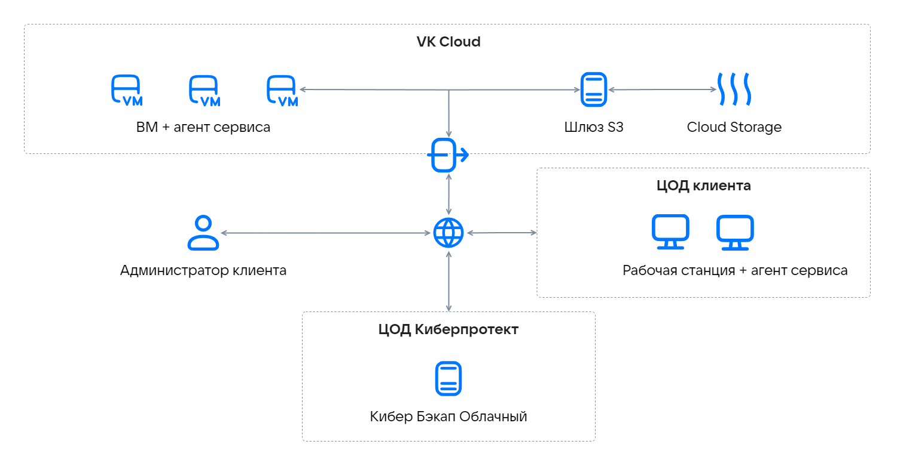

# {heading(Қызмет туралы)[id=s3-cyber-backup-about]}

{include(/kz/_includes/_translated_by_ai.md)}

S3 шлюзі [Кибер Бэкап Облачный](../../../../applications-and-services/marketplace/initial-configuration/cyber-backup-quick-start) сервисіне резервтік көшірмелерді сақтау үшін жария бұлттық [VK Object Storage](../../../../storage/s3) сервисін пайдалануға мүмкіндік береді. Бұл резервтік көшірмелерге интернет арқылы қол жеткізу мүмкіндігін қамтамасыз етеді.

VK Cloud инфрақұрылымында «Кибер Бэкап Облачный» үшін S3 шлюзін қосқанда резервтік көшірмелерді сақтауға арналған кластер құрылады, ол келесі элементтерден тұрады:

- Виртуалды машиналар. Шлюзді баптау және қосу кезінде ВМ-де кемінде бір сервер өрістетіледі. Істен шығуға төзімділікке қол жеткізу үшін бірнеше ВМ-ден тұратын кластер құрылады.
- Виртуалды дискілер.
- Резервтік көшірмелерді сақтауға арналған VK Object Storage бакеті.
- ВМ арасында жүктемені таратуға арналған сыртқы IP-мекенжайы бар желілік жүктеме теңгергіші (істен шығуға төзімді конфигурация үшін).

Қызмет архитектурасы:

{params[noBorder=true]}

Жария бұлтқа жүктеуге арналған деректер алдымен жергілікті түрде сақталады, содан кейін ғана тағайындалған орынға жіберіледі.

{note:err}
Аралық көшірмелерді сақтау үшін тұрақты жергілікті сақтау орнын пайдаланыңыз. Уақытша дискілерді пайдалану деректердің жоғалуына әкелуі мүмкін.
{/note}

Жергілікті сақтау кластерінде жеткілікті логикалық кеңістік болуы керек. Мысалы, күнделікті резервтік көшіру кезінде орын бір күнге ғана емес, кемінде бір жарым күнге жететін резервтік көшірмелерге жеткілікті болуы керек.

Резервтік көшірмелер сирек қатынайтын, бірақ сұратылған кезде бірден қолжетімді болуы тиіс, арнайы қатынау сызбасы бар суық деректер болып табылады. [VK Object Storage](../../../../storage/s3) жүйесінде резервтік көшірмелерді сақтау үшін Hotbox және Icebox сақтау класы бар бакеттер қолданылады.

Кестеде сақтау кластерін құруға арналған ВМ ең төменгі конфигурациялары көрсетілген.

[cols="1,2,2", options="header"]
|===
|Ресурстар
|Бір сервер
|Үш сервер (істен шығуға төзімді конфигурация)

|vCPU
|4
|12

|RAM (ГБ)
|8
|24

|SSD (ГБ)
|120
|360

|ВМ түрі
|Standart-4-8
|Standart-4-8
|===

Шлюзді баптауға арналған серверлер саны резервтік көшірмелерді бұлтқа беру кезіндегі өнімділікке тікелей әсер етеді. Деректер көлемі мен инфрақұрылымы үлкен ірі жобалар үшін істен шығуға төзімді кластер құру ұсынылады.

«Кибер Бэкап Облачный» үшін S3 шлюзін қосу және баптау үшін [техникалық қолдауға](/kz/contacts) хабарласыңыз. Құнды есептеу үшін резервтік көшірмесі орындалуы тиіс инфрақұрылым (ВМ) мен деректер (ГБ) көлемі туралы ақпарат беріңіз. Шлюзді өрістетуге өтінім бір жұмыс аптасының ішінде қаралады.

Шлюзді өрістету барысында сіздің VK Cloud жобаңызда қажетті бұлттық ресурстар құрылады, сондай-ақ есептік жазбалар, тенанттар және {linkto(../../../../tools-for-using-services/account/concepts/quotasandlimits)[text=квоталар]} бапталады.

Өрістетуден кейін басқару үшін Кибер Бэкап Облачный сервисінің панелі пайдаланылады.
