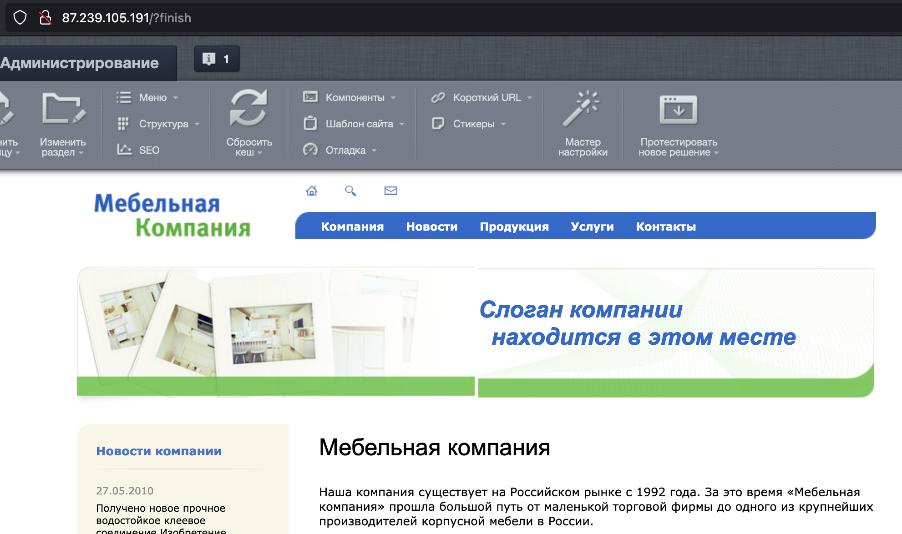

{include(/kz/_includes/_translated_by_ai.md)}

[1С-Битрикс: Управление сайтом](https://www.1c-bitrix.ru/products/cms/) — ақпараттық порталдарды, интернет-дүкендерді және корпоративтік сайттарды жасауға және қолдауға мүмкіндік беретін интернет-ресурстарды басқарудың кәсіби жүйесі.

Бұл нұсқаулық VK Cloud-та Ubuntu 22.04 операциялық жүйесінде 1С-Битрикс: Управление сайтом соңғы нұсқасын өрістетуге, сондай-ақ домендік ат арқылы қол жеткізу үшін DNS жазбасын баптауға көмектеседі. ДҚБЖ ретінде Single конфигурациясындағы MySQL 8.0 пайдаланылады.

## Дайындық қадамдары

1. VK Cloud-та [тіркеліңіз](/kz/intro/onboarding/account).
1. Интернетке қолжетімділігі бар және `10.0.0.0/24` ішкі желісі бар `network1` желісін [жасаңыз](/kz/networks/vnet/instructions/net#zhelini_zhasau).
1. [ВМ жасаңыз](/kz/computing/iaas/instructions/vm/vm-create):

   - атауы: `Ubuntu_22_04_Bitrix`;
   - операциялық жүйе: Ubuntu 22.04;
   - желі: `10.0.0.0/24` ішкі желісі бар `network1`;
   - жария IP-мекенжайын тағайындаңыз. Мысалда `87.239.105.191` пайдаланылады;
   - қауіпсіздік топтары: `default`, `ssh+www`.

1. [ДҚ инстансын жасаңыз](/kz/dbs/dbaas/instructions/create/create-single-replica):

   - атауы: `MySQL-1111`;
   - ДҚБЖ: MySQL 8.0;
   - конфигурация түрі: Single;
   - желі: `network1`;
   - ДҚ атауы: `MySQL-1111`;
   - ДҚ пайдаланушысының аты: `user`;
   - пайдаланушы құпиясөзі: `AN0r25e0ae4d626p`;

   Мысалда жасалған инстанстың ішкі IP-мекенжайы: `10.0.0.7`.

1. DNS аймағын [жасаңыз](/kz/networks/dns/instructions/publicdns/dns-zone#add).

   {note:warn}

   DNS аймағы сәтті делегацияланғанына және NS жазбалары дұрыс бапталғанына көз жеткізіңіз: аймақ **NS жазбалары дұрыс бапталған** күйінде болуы тиіс.

   {/note}

1. Бөлінген аймақта жазба [жасаңыз](/kz/networks/dns/instructions/publicdns/records#add):

   - жазба түрі: `A`;
   - атауы: мысалы, `site-bitrix.example.vk.cloud`;
   - IP-мекенжайы: ВМ-нің сыртқы мекенжайы `87.239.105.191`.

1. (Қосымша) `nslookup site-bitrix.example.vk.cloud` командасының көмегімен атаудың IP-мекенжайға шешілетінін тексеріңіз. Операция сәтті орындалған кезде шығатын нәтиже:

   ```console
   Non-authoritative answer:
   Name:   site-bitrix.example.vk.cloud
   Address: 87.239.105.191
   ```

## 1. Bitrix-ті ВМ-ге орнатыңыз

1. `Ubuntu_22_04_Bitrix` ВМ-іне [қосылыңыз](/kz/computing/iaas/instructions/vm/vm-connect/vm-connect-nix).
1. Пакеттерді өзекті нұсқаға дейін жаңартыңыз және ВМ-ді келесі командалар арқылы қайта жүктеңіз:

   ```console
   sudo dnf update -y
   sudo apt upgrade -y
   sudo systemctl reboot
   ```

1. Bitrix CMS үшін қажетті пакеттерді орнатыңыз:

   ```console
   sudo apt install apache2 apache2-utils libapache2-mod-php php8.1 php8.1-cli php8.1-curl php8.1-fpm php8.1-gd php8.1-intl php8.1-mbstring php8.1-mysql php8.1-opcache php8.1-readline php8.1-soap php8.1-xml php8.1-xmlrpc php8.1-zip php-gd -y
   ```

1. `/etc/php/8.1/apache2/php.ini` файлын тауып, ондағы параметрлердің түсіндірме белгілерін алып тастап, өзгертіңіз:

   ```txt
   short_open_tag = On

   opcache.revalidate_freq = 0

   date.timezone = Europe/Moscow
   ```

1. `/etc/apache2/sites-available/000-default.conf` файлын тауып, оған `DocumentRoot /var/www/html` блогынан кейін мына фрагментті қосыңыз:

   ```txt
   <Directory /var/www/html>
     AllowOverride All
   </Directory>
   ```

1. Веб-сервер конфигурациясында синтаксистік қателердің бар-жоғын тексеріңіз:

   ```console
   apachectl configtest
   ```

   Тексеру сәтті өткен жағдайда `Syntax OK` түріндегі хабарлама пайда болады.

1. Веб-серверді келесі команда арқылы қайта іске қосыңыз:

   ```console
   sudo systemctl restart apache2
   ```

1. Ресми сайттан «Старт» редакциясындағы Bitrix CMS репозиторийін жүктеп, оны веб-серверге тарқатыңыз:

   ```console
   cd ~
   wget https://www.1c-bitrix.ru/download/start_encode.tar.gz
   sudo rm -rf /var/www/html/*
   sudo tar xzf start_encode.tar.gz -C /var/www/html/
   sudo chown -R www-data:www-data /var/www/html/
   ```

1. Браузерде ВМ-нің жария мекенжайын енгізіңіз (осы нұсқаулықта бұл `site-bitrix.example.vk.cloud`).
1. Орнату шеберінде CMS орнату процесін бастаңыз.
1. **Лицензиялық келісім** қадамында Bitrix CMS лицензиялық келісімінің шарттарын қабылдаңыз.
1. **Тіркеу** қадамында өнімді [тіркеңіз](https://dev.1c-bitrix.ru/learning/course/index.php?COURSE_ID=32&LESSON_ID=2043&LESSON_PATH=3903.4862.4888.4538.2043).
1. **Алдын ала тексеру** қадамында барлық параметрлердің талаптарға сәйкес келетінін тексеріңіз (жасыл түспен белгіленген).
1. **Дерекқорды жасау** қадамында ДҚ үшін `MySQL-1111` параметрлерін көрсетіңіз:

   - **Сервер**: `10.0.0.7`.
   - **Дерекқор пайдаланушысы**: **Бар**.
   - **Пайдаланушы аты**: `user`.
   - **Дерекқор пайдаланушысының құпиясөзі**: `AN0r25e0ae4d626p`.
   - **Дерекқор**: **Бар**.
   - **Дерекқор атауы**: `MySQL-1111`.

1. **Өнімді орнату** қадамында өнімнің орнатылуын күтіңіз, бұл біраз уақыт алуы мүмкін.
1. [Пайда болған терезеде](https://dev.1c-bitrix.ru/learning/course/index.php?COURSE_ID=32&LESSON_ID=2059&LESSON_PATH=3903.4862.4888.4538.2059) әкімшінің тіркелгі деректерін көрсетіңіз.

## 2. Bitrix жұмыс қабілеттілігін тексеріңіз

[Әкімшінің тіркелгі деректерін көрсеткеннен кейін](https://dev.1c-bitrix.ru/learning/course/index.php?COURSE_ID=32&LESSON_ID=2059&LESSON_PATH=3903.4862.4888.4538.2059) **Сайтқа өту** түймесін басыңыз. Bitrix CMS-тің бастапқы беті ашылады.



## Пайдаланылмайтын ресурстарды жойыңыз

Өрістетілген виртуалды ресурстар тарифтелмейді. Егер олар енді қажет болмаса:

- `Ubuntu_22_04_Bitrix` ВМ-ін [жойыңыз](/kz/computing/iaas/instructions/vm/vm-manage#delete_vm).
- `MySQL-1111` ДҚ инстансын [жойыңыз](/kz/dbs/dbaas/instructions/manage-instance/mysql#bd_instansyn_nemese_onyn_hosttaryn_zhoyu).
- Қажет болса, `87.239.105.191` Floating IP-мекенжайын [жойыңыз](/kz/networks/vnet/instructions/ip/floating-ip#delete).
- Жасалған `site-bitrix.example.vk.cloud` DNS жазбасын [жойыңыз](/kz/networks/dns/instructions/publicdns/records#resurstyk_zhazbalardy_zhoyu).
