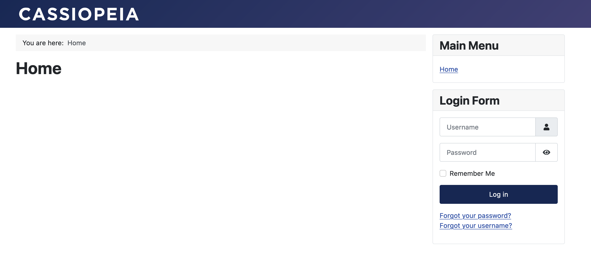

{include(/kz/_includes/_translated_by_ai.md)}

[Joomla!](https://www.joomla.org) — PHP және JavaScript тілдерінде жазылған және деректер қорының қоймасы ретінде MySQL ДҚБЖ пайдаланатын контентті басқару жүйесі (CMS).

Бұл нұсқаулық VK Cloud-та Almalinux 9 операциялық жүйесінде Joomla! 4.3.4 нұсқасындағы CMS-ті өрістетуге, сондай-ақ домендік ат арқылы қол жеткізу үшін DNS жазбасын баптауға көмектеседі. ДҚБЖ ретінде Single конфигурациясындағы MySQL 8.0 пайдаланылады.

## Дайындық қадамдары

1. VK Cloud-та [тіркеліңіз](/kz/intro/onboarding/account).
1. Интернетке қолжетімділігі бар және `10.0.0.0/24` ішкі желісі бар `network1` желісін [жасаңыз](/kz/networks/vnet/instructions/net#vnet-net-add).
1. [ВМ жасаңыз](/kz/computing/iaas/instructions/vm/vm-create):

   - атауы: `Almalinux_9_Joomla`;
   - операциялық жүйе: Almalinux 9;
   - желі: `network1` с `10.0.0.0/24` ішкі желісімен;
   - жария IP-мекенжайын тағайындаңыз. Мысалда `87.239.105.44` пайдаланылады;
   - қауіпсіздік топтары: `default`, `ssh+www`.

1. [ДҚ инстансын жасаңыз](/kz/dbs/dbaas/instructions/create/create-single-replica):

   - атауы: `MySQL-7313`;
   - ДҚБЖ: MySQL 8.0;
   - конфигурация түрі: Single;
   - желі: `network1`;
   - ДҚ атауы: `MySQL-7313`;
   - ДҚ пайдаланушысының аты: `user`;
   - пайдаланушы құпиясөзі: `AN0r25e0ae4d626p`;

   Мысалда жасалған инстанстың ішкі IP-мекенжайы: `10.0.0.7`.

1. DNS аймағын [жасаңыз](/kz/networks/dns/instructions/publicdns/dns-zone#dns-dns-zone-add).

   {note:warn}

   DNS аймағы сәтті делегацияланғанына және NS жазбалары дұрыс бапталғанына көз жеткізіңіз: аймақ **NS жазбалары дұрыс бапталған** күйінде болуы тиіс.

   {/note}

1. Бөлінген аймақта жазба [жасаңыз](/kz/networks/dns/instructions/publicdns/records#dns-records-zone-add):

   - жазба түрі: `A`;
   - атауы: мысалы, `site-joomla.example.vk.cloud`;
   - IP-мекенжайы: ВМ-нің сыртқы мекенжайы `87.239.105.44`.

1. (Қосымша) `nslookup site-joomla.example.vk.cloud` командасының көмегімен атаудың IP-мекенжайға шешілетінін тексеріңіз. Операция сәтті орындалған кезде шығатын нәтиже:

   ```console
   Non-authoritative answer:
   Name:   site-joomla.example.vk.cloud
   Address: 87.239.105.44
   ```

## 1. Joomla!-ны ВМ-ге орнатыңыз

1. `Almalinux_9_Joomla` ВМ-іне [қосылыңыз](/kz/computing/iaas/instructions/vm/vm-connect/vm-connect-nix).
1. Пакеттерді өзекті нұсқаға дейін жаңартыңыз және ВМ-ді келесі командалар арқылы қайта жүктеңіз:

   ```console
   sudo dnf update -y
   sudo systemctl reboot
   ```

1. Қажетті репозиторийлерді жүктеп, командаларды ретімен орындаңыз:

   ```console
   sudo dnf install https://dl.fedoraproject.org/pub/epel/epel-release-latest-9.noarch.rpm -y
   sudo dnf install https://rpms.remirepo.net/enterprise/remi-release-9.rpm -y
   sudo dnf module enable php:remi-8.2 -y
   sudo dnf install wget httpd php php-mysqlnd php-gd php-xml php-mbstring php-intl php-pecl-zip -y
   ```

1. httpd-демонын іске қосыңыз:

   ```console
   sudo systemctl enable httpd.service --now
   ```

1. Joomla! CMS репозиторийін жүктеп, оны іске қосылған веб-сервердегі `joomla` директориясына өрістетіңіз:

   ```console
   wget https://github.com/joomla/joomla-cms/releases/download/4.3.4/Joomla_4.3.4-Stable-Full_Package.tar.gz
   sudo mkdir -p /var/www/html/joomla
   sudo tar xzf Joomla_4.3.4-Stable-Full_Package.tar.gz -C /var/www/html/joomla/
   sudo chown -R apache:apache /var/www/html/joomla
   ```

1. Веб-сервердің дұрыс жұмыс істеуі үшін SELinux параметрлерін орнатыңыз:

   ```console
   sudo setsebool -P httpd_enable_cgi on
   sudo setsebool -P httpd_unified on
   sudo setsebool -P httpd_builtin_scripting on
   sudo setsebool -P httpd_can_network_connect on
   ```

1. Браузерде ВМ-нің жария IP-мекенжайын `/joomla` жолымен енгізіңіз. Осы нұсқаулықта бұл `site-joomla.example.vk.cloud/joomla`.
1. Орнату шеберінде орыс тілін және сайт атауын — `site-joomla.example.vk.cloud` көрсетіңіз.
1. **Тіркелгі параметрлері** қадамында CMS әкімшісінің тіркелгі деректерін көрсетіңіз.
1. **Деректер қорының параметрлері** қадамында `MySQL-7313` ДҚ параметрлерін көрсетіңіз:

   - **Тип базы данных**: **MySQL (PDO)**.
   - **Имя хоста**: `10.0.0.7`.
   - **Имя пользователя базы данных**: `user`.
   - **Пароль пользователя базы данных**: `AN0r25e0ae4d626p`.
   - **Имя базы данных**: `MySQL-7313`.

1. (Қосымша) `/var/www/html/joomla/installation` директориясында файл жасаңыз немесе жойыңыз: файл атауы және оның орналасуы орнату шеберінің қалқымалы терезесінде көрсетіледі.

## 2. Joomla! жұмыс қабілеттілігін тексеріңіз

Браузерде `http://site-joomla.example.vk.cloud/joomla/` мекенжайына өтіңіз. Орнату сәтті аяқталса, Joomla! CMS-тің бастапқы беті ашылады.



## Пайдаланылмайтын ресурстарды жойыңыз

Өрістетілген виртуалды ресурстар тарификацияланады. Егер олар енді қажет болмаса:

- `Almalinux_9_Joomla` ВМ-ін [жойыңыз](/kz/computing/iaas/instructions/vm/vm-manage#iaas-vm-manage-delete).
- `MySQL-7313` ДҚ инстансын [жойыңыз](/kz/dbs/dbaas/instructions/manage-instance/mysql#dbaas-mysql-delete-instance).
- Қажет болса, `87.239.105.44` Floating IP-мекенжайын [жойыңыз](/kz/networks/vnet/instructions/ip/floating-ip#vnet-floating-ip-delete).
- Жасалған `site-joomla.example.vk.cloud` DNS жазбасын [жойыңыз](/kz/networks/dns/instructions/publicdns/records#dns-records-delete).
