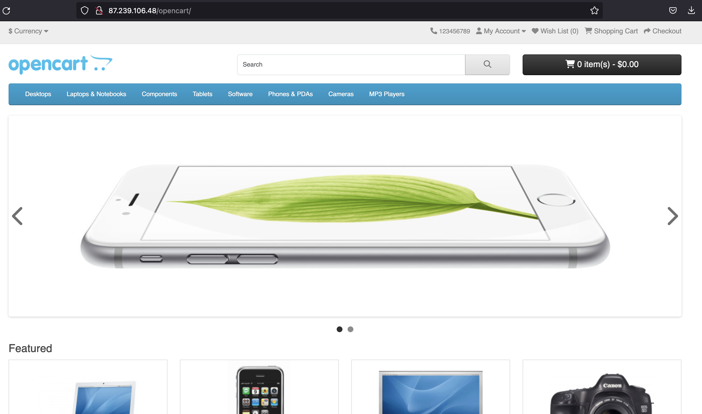

{include(/kz/_includes/_translated_by_ai.md)}

[OpenCart](https://www.opencart.com) — интернет-дүкен жасауға арналған платформа. OpenCart MVC қағидаты бойынша құрылған және PHP пен MySQL қолдайтын кез келген веб-серверге орнатылуы мүмкін.

Бұл нұсқаулық VK Cloud-та Ubuntu 22.04 операциялық жүйесінде OpenCart 4.0.2.3 нұсқасын өрістетуге, сондай-ақ домендік ат арқылы қол жеткізу үшін DNS жазбасын баптауға көмектеседі. ДҚБЖ ретінде Single конфигурациясындағы MySQL 8.0 пайдаланылады.

## Дайындық қадамдары

1. VK Cloud-та [тіркеліңіз](/kz/intro/onboarding/account).
1. Интернетке қолжетімділігі бар және `10.0.0.0/24` ішкі желісі бар `network1` желісін [жасаңыз](/kz/networks/vnet/instructions/net#zhelini_zhasau).
1. [ВМ жасаңыз](/kz/computing/iaas/instructions/vm/vm-create):

   - атауы: `Ubuntu_22_04_OpenCart`;
   - операциялық жүйе: Ubuntu 22.04;
   - желі: `10.0.0.0/24` ішкі желісі бар `network1`;
   - жария IP-мекенжайын тағайындаңыз. Мысалда `87.239.106.48` пайдаланылады;
   - қауіпсіздік топтары: `default`, `ssh+www`.

1. [ДҚ инстансын жасаңыз](/kz/dbs/dbaas/instructions/create/create-single-replica):

   - атауы: `MySQL-9341`;
   - ДҚБЖ: MySQL 8.0;
   - конфигурация түрі: Single;
   - желі: `network1`;
   - ДҚ атауы: `MySQL-9341`;
   - ДҚ пайдаланушысының аты: `user`;
   - пайдаланушы құпиясөзі: `AN0r25e0ae4d626p`;

   Мысалда жасалған инстанстың ішкі IP-мекенжайы: `10.0.0.7`.

1. DNS аймағын [жасаңыз](/kz/networks/dns/instructions/publicdns/dns-zone#add).

   {note:warn}

   DNS аймағы сәтті делегацияланғанына және NS жазбалары дұрыс бапталғанына көз жеткізіңіз: аймақ **NS жазбалары дұрыс бапталған** күйінде болуы тиіс.

   {/note}

1. Бөлінген аймақта жазба [жасаңыз](/kz/networks/dns/instructions/publicdns/records#add):

   - жазба түрі: `A`;
   - атауы: мысалы, `site-opencart.example.vk.cloud`;
   - IP-мекенжайы: ВМ-нің сыртқы мекенжайы `87.239.106.48`.

1. (Қосымша) `nslookup site-opencart.example.vk.cloud` командасының көмегімен атаудың IP-мекенжайға шешілетінін тексеріңіз. Операция сәтті орындалған кезде шығатын нәтиже:

   ```console
   Non-authoritative answer:
   Name:   site-opencart.example.vk.cloud
   Address: 87.239.106.48
   ```

## 1. OpenCart-ты ВМ-ге орнатыңыз

1. `Ubuntu_22_04_OpenCart` ВМ-іне [қосылыңыз](/kz/computing/iaas/instructions/vm/vm-connect/vm-connect-nix).
1. Пакеттерді өзекті нұсқаға дейін жаңартыңыз және ВМ-ді келесі командалар арқылы қайта жүктеңіз:

   ```console
   sudo dnf update -y
   sudo systemctl reboot
   ```

1. Қажетті репозиторийлерді жүктеп, веб-серверді іске қосыңыз:

   ```console
   sudo apt install apache2 apache2-utils libapache2-mod-php php8.1 php8.1-cli php8.1-curl php8.1-fpm php8.1-gd php8.1-intl php8.1-mbstring php8.1-mysql php8.1-opcache php8.1-readline php8.1-soap php8.1-xml php8.1-xmlrpc php8.1-zip php-gd -y
   sudo systemctl enable apache2 --now
   ```

1. OpenCart репозиторийін жүктеп, оны іске қосылған веб-сервердегі `opencart` директориясына өрістетіңіз:

   ```console
   cd ~
   wget https://github.com/opencart/opencart/archive/refs/tags/4.0.2.3.tar.gz
   tar xzf 4.0.2.3.tar.gz
   sudo cp -r opencart-4.0.2.3/upload /var/www/html/opencart
   sudo chown -R www-data:www-data /var/www/html/opencart
   sudo mv /var/www/html/opencart/config-dist.php /var/www/html/opencart/config.php
   sudo mv /var/www/html/opencart/admin/config-dist.php /var/www/html/opencart/admin/config.php
   ```

1. Браузерде ВМ-нің жария IP-мекенжайын `/opencart` жолымен енгізіңіз. Осы нұсқаулықта бұл `site-opencart.example.vk.cloud/opencart`.
1. Орнату шеберінде OpenCart лицензиялық келісімінің шарттарымен танысып, оларды қабылдаңыз.
1. **Pre-Installation** қадамында OpenCart орнатуға ВМ-нің дайындығын тексеріңіз — барлық тексерулер сәтті орындалуы тиіс.
1. **Configuration** қадамында `MySQL-9341` параметрлерін көрсетіңіз:

   - **DB Driver**: `MySQLi`.
   - **Hostname**: `10.0.0.7`.
   - **Username**: `user`.
   - **Password**: `AN0r25e0ae4d626p`.
   - **Database**: `MySQL-9341`.
   - **Port**: `3306`.

    Осы қадамда әкімшінің тіркелгі деректерін де көрсетіңіз.

1. Орнатудың аяқталуын күтіңіз: **Installation complete** беті пайда болады.
1. (Қосымша) Бағдарламалық жасақтама әзірлеушісінің ұсынымдарына сәйкес OpenCart-ты қосымша баптаңыз:

   1. Веб-серверден `install` директориясын жойыңыз:

      ```console
      sudo rm -rf /var/www/html/opencart/install
      ```

   1. `storage` директориясын `/var/www` ішіне жылжытыңыз:

      ```console
      sudo mv /var/www/html/opencart/system/storage/ /var/www
      ```

   1. `/var/www/html/opencart/config.php` және `/var/www/html/opencart/admin/config.php` конфигурациялық файлдарында мына жолды ауыстырыңыз:

      ```console
      // исходная строка
      define('DIR_STORAGE', DIR_SYSTEM . 'storage/');

      // заменяемая строка
      define('DIR_STORAGE', '/var/www/storage/');
      ```

## 2. OpenCart жұмыс қабілеттілігін тексеріңіз

Браузерде `http://site-opencart.example.vk.cloud/opencart/` мекенжайына өтіңіз. Орнату сәтті аяқталса, демо-дүкені бар бет ашылады.



## Пайдаланылмайтын ресурстарды жойыңыз

Өрістетілген виртуалды ресурстар тарифтелмейді. Егер олар енді қажет болмаса:

- `Ubuntu_22_04_OpenCart` ВМ-ін [жойыңыз](/kz/computing/iaas/instructions/vm/vm-manage#delete_vm).
- `MySQL-9341` ДҚ инстансын [жойыңыз](/kz/dbs/dbaas/instructions/manage-instance/mysql#bd_instansyn_nemese_onyn_hosttaryn_zhoyu).
- Қажет болса, `87.239.106.48` Floating IP-мекенжайын [жойыңыз](/kz/networks/vnet/instructions/ip/floating-ip#delete).
- Жасалған `site-opencart.example.vk.cloud` DNS жазбасын [жойыңыз](/kz/networks/dns/instructions/publicdns/records#resurstyk_zhazbalardy_zhoyu).
