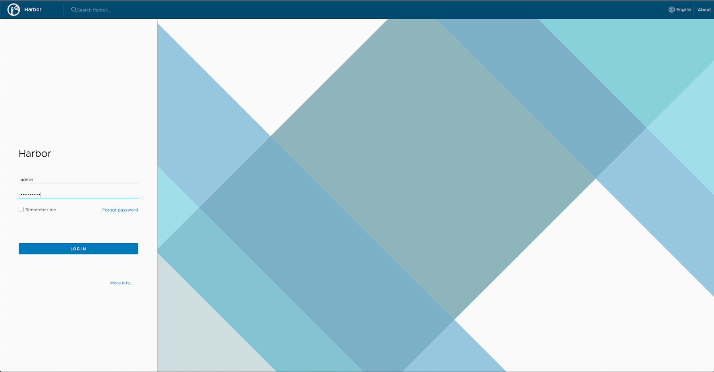
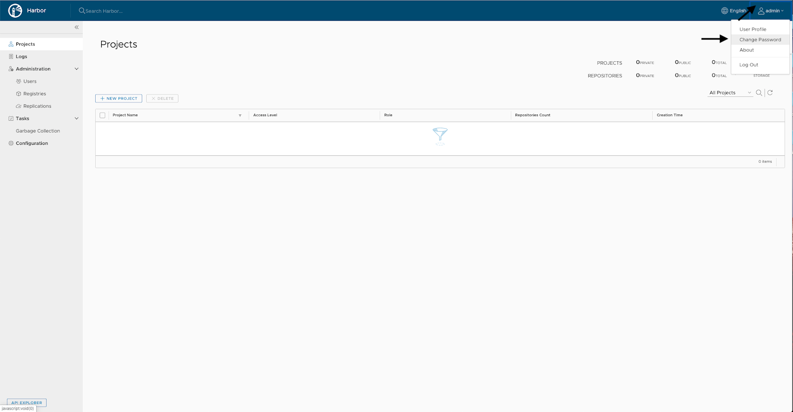
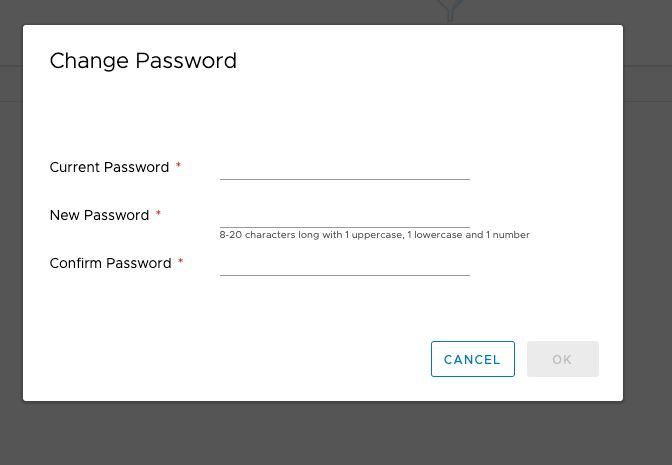
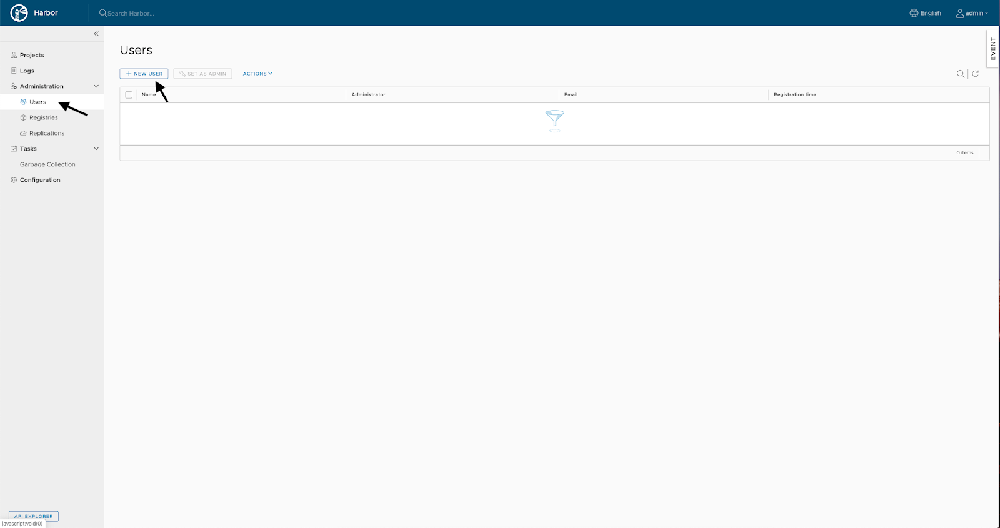
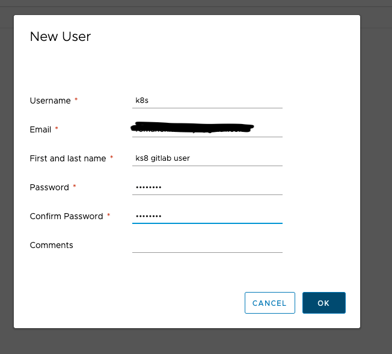
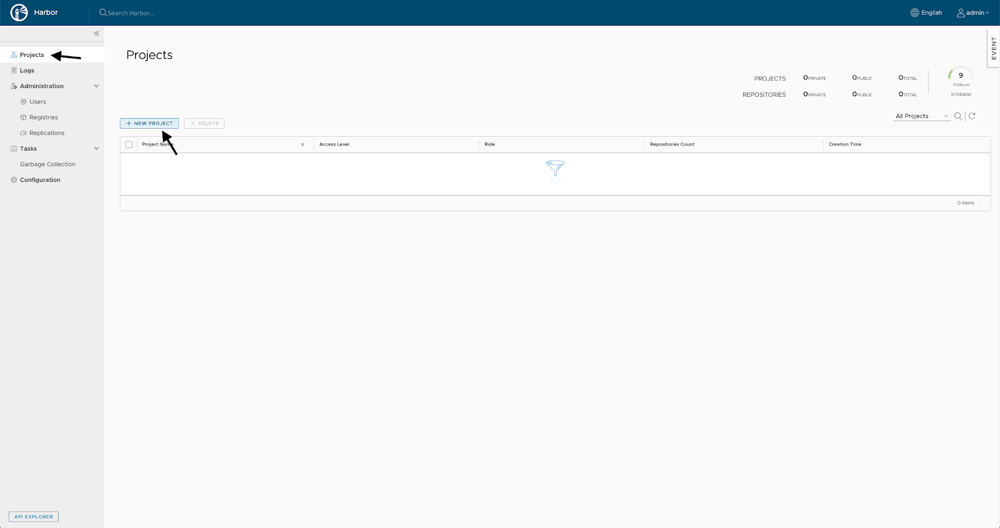
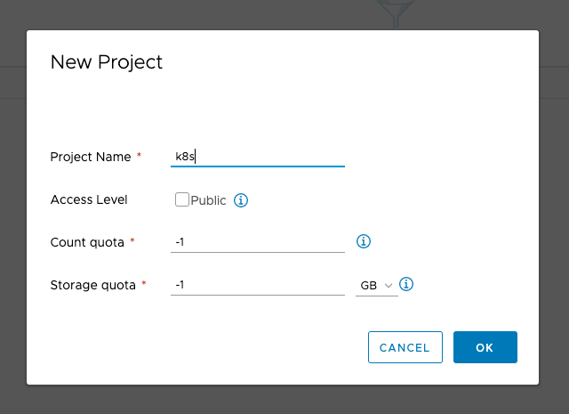
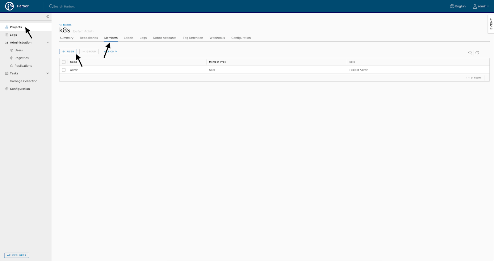
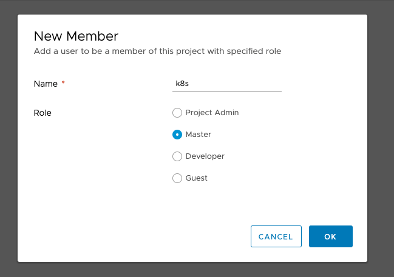

{include(/kz/_includes/_translated_by_ai.md)}

Бұл мақалада Harbor репозиторийлер қоймаларын қалай орнатуға және баптауға болатынын қарастырамыз. Осыдан кейін сіз [қолданбаны Kubernetes кластеріне автоөрістетуді баптай аласыз](/kz/cases/cases-gitlab/case-k8s-app).

## Harbor репозиторийлер қоймасын орнату

Harbor орнату алдында:

1. [Docker орнатып, баптаңыз](/kz/cases/cases-docker-ce/docker-ce-u18).
2. [GitLab орнатып, баптаңыз](/kz/cases/cases-gitlab/case-gitlab).

Harbor online installer көмегімен Docker-образы ретінде орнатылады.

Harbor репозиторийлер қоймаларын орнату үшін:

1. online installer скриптін жүктеп алып, архивтен шығарыңыз:

```console
root@ubuntu-standard-2-4-40gb:~# wget https://github.com/goharbor/harbor/releases/download/v1.9.3/harbor-online-installer-v1.9.3.tgz
root@ubuntu-standard-2-4-40gb:~# tar -zxvf harbor-online-installer-v1.9.3.tgz
```

2. Алынған `harbor` директориясында `harbor.yml` файлын баптаңыз:

```yaml
hostname: <SERVER_DNS_NAME>
http:
    # port for http, default is 80. If https enabled, this port will redirect to https port
    port: 8080
# https related config
    https:
#   # https port for harbor, default is 443
    port: 8443
#   # The path of cert and key files for nginx
    certificate: /opt/gitlab/config/ssl/<SERVER_DNS_NAME>.crt
    private_key: /opt/gitlab/config/ssl/<SERVER_DNS_NAME>.key
# The default data volume
data_volume: /opt/harbor
```

Мұнда:

- Хост атауы GitLab атауымен бірдей, себебі өрістету GitLab орналасқан серверде орындалады.
- Стандартты емес HTTP және HTTPS порттары пайдаланылады, себебі стандартты порттарды GitLab веб-интерфейсі қолданады.
- GitLab баптау кезінде жасалған LetsEncrypt сертификаты мен кілті пайдаланылады.

3. `install.sh` скриптін орындаңыз:

```console
root@ubuntu-standard-2-4-40gb:~/harbor# ./install.sh

[Step 0]: checking installation environment ...
Note: docker version: 19.03.5
Note: docker-compose version: 1.25.0

[Step 1]: preparing environment ...
[Step 2]: starting Harbor ...
Creating harbor-log ... done
Creating registryctl ... done
Creating redis ... done
Creating harbor-db ... done
Creating harbor-portal ... done
Creating registry ... done
Creating harbor-core ... done
Creating nginx ... done
Creating harbor-jobservice ... done

✔ ----Harbor has been installed and started successfully.----
```

Harbor іске қосылды.

## Harbor репозиторийлер қоймасын баптау

1. Harbor-ға авторизациялаңыз.

Бізде стандартты емес порттар қолданылатындықтан, URL келесі түрде болады:

```http
https://<SERVER_DNS_NAME>:8443
```

Әдепкі логин `admin`. Бастапқы құпиясөз `harbor.yml` файлында беріледі (`әдепкі бойынша — Harbor12345`).

****

2. admin пайдаланушысының құпиясөзін өзгертіңіз. Ол үшін оң жақ жоғарғы бұрышта admin батырмасын басып, Change Password тармағын таңдаңыз:

****

3. Ағымдағы және жаңа құпиясөздерді көрсетіңіз:

****

4. GitLab Harbor-пен жұмыс істейтін пайдаланушыны жасаңыз. Ол үшін сол жақтан Users тармағын таңдаңыз:



5. Жаңа пайдаланушының деректерін көрсетіңіз:



{note:warn}

Пайдаланушы үшін енгізілген құпиясөзді есте сақтаңыз, ол GitLab-пен интеграция үшін қажет болады.

{/note}

6. GitLab-тен жиналған образдар жіберілетін жаңа жобаны жасаңыз. Ол үшін сол жақтан Projects тармағын таңдаңыз:



7. Жаңа жобаның деректерін енгізіңіз:



8. Пайдаланушыны жобаға қосыңыз:

****

9. Пайдаланушы үшін атау мен рөлді көрсетіңіз:



Енді [қолданбаны Kubernetes кластеріне автоөрістетуді баптаңыз](/kz/cases/cases-gitlab/case-k8s-app).
