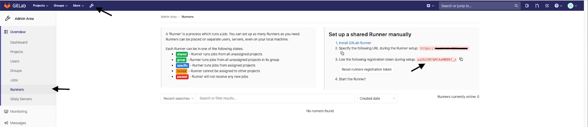
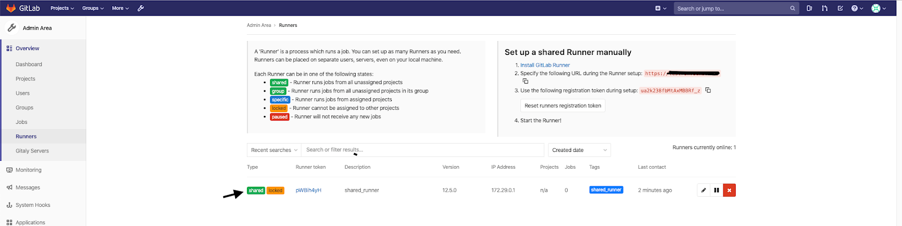
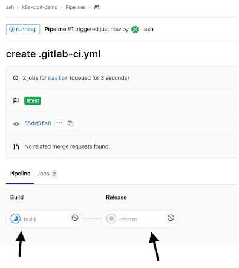
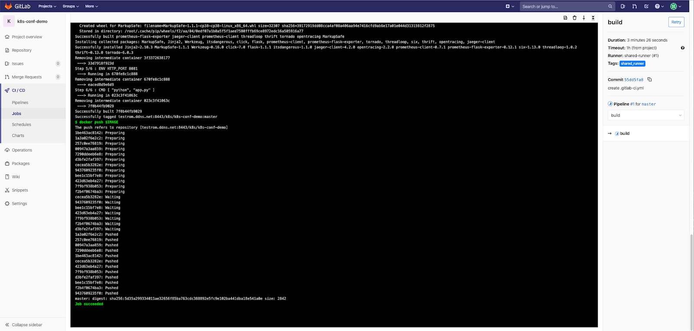
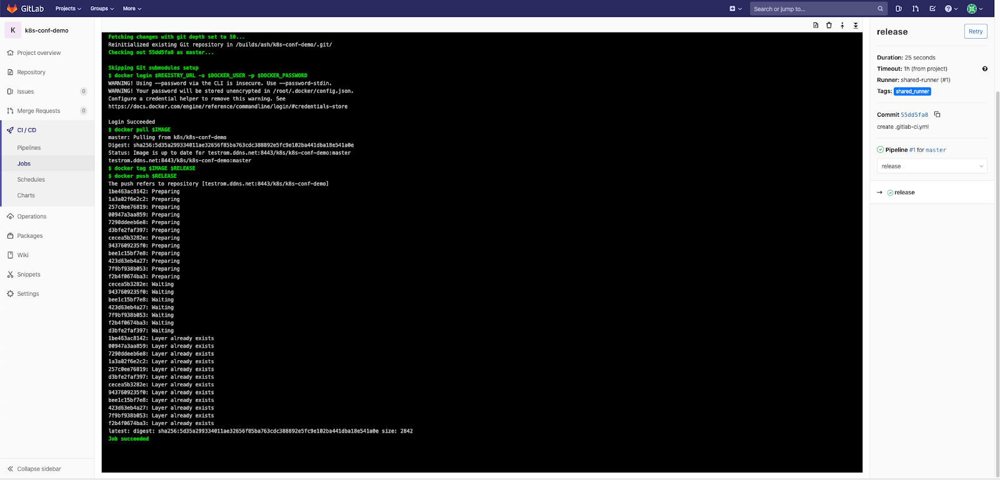
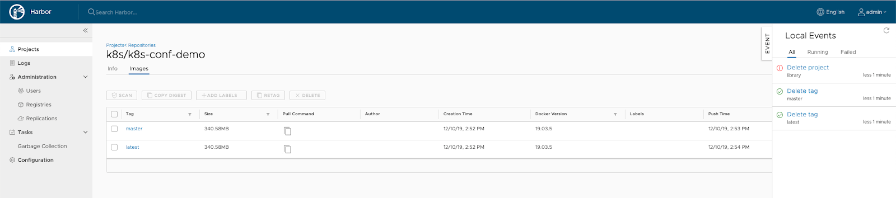
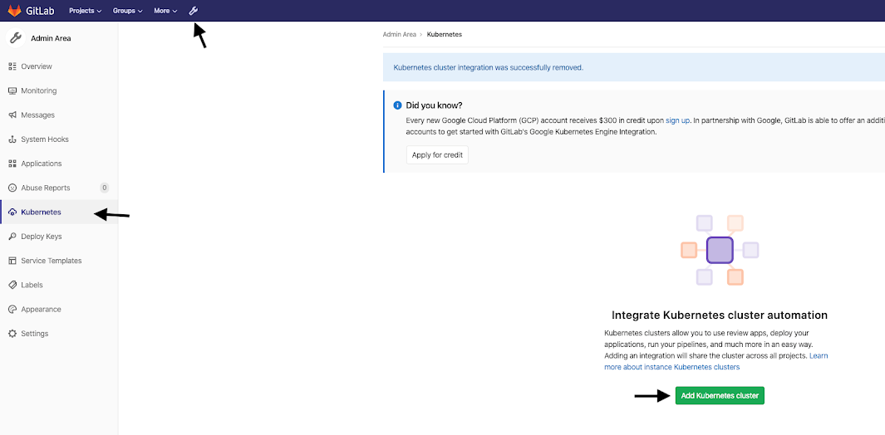
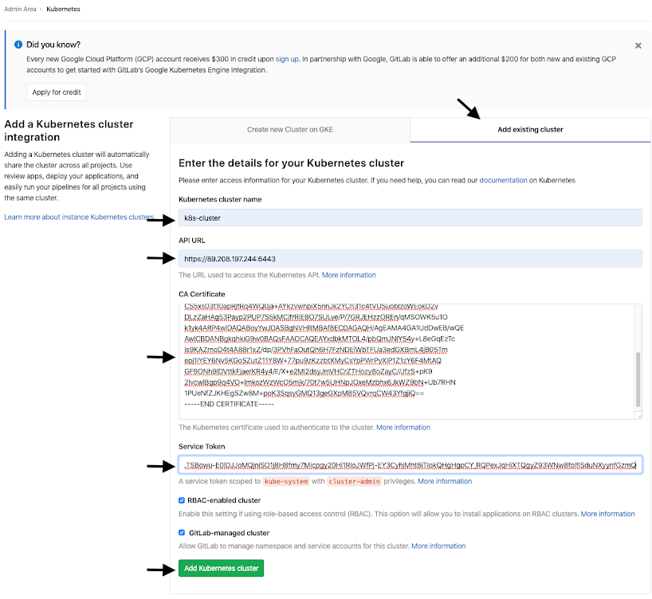

{include(/kz/_includes/_translated_by_ai.md)}

Бұл мақалада қосымшаны Kubernetes кластеріне автоматты түрде жайып орналастыруды қалай баптау керектігі сипатталған. Мысалда келесі жабдық пайдаланылады:

- Ubuntu 18.04 LTS x86_64 сервері: онда Docker, GitLab және Harbor орнатылып, бапталады.
- VK Cloud-та [жайып орналастырылған](/kz/kubernetes/k8s/instructions/create-cluster/create-webui) K8s кластері.

## Дайындық қадамдары

1. [Docker-ды орнатып, баптаңыз](/kz/cases/cases-docker-ce/docker-ce-u18).
1. [GitLab-ты орнатып, баптаңыз](/kz/cases/cases-gitlab/case-gitlab).
1. [Harbor-ды орнатып, баптаңыз](/kz/cases/cases-gitlab/case-harbor).

## 1. GitLab-runner-ді баптаңыз

{note:info}

Мысалда ортақ runner (shared runner) бапталады.

{/note}

1. GitLab веб-интерфейсіне әкімші құқықтарымен авторизациялаңыз:

   

1. **registration token** мәнін көшіріп алыңыз. GitLab-runner орнатылған сервердің консолінде келесі команданы орындаңыз:

   ```console
   docker exec -it gitlab-runner gitlab-runner register -n --url https://<SERVER_DNS_NAME>/ --executor docker --registration-token ua2k238fbMtAxMBBRf_z --description "shared-runner" --docker-image="docker:dind" --tag-list "shared_runner" --docker-privileged --docker-volumes /var/run/docker.sock:/var/run/docker.sock
   ```

   Нәтижесінде runner веб-интерфейсте көрсетіледі:

   

1. Орындау ортасының айнымалыларын баптаңыз:

   1. **Settings** → **CI/CD** бөліміне өтіңіз.
   1. **Variables** блогында **Expand** батырмасын басыңыз:
   1. `.gitlab-ci.yml` автожинау файлында пайдаланылатын айнымалыларды орнатыңыз:

      - `DOCKER_USER` — Harbor-дағы репозиторийге қол жеткізуге арналған пайдаланушы. Біздің мысалда — `k8s`.
      - `DOCKER_PASSWORD` — Harbor-да пайдаланушыны жасау кезінде енгізген k8s пайдаланушысының құпиясөзі. Айнымалы үшін **Masked** опциясын белгілеңіз — соның арқасында сценарийде айнымалы мәтінін шығаруға әрекет жасалғанда ол бүркемеленеді және құпиясөз көрінбейді.
      - `DOCKER_REGISTRY` — Harbor орналасқан хост атауы. Біздің мысалда — `<SERVER_DNS_NAME>`.

## 2. Автожинау файлын баптаңыз

1. Жүктеп алынған репозиторийі бар директорияға өтіп, келесі мазмұндағы `.gitlab-ci.yml` файлын жасаңыз:

   {cut(.gitlab-ci.yml)}

   ```yaml
   image: docker:latest
   
   stages:
     - builds
     - test
     - release
   
   variables:
     REGISTRY_URL: https://$DOCKER_REGISTRY:8443
     IMAGE: $DOCKER_REGISTRY:8443/$DOCKER_USER/$CI_PROJECT_NAME:$CI_COMMIT_REF_NAME
     RELEASE: $DOCKER_REGISTRY:8443/$DOCKER_USER/$CI_PROJECT_NAME:latest
   
   before_script:
      - docker login $REGISTRY_URL -u $DOCKER_USER -p $DOCKER_PASSWORD
   
   build:
     stage: builds
     tags:
       - shared_runner
     script:
      - cd app && docker build --pull -t $IMAGE .
      - docker push $IMAGE
   
   release:
     stage: release
     tags:
       - shared_runner
     script:
       - docker pull $IMAGE
       - docker tag $IMAGE $RELEASE
       - docker push $RELEASE
     only:
       - master
   ```

   Файлдағы айнымалылар туралы ақпарат:

   - `image` — жинақ қай docker image ішінде іске қосылатынын көрсетеді. Docker-образы жиналатындықтан, жинақтауға қажет утилиталары бар image қажет. Әдетте `image docker:latest` пайдаланылады.
   - `stages` — образды жинақтау кезеңдерін сипаттайды. Мысалда `test` кезеңі өткізіледі.
   - `before_script` — бірінші кезең: GitLab runner деректемелері арқылы registry-ге кіру.
   - `build` — образды жинақтау. Репозиторийдегі Dockerfile пайдаланыла отырып орындалатын Docker-образын стандартты жинақтау.
   - `release` — соңғы образды қалыптастыру бөлімі. Мысалда алдыңғы кезеңде жиналған образды алып, оған `latest` тегін қосып, репозиторийге жүктейміз.

   {note:warn}

   `tags: shared_runner` — runner тіркелген кезде көрсетілген тег. Осы тегті `.gitlab-ci.yml` файлында көрсету GitLab-runner-ге осы сценарийді орындауға рұқсат береді. Жинақ аяқталғаннан кейін жиналған образ `CI_COMMIT_REF_NAME` тегімен registry-ге енгізіледі. Жинақтау кезінде пайдалануға болатын айнымалылар туралы [мақаладан оқыңыз](https://docs.gitlab.com/ee/ci/variables). Мысалда `master` тармағына commit жасалатындықтан, образ атауы `k8s/k8s-conf-demo:master` болады.

   {/note}

   {/cut}

1. Жасалған файлды репозиторийге жүктеңіз:

   ```console
   ash-work:k8s-conf-demo git add .
   ash-work:k8s-conf-demo git commit -m "create .gitlab-ci.yml"
   [master 55dd5fa] create .gitlab-ci.yml
   1 file changed, 1 insertion(+), 1 deletion(-)
   ash-work:k8s-conf-demo git push
   Перечисление объектов: 5, готово.
   Подсчет объектов: 100% (5/5), готово.
   При сжатии изменений используется до 4 потоков
   Сжатие объектов: 100% (3/3), готово.
   Запись объектов: 100% (3/3), 299 bytes | 299.00 KiB/s, готово.
   Всего 3 (изменения 2), повторно использовано 0 (изменения 0)
   To testrom.ddns.net:ash/k8s-conf-demo.git
      7c91eab..55dd5fa  master -> master
   ```

   `.gitlab-ci.yml` файлы репозиторийде пайда болған бойда, GitLab оның жинағын автоматты түрде іске қосады.

1. Жинақтың аяқталуын күтіңіз.

   {cut(Жинақ процесін қайдан бақылауға болады?)}

   1. GitLab интерфейсінде **CI/CD** → **Pipelines** бөліміне өтіңіз.
   1. Жинақ күйін басыңыз. Ағымдағы pipeline ашылады:

      

   1. Операцияның орындалу процесі бар консольді ашу үшін жинақ кезеңдерін басыңыз.

      `build` кезеңіне арналған мысал:

      

      `release` кезеңіне арналған мысал:

      

   {/cut}

1. (Опционалды) Harbor-да жиналған образдың бар-жоғын тексеріңіз:

   

## 3. Жергілікті қосымшаны Kubernetes кластерінде жайып орналастырыңыз

1. VK Cloud-та Kubernetes кластерін [жасаңыз](/kz/kubernetes/k8s/instructions/create-cluster/create-webui).
1. `kubectl` көмегімен кластерге [қосылыңыз](/kz/kubernetes/k8s/connect/kubectl).
1. Кластерге Harbor образдар репозиторийіне қол жеткізу құқықтарын беріңіз:

   1. `<SERVER_DNS_NAME>` (Harbor серверінің атауы) және `<PASSWORD>` (Harbor-дағы k8s пайдаланушысының құпиясөзі) мәндерімен secret жасаңыз:

   ```console
   kubectl create secret docker-registry myprivateregistry --docker-server=https://<SERVER_DNS_NAME>:8443 --docker-username=k8s --docker-password=<PASSWORD>
   ```

   1. Secret сәтті жасалғанына көз жеткізіңіз:

   ```console
   ash-work:~ kubectl get secret myprivateregistry --output="jsonpath={.data.\.dockerconfigjson}" | base64 --decode
   ```

1. `deployment.yml` қосымша файлын жасаңыз:

   {cut(deployment.yml)}

   ```yaml
   apiVersion: apps/v1
   kind: Deployment
   metadata:
     name: myapp
   spec:
     selector:
       matchLabels:
         run: myapp
     template:
       metadata:
         labels:
           run: myapp
       spec:
         containers:
         - name: myapp
           image: <SERVER_DNS_NAME>:8443/k8s/k8s-conf-demo:latest
           imagePullPolicy: Always
           env:
           - name: HTTP_PORT
             value: "8081"
           ports:
           - containerPort: 8081
         imagePullSecrets:
         - name: myprivateregistry
   ```

   {/cut}

1. Қосымшаны іске қосыңыз:

   ```console
   kubectl create -f deployment.yaml 
   ```

1. Біраз уақыттан кейін контейнердің көтерілгеніне көз жеткізіңіз:

   ```console
   kubectl get pods 
   ```

   Ұқсас ақпарат көрсетілуі керек:

   ```console
   NAME READY STATUS RESTARTS AGE 
   myapp-deployment-66d55bcbd5-s86m6   1/1     Running   0          39s
   ```

1. `service.yml` файлын жасаңыз:

   {cut(service.yml)}

   ```yaml
   apiVersion: v1
   kind: Service
   metadata:
     name: myapp-svc
     labels:
       run: myapp
   spec:
     ports:
       - protocol: TCP
         port: 8081
         targetPort: 8081
     selector:
       run: myapp
   ```

   {/cut}

1. Сервисті жасаңыз:

   ```console
   kubectl create -f service.yaml
   ```

1. Қосымшаға сыртқы желіден қолжетімділікті қамтамасыз ету үшін ingress-контроллерді баптаңыз. Ол үшін `ingress.yaml` файлын жасаңыз:

   {cut(ingress.yaml)}

   ```yaml
   apiVersion: extensions/v1beta1 
   kind: Ingress 
   metadata: 
   name: myapp-ingress 
   spec: 
   rules: 
   - host: echo.com 
   http: 
   paths: 
   - path: / 
   backend: 
   serviceName: myapp-svc 
             servicePort: 8081
   ```

   Бұл файлда қосымшаға өту орындалатын доменді көрсетіңіз. Кез келген доменді көрсетуге болады, мысалда ол тесттер үшін жергілікті түрде көрсетілген.

   {/cut}

1. Ingress-контроллерді қолданыңыз:

   ```console
   kubectl create -f ingress.yaml
   ```

1. Ingress-контроллердің күйін қараңыз:

   ```console
   kubectl describe ingress myapp-ingress
   ```

   Команданың күтілетін нәтижесі:

   ```console
   Name: myapp-ingress 
   Namespace: default 
   Address: 
   Default backend: default-http-backend:80 (<none>) 
   Rules: 
   Host Path Backends 
   ---- ---- -------- 
   echo.com 
   / myapp-svc:8081 (10.100.69.71:8081) 
   Annotations: 
   Events: 
   Type Reason Age From Message 
   ---- ------ ---- ---- ------- 
   Normal CREATE 45s nginx-ingress-controller Ingress default/myapp-ingress 
     Normal  UPDATE  5s    nginx-ingress-controller  Ingress default/myapp-ingress
   ```

1. Қосымшаның жұмысын тексеріңіз. Ingress-контроллермен байланыстырылған сыртқы IP-мекенжайды [кластер бетінде](/kz/kubernetes/k8s/instructions/manage-cluster#klaster_turaly_akparat_alu) көруге болады. Ол Ingress Controller үшін жүктеме теңгергішінің IP-мекенжайы деп аталады. Оны `<INGRESS_EXTERNAL_IP>` деп белгілейік.

   ```console
   ash-work:~ curl --resolve echo.com:80:<INGRESS_EXTERNAL_IP> http://echo.com/handler
   ```

   {note:info}

   `--resolve` опциясы curl сұрауы кезінде жергілікті resolve үшін жауап береді, өйткені домен жергілікті және нақты resolve жоқ.

   {/note}

1. (Опционалды) Кластерде жасалған сервистерді жойыңыз:

   ```console
   ash-work:~ kubectl delete -f ingress.yaml
   ash-work:~ kubectl delete -f service.yaml
   ash-work:~ kubectl delete -f deployment.yaml
   ```

## 4. Қосымшаны Kubernetes кластерінде GitLab CI/CD пайдаланып жайып орналастырыңыз

GitLab әдепкі бойынша Kubernetes кластерімен интеграцияны қолдайды. Интеграцияны баптау үшін кластердің бірнеше параметрін алыңыз:

1. API URL алыңыз:

   ```console
   ash-work:~ kubectl cluster-info | grep 'Kubernetes master' | awk '/http/ {print $NF}'
   ```

1. Кластер secret-терінің тізімін алыңыз:

   ```console
   kubectl get secrets
   ```

   Команданың күтілетін нәтижесі:

   ```console
   NAME                       TYPE                                  DATA   AGE
   dashboard-sa-token-xnvmp   kubernetes.io/service-account-token   3      41h
   default-token-fhvxq        kubernetes.io/service-account-token   3      41h
   myprivateregistry          kubernetes.io/dockerconfigjson        1      39h
   regcred                    kubernetes.io/dockerconfigjson        1      39h   
   ```

1. `default-token` secret-інің PEM сертификатын алыңыз:

   ```console
   kubectl get secret default-token-fhvxq -o jsonpath="{['data']['ca\.crt']}" | base64 --decode
   ```

1. GitLab-тың кластерге қол жеткізу құқықтарын сипаттайтын `gitlab-admin-service-account.yaml` файлын жасаңыз.

   {cut(gitlab-admin-service-account.yaml)}

   ```yaml
   apiVersion: v1
   kind: ServiceAccount
   metadata:
   name: gitlab-admin
   namespace: kube-system
   ---
   apiVersion: rbac.authorization.k8s.io/v1beta1
   kind: ClusterRoleBinding
   metadata:
   name: gitlab-admin
   roleRef:
   apiGroup: rbac.authorization.k8s.io
   kind: ClusterRole
   name: cluster-admin
   subjects:
   - kind: ServiceAccount
   name: gitlab-admin
     namespace: kube-system
   ```

   {/cut}

1. Құқықтарды қолданыңыз және кластерге қол жеткізу токенін алыңыз:

   ```console
   kubectl apply -f gitlab-admin-service-account.yaml
   kubectl -n kube-system describe secret $(kubectl -n kube-system get secret | grep gitlab-admin | awk '{print $1}')
   ```

1. GitLab интерфейсінің әкімшілік бөлігіне өтіп, **Add Kubernetes Cluster** батырмасын басыңыз:

   

1. **Add Existing cluster** қойындысын таңдап, параметрлерді (API URL, PEM, Token) енгізіңіз де, **Add Kubernetes Cluster** батырмасын басыңыз:

   

1. `deployment.yaml`, `service.yaml`, `ingress.yaml` файлдарын жобаның `deployments` директориясына жылжытыңыз.
1. `.gitlab-ci.yml` файлына `deploy` секциясын қосыңыз:

   {cut(.gitlab-ci.yml)}

   ```yaml
   image: docker:latest
   
   stages:
   - build
   - test
   - release
   - deploy
   
   variables:
   REGISTRY_URL: https://$DOCKER_REGISTRY:8443
   IMAGE: $DOCKER_REGISTRY:8443/$DOCKER_USER/$CI_PROJECT_NAME:$CI_COMMIT_REF_NAME
   RELEASE: $DOCKER_REGISTRY:8443/$DOCKER_USER/$CI_PROJECT_NAME:latest
   
   before_script:
   - docker login $REGISTRY_URL -u $DOCKER_USER -p $DOCKER_PASSWORD
   
   build:
   stage: build
   tags:
   - shared_runner
   script:
   - cd app && docker build --pull -t $IMAGE .
   - docker push $IMAGE
   
   release:
   stage: release
   tags:
   - shared_runner
   script:
   - docker pull $IMAGE
   - docker tag $IMAGE $RELEASE
   - docker push $RELEASE
   only:
   - master
   
   deploy:
   stage: deploy
   before_script:
   - apk add --no-cache curl
   - curl -LO https://storage.googleapis.com/kubernetes-release/release/$(curl -s https://storage.googleapis.com/kubernetes-release/release/stable.txt)/bin/linux/amd64/kubectl
   - chmod +x ./kubectl
   tags:
   - shared_runner
   environment:
   name: production
   script:
   - echo $KUBECONFIG
   - export KUBECONFIG=$KUBECONFIG
       - ./kubectl create secret docker-registry myprivateregistry --docker-server=$REGISTRY_URL --docker-username=$DOCKER_USER --docker-password=$DOCKER_PASSWORD --dry-run -o yaml | ./kubectl apply -f -
       - ./kubectl apply -f manifests/deployment.yaml
   - ./kubectl apply -f manifests/service.yaml
       - ./kubectl apply -f manifests/ingress.yaml
       - ./kubectl rollout restart deployment
   ```

   {/cut}

1. Кластердің namespace мәнін тексеріңіз:

   ```console
   kubectl get namespaces
   ```

   Команданың күтілетін нәтижесі:

   ```console
   NAME STATUS AGE
   default Active 45h
   gitlab-managed-apps Active 67m
   ingress-nginx Active 45h
   k8s-conf-demo-1-production Active 57m
   kube-node-lease Active 45h
   kube-public Active 45h
   kube-system Active 45h
   magnum-tiller Active 45h
   ```

1. `k8s-conf-demo-1-production` ішіндегі pod-тарды, сервистерді және ingress-ті қараңыз:

   ```console
   kubectl get pods -n k8s-conf-demo-1-production
   kubectl get services -n k8s-conf-demo-1-production
   kubectl get ingress -n k8s-conf-demo-1-production
   ```

1. Қосымшаның жұмысқа қабілеттілігін тексеріңіз:

   ```console
   ash-work:~ curl --resolve echo.com:<INGRESS_EXTERNAL_IP> http://echo.com/handler
   ```

   Күтілетін нәтиже: `OK`.

1. Автоматты жайып орналастыруды тестілеу үшін қосымша кодын өзгертіңіз: репозиторийдегі `app/app.py` файлында `return 'OK'` жолын `return 'HANDLER OK'` жолына түзетіңіз.
1. Өзгерістерді жариялаңыз:

   ```console
   k8s-conf-demo git add . && git commit -m "update" && git push
   ```

1. CI/CD орындалуының аяқталуын күтіп, қосымшаның нәтижесін қайта тексеріңіз:

   ```console
   ash-work:~ curl --resolve echo.com:<INGRESS_EXTERNAL_IP> http://echo.com/handler
   ```

   Автоматты жайып орналастыру сәтті бапталса, `HANDLER OK` хабарламасы пайда болады.
