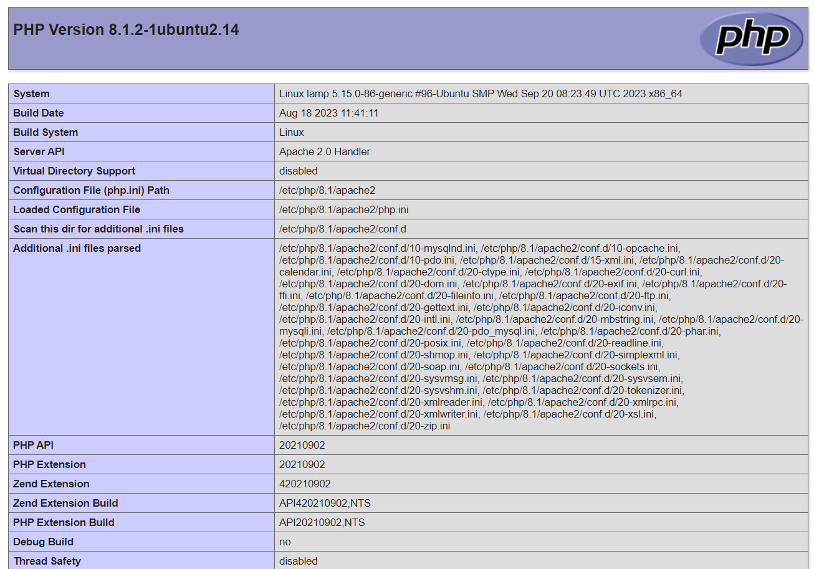

{include(/kz/_includes/_translated_by_ai.md)}

LAMP стегі Linux операциялық жүйелер тобының операциялық жүйесін, Apache веб-серверін, MySQL дерекқорларды басқару жүйесін және PHP динамикалық контентті өңдеуге арналған серверлік сценарийлер тілін қамтиды. Мұның барлығы динамикалық сайттар мен веб-қосымшаларды қолдау үшін пайдаланылады.

Бұл нұсқаулық VK Cloud жүйесіндегі Ubuntu 22.04 операциялық жүйесінде Apache серверін өрістетуге, PHP орнатуға, сондай-ақ домендік атау арқылы қол жеткізу үшін DNS жазбасын баптауға көмектеседі. СУБД ретінде Single конфигурациясындағы MySQL 8.0 қолданылады.

## 1. Дайындық қадамдары

1. [Тіркеліңіз](/kz/intro/onboarding/account) VK Cloud жүйесінде.
1. Интернетке қолжетімділігі және `10.0.0.0/24` ішкі желісі бар `network1` желісін [құрыңыз](/kz/networks/vnet/instructions/net#vnet-net-add).
1. [ВМ жасаңыз](/kz/computing/iaas/instructions/vm/vm-create):

   - атауы: `Ubuntu_22_04_LAMP`;
   - виртуалды машинаның түрі: `STD2-2-2`;
   - операциялық жүйе: Ubuntu 22.04;
   - желі: `10.0.0.0/24` ішкі желісі бар `network1`;
   - жария IP мекенжайын тағайындаңыз. Мысалда `211.243.95.137` пайдаланылады;
   - қауіпсіздік топтары: `default`, `ssh+www`.

1. [ДҚ инстансын жасаңыз](/kz/dbs/dbaas/instructions/create/create-single-replica):

   - атауы: `MySQL-5864`;
   - СУБД: MySQL 8.0;
   - конфигурация түрі: Single;
   - желі: `network1`.

   Қалған параметрлерді өз қалауыңыз бойынша таңдаңыз.

   {note:info}

   Жасалған инстанстың ішкі IP мекенжайы: `10.0.0.7` — оны стекпен әрі қарай жұмыс істеу үшін пайдаланыңыз.

   {/note}

1. DNS аймағын [құрыңыз](/kz/networks/dns/instructions/publicdns/dns-zone#dns-dns-zone-add).

   {note:warn}

   DNS аймағының сәтті делегирленгеніне және NS жазбаларының дұрыс бапталғанына көз жеткізіңіз: аймақ **NS-записи настроены верно** күйінде болуы керек.

   {/note}

1. Бөлінген аймақта жазба [жасаңыз](/kz/networks/dns/instructions/publicdns/records#dns-records-zone-add):

   - жазба түрі: `A`;
   - атауы: мысалы, `site-lamp.example.vk.cloud`;
   - IP мекенжайы: ВМ сыртқы мекенжайы `211.243.95.137`.

1. (Қосымша) `nslookup site-lamp.example.vk.cloud` командасының көмегімен атаудың IP мекенжайына резолвингін тексеріңіз. Сәтті орындалғандағы шығыс:

   ```console
   Non-authoritative answer:
   Name:   site-lamp.example.vk.cloud
   Address: 211.243.95.137
   ```

## 2. ВМ-ге Apache және PHP орнатыңыз

1. `Ubuntu_22_04_LAMP` ВМ-ге [қосылыңыз](/kz/computing/iaas/instructions/vm/vm-connect/vm-connect-nix).
1. Пакеттерді өзекті нұсқаға дейін жаңартып, келесі командалармен ВМ-ді қайта жүктеңіз:

   ```console
   sudo apt update && sudo apt upgrade -y
   sudo reboot
   ```

1. Қажетті репозиторийлерді жүктеп, веб-серверді іске қосыңыз:

   ```console
   sudo apt install apache2 apache2-utils libapache2-mod-php php8.1 php8.1-cli php8.1-curl php8.1-fpm php8.1-gd php8.1-intl php8.1-mbstring php8.1-mysql php8.1-opcache php8.1-readline php8.1-soap php8.1-xml php8.1-xmlrpc php8.1-zip php-gd -y
   sudo systemctl enable apache2 --now
   ```

## 3. Веб-сервердің жұмысқа қабілеттілігін тексеріңіз

1. `Ubuntu_22_04_LAMP` ВМ-де `/var/www/html/info.php` файлын келесі мазмұнмен жасаңыз:

   ```php
   <?php
    phpinfo();
   ?>
   ```
1. Браузерде `http://site-lamp.example.vk.cloud/info.php` мекенжайына өтіңіз.

   Орнатылған PHP нұсқасы туралы ақпарат бар бет ашылады.

   

1. (Қосымша) `/var/www/html/info.php` файлын веб-серверден жойыңыз.

## Пайдаланылмайтын ресурстарды жойыңыз

Өрістетілген виртуалды ресурстар тарификацияланады. Егер олар сізге енді қажет болмаса:

- `Ubuntu_22_04_LAMP` ВМ-ді [жойыңыз](/kz/computing/iaas/instructions/vm/vm-manage#iaas-vm-manage-delete).
- `MySQL-5864` ДҚ инстансын [жойыңыз](/kz/dbs/dbaas/instructions/manage-instance/mysql#dbaas-mysql-delete-instance).
- Қажет болса, `211.243.95.137` Floating IP мекенжайын [жойыңыз](/kz/networks/vnet/instructions/ip/floating-ip#vnet-floating-ip-delete).
- Жасалған `site-lamp.example.vk.cloud` DNS жазбасын [жойыңыз](/kz/networks/dns/instructions/publicdns/records#dns-records-delete).
