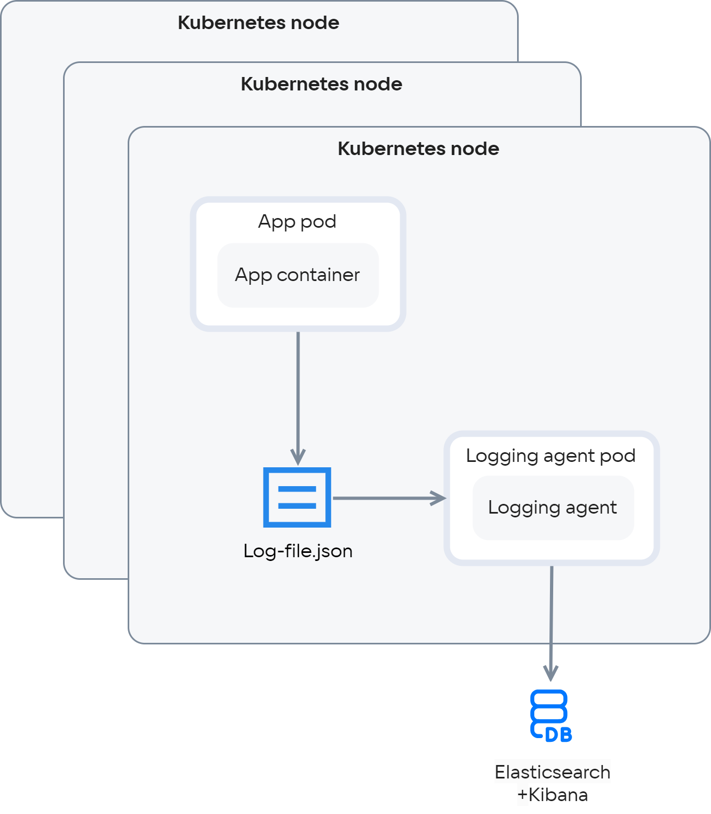
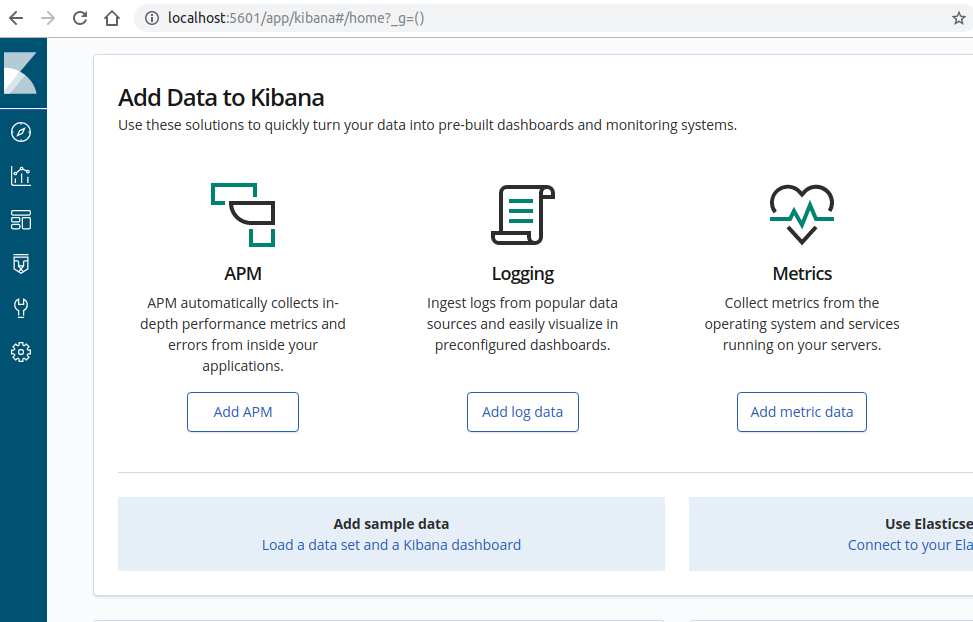
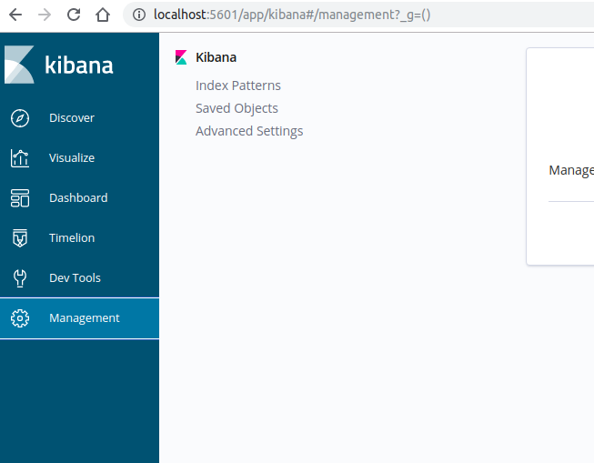
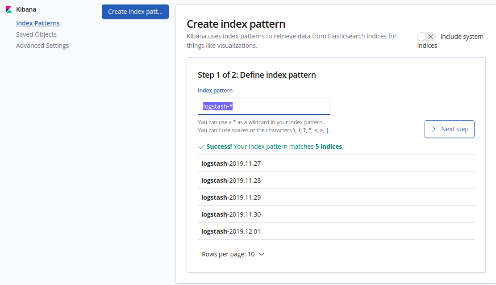
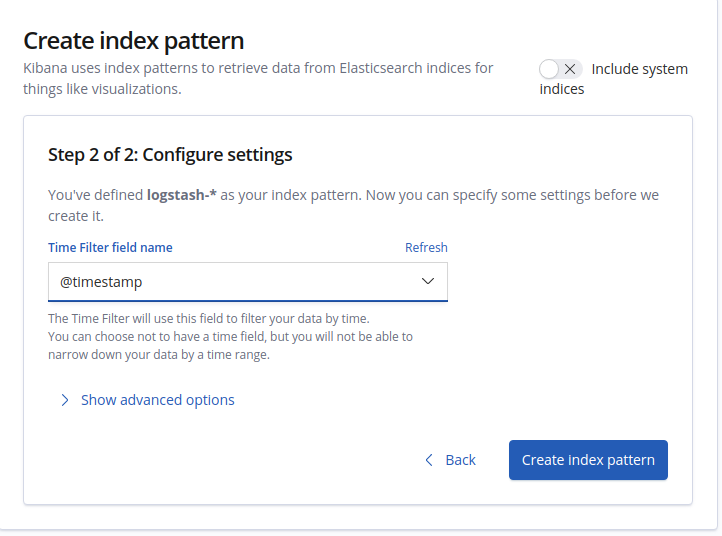
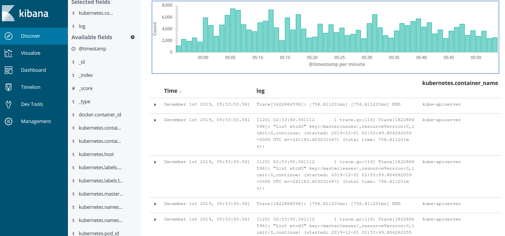

{include(/kz/_includes/_translated_by_ai.md)}

## Kubernetes жүйесінде лог жүргізу үшін неге арнайы шешім қажет

Логтарды контейнерлерге жазу қолайсыз, себебі:

- контейнерлендірілген қолданбаларда жасалатын деректер контейнер бар болғанша ғана сақталады. docker-контейнер қайта жүктелген кезде деректер, соның ішінде қолданба логтары да жойылады;
- логтарды контейнер ішінде ротациялау мүмкін емес, өйткені ротация — лог жүргізілетін процестен бөлек қосымша процесс, ал бір контейнерде бірден артық процесс іске қосыла алмайды.

{note:info}

Логтарды ротациялау — утилиталардың көмегімен логтарды өңдеу, тазалау, архивтеу және жіберу процесі.

{/note}

Kubernetes жүйесіндегі контейнерлендірілген қолданбалардың логтарына қол жеткізу үшін docker-контейнерлер өз логтарын стандартты шығару (stdout) және қате шығару (stderr) ағындарына жіберуі керек. Әдепкі бойынша docker logging driver логтарды нодадағы json-файлға жазады, сол жерден оларды мына команда арқылы алуға болады:

```console
kubectl logs pod_name
```

{note:info}

Docker logging driver — docker қозғалтқышына ендірілген және [логтарды ротациялау құралдарының](https://docs.docker.com/config/containers/logging/configure/) көбін қолдайтын логтарды жинау механизмі.

{/note}

docker-контейнерлердің өмірлік циклін Kubernetes оркестраторы басқарған кезде, контейнерлері бар подтар жиі және болжап болмайтындай түрде жасалады, қайта жүктеледі және жойылады. Егер docker лог жүргізу драйверінің баптаулары рұқсат етсе, подтың қайта жүктеуге дейінгі соңғы логтарына --previous аргументі арқылы қол жеткізуге болады:

```console
kubectl logs pod_name --previous
```

Бірақ осылайша бір қайта жүктеуден де ертеректегі уақыттың логтарын алу мүмкін емес. Подты жою ол туралы бүкіл ақпаратты, соның ішінде логтарды да жоюды білдіреді.

Сондықтан Kubernetes жүйесінде қолданба логтарымен жұмыс істеу үшін логтардан деректерді жинай, агрегаттай, сақтай және пайдалы ақпаратты шығара алатын жүйе қажет. Бұл міндетке Elasticsearch іздеу қозғалтқышы, Fluentd лог жүргізу агенті және Kibana дашбордының байланысы — EFK-стек сай келеді.

## Kubernetes кластеріндегі лог жүргізу жүйесінің сызбасы:

{params[width=70%; height=70%; noBorder=true]}

Elasticsearch өңдеуіне қажет ақпарат көлеміне байланысты EFK-стекті орнатудың әртүрлі жолдарын таңдауға болады:

- Секундына ондаған мың лог түседі деп күтілсе, Elasticsearch-ті Kubernetes кластеріне орнату ұсынылмайды. Продакшндағы жоғары жүктемелі шешім үшін Elasticsearch кластерінің өзіне бөлек виртуалды машиналар бөліп, логтарды Kubernetes жүйесінен лог-агрегаторлар арқылы жіберген дұрыс.
- Егер жүйе секундына ондаған мың лог өндірмесе және дев-, тест-орталардағы логтарды бақылау керек болса, EFK-стекті Kubernetes кластеріне, қолданбаларға жақынырақ орнатуға болады.

Лог жинаушы агент ретінде fluentd қолданамыз — C және Ruby тілдерінде жазылған, логтарды жинауға, сүзуге және агрегаттауға арналған, қолданбаның базалық функционалын кеңейту үшін түрлі плагиндері бар қосымша.

Kubernetes үшін орталықтандырылған лог жүргізу жүйесін ұйымдастырайық.

## Helm көмегімен Kubernetes жүйесінде Elasticsearch орнату

1. `kube-logging` namespace жасаңыз:

```console
kubectl create ns kube-logging
```

{note:info}

Helm арқылы орнатқанда қолданба үшін storage-class көрсету қажет болады.

{/note}

2. Kubernetes кластерінде қолжетімді `storage class` түрлерін анықтаңыз:

```console
admin@k8s:~$ kubectl get sc 
NAME            PROVISIONER            AGE
hdd (default)   kubernetes.io/cinder   103d
hdd-retain      kubernetes.io/cinder   103d
ssd             kubernetes.io/cinder   103d
ssd-retain      kubernetes.io/cinder   103d
```

3. Elasticsearch-ті Kubernetes кластеріне көрсетілген айнымалылармен орнатыңыз:

    ```console
    helm install stable/elasticsearch \
          --name elastic \
          --set client.replicas=1 \
          --set master.replicas=1 \
          --set data.replicas=1 \
          --set master.persistence.storageClass=hdd \
          --set data.persistence.storageClass=hdd \
          --set master.podDisruptionBudget.minAvailable=1 \
          --set resources.requests.memory=4Gi \
          --set cluster.env.MINIMUM_MASTER_NODES=1 \
          --set cluster.env.RECOVER_AFTER_MASTER_NODES=1 \
          --set cluster.env.EXPECTED_MASTER_NODES=1 \
          --namespace kube-logging
    ```
    Нәтижесінде 1 мастер-нода, 1 деректерді сақтау нодасы және 1 клиент нодасынан тұратын Elasticsearch кластері орнатылады.
4. Барлық подтардың жұмысқа дайын екенін тексеріңіз:

    ```console
    kubectl get po -n kube-logging
    ```

    ```console
    NAME                                           READY   STATUS    RESTARTS   AGE
    elastic-elasticsearch-client-c74598797-9m7pm   1/1     Running  
    elastic-elasticsearch-data-0                   1/1     Running  
    elastic-elasticsearch-master-0                 1/1     Running  
    ```

5. kube-logging ішіндегі сервистердің атауын анықтаңыз:

    ```console
    kubectl get svc -n kube-logging
    ```

```console
NAME                              TYPE        CLUSTER-IP     EXTERNAL-IP   PORT(S)    AGE
elastic-elasticsearch-client      ClusterIP   10.233.8.213   <none>        9200/TCP   11m
elastic-elasticsearch-discovery   ClusterIP   None           <none>        9300/TCP   11m
```

`elastic-elasticsearch-client` сервисі kibana және fluentd-мен байланыстыру үшін қолданылады. Kibana дашбордын да helm көмегімен орнатамыз, бірақ оның helm-чартының айнымалыларына `elastic-elasticsearch-clien`t сервисінің атауын жазамыз.

6. Өңдеу үшін kibana helm-чартының айнымалыларын жүктеп алыңыз:

```console
helm fetch --untar stable/kibana
```

7. `kibana` директориясына өтіп, `values.yaml` файлын өңдеңіз:

```console
cd kibana/ && vim values.yaml
```

8. `elasticsearch hosts` бөліміне `elastic-elasticsearch-client` сервисінің атауын жазыңыз:

```yaml
 files:
   kibana.yml:
     ## Default Kibana configuration from kibana-docker.
     server.name: kibana
     server.host: "0"
     ## For kibana < 6.6, use elasticsearch.url instead
     elasticsearch.hosts: http://elastic-elasticsearch-client:9200
```

9. Өзгертілген параметрлермен Kibana орнатыңыз:

```console
helm install stable/kibana \
     --name kibana \
     --namespace kube-logging \
     -f values.yaml
```

10. Подтың іске қосылғанына көз жеткізіп, дашбордқа қол жеткізу үшін Kibana подының 5601 портын жергілікті машинаңызға бағыттаңыз:

```console
kubectl get pod -n kube-logging 
```

Келесі командада kibana-pod_hash_id орнына алдыңғы команданың шығысынан алынған kibana подының толық атын жазыңыз:

```console
kubectl port-forward --namespace kube-logging kibana-pod_hash_id 5601:5601
```

11. Браузердің мекенжай жолағында бағытталған Kibana дашбордына қосылу жолын көрсетіңіз:

```console
localhost:5601
```



## Kubernetes кластеріне fluentd лог агрегаторларын орнату

Kubernetes кластеріндегі Fluend тек подтар, сервистер және хосттар логтарын ғана емес, сонымен қатар kubernetes нысандарының label-дарымен байланыстырылатын метадеректерді де жинай алады.

fluentd конфигурациясында логтарды жинау көздері, пайдалы ақпаратты парсингтеу және сүзу тәсілдері, сондай-ақ осы ақпараттың тұтынушылары туралы мәліметтер бар (біздің жағдайда мұндай тұтынушы — elasticsearch).

fluentd конфигурациялық файлында `<source>` элементтері аясында логтарды жинау көздері көрсетіледі. Төменде берілген configmap ішінде fluentd қолданба контейнерлерінің логтарынан, kubernetes-тің өз контейнерлерінің логтарынан және kubernetes нодаларының жүйелік логтарынан ақпарат жинайтыны көрсетілген.

1.  fluentd үшін төмендегі мазмұнмен configmap жасаңыз:

```yaml
kind: ConfigMap
apiVersion: v1
data:
  containers.input.conf: |-
    <source>
      @type tail
      path /var/log/containers/*.log
      pos_file /var/log/es-containers.log.pos
      time_format %Y-%m-%dT%H:%M:%S.%NZ
      tag kubernetes.*
      read_from_head true
      format multi_format
      <pattern>
        format json
        time_key time
        time_format %Y-%m-%dT%H:%M:%S.%NZ
      </pattern>
      <pattern>
        format /^(?<time>.+) (?<stream>stdout|stderr) [^ ]* (?<log>.*)$/
        time_format %Y-%m-%dT%H:%M:%S.%N%:z
      </pattern>
    </source>
  system.input.conf: |-
    <source>
      @type tail
      format /^time="(?<time>[^)]*)" level=(?<severity>[^ ]*) msg="(?<message>[^"]*)"( err="(?<error>[^"]*)")?( statusCode=($<status_code>\d+))?/
      path /var/log/docker.log
      pos_file /var/log/es-docker.log.pos
      tag docker
    </source>

    <source>
      @type tail
      format none
      path /var/log/etcd.log
      pos_file /var/log/es-etcd.log.pos
      tag etcd
    </source>

    <source>
      @type tail
      format multiline
      multiline_flush_interval 5s
      format_firstline /^\w\d{4}/
      format1 /^(?<severity>\w)(?<time>\d{4} [^\s]*)\s+(?<pid>\d+)\s+(?<source>[^ \]]+)\] (?<message>.*)/
      time_format %m%d %H:%M:%S.%N
      path /var/log/kubelet.log
      pos_file /var/log/es-kubelet.log.pos
      tag kubelet
    </source>

    <source>
      @type tail
      format multiline
      multiline_flush_interval 5s
      format_firstline /^\w\d{4}/
      format1 /^(?<severity>\w)(?<time>\d{4} [^\s]*)\s+(?<pid>\d+)\s+(?<source>[^ \]]+)\] (?<message>.*)/
      time_format %m%d %H:%M:%S.%N
      path /var/log/kube-proxy.log
      pos_file /var/log/es-kube-proxy.log.pos
      tag kube-proxy
    </source>

    <source>
      @type tail
      format multiline
      multiline_flush_interval 5s
      format_firstline /^\w\d{4}/
      format1 /^(?<severity>\w)(?<time>\d{4} [^\s]*)\s+(?<pid>\d+)\s+(?<source>[^ \]]+)\] (?<message>.*)/
      time_format %m%d %H:%M:%S.%N
      path /var/log/kube-apiserver.log
      pos_file /var/log/es-kube-apiserver.log.pos
      tag kube-apiserver
    </source>

    <source>
      @type tail
      format multiline
      multiline_flush_interval 5s
      format_firstline /^\w\d{4}/
      format1 /^(?<severity>\w)(?<time>\d{4} [^\s]*)\s+(?<pid>\d+)\s+(?<source>[^ \]]+)\] (?<message>.*)/
      time_format %m%d %H:%M:%S.%N
      path /var/log/kube-controller-manager.log
      pos_file /var/log/es-kube-controller-manager.log.pos
      tag kube-controller-manager
    </source>

    <source>
      @type tail
      format multiline
      multiline_flush_interval 5s
      format_firstline /^\w\d{4}/
      format1 /^(?<severity>\w)(?<time>\d{4} [^\s]*)\s+(?<pid>\d+)\s+(?<source>[^ \]]+)\] (?<message>.*)/
      time_format %m%d %H:%M:%S.%N
      path /var/log/kube-scheduler.log
      pos_file /var/log/es-kube-scheduler.log.pos
      tag kube-scheduler
    </source>

    <source>
      @type tail
      format multiline
      multiline_flush_interval 5s
      format_firstline /^\w\d{4}/
      format1 /^(?<severity>\w)(?<time>\d{4} [^\s]*)\s+(?<pid>\d+)\s+(?<source>[^ \]]+)\] (?<message>.*)/
      time_format %m%d %H:%M:%S.%N
      path /var/log/rescheduler.log
      pos_file /var/log/es-rescheduler.log.pos
      tag rescheduler
    </source>

    # Logs from systemd-journal for interesting services.
    <source>
      @type systemd
      matches [{ "_SYSTEMD_UNIT": "docker.service" }]
      pos_file /var/log/gcp-journald-docker.pos
      read_from_head true
      tag docker
    </source>

    <source>
      @type systemd
      matches [{ "_SYSTEMD_UNIT": "kubelet.service" }]
      pos_file /var/log/gcp-journald-kubelet.pos
      read_from_head true
      tag kubelet
    </source>

    <source>
      @type systemd
      matches [{ "_SYSTEMD_UNIT": "node-problem-detector.service" }]
      pos_file /var/log/gcp-journald-node-problem-detector.pos
      read_from_head true
      tag node-problem-detector
    </source>
  forward.input.conf: |-
    # Takes the messages sent over TCP
    <source>
      @type forward
    </source>

    <match **>
       @type elasticsearch
       @log_level info
       include_tag_key true
       host elastic-elasticsearch-client
       port 9200
       logstash_format true
       logstash_prefix fluentd
       # Set the chunk limits
       buffer_chunk_limit 2M
       buffer_queue_limit 8
       flush_interval 5s
       # Never wait longer than 5 minutes between retries.
       max_retry_wait 30
       # Disable the limit on the number of retries (retry forever).
       disable_retry_limit
       # Use multiple threads for processing.
       num_threads 2
    </match>
metadata:
  name: fluentd-es-config-v0.1.1
  namespace: kube-logging
  labels:
    addonmanager.kubernetes.io/mode: Reconcile
```

2.  Kubernetes жүйесінде configmap қолданыңыз:

    ```console
    kubectl apply -f fluentd-cm.yaml
    ```

fluentd бүкіл кластерден ақпарат жинайтындықтан, оған kubernetes ресурстарына қол жеткізу қажет болады. Осы қолжетімділікті қамтамасыз ету үшін fluentd үшін service account пен role жасаңыз. Содан кейін role-ды service account-қа тағайындаңыз.

3.  fluentd үшін service account, role және rolebinding сипаттамасы бар `sa-r-crb.yaml` файлын жасаңыз:

    ```yaml
    apiVersion: v1
    kind: ServiceAccount
    metadata:
       name: fluentd
       namespace: kube-logging
       labels:
         app: fluentd
    ---
    apiVersion: rbac.authorization.k8s.io/v1
    kind: ClusterRole
    metadata:
      name: fluentd
      labels:
        app: fluentd
    rules:
    - apiGroups:
        - ""
        resources:
          - pods
          - namespaces
        verbs:
          - get
          - list
          - watch
    ---
    kind: ClusterRoleBinding
    apiVersion: rbac.authorization.k8s.io/v1
    metadata:
      name: fluentd
    roleRef:
      kind: ClusterRole
      name: fluentd
      apiGroup: rbac.authorization.k8s.io
    subjects:
      - kind: ServiceAccount
        name: fluentd
        namespace: kube-logging
    ```
4.  Ресурстарды кластерге деплойлаңыз:

```console
kubectl apply -f sa-r-crb.yaml
```

```console
serviceaccount/fluentd created
clusterrole.rbac.authorization.k8s.io/fluentd created
clusterrolebinding.rbac.authorization.k8s.io/fluentd created
```

Gatekeeper үшін шектеуге (constraint) өзгерістер енгізіңіз. Бұл өзгерістер нодалардан логтарды оқуға мүмкіндік береді:

5. Кластерде `fluent_patch.yaml` файлын жасап, оны төмендегі мазмұнмен толтырыңыз:

   ```yaml
   spec: 
     match: 
       kinds: 
       - apiGroups: 
         - ""
         kinds: 
         - Pod
     parameters: 
       allowedHostPaths: 
         - pathPrefix: /k8spsp
           readOnly: true
         - pathPrefix: /var/log
           readOnly: true
         - pathPrefix: /var/log/containers
           readOnly: true
   ```
6. Өзгерістерді мына команданы орындап қолданыңыз:

    ```console
    kubectl patch k8spsphostfilesystem.constraints.gatekeeper.sh k8spsphostfilesystem --patch-file fluent_patch.yaml --type merge
    ```

fluentd орнатыңыз. fluentd-ті кластердің барлық нодаларына орнату қажет болғандықтан, kubernetes ресурсы ретінде `DaemonSet` түрін таңдаңыз.

7. Келесі мазмұнмен `fluentd-daemonset.yaml` манифесін жасаңыз (kubernetes 1.22 нұсқасынан төмен нұсқаларға сай келеді):

```yaml
apiVersion: apps/v1
kind: DaemonSet
metadata:
  name: fluentd
  namespace: kube-logging
  labels:
    app: fluentd
spec:
  selector:
    matchLabels:
      app: fluentd
  template:
    metadata:
      labels:
        app: fluentd
    spec:
      serviceAccount: fluentd
      serviceAccountName: fluentd
      tolerations:
      - key: node-role.kubernetes.io/master
        effect: NoSchedule
      containers:
      - name: fluentd
        image: fluent/fluentd-kubernetes-daemonset:v1.4.2-debian-elasticsearch-1.1
        env:
          - name:  FLUENT_ELASTICSEARCH_HOST
            value: "elastic-elasticsearch-client"
          - name:  FLUENT_ELASTICSEARCH_PORT
            value: "9200"
          - name: FLUENT_ELASTICSEARCH_SCHEME
            value: "http"
          - name: FLUENTD_SYSTEMD_CONF
            value: disable
          - name: FLUENT_ELASTICSEARCH_SED_DISABLE
            value: disable
        resources:
          limits:
            memory: 512Mi
          requests:
            cpu: 100m
            memory: 200Mi
        volumeMounts:
        - name: varlog
          mountPath: /var/log
        - name: varlibdockercontainers
          mountPath: /var/log/containers
          readOnly: true
        - name: config-volume
          mountPath: /fluentd/etc/conf.d
      terminationGracePeriodSeconds: 3
      volumes:
      - name: varlog
        hostPath:
          path: /var/log
      - name: varlibdockercontainers
        hostPath:
          path: /var/log/containers
      - name: config-volume
        configMap:
            name: fluentd-es-config-v0.1.1
```

8.  Kubernetes жүйесінде манифесті қолданыңыз:

    ```console
    kubectl apply -f fluentd-daemonset.yaml
    ```

## Kibana дашборды арқылы логтарға қол жеткізу

Kibana UI интерфейсінде индексті баптаңыз:

1.  Kibana дашборды бар қойындыға өтіп, **Management** мәзірін таңдаңыз:

    

2.  **Index Patterns** қойындысын таңдап, **Create index pattern** батырмасын басыңыз да, `logstash-\*` атауын енгізіңіз:

    

3.  **Next Step** батырмасын басып, **Create Index Pattern** таңдаңыз:



4.  **Discover** қойындысына өтіңіз. Сіз Kubernetes кластерінен логтарды көресіз:


