{include(/kz/_includes/_translated_by_ai.md)}

## Жабдық конфигурациясы

Осы сценарийді орындау үшін Ubuntu 18.04 LTS x86_64 ОЖ-де ELK үшін орнатылған және бапталған сервер қажет.

{note:warn}

**Назар аударыңыз!**

Басқа серверлер мен жабдықты пайдаланған кезде сценарийдің кейбір қадамдары төменде сипатталғаннан өзгеше болуы мүмкін.

{/note}

## Жұмыс сызбасы

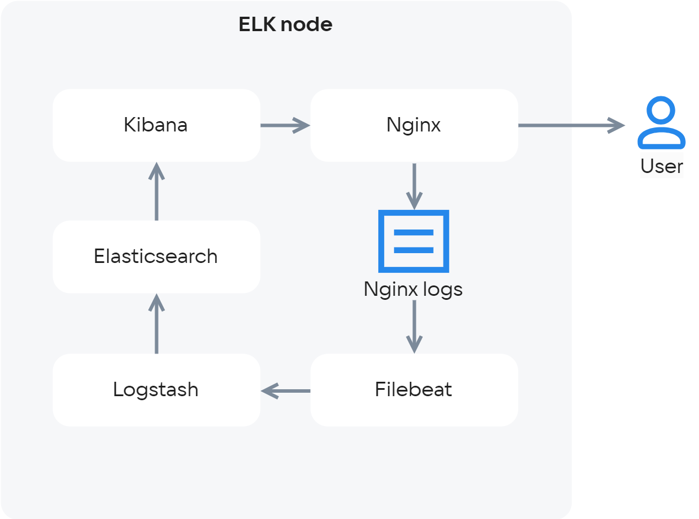{params[width=68%; height=68%;noBorder=true]}

ELK стегі үш компоненттен тұрады:

- Elasticsearch - ортақ қоймада деректерді сақтау, индекстеу және өңдеу, сондай-ақ деректер бойынша толықмәтіндік іздеу қозғалтқышы.
- Logstash - бастапқы деректерді жинауға, сүзгілеуге, агрегаттауға, өзгертуге және кейіннен соңғы қоймаға қайта бағыттауға арналған утилита.
- Kibana - қоймадағы деректерді қарауға және талдауға арналған веб-интерфейс.

## Elasticsearch, Logstash және Kibana орнату

1.  Ubuntu серверіне root құқықтарымен кіріңіз.
2.  Elasticsearch репозиторийінің кілтін импорттаңыз:

```console
root@ubuntu-std1-1:~# wget -qO - https://artifacts.elastic.co/GPG-KEY-elasticsearch | sudo apt-key add -
OK
```

3.  apt-transport-https орнатыңыз:

```console
root@ubuntu-std1-1:~# apt-get install apt-transport-https
```

4.  Репозиторийді қосыңыз:

```console
root@ubuntu-std1-1:~# echo "deb https://artifacts.elastic.co/packages/7.x/apt stable main" | sudo tee -a /etc/apt/sources.list.d/elastic-7.x.list
deb https://artifacts.elastic.co/packages/7.x/apt stable main
```

5.  Elasticsearch орнатыңыз:

```console
root@ubuntu-std1-1:~# apt-get update && apt-get install elasticsearch
```

6.  Kibana орнатыңыз:

```console
root@ubuntu-std1-1:~# apt-get install kibana
```

7.  Logstash жұмысы үшін OpenJDK орнатыңыз:

```console
root@ubuntu-std1-1:~# apt-get install openjdk-8-jre
```

8.  Logstash орнатыңыз:

```console
root@ubuntu-std1-1:~# apt-get install logstash

```

## Elasticsearch баптау

Elasticsearch үш конфигурациялық файлды пайдаланып бапталады:

- **elasticsearch.yml  - негізгі конфигурациялық файл;**
- **jvm.options - Elasticsearch іске қосуға арналған Java машинасын баптау файлы;**
- **log4j2.properties  - Elasticsearch журналдауын баптау файлы.**

**jvm.options**

Бұл файлдағы ең маңыздысы — JVM үшін бөлінген жадты (Heap Size) баптау. Elasticsearch үшін бұл параметр оның қаншалықты үлкен деректер массивтерін өңдей алатынына тікелей әсер етеді. Heap Size екі параметрмен анықталады:

- Xms - бастапқы мән;
- Xmx - максималды мән.

Әдепкі бойынша Heap Size 1 ГБ құрайды. Егер сервердегі жад көлемі мүмкіндік берсе, бұл мәнді арттырыңыз ([Heap Size туралы толығырақ](https://www.elastic.co/guide/en/elasticsearch/reference/current/heap-size.html)). Ол үшін келесі жолдарды табыңыз:

```txt
Xms1g
Xmx1g
```

және оларды, мысалы, келесі жолдарға ауыстырыңыз:

```txt
Xms4g
Xmx4g
```

**log4j2.properties**

Ыңғайлы болу үшін ротация орындалатын лог өлшемін көрсететін appender.rolling.policies.size.size параметрін өзгертуге болады (әдепкі бойынша - 128 МБ). Журналдау туралы толығырақ [мына жерден қараңыз](https://www.elastic.co/guide/en/elasticsearch/reference/current/logging.html).

**elasticsearch.yml**

Келесіні баптаңыз:

- node.name: elasticsearch - нода атауын көрсетіңіз;
- network.host: 127.0.0.1 - тек localhost тыңдауын орнатыңыз.

Elasticsearch іске қосыңыз:

```console
root@ubuntu-std1-1:~# systemctl start elasticsearch.service
```

Егер Heap Size үшін тым үлкен мән көрсетсеңіз, іске қосу сәтсіз аяқталады. Бұл жағдайда логтарда мыналар көрсетіледі:

```console
root@ubuntu-std1-1:~# systemctl start elasticsearch.service
Job for elasticsearch.service failed because the control process exited with error code.
See "systemctl status elasticsearch.service" and "journalctl -xe" for details.
root@ubuntu-std1-1:~# journalctl -xe
-- Unit elasticsearch.service has begun starting up.
Nov 12 12:48:12 ubuntu-std1-1 elasticsearch[29841]: Exception in thread "main" java.lang.RuntimeException: starting java failed with [1]
Nov 12 12:48:12 ubuntu-std1-1 elasticsearch[29841]: output:
Nov 12 12:48:12 ubuntu-std1-1 elasticsearch[29841]: #
Nov 12 12:48:12 ubuntu-std1-1 elasticsearch[29841]: # There is insufficient memory for the Java Runtime Environment to continue.
Nov 12 12:48:12 ubuntu-std1-1 elasticsearch[29841]: # Native memory allocation (mmap) failed to map 986513408 bytes for committing reserved memory.
Nov 12 12:48:12 ubuntu-std1-1 elasticsearch[29841]: # An error report file with more information is saved as:
Nov 12 12:48:12 ubuntu-std1-1 elasticsearch[29841]: # /var/log/elasticsearch/hs_err_pid29900.log
```

Іске қосу сәтті болса, Elasticsearch-ты автоматты түрде іске қосылатын процестер тізіміне қосыңыз:

```console
root@ubuntu-std1-1:~# systemctl enable elasticsearch.service
Synchronizing state of elasticsearch.service with SysV service script with /lib/systemd/systemd-sysv-install.
Executing: /lib/systemd/systemd-sysv-install enable elasticsearch
Created symlink /etc/systemd/system/multi-user.target.wants/elasticsearch.service → /usr/lib/systemd/system/elasticsearch.service.
```

Elasticsearch сұрауларға жауап беретініне көз жеткізіңіз:

```console
root@ubuntu-std1-1:~# curl http://localhost:9200
{
"name" : "ubuntu-std1-1",
"cluster_name" : "elasticsearch",
"cluster_uuid" : "ZGDKK_5dQXaAOr75OQGw3g",
"version" : {
"number" : "7.4.2",
"build_flavor" : "default",
"build_type" : "deb",
"build_hash" : "2f90bbf7b93631e52bafb59b3b049cb44ec25e96",
"build_date" : "2019-10-28T20:40:44.881551Z",
"build_snapshot" : false,
"lucene_version" : "8.2.0",
"minimum_wire_compatibility_version" : "6.8.0",
"minimum_index_compatibility_version" : "6.0.0-beta1"
},
"tagline" : "You Know, for Search"
}
```

## Kibana баптау

Әдепкі бойынша Kibana конфигурациялық файлы /etc/kibana/kibana.yml ішінде барлық қажетті баптаулар бар. Өзгерту қажет жалғыз параметр: server.host: “localhost”. Әдепкі баптауда Kibana тек жергілікті түрде қолжетімді. Kibana-ға қашықтан қол жеткізу үшін “localhost” мәнін Kibana орнатылған сервердің сыртқы IP-мекенжайына ауыстырыңыз. Сонымен қатар, егер Elasticsearch Kibana-мен бір хостта орналаспаса, elasticsearch.hosts: ["[http://localhost:9200](http://localhost:9200/)"] баптауын өзгертіңіз.

1.  Kibana іске қосыңыз:

```console
root@ubuntu-std1-1:/etc/kibana# systemctl start kibana.service
```

2.  Kibana-ны автоматты түрде іске қосылатын қолданбалар тізіміне қосыңыз:

```console
root@ubuntu-std1-1:/etc/kibana# systemctl enable kibana.service
Synchronizing state of kibana.service with SysV service script with /lib/systemd/systemd-sysv-install.
Executing: /lib/systemd/systemd-sysv-install enable kibana
```

3.  Браузерде http://<kibana серверінің IP-мекенжайы>:5601 мекенжайына өтіңіз.

Егер Kibana жұмыс істеп тұрса, төмендегідей көрініс шығады:

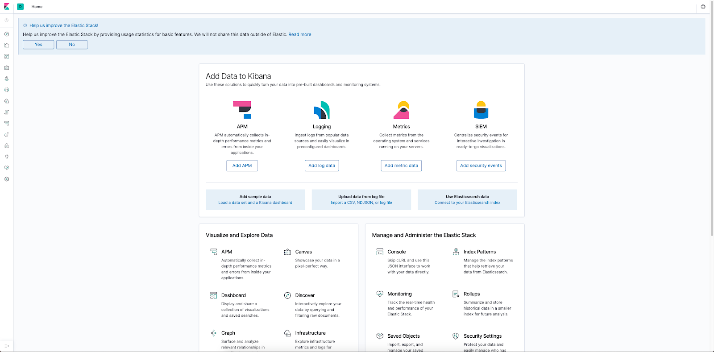

## Kibana және Elasticsearch қауіпсіздігін баптау

Әдепкі бойынша Elasticsearch пен Kibana барлығына толық қолжетімді. Қолжетімділікті келесі тәсілдердің бірімен шектеуге болады:

- Nginx-ті авторизациясы және қолжетімділікті басқаруы бар reverse proxy ретінде пайдалану.
- Кірістірілген elasticsearch xpack.security механизмін пайдалану (бұл туралы толық [мына жерде](https://www.elastic.co/guide/en/elasticsearch/reference/7.4/configuring-security.html) немесе [мына жерде](https://www.elastic.co/guide/en/kibana/current/using-kibana-with-security.html) қараңыз).

Ең танымал бірінші тәсілді қарастырайық.

1.  Nginx орнатыңыз:

```console
root@ubuntu-std1-1:~# apt-get install nginx
```

2.  /etc/elasticsearch/elasticsearch.yml конфигурациялық файлында network.host параметрі 127.0.0.1 немесе localhost мәніне ие екеніне көз жеткізіңіз. Қажет болса, осы баптауды орындап, elasticsearch демонын қайта іске қосыңыз:

```console
root@ubuntu-std1-1:~# cat /etc/elasticsearch/elasticsearch.yml  | grep network.host
network.host: 127.0.0.1
root@ubuntu-std1-1:~# systemctl restart elasticsearch.service
```

3.  /etc/kibana/kibana.yml конфигурациялық файлында server.host параметрі 127.0.0.1 немесе localhost мәніне ие екеніне көз жеткізіңіз. Қажет болса, осы баптауды орындап, kibana демонын қайта іске қосыңыз:

```console
root@ubuntu-std1-1:~# cat /etc/kibana/kibana.yml  | grep server.host
server.host: "127.0.0.1"
# When this setting's value is true Kibana uses the hostname specified in the server.host
root@ubuntu-std1-1:~# systemctl restart kibana.service
```

4.  Elasticsearh пен Kibana 127.0.0.1 интерфейсін пайдаланғанына көз жеткізіңіз:

```console
root@ubuntu-std1-1:~# netstat -tulpn | grep 9200
tcp6 0 0 127.0.0.1:9200 :::\* LISTEN 10512/java
root@ubuntu-std1-1:~# netstat -tulpn | grep 5601
tcp        0      0 127.0.0.1:5601          0.0.0.0:\*               LISTEN      11029/node
```

5.  /etc/nginx/sites-available ішінде kibana.conf файлын жасаңыз және оған келесіні қосыңыз:

```nginx
server {
listen <Kibana және Nginx бар сервердің сыртқы IP-мекенжайы>:5601;
server_name kibana;

error_log /var/log/nginx/kibana.error.log;
access_log /var/log/nginx/kibana.access.log;

location / {
auth_basic "Restricted Access";
auth_basic_user_file /etc/nginx/htpasswd;
rewrite ^/(.\*) /$1 break;
proxy_ignore_client_abort on;
proxy_pass http://localhost:5601;
proxy_set_header X-Real-IP $remote_addr;
proxy_set_header X-Forwarded-For $proxy_add_x_forwarded_for;
proxy_set_header Host $http_host;
}
}
```

6.  Пайдаланушы атын (USER) және құпиясөзді (PASSWORD) көрсетіңіз:

```console
root@ubuntu-std1-1:/etc/nginx# printf "USER:$(openssl passwd -crypt PASSWORD)\n" >> /etc/nginx/htpasswd
```

7.  Сайтты қосу үшін `/etc/nginx/sites-enabled` директориясына симлинк жасаңыз:

```console
root@ubuntu-std1-1:~# ln -s /etc/nginx/sites-available/kibana.conf /etc/nginx/sites-enabled/kibana.conf
```

8.  Nginx іске қосыңыз:

```console
root@ubuntu-std1-1:~# systemctl start nginx 
```

9.  Браузерде http://<kibana серверінің IP-мекенжайы>:5601 мекенжайына өтіңіз. Ашылған терезеде Kibana веб-интерфейсіне қол жеткізу үшін логин мен құпиясөзді енгізіңіз.

Elasticsearh (9200 порт) және Logstash (әдетте 5044 порт) үшін де Nginx-ті reverse proxy ретінде дәл осылай баптаңыз.

Kibana-мен танысу үшін тестілік деректер жиынтығын пайдалануға болады:

[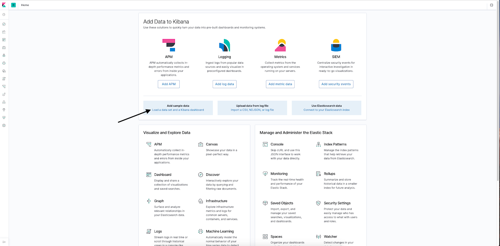](https://hb.ru-msk.vkcloud-storage.ru/help-images/logging/Kibana_Dashboard_2.png)

[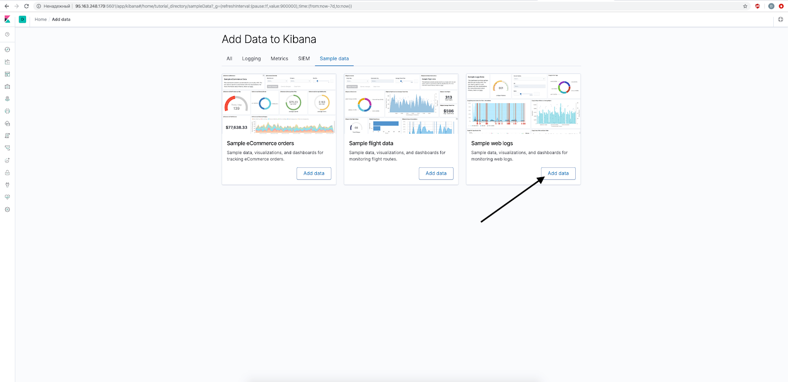](https://hb.ru-msk.vkcloud-storage.ru/help-images/logging/Kibana_Dashboard_3.png)

## filebeat орнату

Beats - Elasticsearch инфрақұрылымының бір бөлігі, яғни Data Shippers (деректер жеткізушілері). Бұлар әртүрлі дереккөздерден деректерді алып, оларды Elasticsearch-ке жіберу үшін түрлендіретін жеңіл агенттер. Beats функционалдығы Logstash-ты ішінара қайталайды, бірақ Beats жеңілірек, оңайырақ бапталады, жылдамырақ жұмыс істейді және Java stack орнатуды қажет етпейді. Әдетте логтар қалыптасатын нодаларға тиісті Beats агенттері орнатылады, олар логтарды Logstash-қа жібереді. Logstash логтарды агрегаттайды, түрлендіреді және оларды Elasticsearch-ке жібереді. Әртүрлі Beats түрлері бар, стандартты жинаққа келесі агенттер кіреді:

- Filebeat - әртүрлі log-файлдардан логтарды жинау.
- Packetbeat - желілік статистиканы жинау.
- Winlogbeat - Windows платформасындағы логтарды жинау.
- Metricbeat - әртүрлі метрикаларды жинау.
- Heartbeat - инфрақұрылым қолжетімділігі туралы деректерді жинау.
- Auditbeat - жүйелік аудит деректерін жинау.
- Functionbeat - Serverless жобаларынан (AWS Lambda) деректерді жинау.
- Journalbeat - Journald логтарын жинау.

Ең кең таралған агент — Filebeat, оны Nginx логтарын жинау үшін пайдаланамыз.

1.  Filebeat орнатыңыз:

```console
root@ubuntu-std1-1:~# apt-get install filebeat
```

2.  Nginx логтарын өңдеуге рұқсат беріңіз:

```console
root@ubuntu-std1-1:~# mv /etc/filebeat/modules.d/nginx.yml.disabled /etc/filebeat/modules.d/nginx.yml
```

Егер логтар стандартты емес жерде орналасса немесе логтардың тек бір бөлігін өңдеу қажет болса, /etc/filebeat/modules.d/nginx.yml файлында var.paths айнымалыларын комментарийден шығарып, толтырыңыз.

Келесі мысалда біз Kibana сервисіне жүгіну логтарын жинап, талдаймыз. Nginx баптау кезінде біз жүгіну логтары /var/log/nginx/kibana.access.log және /var/log/nginx/kibana.error.log файлдарында сақталатынын анықтадық.

3.  /etc/filebeat/modules.d/nginx.yml файлын келесі түрге келтіріңіз:

```yaml
# Module: nginx
# Docs: https://www.elastic.co/guide/en/beats/filebeat/7.4/filebeat-module-nginx.html

- module: nginx
# Access logs
access:
enabled: true

# Set custom paths for the log files. If left empty,
# Filebeat will choose the paths depending on your OS.
var.paths:
- /var/log/nginx/kibana.access.log

# Error logs
error:
enabled: true

# Set custom paths for the log files. If left empty,
# Filebeat will choose the paths depending on your OS.
var.paths:
     - /var/log/nginx/kibana.error.log
```

4.  /etc/filebeat/filebeat.yml файлында setup.kibana секциясын өңдеңіз:

```yaml
setup.kibana:
  host: "<Kibana бар сервердің IP-мекенжайы>:5601"
  username: "логин"
  password: "құпиясөз"
```

{note:info}

Логин мен құпиясөз Filebeat-тің белгілі деректер жиынтықтарына арналған типтік dashboard-тарды жүктеу мақсатында Kibana-ға қол жеткізуі үшін қажет.

{/note}

5.  Логтар Logstash-қа қайта жіберіледі, сондықтан output.elasticsearch секциясын комментарийге алып, output.logstash секциясында Logstash орналасқан сервердің IP-мекенжайын көрсетіңіз:

```yaml
#-------------------------- Elasticsearch output ------------------------------
#output.elasticsearch:
# Array of hosts to connect to.
# hosts: ["localhost:9200"]

# Optional protocol and basic auth credentials.
#protocol: "https"
#username: "elastic"
#password: "changeme"

#----------------------------- Logstash output --------------------------------
output.logstash:
# The Logstash hosts
hosts: ["<logstash серверінің IP-мекенжайы>:5044"]

# Optional SSL. By default is off.
# List of root certificates for HTTPS server verifications
#ssl.certificate_authorities: ["/etc/pki/root/ca.pem"]

# Certificate for SSL client authentication
#ssl.certificate: "/etc/pki/client/cert.pem"

# Client Certificate Key
  #ssl.key: "/etc/pki/client/cert.key"
```

6.  Конфигурациялық файлда қателер жоқ екеніне көз жеткізіңіз:

```console
root@ubuntu-std1-1:/etc/filebeat# filebeat test config -c /etc/filebeat/filebeat.yml
Config OK
```

Filebeat іске қоспас бұрын Logstash-та логтарды қабылдауды баптаңыз.

## Logstash баптау

Жалпы түрде Logstash конфигурациялық файлы үш секциядан тұрады:

- input - логтардың тағайындалу нүктесінің сипаттамасы.
- filter - логтарды түрлендіру.
- output - түрлендірілген логтардың тағайындалу нүктесінің сипаттамасы.

1.  /etc/logstash/conf.d/input-beats.conf файлын жасаңыз, онда Beats (атап айтқанда, Filebeat) өз логтарын жіберетін порт нөмірі көрсетілуі керек:

```log
input {
beats {
port => 5044
}
}
```

2.  /etc/logstash/conf.d/output-elasticsearch.conf файлын жасаңыз және логтарды localhost мекенжайындағы Elasticsearch-ке жіберу, ал индекстерді nginx-<күн> форматында атау қажет екенін көрсетіңіз (яғни күн сайын жаңа индекс жасалады, бұл талдау үшін ыңғайлы):

```log
output {
elasticsearch {
hosts => [ "localhost:9200" ]
        manage_template => false
        index => "nginx-%{+YYYY.MM.dd}"
    }
}
```

3.  /etc/logstash/conf.d/filter-nginx.conf файлын келесі мазмұнмен жасаңыз:

```log
filter {
 if [event][dataset] == "nginx.access" {
   grok {
    match => [ "message" , "%{IPORHOST:clientip} %{USER:ident} %{USER:auth} \[%{HTTPDATE:timestamp}\] \"(?:%{WORD:verb} %{NOTSPACE:request}(?: HTTP/%{NUMBER:httpversion})?|%{DATA:rawrequest})\" %{NUMBER:response} (?:%{NUMBER:bytes}|-) %{QS:referrer} %{QS:user_agent}"]
    overwrite => [ "message" ]
   }
   mutate {
    convert => ["response", "integer"]
    convert => ["bytes", "integer"]
    convert => ["responsetime", "float"]
   }
  geoip {
   source => "clientip"
   target => "geoip"
   add_tag => [ "nginx-geoip" ]
  }
  date {
   match => [ "timestamp" , "dd/MMM/YYYY:HH:mm:ss Z" ]
   remove_field => [ "timestamp" ]
  }
  
  useragent {
   source => "user_agent"
  }
 }
}
```

Nginx логтарын Logstash-қа қайта жіберетін Filebeat бүкіл Nginx лог жолын message өрісіне жазады. Сондықтан бұл өрісті Elasticsearch-те жұмыс істеуге болатын айнымалыларға бөліп шығару керек. Бұл талдау grok секциясында NGINX ACCESS LOG форматында орындалады.

mutate секциясында деректерді сақтау форматын өзгертуге болады (мысалы, логтағы bytes өрісі жол ретінде емес, сан ретінде сақталуы үшін).

geoip секциясында логқа сұраудың IP-мекенжайы бойынша геолокация өрістері қосылады.

date секциясы логтағы сұрау күні өрісін талдау және оны Elasticsearch-ке жіберу үшін түрлендіру мақсатында қолданылады.

useragent секциясы өрістерді логтағы өріс бойынша толтырады. Әдетте осындай нұсқаулықтарда agent өрісі қолданылатынына назар аударыңыз. Бұл өріс Filebeat + Logstash байланысында жұмыс істемейді, себебі ол Filebeat-тен Elasticsearh-қа тікелей жазу кезінде пайдалануға арналған. Logstash-та пайдаланған кезде келесі қате шығады:

```txt
[2019-11-19T09:55:46,254][ERROR][logstash.filters.useragent][main] Uknown error while parsing user agent data {:exception=>#<TypeError: cannot convert instance of class org.jruby.RubyHash to class java.lang.String>, :field=>"agent", :event=>#<LogStash::Event:0x1b16bb2>}
```

Сол себепті grok match секциясында %{COMBINEDAPACHELOG} макросын пайдаланудың қажеті жоқ.

Logstash-тағы қателерді бақылау үшін дебагты қосыңыз. Ол үшін output секциясына келесі жолды қосыңыз:

```console
stdout { codec => rubydebug }
```

Нәтижесінде Elasticsearch дерекқорына шығарылым консоль/syslog-қа шығарумен қайталанатын болады. Сонымен қатар, grok match өрнектерін тексеру үшін [Grok Debugger](https://grokdebug.herokuapp.com/) пайдалану пайдалы.

4.  Logstash іске қосыңыз және оны автоматты түрде іске қосылатын қолданбалар тізіміне қосыңыз:

```console
root@ubuntu-std1-1:~# systemctl start logstash
root@ubuntu-std1-1:~# systemctl enable logstash
Created symlink /etc/systemd/system/multi-user.target.wants/logstash.service → /etc/systemd/system/logstash.service.
```

5.  Сервистің іске қосылғанына көз жеткізіңіз:

```console
root@ubuntu-std1-1:~# netstat -tulpn | grep 5044
tcp6       0      0 :::5044                 :::\*                    LISTEN      18857/java
```

6.  Filebeat жұмысын тексеріңіз:

```console
root@ubuntu-std1-1:~# service filebeat start
```

## Kibana Templates баптау

Filebeat іске қосылғаннан кейін Kibana-ға жүгіну логтары Logstash-қа, одан кейін Elasticsearch-ке түседі. Бұл логтарды көру үшін Kibana-да templates баптау қажет.

1.  Kibana-ға өтіп, сол жақ мәзірде тісті дөңгелек белгішесін басыңыз, Kibana > Index Patterns тармағын таңдаңыз және Create Index Pattern түймесін басыңыз.

[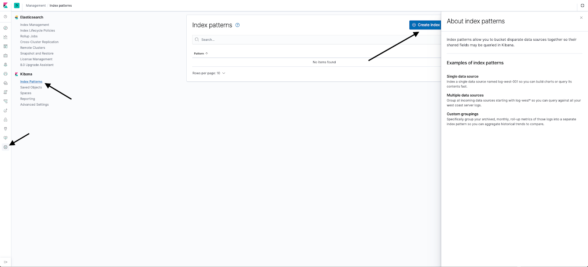](https://hb.ru-msk.vkcloud-storage.ru/help-images/logging/Template-1.png)

2.  Барлық жазбаларды таңдау үшін Index pattern өрісіне nginx-\* енгізіп, Next step түймесін басыңыз.

[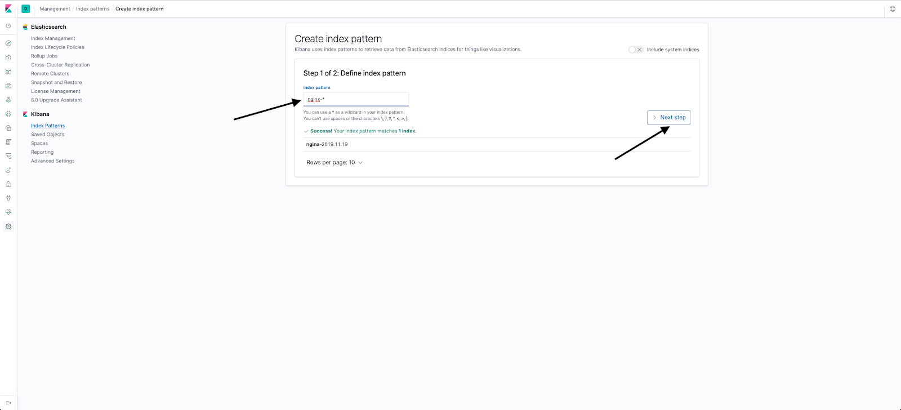](https://hb.ru-msk.vkcloud-storage.ru/help-images/logging/Template-2.png)

3.  Лог-файлдардағы уақыт белгілерін пайдалану үшін Time Filter field name өрісінде @timestamp таңдап, Create index pattern түймесін басыңыз.

[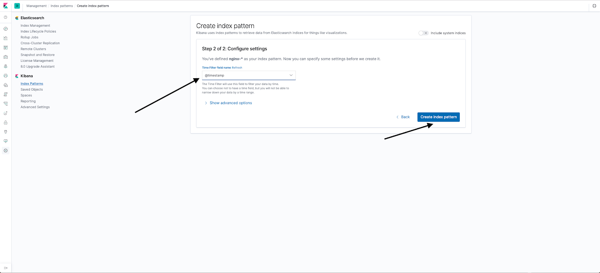](https://hb.ru-msk.vkcloud-storage.ru/help-images/logging/Template-3.png)

Нәтижесінде index pattern жасалады.

[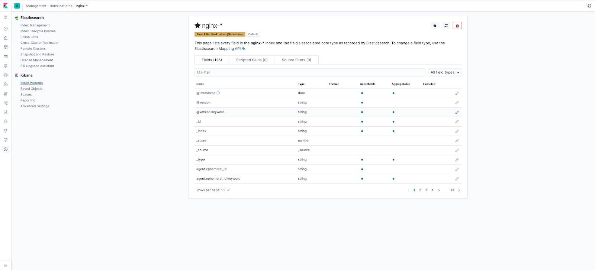](https://hb.ru-msk.vkcloud-storage.ru/help-images/logging/Template-4.png)

Elasticsearch-ке түскен логтарды көру үшін Discover бөліміне өтіңіз.

## Kibana Visualizations баптау

Kibana ішіндегі Dashboard визуализациялардан тұрады. Визуализация — Elasticsearch-тен белгілі бір сұраулар негізінде құрылған график түрі.

Бірінші визуализацияны құрайық  - топ 10 клиент.

1.  Сол жақ мәзірде Visualisations тармағын таңдап, Create new visualisation түймесін басыңыз.

[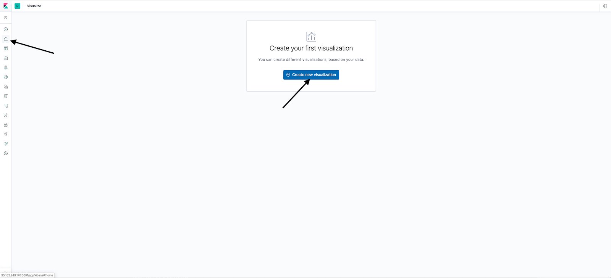](https://hb.ru-msk.vkcloud-storage.ru/help-images/logging/Visualisation_1.png)

2.  Vertical bar таңдаңыз.

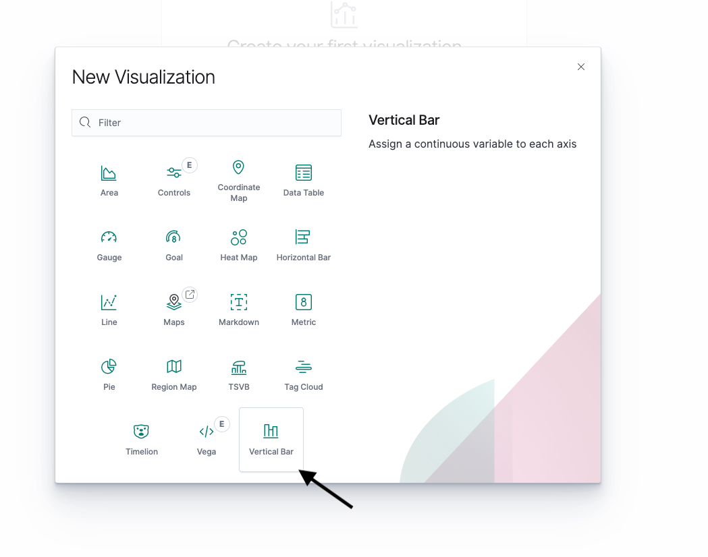

3.  nginx-\* темплейтін таңдаңыз.


4.  X осін қосыңыз.

[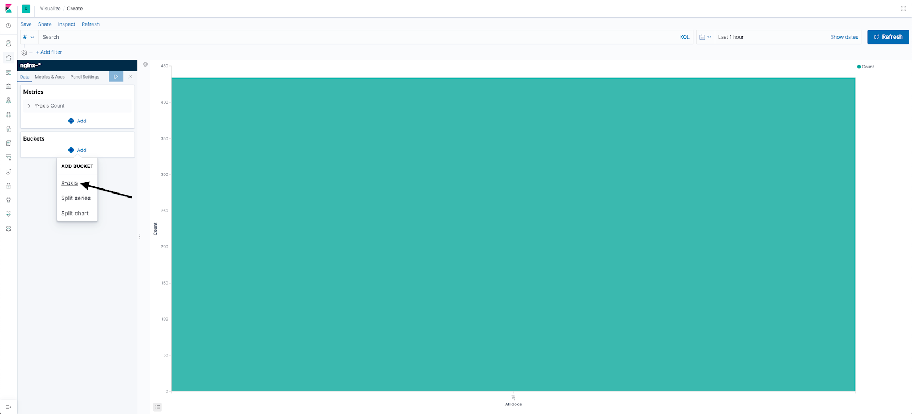](https://hb.ru-msk.vkcloud-storage.ru/help-images/logging/Visualisation-4.png)

5.  Деректерді енгізіңіз:

- Aggregation: Terms - көрсетілген топ-мәндер санын қайтарады.
- Field: clientip.keyword - клиентті IP-мекенжайы бойынша таңдаймыз.
- Size: 10 - 10 топ мән.
- Custom Label: Top 10 clients - визуализация атауы.

[](https://hb.ru-msk.vkcloud-storage.ru/help-images/logging/Visualisation-5.png)

6.  Сұрауды орындап, визуализацияны сақтаңыз.

[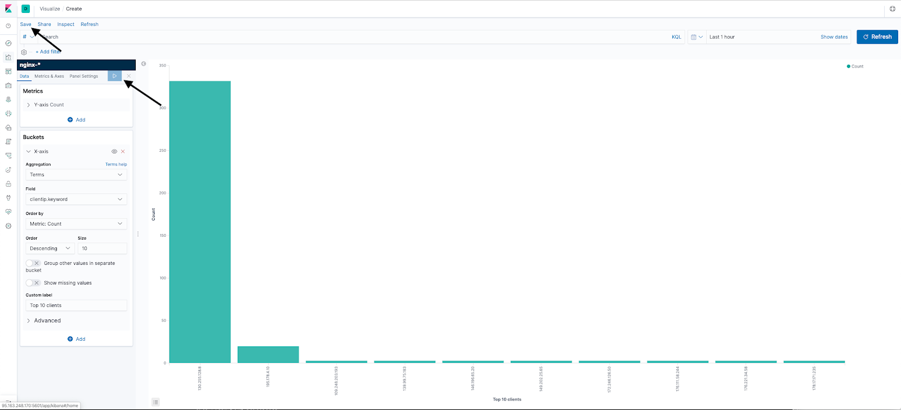](https://hb.ru-msk.vkcloud-storage.ru/help-images/logging/Visualisation-6.png)

Нәтижесінде визуализацияда жүгінулер жасалған топ-10 IP-мекенжай көрсетіледі.

Екінші визуализацияны құрамыз - пайдаланушылар қай елдерден жүгінгенін көрсететін топ 5 елдің дөңгелек диаграммасы.

1.  Сол жақ мәзірде Visualisations тармағын таңдап, Create new visualisation түймесін басыңыз.
2.  Pie таңдаңыз.
3.  nginx-\* темплейтін таңдаңыз.
4.  X осін қосыңыз.
5.  Деректер секторлар түрінде көрсетілуі үшін Add bucket / Split slices таңдаңыз.

[](https://hb.ru-msk.vkcloud-storage.ru/help-images/logging/Visualisation_21.png)

1.  Келесі деректерді енгізіңіз:

- Aggregation: Terms - деректердің топ мәндерін таңдаймыз.
- Field: geoip.country_code2.keyword - елдің екі әріптік белгіленуі.
- Size:5  - топ 5 таңдаймыз.
- Custom label: Top 5 countries -  график атауы.

[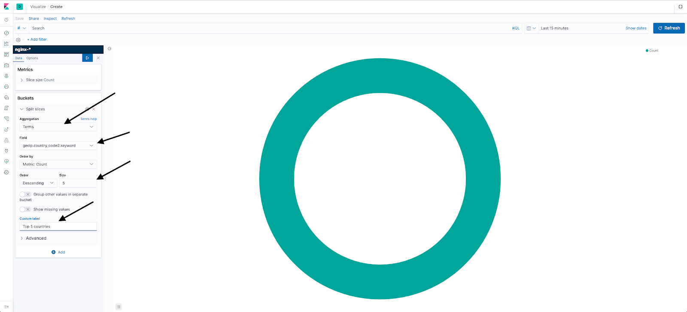](https://hb.ru-msk.vkcloud-storage.ru/help-images/logging/Visualisation_22.png)

9.  Сұрауды орындап, визуализацияны сақтаңыз.

[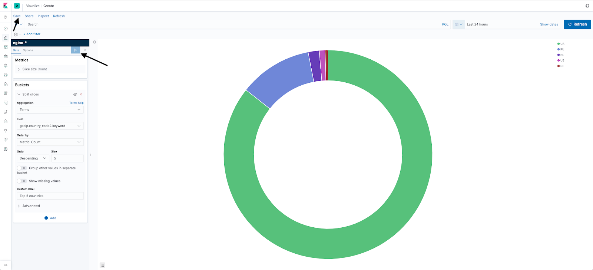](https://hb.ru-msk.vkcloud-storage.ru/help-images/logging/Visualisation_23.png)

Графикте қолжетімділік болған топ 5 ел көрсетіледі.

Үшінші визуализацияны құрамыз - жауап кодтары бойынша бөлінген сұраулар санының графигі.

1.  Сол жақ мәзірде Visualisations тармағын таңдап, Create new visualisation түймесін басыңыз.
2.  TSVB таңдаңыз.
3.  nginx-\* темплейтін таңдаңыз.
4.  Сервердің барлық жауап кодтарын алу үшін (яғни серверге жіберілген барлық сұраулар), ашылған терезеде атау ретінде Requests деп жазыңыз, сүзгі бойынша топтастыруды таңдаңыз және сұрау жолында responce:\* көрсетіңіз.
5.  Графикке екінші сызықты қосу үшін, .
6.  Екінші графикте уақыт бірлігіндегі "200 ОК" сервер жауаптарының санын алу үшін "+", белгісін басыңыз, басқа түсті таңдаңыз, атауда Responce:200 көрсетіңіз, сұрау жолында - responce:200.
7.  "+" басып, дәл осылай 302 жауап кодын қосыңыз. Содан кейін визуализацияны сақтаңыз.

[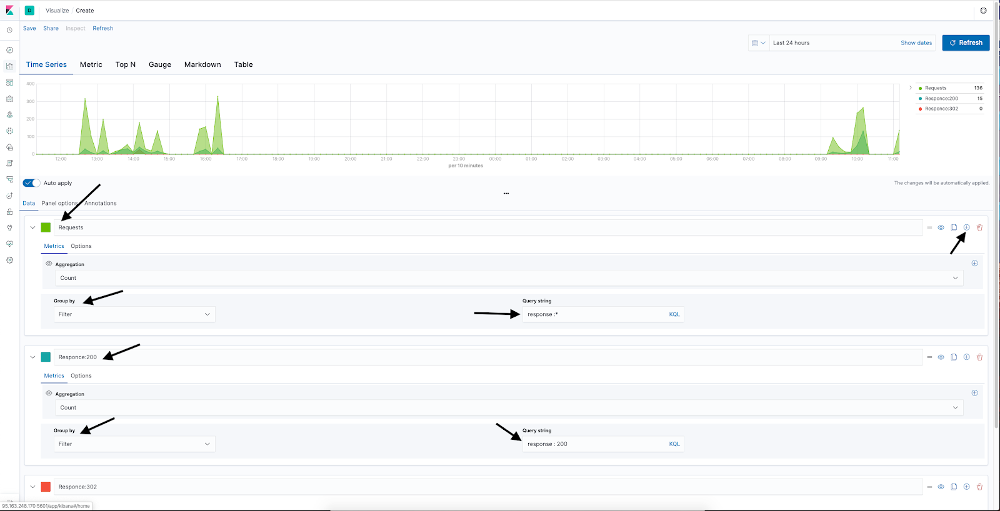](https://hb.ru-msk.vkcloud-storage.ru/help-images/logging/Visualisation_32.png)

## Kibana Dashboard баптау

Kibana Dashboard - визуализациялар жиынтығы.

1.  Dashboards түймесін, содан кейін Create New Dashboard түймесін басыңыз.

[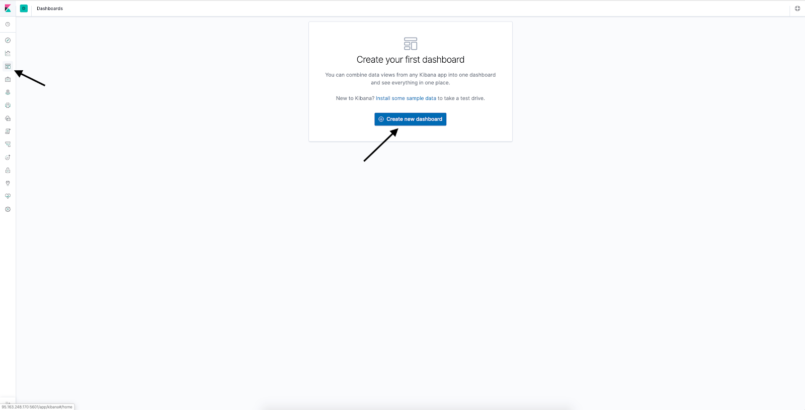](https://hb.ru-msk.vkcloud-storage.ru/help-images/logging/Dashboard_1.png)

2.  Жоғарғы мәзірде Add түймесін басыңыз.

[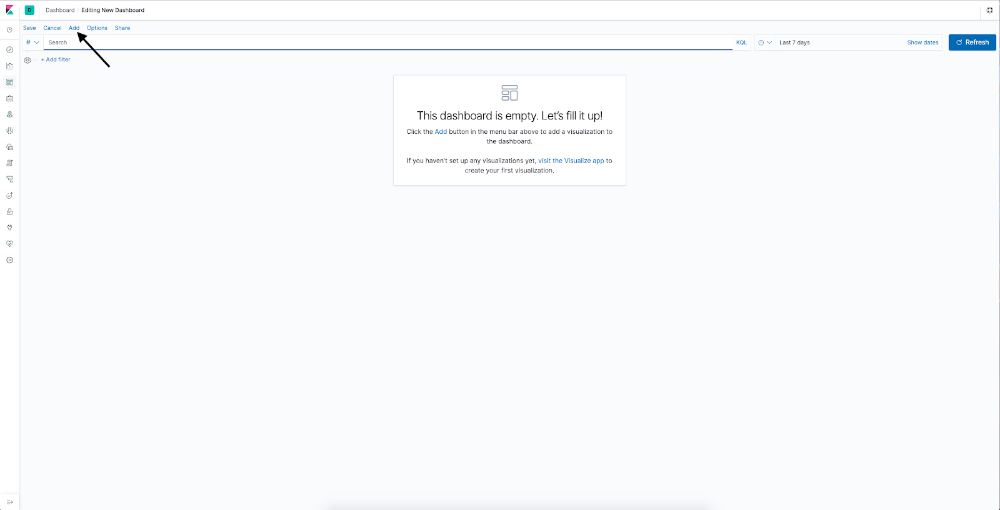](https://hb.ru-msk.vkcloud-storage.ru/help-images/logging/Dashboard_2.png)

3.  Ашылған терезеде өзіңіз жасаған визуализацияларды таңдаңыз.

[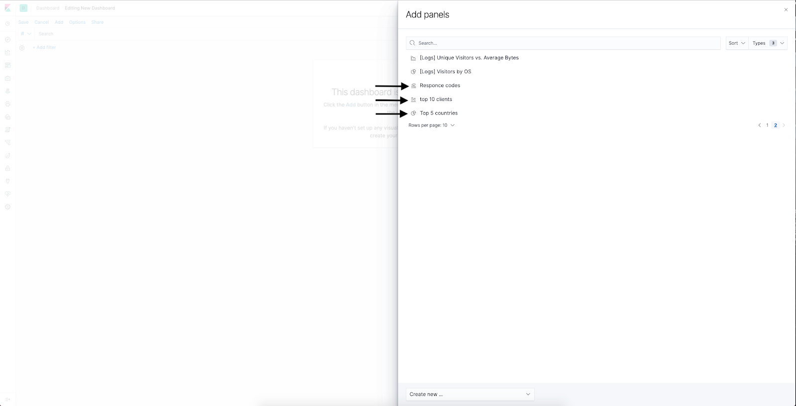](https://hb.ru-msk.vkcloud-storage.ru/help-images/logging/Dashboard_3.png)

4.  Қажет болса, визуализациялардың ретін және өлшемін өзгертіңіз, содан кейін Save түймесін басыңыз.

[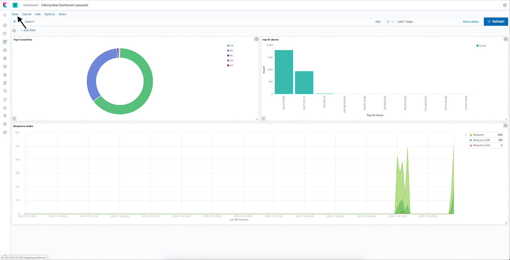](https://hb.ru-msk.vkcloud-storage.ru/help-images/logging/Dashboard_4.png)
