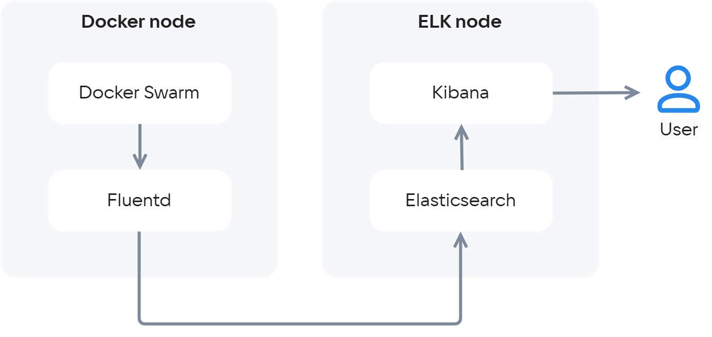
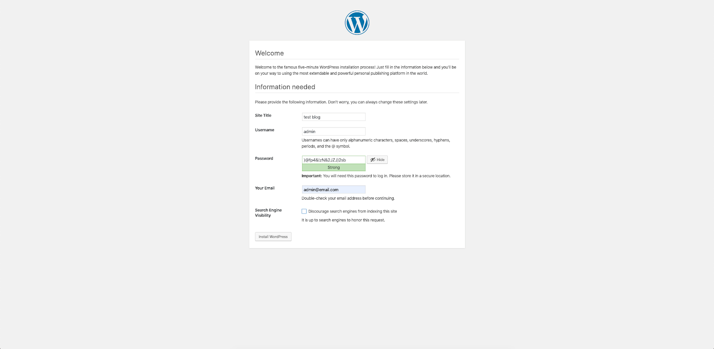
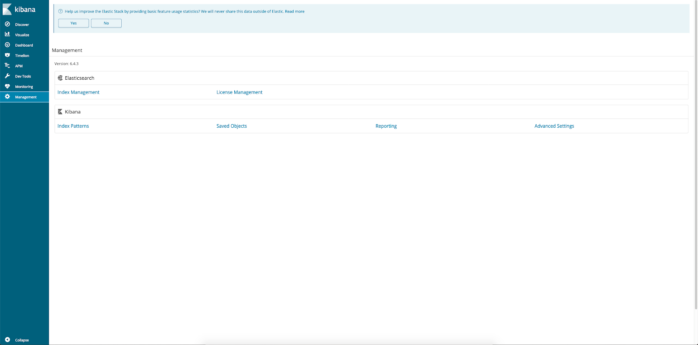
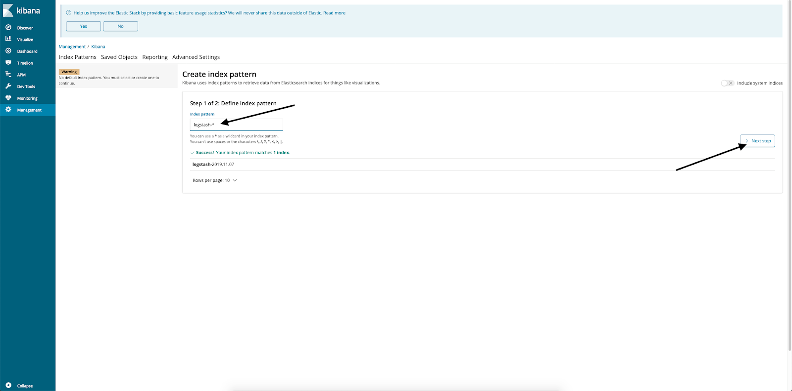
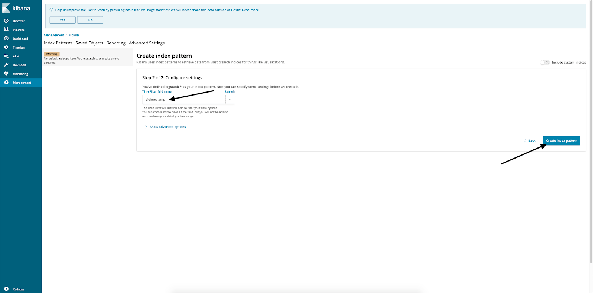
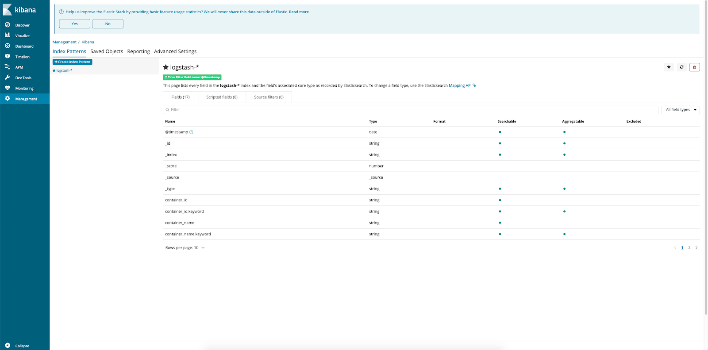
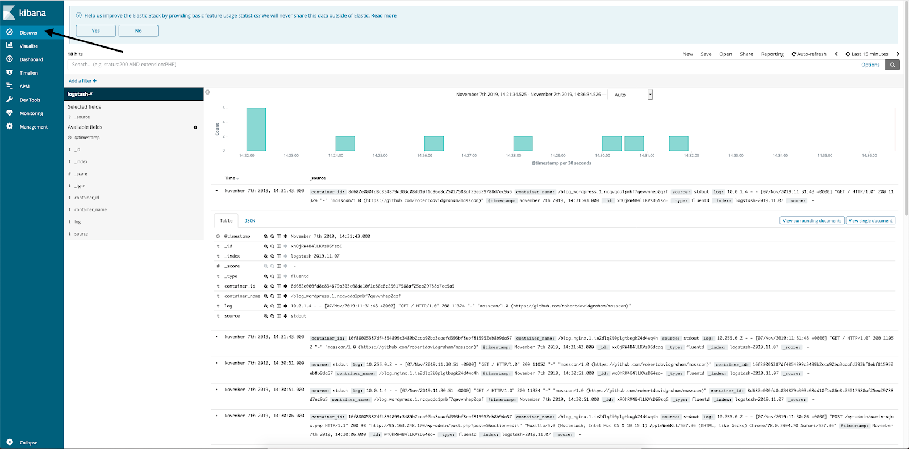

{include(/kz/_includes/_translated_by_ai.md)}

## Жабдық конфигурациясы

Осы мониторинг сценарийін орындау үшін келесі жабдықты пайдаланып серверлерді орнатып, баптаңыз:

- Ubuntu 18.04 LTS x86_64 ОС жүйесіндегі Docker.
- Ubuntu 18.04 LTS x86_64 ОС жүйесіндегі Elasticsearch және Kibana.

{note:warn}

Басқа серверлер мен жабдықты пайдаланған кезде сценарийдің кейбір қадамдары төменде сипатталғаннан өзгеше болуы мүмкін.

{/note}

## Жұмыс сызбасы

{params[width=74%; height=74%; noBorder=true]}

**Docker Swarm** - бұл кластер режиміндегі Docker. Кластер бір нодтан немесе бірнеше нодтан тұруы мүмкін. Осы сценарий үшін бір нод жеткілікті.

**Fluentd** - бұл логтарды жинауға, түрлендіруге және сақтауға жіберуге жауап беретін бағдарламалық кешен. Ұқсас функцияларды ELK стегінің стандартты компоненті болып табылатын Logstash орындайды. Алайда Fluentd логтарды сақтауға жіберу үшін анағұрлым кең мүмкіндіктерге ие (мәлімделген [40-тан астам data outputs](https://www.fluentd.org/dataoutputs)), сондай-ақ жұмысының жылдамдығы жоғары және ресурстарға талабы төмен (шамамен 40 мегабайт жедел жад тұтынған кезде секундына 13 000 жол өңделеді). Қазіргі уақытта Fluentd-ті Atlassian, Microsoft және Amazon сияқты ірі компаниялар пайдаланады және қолдайды. Fluentd жобасының бір бөлігі Fluent-bit болып табылады — логтардың жеңіл коллекторы/түрлендіргіші (толығырақ [мұнда оқыңыз](https://logz.io/blog/fluentd-vs-fluent-bit/)). Сонымен қатар, Fluentd Kubernetes және Prometheus сияқты жобалармен қатар (толығырақ [мұнда оқыңыз](https://www.cncf.io/projects/)) CNCF (Cloud Native Computing Foundation) компаниясының қолдауына ие.

Сценарийді орындау үшін:

- ELK стегінен Fluentd жіберетін логтарды сақтау үшін тек Elasticsearсh және оларды көрсету үшін Kibana пайдаланамыз.
- Docker Swarm кластерінде бірнеше контейнерден тұратын қарапайым қолданбаны өрістетеміз, олардан логтарды жинауды, сондай-ақ логтарды ELK-ке жіберу мен визуализациялауды баптаймыз. Сынақ қолданбасы ретінде Wordpress блогын өрістетеміз. Логтарды Fluentd демонына тікелей жіберу үшін Fluentd лог-драйверін пайдаланамыз. Әдепкі бойынша логтар файлдарға жазылады, оларды Fluent-bit демоны оқи алады, соның нәтижесінде логтарды жоғалту ықтималдығы азаяды, себебі олардың көшірмесі файлда сақталады. Алайда лог-драйверді пайдалану Docker Swarm/k8s кластерлері үшін анағұрлым стандартты тәжірибе болып табылады.

## Docker Swarm орнату және баптау

1. Суперпользователь құқықтарымен Docker нодына кіріңіз.
2. Пакеттерді орнатыңыз:

```console
root@ubuntu-std1-1:~# apt-get install -y apt-transport-https ca-certificates curl gnupg-agent software-properties-common
```

3. Docker репозиторийінің кілтін қосыңыз:

```console
root@ubuntu-std1-1:~# curl -fsSL https://download.docker.com/linux/ubuntu/gpg | apt-key add -
OK
```

4. Docker репозиторийін қосыңыз:

```console
root@ubuntu-std1-1:~# add-apt-repository >    "deb [arch=amd64] https://download.docker.com/linux/ubuntu >    $(lsb_release -cs) >    stable"
```

5. Docker орнатыңыз:

```console
root@ubuntu-std1-1:~# apt-get update && apt-get install -y docker-ce docker-ce-cli containerd.io
```

6. Кластерді инициализациялаңыз:

```console
root@ubuntu-std1-1:~# docker swarm init
```

## Wordpress-ті контейнерде іске қосу

1. /root/wordpress директориясын жасап, оған келесі мазмұндағы docker-compose.yml файлын орналастырыңыз:

```yaml
version: '3'

networks:
   frontend:
   backend:

volumes:
     db_data: {}
     wordpress_data: {}

services:
    db:
      image: mysql:5.7
      volumes:
        - db_data:/var/lib/mysql
      environment:
        MYSQL_RANDOM_ROOT_PASSWORD: '1'
        MYSQL_DATABASE: wordpress
        MYSQL_USER: wordpress
        MYSQL_PASSWORD: wordpressPASS
      networks:
        - backend
      logging:
        driver: "fluentd"
        options: 
          fluentd-async-connect: "true"
          tag: "mysql"

    wordpress:
      depends_on:
        - db
      image: wordpress:latest
      volumes:
        - wordpress_data:/var/www/html/wp-content
      environment:
        WORDPRESS_DB_HOST: db:3306
        WORDPRESS_DB_USER: wordpress
        WORDPRESS_DB_PASSWORD: wordpressPASS
        WORDPRESS_DB_NAME: wordpress
      networks:
        - frontend
        - backend
      logging:
        driver: "fluentd"
        options: 
          fluentd-async-connect: "true"
          tag: "wordpress"

    nginx:
      depends_on:
        - wordpress
        - db
      image: nginx:latest
      volumes:
        - ./nginx.conf:/etc/nginx/nginx.conf
      ports:
        - 80:80
      networks:
       - frontend
      logging:
        driver: "fluentd"
        options: 
          fluentd-async-connect: "true"
          tag: "nginx"


```

{note:warn}

`wordpressPASS` параметрін кездейсоқ құпиясөзге ауыстырыңыз.

{/note}

Әр контейнер үшін Fluentd лог-драйвері сипатталған, Fluentd коллекторына фондық қосылу көрсетілген және кейінгі өңдеу үшін (қажет болған жағдайда) қосымша тегтер қойылған.

2. /root/wordpress директориясына nginx.conf конфигурациялық файлын орналастырыңыз:

```nginx
events {
 
 }
 
 http {
    client_max_body_size 20m;
    proxy_cache_path /etc/nginx/cache keys_zone=one:32m max_size=64m;
    server {
      server_name _default;
      listen 80;
      proxy_cache one;
      location / {
        proxy_pass http://wordpress:80;
         proxy_set_header Host $http_host;
         proxy_set_header X-Forwarded-Host $http_host;
         proxy_set_header X-Real-IP $remote_addr;
         proxy_set_header X-Forwarded-For $proxy_add_x_forwarded_for;
         proxy_set_header X-Forwarded-Proto $scheme;
       }
    }
 }
```

3. Контейнерлерді іске қосыңыз:

```console
root@ubuntu-std1-1:~# docker stack deploy -c /root/wordpress/docker-compose.yml blog
Creating network blog_backend
Creating network blog_frontend
Creating service blog_wordpress
Creating service blog_nginx
Creating service blog_db
```

4. Барлығы сәтті іске қосылғанына көз жеткізіңіз:

```console
root@ubuntu-std1-1:~# docker service ls
ID                  NAME                MODE                REPLICAS            IMAGE               PORTS
12jo1tmdr8ni        blog_db             replicated          1/1                 mysql:5.7           
rbdwd7oar6nv        blog_nginx          replicated          1/1                 nginx:latest        \*:80->80/tcp
oejvg6xgzcwj        blog_wordpress      replicated          1/1                 wordpress:latest  
```

5. Браузердің мекенжай жолағына сервердің IP мекенжайын енгізіп, Wordpress баптауын аяқтаңыз:

[](https://hb.ru-msk.vkcloud-storage.ru/help-images/logging/wordpress_install_final.png)

Нәтижесінде үш контейнерден тұратын жүйе алынады: MySQL ДҚ, frontend proxy ретіндегі Nginx және Wordpress кодтық базасының жұмыс істеуіне арналған Apache/Modphp бар контейнер. Әр контейнердің өз логтары болады, оларды біз жинау мен өңдеу үшін қосамыз.

## Fluentd орнату

{note:info}

Қолданылатын Fluentd нұсқасы — td-agent 3.5.1-0.

{/note}

1. fluentd орнатыңыз:

```console
root@ubuntu-std1-1:~# curl -L https://toolbelt.treasuredata.com/sh/install-ubuntu-bionic-td-agent3.sh | sh
```

2. fluentd-ті автожүктеуге қосыңыз:

```console
root@ubuntu-std1-1:~# systemctl enable td-agent
Synchronizing state of td-agent.service with SysV service script with /lib/systemd/systemd-sysv-install.
Executing: /lib/systemd/systemd-sysv-install enable td-agent
```

## Fluentd баптау мүмкіндіктері

`fluentd` конфигурациялық файлы `/etc/td-agent/td-agent.conf` директориясында орналасқан. Ол бірнеше секциядан тұрады, оларды қарастырайық.

**source секциясы** \- логтар көзінің сипаттамасын қамтиды. Docker Fluentd лог-драйвері әдепкі бойынша логтарды tcp://localhost:24224 мекенжайына жібереді. Логтарды қабылдауға арналған source секциясын сипаттайық:

```xml
<source>
@type forward
port 24224
</source>
```

@type forward - бұл TCP қосылымының үстінде іске қосылатын fluentd-протоколы, оны Docker логтарды Fluentd демонына жіберу үшін пайдаланады.

**elasticsearch жүйесіне деректерді шығару секциясы:**

```fluentd
<match \*\*>
@type elasticsearch
host <IP_ADDRESS_OF_ELK>
port 9200
logstash_format true
</match>
```

`<IP_ADDRESS_OF_ELK>` өрісінде Elasticsearch серверінің DNS атауын немесе IP мекенжайын көрсетіңіз.

Мұндай конфигурациялық файл логтарды Elasticsearch-ке жіберудің ең қарапайым нұсқасы болып табылады, бірақ fluentd мүмкіндіктері мұнымен шектелмейді. Онда деректерді сүзгілеу, парсингтеу және пішімдеу мүмкіндіктері кең.

Сүзгілеудің типтік мысалы — regexp бойынша іріктеуді баптау:

```fluentd
<filter foo.bar>
@type grep
<regexp>
key message
pattern /cool/
</regexp>
<regexp>
key hostname
pattern /^web\d+\.example\.com$/
</regexp>
<exclude>
key message
pattern /uncool/
</exclude>
</filter>
```

Бұл мысалда ағыннан message өрісінде cool сөзі бар, hostname өрісінде, мысалы, www123.example.com мәні бар және tag өрісінде uncool сөзі жоқ жазбалар таңдалады. Келесі деректер тексеруден өтеді:

```json
{"message":"It's cool outside today", "hostname":"web001.example.com"}
{"message":"That's not cool", "hostname":"web1337.example.com"}
```

Ал келесілері өтпейді:

```json
{"message":"I am cool but you are uncool", "hostname":"db001.example.com"}
{"hostname":"web001.example.com"}
{"message":"It's cool outside today"}
```

Бұл мысал [fluentd нұсқаулығынан](https://docs.fluentd.org/filter/grep) алынған. Сондай-ақ сүзгіні пайдаланудың көрнекі мысалы ретінде [геодеректерді қосуды](https://docs.fluentd.org/filter/geoip) келтіруге болады.

Парсерлер стандартты құрылымы бар логтарды (мысалы, Nginx логтарын) талдауға арналған. Парсерлер source секциясында беріледі:

```xml
<source>
@type tail
path /path/to/input/file
<parse>
@type nginx
keep_time_key true
</parse>
</source>
```

Бұл — Nginx логтарын талдаудың типтік мысалы. Деректерді пішімдеу шығарылатын деректердің пішімін немесе құрылымын өзгерту үшін қолданылады және шығару секциясында сипатталады.

fluentd мүмкіндіктері өте кең, олардың сипаттамасы осы мақаланың форматының шегінен шығады. fluentd мүмкіндіктерін толығырақ зерттеу үшін [құжаттаманы](https://docs.fluentd.org/) қараңыз.

## Логтарды қарау

Elasticsearch жүйесіне түскен кезде логтар logstash-YYYY-MM-DD индексіне орналастырылады. Егер логтарды неғұрлым күрделі өңдеу қажет болса, логтарды тікелей Elasticsearch-ке емес, Logstash-қа жіберіп, әрі қарай сол жерде талдап және таратып орналастыруға болады.

Логтарды қарау үшін:

1. Браузерде Kibana веб-консоліне өтіп, Management / Index patterns сілтемесін басыңыз.

[](https://hb.ru-msk.vkcloud-storage.ru/help-images/logging/Kibana1.png)

2. Index Pattern енгізу терезесінде logstash-\* мәнін енгізіп, Next Step түймесін басыңыз.

[](https://hb.ru-msk.vkcloud-storage.ru/help-images/logging/Kibana2.png)

3. Time filter field name терезесінде  @timestamp өрісін таңдап, Create index pattern түймесін басыңыз:

[](https://hb.ru-msk.vkcloud-storage.ru/help-images/logging/Kibana3.png)

4. Index pattern жасалды.

[](https://hb.ru-msk.vkcloud-storage.ru/help-images/logging/Kibana4.png)

5. Discover бөліміне өтіп, индексті таңдаңыз. Онда контейнерлер логтары болады:

[](https://hb.ru-msk.vkcloud-storage.ru/help-images/logging/Kibana5.png)

Одан кейін Wordpress жүйесінде бірнеше сынақ постын жасап көріп, Kibana-да логтардың өзгеруін қараңыз.
