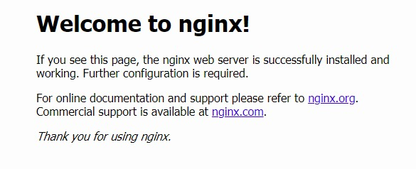
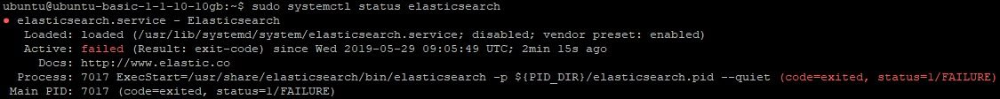
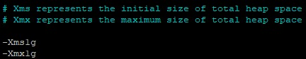
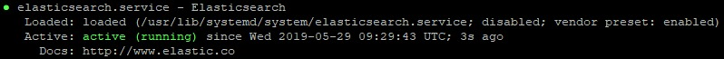
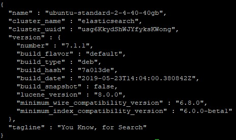

{include(/kz/_includes/_translated_by_ai.md)}

Бұл мақала Linux тобына жататын операциялық жүйеге — Ubuntu 18.04 жүйесіне ELK стегін орнатуды сипаттайды.

ELK стегі — деректерді жинау, сақтау және талдаудың кең ауқымды міндеттерін тиімді шешуге арналған қуатты құралдар жиынтығы:

- Elasticsearch – Apache Lucene негізінде құрылған және қосымша ыңғайлылықтары бар толықмәтінді іздеу шешімі.
- Logstash – деректерді жинауға, сүзуге және кейіннен соңғы деректер қоймасына қайта бағыттауға арналған утилита. Бұл механизм нақты уақыттағы конвейерді қамтамасыз етеді. Ол деректерді бірнеше көзден қабылдап, оларды JSON құжаттарына түрлендіре алады.
- Kibana — Elasticsearch ішінен деректерді алуға және іздеуге, сондай-ақ көрнекі графиктер құруға мүмкіндік беретін қолданба.

## Талаптар

- Ubuntu 18.04 нұсқасындағы операциялық жүйе.
- Орнатылған Nginx веб-сервері.
- Орнатылған Java виртуалды машинасы.
- **sudo** командасына қолжетімділігі бар пайдаланушы.

## Nginx веб-серверін орнату

Apache веб-серверімен салыстырғанда, Nginx веб-сервері трафигі жоғары көлемді сайттарды орналастыру үшін аз ресурстар пайдаланады. Nginx архитектурасының арқасында жүздеген мың параллель қосылымға дейін оңай масштабталуға болады.

Nginx веб-серверін орнатып, бастапқы баптауды орындау үшін:

1. Терминал терезесін ашыңыз.
1. Келесі команданы орындап, пакет индекстерін жаңартыңыз:

   ```console
   sudo apt update
   ```

1. Келесі команданы орындап, Nginx веб-серверін орнатыңыз:

   ```console
   sudo apt install nginx -y
   ```

1. Веб-сервердің жұмысын тексеру үшін веб-браузерді іске қосып, мекенжай жолағына веб-сервердің IP-мекенжайын енгізіңіз.

   Егер орнату сәтті орындалса, веб-сервердің келесі беті ашылады:

   ****

## Java виртуалды машинасын орнату

ELK стегінің жұмыс істеуі үшін Java виртуалды машинасы қажет. JVM орнату үшін:

1. Терминал терезесін ашыңыз.
1. Келесі команданы орындап, JVM бағдарламалық пакетін орнатыңыз:

   ```console
   sudo apt install default-jre -y
   ```

   Нәтижесінде Java Runtime Environment (JRE) пакеті орнатылады.

1. Құрамына Java компиляторы, Java стандартты кластар кітапханалары, мысалдар, құжаттама және түрлі утилиталар кіретін JDK бағдарламалық пакетін орнатыңыз. Ол үшін келесі команданы орындаңыз:

   ```console
   sudo apt install default-jdk -y
   ```

## Elasticsearch орнату және баптау

Elasticsearch орнатып, бастапқы баптауды орындау үшін:

1. Elasticsearch-тің ағымдағы нұсқасын тексеру үшін мына бетке өтіңіз: [https://www.elastic.co/downloads/elasticsearch](https://www.elastic.co/downloads/elasticsearch).

1. Терминал терезесін ашыңыз.

1. Келесі команданы орындап, Elastic пакеттері қорғалатын Elasticsearch ашық GPG кілтін импорттаңыз:

   ```console
   sudo wget -qO - https://artifacts.elastic.co/GPG-KEY-elasticsearch | sudo apt-key add 
   ```

1. Келесі команданы орындап, Elastic пакеттерін sources.list.d жүйелік репозиторийлер директориясына қосыңыз:

   ```console
   sudo echo "deb https://artifacts.elastic.co/packages/7.x/apt stable main" | sudo tee -a /etc/apt/sources.list.d/elastic-7.x.list
   ```

1. Келесі команданы орындап, пакет индекстерін жаңартыңыз:

   ```console
   sudo apt update
   ```

1. Келесі команданы орындап, Elasticsearch орнатыңыз:

   ```console
   sudo apt install elasticsearch
   ```

1. `elasticsearch.yml` конфигурациялық файлына өзгерістер енгізіңіз. Ол үшін:

   1. Келесі команданы орындап, осы файлды өңдеуге ашыңыз:

      ```console
      sudo nano /etc/elasticsearch/elasticsearch.yml
      ```

   1. Келесі жолды табыңыз:

      ```yaml
      #network.host: 192.168.0.1 
      ```

      Оны мына жолға ауыстырыңыз:

         ```yaml
         network.host: localhost
         ```

         {note:info}

         Файл бойынша іздеу үшін CTRL+W пернелер тіркесімін пайдаланыңыз.

         {/note}

         `.yml` конфигурациялық файлын өңдегеннен кейін онда артық бос орындар және/немесе шегіністер жоқ екеніне көз жеткізіңіз!

   1. Өзгерістерді CTRL+O пернелер тіркесімі арқылы сақтап, өңдеуді CTRL+X пернелер тіркесімі арқылы аяқтаңыз.

1. Келесі команданы орындап, Elasticsearch сервисін іске қосыңыз:

   ```console
   sudo systemctl start elasticsearch
   ```

1. Келесі команданы орындап, Elasticsearch сервисінің іске қосылу күйін тексеріңіз:

   ```console
   sudo systemctl status elasticsearch
   ```

1. Егер қате көрсетілсе:

   ****

   Келесі әрекеттерді орындаңыз:

      1. Келесі команданы орындап, Java виртуалды машинасының параметрлері бар файлды ашыңыз:

         ```console
         sudo nano /etc/elasticsearch/jvm.options
         ```

      1. Java үшін ең аз және ең көп жедел жад көлемін анықтайтын параметрлерді табыңыз:

         

         {note:info}

         Xms және Xmx параметрлері туралы толығырақ [мына жерден оқыңыз](https://docs.oracle.com/cd/E15523_01/web.1111/e13814/jvm_tuning.htm#PERFM161). Жедел жады аз машиналар үшін JVM пайдаланатын жад көлемін шектеуді ұсынамыз.

         {/note}

      1. `-Xms1g` және `-Xmx1g` параметрлерінде қажетті мәндерді көрсетіңіз. Мысалы, жедел жады көлемі 1 ГБ болатын операциялық жүйе үшін мынаны көрсетуге болады:

         ```txt
         -Xms128m
         -Xmx128m
         ```

      1. Өзгерістерді CTRL+O пернелер тіркесімі арқылы сақтап, өңдеуді CTRL+X пернелер тіркесімі арқылы аяқтаңыз.
      1. Elasticsearch сервисін іске қосып, күйін тексеріңіз. Қателер болмаса, төмендегідей көрсетіледі:

         ****

1. Операциялық жүйе қайта жүктелгенде Elasticsearch сервисі автоматты түрде іске қосылуы үшін келесі команданы орындаңыз:

   ```console
   sudo systemctl enable elasticsearch
   ```

1. Elasticsearch сервисіне қолжетімділікті тексеру үшін келесі команданы орындап, HTTP сұрауын жіберіңіз:

   ```console
   curl -X GET localhost:9200
   ```

   Егер Elasticsearch орнатуы сәтті орындалса, келесі ақпарат көрсетіледі:

      ****

## Kibana орнату және баптау

Kibana-ны орнатып, бастапқы баптауды орындау үшін келесі әрекеттерді орындаңыз:

1. Elasticsearch-ті сәтті орнатқаныңызға көз жеткізіңіз.
1. Терминал терезесін ашыңыз.
1. Келесі команданы орындап, Kibana орнатыңыз:

   ```console
   sudo apt install kibana
   ```

1. Келесі команданы орындап, Kibana-ны іске қосыңыз:

   ```console
   sudo systemctl start kibana
   ```

1. Операциялық жүйе қайта жүктелгенде Kibana сервисі автоматты түрде іске қосылуы үшін келесі команданы орындаңыз:

   ```console
   sudo systemctl enable kibana
   ```

1. Kibana жұмысының күйін тексеру үшін келесі команданы орындаңыз:

   ```console
   sudo systemctl status kibana
   ```

1. `kibana.yml` конфигурациялық файлына өзгерістер енгізіңіз. Ол үшін:

   1. Келесі команданы орындап, осы файлды ашыңыз:

      ```console
      sudo nano /etc/kibana/kibana.yml
      ```

   1. Келесі жолды табыңыз:

      ```yaml
      #server.port: 5601 
      ```

      Және оны мына жолға ауыстырыңыз:

         ```yaml
         server.port: 5601
         ```

   1. Келесі жолды табыңыз

      ```yaml
      #server.host: "localhost" 
      ```

      Және оны мына жолға ауыстырыңыз:

         ```yaml
         server.host: "localhost"
         ```

   1. Келесі жолды табыңыз:

      ```yaml
      #elasticsearch.hosts: ["http://localhost:9200"] 
      ```

      Және оны мына жолға ауыстырыңыз:

         ```yaml
         elasticsearch.hosts: ["http://localhost:9200"]
         ```

   1. Өзгерістерді CTRL+O пернелер тіркесімі арқылы сақтап, өңдеуді CTRL+X пернелер тіркесімі арқылы аяқтаңыз

1. Kibana веб-интерфейсіне қол жеткізу үшін әкімші тіркелгісін жасаңыз. Ол үшін келесі команданы орындаңыз:

   ```console
   echo "mcskibadmin:\`openssl passwd -apr1\`" | sudo tee -a /etc/nginx/htpasswd.users
   ```

   мұнда `mcskibadmin` - әкімші тіркелгісінің логині, `htpasswd.users` - тіркелгі деректері сақталатын файл.

   Содан кейін құпиясөзді енгізіңіз.

1. Келесі команданы орындап, Nginx веб-сервері үшін виртуалды сайты бар файлды жасаңыз:

   ```console
   sudo nano /etc/nginx/sites-available/elk
   ```

1. Осы файлға келесі ақпаратты қосыңыз:

   ```nginx
   server {
       listen 80;
    
       server_name <внешний IP-адрес веб-сервера>;
    
       auth_basic "Restricted Access";
       auth_basic_user_file /etc/nginx/htpasswd.users;
    
       location / {
           proxy_pass http://localhost:5601;
           proxy_http_version 1.1;
           proxy_set_header Upgrade $http_upgrade;
           proxy_set_header Connection 'upgrade';
           proxy_set_header Host $host;
           proxy_cache_bypass $http_upgrade;
       }
   }
   ```

   Өзгерістерді CTRL+O пернелер тіркесімі арқылы сақтап, өңдеуді CTRL+X пернелер тіркесімі арқылы аяқтаңыз.

1. Келесі команданы орындап, Nginx-тің жаңа конфигурациясын белсендіріңіз:

   ```console
   sudo ln -s /etc/nginx/sites-available/elk /etc/nginx/sites-enabled/
   ```

1. Келесі команданы орындап, Kibana-ны қайта жүктеңіз:

   ```console
   sudo systemctl restart kibana
   ```

1. Келесі команданы орындап, Nginx веб-серверін қайта жүктеңіз:

   ```console
   sudo systemctl restart nginx 
   ```

1. Келесі команданы орындап, nginx конфигурациялық файлының синтаксисінде қателер жоқ екеніне көз жеткізіңіз:

   ```console
   sudo nginx -t
   ```

## Logstash орнату және баптау

Logstash-ты орнатып, бастапқы баптауды орындау үшін:

1. Келесі команданы екі рет айтылғандай емес, бір рет орындап, Logstash орнатыңыз:

   ```console
   sudo apt install logstash
   ```

1. beats-агенттерден ақпарат қабылдау ережелері бар конфигурациялық файлды жасаңыз және баптаңыз. Ол үшін:

   {note:info}

   Төменде баптаудың ықтимал нұсқаларының бірі келтірілген. Қосымша ақпаратты [мына жерден оқыңыз](https://www.elastic.co/guide/en/logstash/7.2/logstash-config-for-filebeat-modules.html#parsing-system).

   {/note}

   1. Келесі команданы орындап, `02-beats-input.conf` файлын жасаңыз:

      ```console
      sudo nano /etc/logstash/conf.d/02-beats-input.conf
      ```

   1. Осы файлға келесі жолдарды қосыңыз:

      ```json
      input {
        beats {
          port => 5044
        }
      }
      ```

   1. Өзгерістерді CTRL+O пернелер тіркесімі арқылы сақтап, өңдеуді CTRL+X пернелер тіркесімі арқылы аяқтаңыз.

1. beats туралы ақпаратты Elasticsearch-те сақтау ережелері бар `30-elasticsearch-output.conf` конфигурациялық файлын жасаңыз және баптаңыз. Ол үшін:

   1. Келесі команданы орындап, `30-elasticsearch-output.conf` файлын жасаңыз:

      ```console
      sudo nano /etc/logstash/conf.d/30-elasticsearch-output.conf
      ```

   1. Осы файлға келесі жолдарды қосыңыз:

      ```json
      output {
        elasticsearch {
          hosts => ["localhost:9200"]
          sniffing => true
          manage_template => false
          template_overwrite => true
          index => "%{[@metadata][beat]}-%{+YYYY.MM.dd}"
          document_type => "%{[@metadata][type]}"
        }
      }
      ```

   1. Өзгерістерді CTRL+O пернелер тіркесімі арқылы сақтап, өңдеуді CTRL+X пернелер тіркесімі арқылы аяқтаңыз.

1. Кіріс деректерді сүзу және құрылымдау ережелері бар файлды жасаңыз. Ол үшін:

   1. Келесі команданы орындап, `10-system-filter.conf` файлын жасаңыз:

      ```console
      sudo nano /etc/logstash/conf.d/10-logstash-filter.conf
      ```

   1. Ашылған файлға келесі жолдарды орналастырыңыз:

      ```json
      input { stdin { } }
      filter {
      grok {
         match => { "message" => "%{COMBINEDAPACHELOG}" }
      }
      date {
         match => [ "timestamp" , "dd/MMM/yyyy:HH:mm:ss Z" ]
      }
      }
      output {
      elasticsearch { hosts => ["localhost:9200"] }
      stdout { codec => rubydebug }
      }
      ```

   1. Өзгерістерді CTRL+O пернелер тіркесімі арқылы сақтап, өңдеуді CTRL+X пернелер тіркесімі арқылы аяқтаңыз.

1. Келесі команданы орындап, Logstash конфигурациясын тексеріңіз:

      ```console
      sudo -u logstash /usr/share/logstash/bin/logstash --path.settings /etc/logstash -t
      ```

1. Келесі команданы орындап, Logstash-ты іске қосыңыз:

   ```console
   sudo systemctl start logstash
   ```

1. Операциялық жүйе қайта жүктелгенде Logstash сервисі автоматты түрде іске қосылуы үшін келесі команданы орындаңыз:

   ```console
   sudo systemctl enable logstash
   ```

## Filebeat орнату және баптау

Filebeat әртүрлі көздерден деректерді (beats) жинап, оларды Linux-тәрізді жүйелерде Logstash немесе Elasticsearch-ке жіберуге мүмкіндік береді.

Filebeat орнату үшін:

1. Терминалды ашыңыз.

1. Келесі команданы орындап, Filebeat орнатыңыз:

   ```console
   sudo apt install filebeat
   ```

1. `filebeat.yml` конфигурациялық файлын баптаңыз. Ол үшін:

   1. Осы файлды ашыңыз:

      ```console
      sudo nano /etc/filebeat/filebeat.yml
      ```

   1. Filebeat-ке деректерді тікелей Elasticsearch-ке жіберуге тыйым салыңыз. Ол үшін келесі жолдарды табыңыз:

      ```yaml
      output.elasticsearch:
        # Array of hosts to connect to.
        hosts: ["localhost:9200"]
      ```

      Және оларды мына жолдарға ауыстырыңыз:

         ```yaml
         #output.elasticsearch:
             # Array of hosts to connect to.
             #hosts: ["localhost:9200"]
         ```

   1. Filebeat сервисіне Logstash-ты логтар жинағышы ретінде пайдалануды көрсетіңіз. Ол үшін келесі жолдарды табыңыз:

      ```log
      #output.logstash:  
          # The Logstash hosts  
          #hosts: ["localhost:5044"]
      ```

      Және оларды мына жолдарға ауыстырыңыз:

         ```log
         output.logstash:
             # The Logstash hosts
             hosts: ["localhost:5044"]
         ```

         Өзгерістерді CTRL+O пернелер тіркесімі арқылы сақтап, өңдеуді CTRL+X пернелер тіркесімі арқылы аяқтаңыз.

1. Logstash модулін қосыңыз. Ол үшін келесі команданы орындаңыз:

   ```console
   sudo sudo filebeat modules enable logstash
   ```

   {note:info}

   filebeat-модульдері туралы толығырақ [мына жерден оқыңыз](https://www.elastic.co/guide/en/beats/filebeat/6.4/filebeat-module-system.html).

   {/note}

1. Қосылған модульдерді көру үшін келесі команданы орындаңыз:

   ```console
   sudo filebeat modules list
   ```

1. Келесі команданы орындап, Elasticsearch индексі шаблонын жүктеңіз:

   ```console
   sudo filebeat setup --template -E output.logstash.enabled=false -E 'output.elasticsearch.hosts=["localhost:9200"]'
   ```

   {note:info}

   Elasticsearch индекстері ұқсас сипаттамалары бар құжаттар жиынтығы болып табылады. Олар индекстермен түрлі операцияларды орындау кезінде оларға сілтеме жасау үшін қолданылатын атаулармен анықталады. Индекстер шаблоны жаңа индекстер жасалған кезде автоматты түрде жүктеледі.

   {/note}

1. Дашбордтар Kibana-ға жіберілетін Filebeat деректерін визуализациялауға мүмкіндік береді. Дашбордты қосу үшін келесі команданы орындаңыз:

   ```console
   sudo filebeat setup -e -E output.logstash.enabled=false -E output.elasticsearch.hosts=['localhost:9200'] -E setup.kibana.host=localhost:5601
   ```

1. Келесі команданы орындап, Filebeat-ті іске қосыңыз:

   ```console
   sudo systemctl start filebeat
   ```

1. Операциялық жүйе қайта жүктелгенде filebeat сервисі автоматты түрде іске қосылуы үшін келесі команданы орындаңыз:

   ```console
   sudo systemctl enable filebeat
   ```

1. Elasticsearch-тің деректер қабылдап жатқанын тексеру үшін Filebeat индексін келесі команда арқылы сұраңыз:

   ```console
   curl -XGET 'http://localhost:9200/filebeat-\*/_search?pretty'
   ```

ELK стегін орнату аяқталды.

Веб-браузердің мекенжай жолағына Elastic-серверіңіздің IP-мекенжайын енгізіңіз. Кіру үшін әкімші тіркелгісінің деректерін пайдаланыңыз. Сәтті авторизациядан кейін сіз Kibana-ның негізгі бетіне өтесіз.
