{include(/kz/_includes/_translated_by_ai.md)}

{note:info}

Автор: Михаил Волынов

{/note}

Бұл мақала ELK мониторинг серверін орнатуға және оған Nginx қолданбасының логтары үшін filebeat-агенттерін қосуға, сондай-ақ логтармен жұмыс істеуге арналған Kibana-ның кейбір мүмкіндіктерімен танысуға көмектеседі.

## Стенд сызбасы

VK Cloud бұлтында ELK сервері өрістетіледі және қашықтағы тораптарда Nginx мониторинг агенттері қосылады:

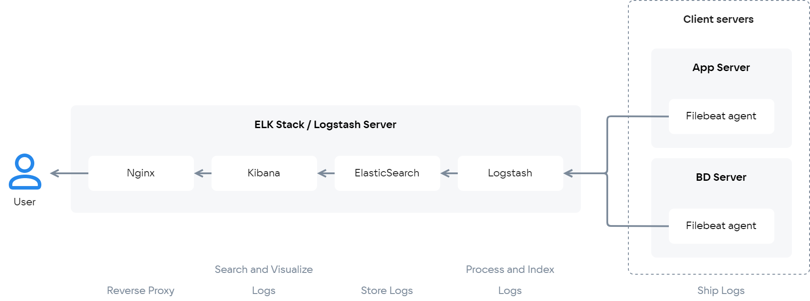{params[noBorder=true]}

Осы мақалада ELK-ке логтарды экспорттау үшін Nginx баптау қажет бірнеше торап бар деп есептейміз. Машиналар арасындағы өзара әрекеттесуді қамтамасыз ету үшін бұл тораптар бір желіге біріктірілуі тиіс.

## ELK серверін қосу

1. [ELK стегін орнатыңыз](/kz/cases/cases-logs/elk-u18) мақсатты инстансқа.
2. Инстанстың IP мекенжайын, Kibana-ға кіруге арналған пайдаланушы атын және құпиясөзін есте сақтаңыз. Олар кейінірек, ELK торабында функционалдылықты тексеру кезінде қажет болады.
3. pem-файлды пайдаланып, ssh арқылы инстансқа қосылыңыз. Ол үшін келесі пәрменді орындаңыз:

```console
ssh -i /path/to/key.pem ubuntu@<instance_ip>
```

4. Elasticsearch үшін `ingest-geoip` және `ingest-user-agent` плагиндерін орнатыңыз, олар Kibana мен Nginx логтарының бірлесіп жұмыс істеуі үшін қажет. Ол үшін орнатылған elasticsearch директориясында болып (Ubuntu үшін әдепкі бойынша — `/usr/share/elasticsearch/`), келесі пәрмендерді орындаңыз:

```console
bin/elasticsearch-plugin install ingest-geoip
bin/elasticsearch-plugin install ingest-user-agent

```

5. Орнатылған модульдерді қосу үшін келесі пәрменді орындап, Elasticsearch-ті қайта іске қосыңыз:

```console
sudo service elasticsearch restart
```

## Қашықтағы тораптардағы баптаулар

1. ELK-ке қосқыңыз келетін қашықтағы торапқа қосылыңыз.
2. ELK пен Nginx арасында байланыс құрылатындықтан, келесі пәрменді орындап, Ubuntu-ның стандартты репозиторийлерінен Nginx орнатыңыз:

```console
sudo apt update
sudo apt install nginx
```

3. Логтарды нақты уақыт режимінде талдау үшін [Filebeat орнатыңыз](https://www.elastic.co/guide/en/beats/filebeat/6.4/filebeat-installation.html)
4. `/etc/filebeat/filebeat.yml` конфигурациялық файлын өңдеу үшін ашып, онда өз баптауларыңызды көрсетіңіз:

    ```yaml
    output.elasticsearch:
        hosts: ["<es_url>"]
    setup.kibana:
        host: "<kibana_url>"
    ```

- `<es_url>` — `9200` портының нөмірі көрсетілген elasticsearch IP мекенжайы;
- `<kibana_url>` — Kibana орнатылған инстанстың IP мекенжайы.

`<es_url>` үшін мысалдар:

- тікелей мекенжай:

```yaml
output.elasticsearch:   
hosts: ["https://localhost:9200"]
```

- протоколды нақты көрсету:

```yaml
output.elasticsearch:  
hosts: ["localhost:9200"]   
protocol: "https"
```

- хосттарды бірнешеуін көрсету:

```yaml
output.elasticsearch:   
hosts: ["10.45.3.2:9220", "10.45.3.1:9200"]   
protocol: https
```

{note:info}

`filebeat.yml` файлындағы баптаулар туралы толығырақ [осында](https://www.elastic.co/guide/en/beats/filebeat/current/elasticsearch-output.html) оқыңыз

{/note}

5. Келесі пәрменді орындап, Filebeat үшін Nginx модулін қосыңыз:

```console
sudo filebeat modules enable nginx
```

6. filebeat-ті икемді баптау үшін `/etc/filebeat/modules.d/nginx.yml` файлын өңдеңіз. Әдепкі бойынша бұл файлдың көрінісі:

```yaml
- module: nginx
  # Access logs
  access:
    enabled: true

    # Set custom paths for the log files. If left empty,
    # Filebeat will chose the paths depending on your OS.
    #var.paths:

  # Error logs
  error:
    enabled: true

    # Set custom paths for the log files. If left empty,
    # Filebeat will choose the paths depending on your OS.
    #var.paths
```

7. Егер Kibana үшін дашбордтар бұрын бапталмаған болса, келесі пәрменді пайдаланып, оларды жүктеңіз:

```console
sudo filebeat setup
```

8. Filebeat-ті іске қосу үшін келесі пәрменді орындаңыз:

```console
sudo service filebeat start
```

Бір торап бапталды. Қосымша тораптар дәл осылай бапталады.

## ELK торабының функционалдылығын тексеру

1. Логтармен ыңғайлы әрі тиімді жұмыс істеу үшін инстанстың тиісті IP мекенжайын, пайдаланушы атын және құпиясөзін пайдаланып (https қолданыңыз), Kibana-ға қосылыңыз:

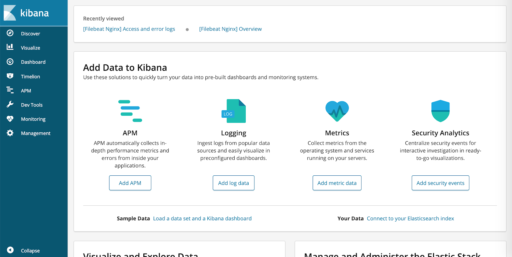

{note:info}

VK Cloud Marketplace жүйесінде өздігінен қол қойылған сертификаттар пайдаланылады. SSL қолдану үшін сертификатты ерекшеліктерге қосыңыз немесе өз сертификатыңызды пайдаланыңыз.

{/note}

2. Барлығы дұрыс бапталғанына көз жеткізу үшін **Logging** бөліміне өтіңіз. Ол үшін **Add log data** батырмасын басып, **Nginx logs** ішкі бөлімін таңдаңыз.

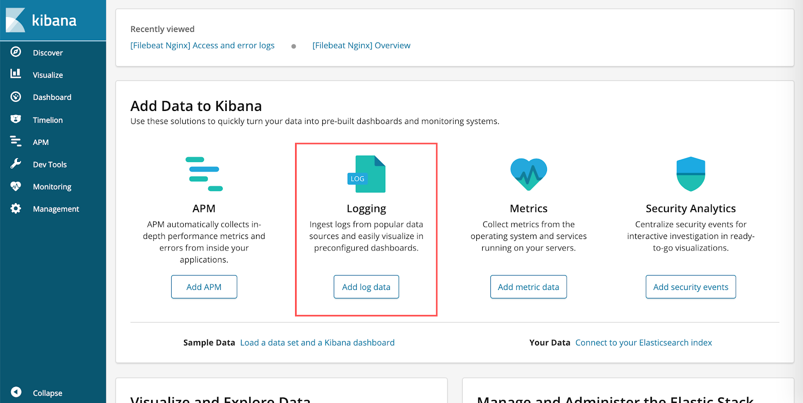

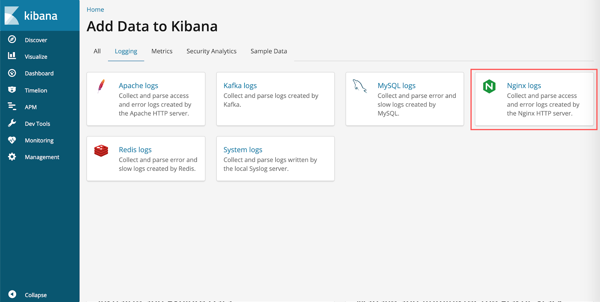

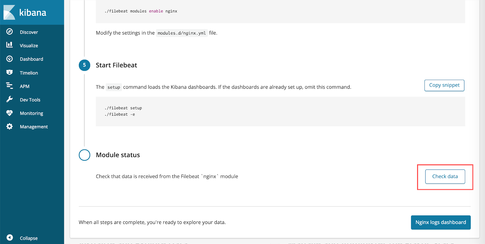

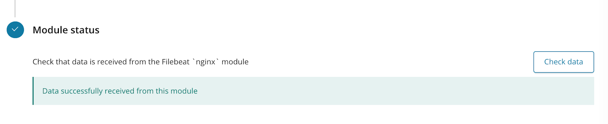

Егер барлығы дұрыс жасалса, **Check data** батырмасын басқан кезде **Data successfully received from this module** хабарламасы пайда болады.

## Kibana дашбордтарымен жұмыс

Kibana дашбордтары қашықтағы тораптан алынған Nginx логтары бойынша егжей-тегжейлі мәліметтерді көруге және қажет болған жағдайда сүзгілеу мен іздеуді орындауға мүмкіндік береді. Сондықтан дашбордтармен жұмыс тек көруге қолжетімді Nginx логтары болған кезде ғана мағыналы.

Бүйірлік мәзірден **Dashboard** тармағын таңдаңыз. Нәтижесінде сұраулар туралы әртүрлі деректері бар Nginx Filebeat үшін стандартты Dashboard көрсетіледі. Ол көрнекі диаграммалар құруға мүмкіндік береді, сондай-ақ серверге жүгінген IP мекенжайлары үшін әлем картасын көрсетеді.

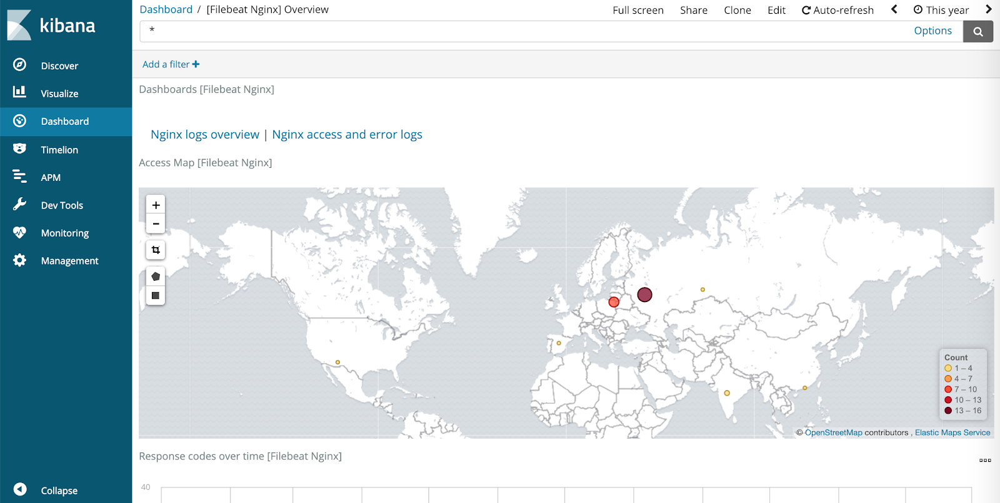

Оң жақ жоғарғы бұрышта көрсетілген кезең үшін серверге жасалған барлық сұраулар тізімін көру үшін **Nginx access and error logs** батырмасын басыңыз.

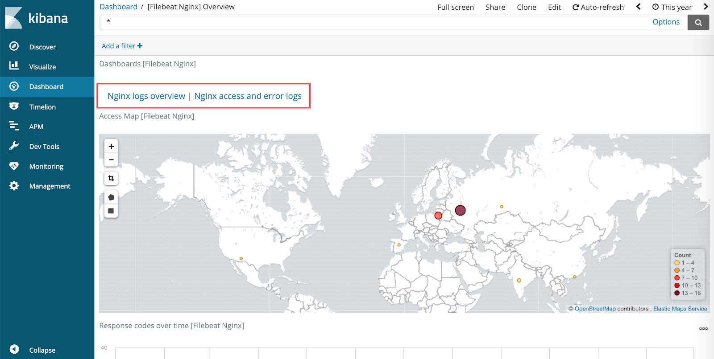

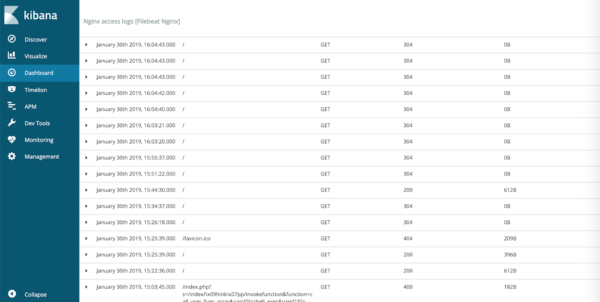

Сұрау бойынша егжей-тегжейлі мәліметтерді көру үшін тиісті жолдың сол жақ бөлігіндегі үшбұрышты басыңыз:

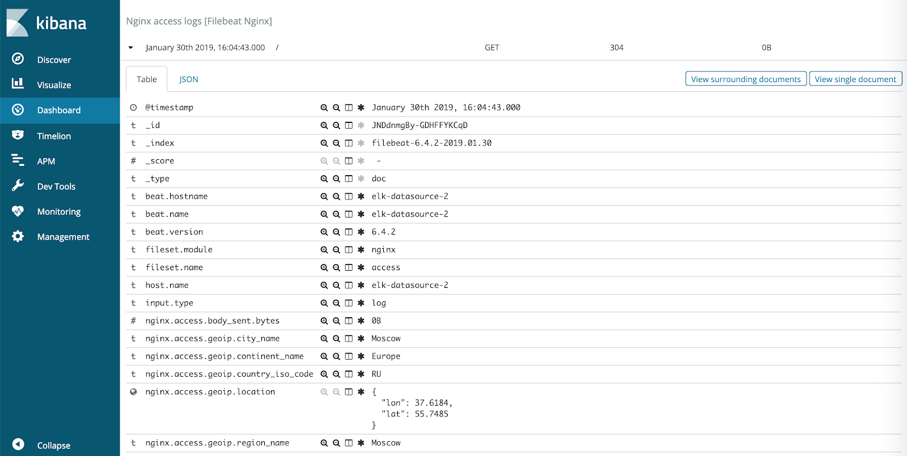

Жылдам іздеу үшін сол жақ жоғарғы жақтағы **Add filter** батырмасын басып, сүзгілеуді пайдалануға болады.

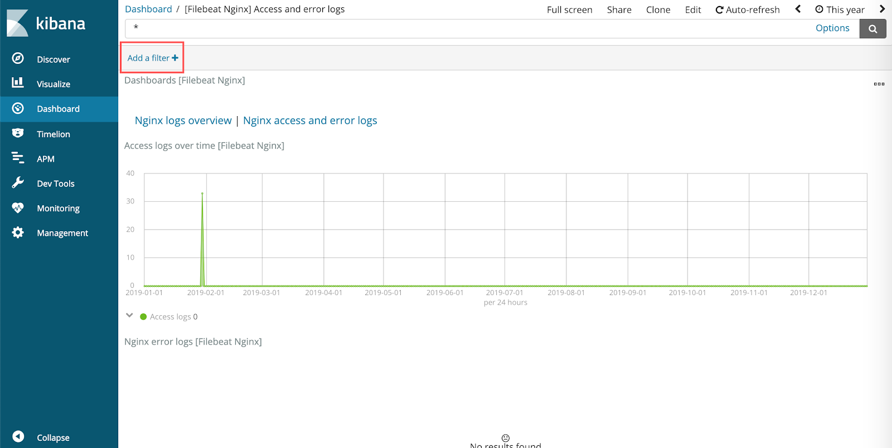

Сүзгіні баптау кезінде ұсынылған өрістердің бірін таңдап, іздеу шартын белгілеу керек (мысалы, төмендегі скриншотта жауап коды `200` болатын барлық сұраулар).

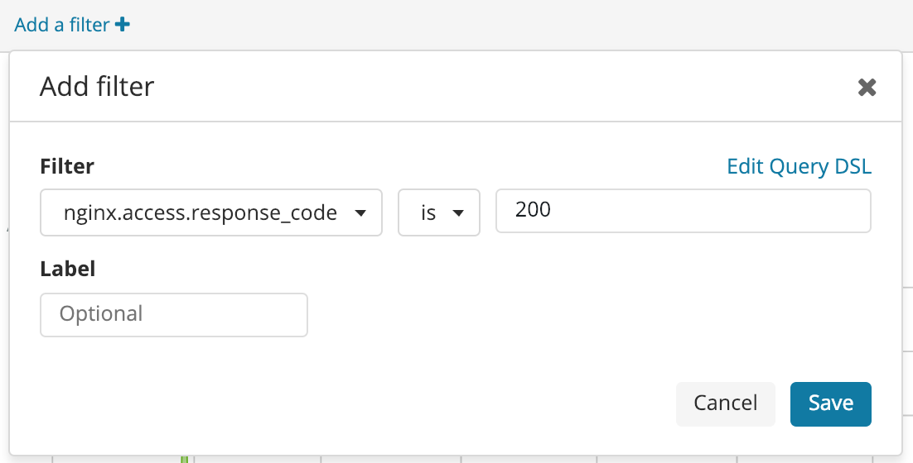
