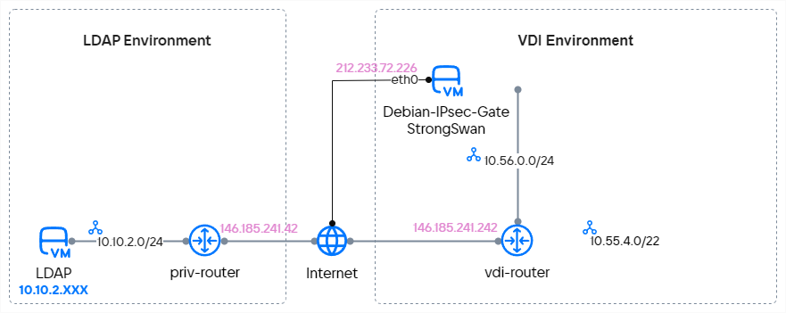
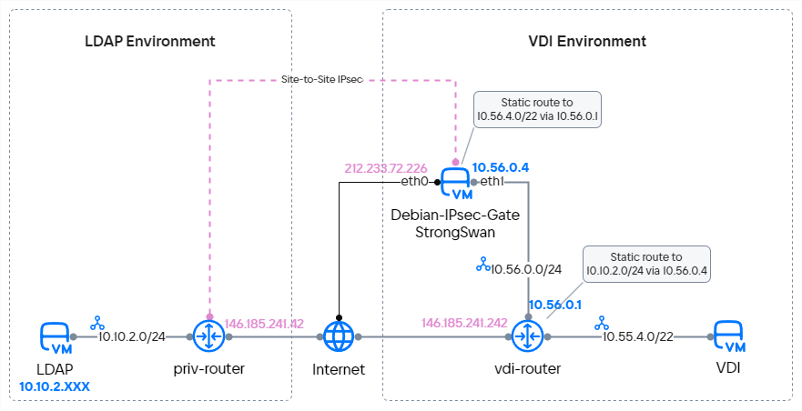

{include(/kz/_includes/_translated_by_ai.md)}

VK Cloud базасында VPN-туннельді ұйымдастыру үшін маршрутизатордың артында орналасқан бір немесе бірнеше бар ішкі желіні көрсету қажет.
Бұл VDI үшін VPN-қосылымды баптауға мүмкіндік бермейді, өйткені VDI-ге арналған ішкі желілер алдын ала анықталған адрестік кеңістікте динамикалық түрде құрылады. VDI ортасымен сәтті интеграциялау үшін VPN-туннельді IaaS ВМ (виртуалды машина) базасындағы арнайы VPN-серверді пайдаланып ұйымдастыруға болады. Бұл VDI баптауларында көрсетілген CIDR-ге дейін қорғалған байланыс орнатуға мүмкіндік береді.

Виртуалды жұмыс үстелдерімен қорғалған қосылымды баптауды көрсету үшін:

- LDAP ортасы мен VK Cloud ішіндегі VDI ортасы арасында VPN-туннель құрылады.
- LDAP жағында VPN-шешім ретінде VK Cloud құрамына кіріктірілген VPN сервисі пайдаланылады. Нақты сценарийде сіз IPsec Site-2-Site технологиясы бойынша VPN-қосылым құру мүмкіндігі бар кез келген жабдықты немесе БҚ-ны пайдалана аласыз.
- VDI жағында VPN-шешім ретінде Debian 11 ОС негізіндегі ВМ және қосымша strongSwan пакеттері пайдаланылады.
- Debian 11 базасындағы VPN-шлюзді VDI желілері қалыптасатын VK Cloud маршрутизаторымен байланыстыратын транзиттік желі құрылады.
- VDI-ді имитациялау үшін ВМ бар желі қосылады. Желілік байланысты тексеру үшін ВМ LDAP-серверді ping арқылы тексереді.

## Дайындық қадамдары

1. OpenStack клиенті [орнатылғанына](/kz/tools-for-using-services/cli/openstack-cli#1_openstack_klientin_ornatynyz) көз жеткізіңіз және жобада [аутентификациядан өтіңіз](/kz/tools-for-using-services/cli/openstack-cli#3_autentifikaciyadan_otiniz).

1. LDAP ортасын жасаңыз:

    1. VK Cloud ішінде интернетке қолжетімді виртуалды желіні таңдаңыз немесе [жасаңыз](/kz/networks/vnet/instructions/net#zhelini_zhasau). Сыртқы желіге қосылған бар маршрутизаторды пайдаланыңыз немесе жаңасын [жасаңыз](/kz/networks/vnet/instructions/router#marshrutizatordy_kosu).

       Келесі ақпаратты жазып алыңыз:

        - ішкі желінің IP-мекенжайы;
        - маршрутизатордың IP-мекенжайы мен атауы.

    1. Таңдалған желіде Windows Server 2019 ОС-пен [виртуалды машина жасаңыз](/kz/computing/iaas/instructions/vm/vm-create).

       ВМ атауы мен IP-мекенжайын жазып алыңыз.

1. VDI ортасын жасаңыз:

    1. VK Cloud ішінде интернетке қолжетімді, транзиттік желі функциясын орындайтын виртуалды желіні таңдаңыз немесе [жасаңыз](/kz/networks/vnet/instructions/net#zhelini_zhasau). Сыртқы желіге қосылған бар маршрутизаторды пайдаланыңыз немесе жаңасын [жасаңыз](/kz/networks/vnet/instructions/router#marshrutizatordy_kosu).

       Келесі ақпаратты жазып алыңыз:

        - ішкі желінің IP-мекенжайы;
        - маршрутизатордың IP-мекенжайы мен атауы.

    1. VDI-ді имитациялайтын желі үшін CIDR-ді алдын ала бөліңіз. CIDR VDI ортасын баптау үшін пайдаланылады.

       Ішкі желінің IP-мекенжайын (CIDR) жазып алыңыз.

1. [Сыртқы `ext-net` желісіне қосылған виртуалды машина жасаңыз](/kz/computing/iaas/instructions/vm/vm-create). Бұл әрі қарайғы баптау кезінде Floating IP-мекенжайын қолданбауға мүмкіндік береді.

   ВМ параметрлері:

    - ОС: Debian 11;
    - Ұсынылатын ВМ түрі: `STD3-2-4`.

   ВМ атауы мен IP-мекенжайын жазып алыңыз.

1. Debian ВМ-дағы ОС-ны жаңартыңыз:

    1. SSH арқылы `Debian-IPsec-Gate` виртуалды машинасына [қосылыңыз](/kz/computing/iaas/instructions/vm/vm-connect/vm-connect-nix) және root-пайдаланушы құқықтарын алыңыз (`sudo bash` пәрмені).

    1. Әрі қарайғы баптау алдында ОС-ны жаңартыңыз:

        ```console
        apt update && apt upgrade -y
        ```

    1. `reboot` пәрмені арқылы ВМ-ды қайта жүктеңіз.

1. Әрі қарай жұмыс істеу үшін қажет барлық мәлімет жиналғанына көз жеткізіңіз.

   Төменде мысал ретінде келесі деректер пайдаланылады:

    - AD/LDAP ортасы:

        - ішкі желінің IP-мекенжайы: `10.10.2.0/24`;
        - маршрутизатордың атауы мен IP-мекенжайы: `priv-router`, `146.185.241.42`;
        - AD/LDAP-сервердің атауы мен IP-мекенжайы: `LDAP`, `10.10.2.14`.

    - VDI ортасы:

        - ішкі желінің IP-мекенжайы: `10.56.0.0/24`;
        - VDI үшін ішкі желінің IP-мекенжайы: `10.55.4.0/22`;
        - маршрутизатордың атауы мен IP-мекенжайы: `vdi-router`, `146.185.241.242`.

    - Сыртқы желідегі виртуалды машинаның атауы мен IP-мекенжайы: `Debian-IPsec-Gate`, `212.233.72.226`.

Желілерді алдын ала дайындау схемасы:

{params[noBorder=true]}

## 1. AD/LDAP жағында VPN-туннельді баптаңыз

Жеке кабинетте [келесі параметрлермен VPN жасаңыз](/kz/networks/vnet/instructions/vpn):

1. **IKE баптауы** қадамында бастапқы IPsec-қосылым үшін алгоритмдерді көрсетіңіз:

    - **IKE саясаты**: `Жаңа IKE саясаты`;
    - **Саясат атауы**: `d11-gate-ike`;
    - **Кілттің жарамдылық мерзімі**: `28800`;
    - **Аутентификация алгоритмі**: `sha256`;
    - **Шифрлау алгоритмі**: `aes-256`;
    - **IKE нұсқасы**: `v2`;
    - **Диффи-Хеллман тобы**: `group14`.

1. **IPsec баптауы** қадамында түйіндер арасындағы пайдалы трафикті қорғау үшін алгоритмдерді көрсетіңіз:

    - **IPsec саясаты**: `Жаңа IPsec саясаты`;
    - **Саясат атауы**: `d11-gate-ike`;
    - **Кілттің жарамдылық мерзімі**: `28800`;
    - **Аутентификация алгоритмі**: `sha256`;
    - **Шифрлау алгоритмі**: `aes-256`;
    - **IKE нұсқасы**: `v2`;
    - **Диффи-Хеллман тобы**: `group14`.

1. **Endpoint Groups құру** қадамында VPN арқылы қорғалатын трафик өтетін желілерді көрсетіңіз:

    - **Маршрутизатор**: `priv-router`;
    - **Local Endpoint**: `Жаңа endpoint тобы`;
    - **Атауы**: `d11-tunnel-local-acl`;
    - **Ішкі желілер**: `priv_subnet_demo (10.10.2.0/24)`;
    - **Remote Endpoint**: `Жаңа endpoint тобы`;
    - **Топ атауы**: `d11-tunnel-remote-acl`;
    - **Ішкі желі мекенжайы**: `10.55.4.0/22`.

1. **Туннельді баптау** қадамында IPsec-қосылым орнатылатын қашықтағы шлюздің мекенжайын және аутентификацияға арналған кілтті (PSK) көрсетіңіз:

    - **Баптаулар**: `Кеңейтілген`;
    - **Туннель атауы**: `d11-ipsec-tun`;
    - **Пирдың жария IPv4 мекенжайы (Peer IP)**: `212.233.72.226`;
    - **Ортақ пайдалану кілті (PSK)**: **Жасау** түймесін басыңыз немесе өз кілтіңізді енгізіңіз;
    - **Аутентификацияға арналған пир маршрутизаторының идентификаторы (Peer ID)**: `212.233.72.226`;
    - **Инициатор күйі**: `bi-directional`;
    - **Пир қолжетімсіздігі анықталғанда**: `restart`;
    - **Пир қолжетімсіздігін анықтау аралығы**: 15 секунд;
    - **Пир қолжетімсіздігін анықтау уақыты**: 60 секунд.

## 2. Debian ВМ-ға қосымша желілік интерфейсті қосыңыз

VDI ортасы жағында VPN-туннельді баптау үшін Debian серверіне `vdi-transit-vsubnet` мекенжайын байлап, `10.56.0.4` ішкі желісіне қосымша желілік интерфейс қосыңыз:

1. [Жеке кабинетте](https://mcs.mail.ru/app) **Бұлттық есептеулер** → **Виртуалды машиналар** бөліміне өтіңіз.
1. `Debian-IPsec-Gate` ВМ-ын таңдап, **Желілер** қойындысына өтіңіз.
1. **Қосылымды қосу** түймесін басыңыз.
1. Қосылымның келесі баптауларын көрсетіңіз:

    - **Атауы**: `vdi-transit`;
    - **Қосылу желісі**: `vdi-transit-vsubnet`;
    - **DNS-атауы**: `debian-ipsec-gate`;
    - **IP-мекенжайды орнату**: опцияны қосыңыз;
    - **IP-мекенжай**: `10.56.0.4`;
    - **Firewall баптаулары**: барлық ережені жойыңыз.
1. **Сақтау** түймесін басыңыз.

## 3. Debian ВМ-да қосымша желілік интерфейсті баптаңыз

1. SSH арқылы `Debian-IPsec-Gate` виртуалды машинасына [қосылыңыз](/kz/computing/iaas/instructions/vm/vm-connect/vm-connect-nix) және root-пайдаланушы құқықтарын алыңыз (`sudo bash` пәрмені).
1. Келесі пәрменнің көмегімен `eth1` файлын жасаңыз:

    ```console
    vim /etc/network/interfaces.d/eth1
    ```

1. Жасалған файлға келесі жолдарды қосыңыз:

    ```console
    auto eth1
    iface eth1 inet static
    address 10.56.0.4/24
    mtu 1500
    post-up ip route add 10.55.4.0/22 via 10.56.0.1 || true
    pre-down ip route del 10.55.4.0/22 via 10.56.0.1 || true
    ```

   {note:info}

   `post-up` және `pre-down` жолдары `eth1` интерфейсін қосу және ажырату кезінде болашақ VDI желісіне баратын маршрутты басқаруды автоматтандырады.

   {/note}

1. Жаңа желілік баптауларды қолдану үшін пәрменді орындаңыз:

    ```console
    systemctl restart networking
    ```

1. `eth1` интерфейсінің IP-мекенжайы дұрыс бапталғанын тексеріңіз:

   ```console
   ip a | grep 10.56
   ```

   Егер жауап ретінде мына жол қайтса, интерфейс дұрыс бапталған:

   ```console
   inet 10.56.0.4/24 brd 10.56.0.7 scope global eth1
   ```
1. `10.55.4.0/22` желісіне маршрут дұрыс бапталғанын тексеріңіз:

   ```console
   ip r | grep 10.55
   ```

   Егер жауап ретінде мына жол қайтса, болашақ VDI желісіне маршрут дұрыс және автоматты түрде қосылған:

   ```console
   10.55.4.0/22 via 10.56.0.1 dev eth1
   ```

## 4. Транзиттік желі жағына бағытталған портта Port Security-ді өшіріңіз

VPN-шлюз порты кез келген трафикті жібере алуы үшін ондағы IP-мекенжайға арналған Source Guard қорғанысын өшіріңіз:

1. Жаңа терминал сессиясын ашып, пәрменді орындаңыз:

    ```console
    openstack port list --server Debian-IPsec-Gate
    ```

   Жауапта `Debian-IPsec-Gate` порттарының тізімі қайтарылады. Транзиттік желі жағына бағытталған портты табыңыз:

    ```console
    +--------------------------------------+-------------+-------------------+-------------------------------------------------------------------------------+--------+
    | ID                                   | Name        | MAC Address       | Fixed IP Addresses                                                            | Status |
    +--------------------------------------+-------------+-------------------+-------------------------------------------------------------------------------+--------+
    | 4d75dafe-d562-462a-afe9-31ede945a196 |             | fa:16:3e:34:e1:3a | ip_address='212.233.72.226', subnet_id='9ec13002-fb52-4e00-ac69-84d86a75d807' | ACTIVE |
    | f00c7678-47c0-4d88-9be2-b5592de9112f | vdi-transit | fa:16:3e:fe:e2:26 | ip_address='10.56.0.4', subnet_id='2f50371c-4e91-4f05-aff1-33bef1388fdf'      | ACTIVE |
    +--------------------------------------+-------------+-------------------+-------------------------------------------------------------------------------+--------+
    ```

1. Port Security-ді өшіріңіз:

    ```console
    openstack port set --disable-port-security f00c7678-47c0-4d88-9be2-b5592de9112f
    ```

## 5. ВМ-да пакеттерді қайта жіберуді қосыңыз

Виртуалды машина транзиттік желіден VPN-туннельге трафикті бағдарлай алуы үшін IP Forwarding-ті қосыңыз:

1. Қосылған `Debian-IPsec-Gate` ВМ-мен терминал сессиясын ашыңыз.

1. Пәрменді орындаңыз:

    ```console
    echo 'net.ipv4.ip_forward = 1' | sudo tee -a /etc/sysctl.conf
    ```

1. ОС-ны қайта жүктемей баптауларды қолдану үшін пәрменді орындаңыз:

    ```console
    sysctl -p
    ```

1. Баптаулардың қолданылғанын тексеріңіз:

    ```console
    cat /proc/sys/net/ipv4/ip_forward
    ```

   Егер жауапта `1` қайтса, пакеттерді қайта жіберу қосылған.

## 6. Debian ВМ жағында VPN-туннельді баптау үшін пакеттерді орнатыңыз

1. Пәрменді орындаңыз:

    ```console
    apt install vim strongswan strongswan-swanctl iptables iptables-persistent netfilter-persistent conntrack bmon -y
    ```

   `iptables-persistent` пакеті iptables ережелерінің белсенді кестесінің конфигурациясын файлға жазу және ОС қайта іске қосылғанда трафикті өңдеу үшін ережелер тізімін жүктеу мақсатында пайдаланылады.

1. `strongswan` және `netfilter` сервистерінің автоматты іске қосылуын қосыңыз:

    ```console
    systemctl enable strongswan-starter
    systemctl start strongswan-starter
    systemctl enable netfilter-persistent
    ```

## 7. IPsec конфигурациясын қосып, оны іске қосуды автоматтандырыңыз

1. VPN-қосылымын баптау үшін swanctl конфигурациялық файлын жасаңыз:

    ```console
    vim /etc/swanctl/conf.d/vkcloud.conf
    ```

1. `swanctl` файлына келесі жолдарды қосыңыз:

    ```console
    connections {
        vkcloud-ikev2 {
            remote_addrs = 146.185.241.42
            local_addrs = 212.233.72.226
            version = 2
            proposals = aes256-sha256-modp2048
            dpd_delay = 15s
            dpd_timeout = 60
            rekey_time = 28800s
            local-1 {
                auth = psk
                id = 212.233.72.226
            }
            remote-1 {
                auth = psk
                id = 146.185.241.42
            }
            children {
                vkcloud-sa {
                    mode = tunnel
                    local_ts = 10.55.4.0/22
                    remote_ts = 10.10.2.0/24
                    esp_proposals = aes256-sha256-modp2048
                    dpd_action = restart
                    rekey_time = 14400s
                    start_action = start
                }
            }
        }
    }
    secrets {
        ike-vkcloud {
            id = 146.185.241.42
            secret = <PSK_Secret>
        }
    }
    ```

   Мұнда `<PSK_Secret>` — бұрын жасалған ортақ пайдалану кілті (PSK).

1. ОС қайта жүктелген кезде VPN-қосылымын іске қосуды автоматтандырыңыз:

    1. Пәрменді орындаңыз:

        ```console
        vim /etc/strongswan.d/charon.conf
        ```

    1. `# Section containing a list of scripts` жолын тауып, оған swanctl конфигурациясын оқу пәрменін қосыңыз:

        ```console
        start-scripts {
            swanctl = /usr/sbin/swanctl --load-all
        }
        ```

## 8. IPsec-ті іске қосып, VPN-туннель күйін тексеріңіз

1. Конфигурацияның жаңа параметрлерін қолдану және VPN-қосылымын іске қосу үшін пәрменді орындаңыз:

    ```console
    swanctl --load-all
    ```

1. VPN-қосылым конфигурациясының жүктелуін тексеріңіз:

    ```console
    swanctl --list-conns
    ```

   Күтілетін жауап:

    ```console
    vkcloud-ikev2: IKEv2, no reauthentication, rekeying every 28800s, dpd delay 15s
    local:  212.233.72.226
    remote: 146.185.241.42
    local pre-shared key authentication:
        id: 212.233.72.226
    remote pre-shared key authentication:
        id: 146.185.241.42
    vkcloud-sa: TUNNEL, rekeying every 14400s, dpd action is restart
        local:  10.55.4.0/22
        remote: 10.10.2.0/24
    ```

1. IKE/SA туннельдерінің орнатылғанын тексеріңіз:

    ```console
    swanctl --list-sas
    ```

   Күтілетін жауап:

    ```console
    vkcloud-ikev2: #1, ESTABLISHED, IKEv2, e462fc2edaae6649_i* e9f38c18ddd4f0ef_r
    local  '212.233.72.226' @ 212.233.72.226[4500]
    remote '146.185.241.42' @ 146.185.241.42[4500]
    AES_CBC-256/HMAC_SHA2_256_128/PRF_HMAC_SHA2_256/MODP_2048
    established 3053s ago, rekeying in 23290s, reauth in 22543s
    vkcloud-sa: #1, reqid 1, INSTALLED, TUNNEL, ESP:AES_CBC-256/HMAC_SHA2_256_128
        installed 3053s ago, rekeying in 10951s, expires in 12787s
        in  ca12c3fa,      0 bytes,     0 packets
        out cce2ec61,      0 bytes,     0 packets
        local  10.55.4.0/22
        remote 10.10.2.0/24
    ```

## 9. iptables ережелерін баптаңыз

VPN-туннель арқылы трафик дұрыс өтуі үшін iptables тізбектеріне бірқатар баптауды қосыңыз:

1. IPsec VPN-туннелінің дұрыс жұмыс істеуі үшін мақсатты трафикті (from Source to Destination) алып тастау ережесін жасаңыз. Ережені NAT Postrouting тізбегінде интернетке трафик шыққанда PAT-трансляциясын орнататын ережеден бұрын орналастырыңыз.

   NAT кестесіне ережені қосыңыз:

    ```console
    iptables -t nat -A POSTROUTING -s 10.55.4.0/22 -d 10.10.2.0/24 -j ACCEPT
    ```

1. Деректер пакеттерінің фрагментациясын болдырмау үшін TCP MSS-ті оңтайландырыңыз. Ол үшін FORWARD тізбектеріне ереже қосыңыз. MSS (Maximum Segment Size) мәні әр туннель мен интернет-қосылымның жеке сипаттамаларына қарай таңдалады.

   MANGLE кестесіне ережелерді қосыңыз:

    ```console
    iptables -t mangle -A FORWARD -s 10.10.2.0/24 -d 10.55.4.0/22 -p tcp -m tcp --tcp-flags SYN,RST SYN -m tcpmss --mss 1321:65495 -j TCPMSS --set-mss 1320
    iptables -t mangle -A FORWARD -s 10.55.4.0/22 -d 10.10.2.0/24 -p tcp -m tcp --tcp-flags SYN,RST SYN -m tcpmss --mss 1321:65495 -j TCPMSS --set-mss 1320
    ```

1. Баптауларды сақтаңыз:

    ```console
    service netfilter-persistent save
    ```

## 10. VDI ортасынан AD/LDAP-қа статикалық маршрутты баптаңыз

1. [Жеке кабинетте](https://mcs.mail.ru/app) **Виртуалды желілер** → **Маршрутизаторлар** бөліміне өтіңіз.
1. `vdi-router` маршрутизаторын таңдап, **Статикалық маршруттар** қойындысына өтіңіз.
1. **Статикалық маршрут қосу** түймесін басыңыз.
1. Маршрут параметрлерін көрсетіңіз:

    - **Мақсатты желі (CIDR)**: `10.10.2.0/24`;
    - **Аралық түйін (Next HOP)**: `10.56.0.4`.

   {note:info}

   Next HOP IP-мекенжайы ретінде Debian 11 ОС-і бар ВМ-ның транзиттік желіге қосылған ішкі желілік интерфейсінің IP-мекенжайы пайдаланылады.

   {/note}

1. **Маршрут қосу** түймесін басыңыз.

## 11. Жұмысқа қабілеттілікті тексеріңіз

1. CIDR `10.55.4.0/22` және `vdi-router` маршрутизаторы бар виртуалды желіні [жасаңыз](/kz/networks/vnet/instructions/net#zhelini_zhasau). Бұл желі VDI желісін имитациялайды және желілік байланысты тексеру үшін қажет. VDI жайылған кезде мұндай желі автоматты түрде жасалады.

1. `10.55.4.0/22` желісінде тестілік [виртуалды машина жасаңыз](/kz/computing/iaas/instructions/vm/vm-create) және оған SSH арқылы қосылыңыз.

1. LDAP-серверге ping жіберіңіз:

    ```console
    ping 10.10.2.14
    ```

   IP-мекенжай ping-ке жауап беруі керек.

Желілер мен сол желілер ішіндегі машиналар арасындағы құрылған өзара әрекеттесу схемасы:

{params[noBorder=true]}

## Пайдаланылмайтын ресурстарды жойыңыз

Егер жасалған ресурстар сізге енді қажет болмаса, оларды жойыңыз:

1. [Виртуалды машиналарды жойыңыз](/kz/computing/iaas/instructions/vm/vm-manage#delete_vm).
1. [VPN-ді жойыңыз](/kz/networks/vnet/instructions/vpn#vpn_tunnelin_zhoyu).
1. [Маршрутизаторларды жойыңыз](/kz/networks/vnet/instructions/router#marshrutizatordy_zhoyu).
1. ВМ орналасқан [ішкі желіні](/kz/networks/vnet/instructions/net#ishki_zhelini_zhoyu) және [желіні жойыңыз](/kz/networks/vnet/instructions/net#zhelini_zhoyu).
