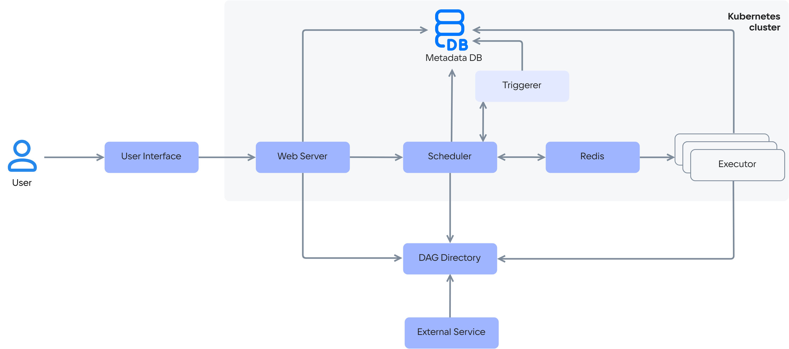

{include(/kz/_includes/_translated_by_ai.md)}

Cloud Airflow сервисі  [Cloud Containers](/kz/kubernetes) кластерлері негізінде жұмыс істейді және  келесі конфигурацияларда жайылтылуы мүмкін:

{include(/kz/_includes/_airflow.md)[tags=conf]}

Cloud Airflow жұмыс процестерін (workflow) бағытталған ациклді графтар (DAG — Directed Acyclic Graph) түрінде ұсынады. Графтар Python тіліндегі скрипттері бар DAG-файлдар болып табылады және DAG-файлдар қоймасында орналастырылады. Жұмыс процестерінің дұрыс орындалуы үшін DAG-файл атаулары бірегей болуы керек. DAG-файлдар қоймасы сервис архитектурасының орталық буыны болып табылады және барлық қалған компоненттердің өзара байланысын қамтамасыз етеді.

Cloud Airflow сервисі архитектурасының компоненттері:

- Веб-сервер (Web Server) — жұмыс процестерін басқаруға және визуализациялауға арналған веб-қолданба.
- Метадеректер базасы (Metadata DB) — тапсырмалардың орындалу тарихын, тапсырмалардың өзін және жүйелік баптауларды сақтайтын қызметтік дерекқор, бұл жұмыс процестерінің келісімділігін қамтамасыз етеді. Cloud Airflow сервисінде  [PostgreSQL](/kz/dbs/dbaas/how-to-guides/tls-connect) дерекқоры пайдаланылады.
- Жоспарлағыш (Scheduler) — DAG-қа сәйкес тапсырмаларды іске қосуға жауап береді. Ол қандай тапсырмалар орындауға дайын екенін үнемі тексереді (әдепкі бойынша — әр минут сайын) және оларды көрсетілген Executor-ға тапсырмалар кезегі (Redis) арқылы орындауға жібереді.
- Триггерер (Triggerer) — кейінге қалдырылған тапсырмаларды қайта жалғастыру үшін жоспарлағыштан сыртқы оқиғаларды күтетін архитектура компоненті.
- Тапсырмалар кезегі (Redis) — жоспарлағыш пен орындаушылар арасындағы асинхронды алмасуға арналған кезек.
- Орындаушы (Executor) — DAG-тен алынған тапсырмаларды  [worker-түйіндерде](/kz/kubernetes/k8s/concepts/architecture#cluster_topology) орындауға жауап береді. Орындаушы тапсырмаларды кезектен алып, олардың қайда және қалай іске қосылатынын анықтайды. Орындаушылардың әртүрлі түрлері болады. Cloud Airflow сервисінде CeleryExecutor типіндегі орындаушы, яғни Celery (Python) кітапханасына негізделген таратылған тапсырма орындаушысы қолданылады.
- DAG-файлдар қоймасы (DAG Directory) — жұмыс процестері сипатталған Python-файлдары бар каталог.
- Сыртқы сервис (External Service) — тапсырмалар өзара әрекеттесетін сыртқы сервистер (мысалы, PostgreSQL, AWS S3, HTTP API).

{params[noBorder=true]}

Сервистің жұмыс істеуінің жалпы қағидаты:

1. Пайдаланушы DAG-файлды қоймаға (DAG Directory) жүктейді.
1. Жоспарлағыш (Scheduler) жаңа DAG-файлды анықтап, оның іске қосылуларын жоспарлай бастайды.
1. Орындау уақыты келгенде, жоспарлағыш тапсырмаларды кезекке (Redis) қояды.
1. Орындаушы (Executor) тапсырманы кезектен алып, оны орындайды.
1. Нәтиже (сәттілік немесе қате) метадеректер базасына (Metadata DB) жазылады.
1. Веб-сервер (Web Server) орындау күйін UI ішінде көрсетеді.
