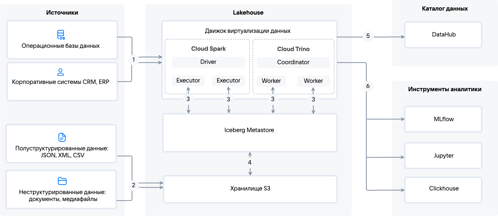

{include(/kz/_includes/_translated_by_ai.md)}

[Data Lakehouse (DLH)](/kz/data-platform/dlh/concepts/about) әртүрлі көздерден құрылымдалған және құрылымдалмаған деректерді жинайды, оларды [Cloud Spark](/kz/data-platform/dlh/concepts/components/spark) арқылы ([ETL](https://ru.wikipedia.org/wiki/ETL) немесе ELT) не [Cloud Trino](/kz/data-platform/dlh/concepts/components/trino) арқылы (SQL-сұраулар) өңдейді, [S3-қоймасында](/kz/data-platform/dlh/concepts/components/s3) [Cloud Iceberg Metastore](/kz/data-platform/dlh/concepts/components/iceberg) ішінде каталогтаумен сақтайды, DataHub-та метадеректерді басқарады және аналитика, BI және ML үшін деректерді Cloud Trino, Cloud Spark немесе [Cloud ClickHouse](/kz/data-platform/dlh/concepts/components/clickhouse) арқылы ұсынады.

{params[noBorder=true]}

1. Операциялық ([OLTP](https://ru.wikipedia.org/wiki/OLTP)) және корпоративтік (CRM, ERP) жүйелерден келетін құрылымдалған деректер күрделі ETL және ELT процестерін орындау үшін Cloud Trino-ға тікелей немесе Cloud Spark арқылы түседі.
 
1. Жартылай құрылымдалған (JSON, XML, CSV) және құрылымдалмаған (медиафайлдар, құжаттар) деректер S3 қоймасына ағындар немесе блоктар түрінде жіберіледі.

1. [Cloud Trino](/kz/data-platform/dlh/concepts/components/trino) және [Cloud Spark](/kz/data-platform/dlh/concepts/components/spark) S3 қоймасымен деректер алмасу үшін Iceberg Metastore API пайдаланады.

   Cloud Trino-да сұрауларды өңдеу процесі координатордың (Coordinator) SQL-сұрауларды қабылдауын ([PULL-моделі](#data_processing_models)) және оңтайландыруын қамтиды, содан кейін ол оларды жұмысшы түйіндерге (Workers) таратып, дәстүрлі СУБД-ларға ұқсас функционалдылықты қамтамасыз етеді.

   Cloud Spark күрделі ETL және ELT процестерін орындау үшін қолданылады. Бұл сервис деректерді пакеттік те, ағындық та өңдеуді қолдайды:

   - [Ағындық өңдеу](https://en.wikipedia.org/wiki/Stream_processing) (Streaming Processing) кезінде деректер үздіксіз, микропартиялармен (mini-batches) немесе оқиға бойынша (event-by-event), нақты уақыт режимінде өңделеді. Ағындық өңдеу [PUSH-моделі](#data_processing_models) бойынша жүзеге асырылады.

   - [Пакеттік өңдеу](https://en.wikipedia.org/wiki/Batch_processing) (Batch Processing) кезінде деректер партиялармен (файлдар, кестелер) жинақталып, бір уақытта өңделеді. Шығарып алу процесі кесте бойынша немесе қолмен іске қосылады ([PULL-моделі](#data_processing_models)).

1. Cloud Iceberg Metastore [S3 қоймасының](/kz/data-platform/dlh/concepts/components/s3) объектілерін каталогтайды және оған қол жеткізу үшін API ұсынады.

 Деректерді сақтау [Cloud Iceberg Metastore](https://ru.wikipedia.org/wiki/ACID) сервисі арқылы [ACID](/kz/data-platform/dlh/concepts/components/iceberg)-транзакцияларды қолдаумен ұйымдастырылған, бұл S3 қоймасының объектілерін ДҚ кестелері ретінде ұсынуға мүмкіндік береді. S3 қоймасын пайдалану сақтау құнын едәуір төмендетеді.

1. Объектілер мен оларды өңдеу ережелерінің жалпы тізімі қолжеткізуді басқару және деректер тарихын қадағалау үшін DataHub негізіндегі деректер каталогында (Data Discovery, Data Quality, Metadata Management, Data Governance, Data Lineage функционалын қолдаумен) жарияланады.
1. Cloud Trino және Cloud Spark-тен өңделген деректерді әртүрлі сыртқы аналитикалық жүйелерде пайдалануға болады: MLflow, Jupyter, ClickHouse. Бұл жүйелер деректерді терең талдауға, егжей-тегжейлі визуализациялар жасауға және машиналық оқыту модельдерінің өмірлік циклін басқаруға мүмкіндік береді.

## {heading(Деректерді өңдеу модельдері)[id=data_processing_models]}

Міндетке байланысты деректер келесі тәсілдермен өңделуі мүмкін:

- _PULL-моделі_ — бұл деректер көзден кесте бойынша batch-процестерді орындау арқылы шығарылатын тәсіл, оларды Cloud Airflow-да ыңғайлы басқаруға болады. Бұл тәсіл қарапайым ETL және ELT процестері, S3 қоймасындағы аналитика, BI-интеграция, дерекқорларға SQL-сұраулар үшін және дереккөзге түсетін жүктемені бақылау қажет болғанда қолданылады.

- _PUSH-моделі_ — бұл деректер көзден автоматты түрде Cloud Spark немесе Cloud Trino-ға жіберілетін тәсіл. Бұл тәсіл деректердің үлкен көлемдерін үздіксіз жеткізу және өңдеу аса маңызды болатын міндеттерде қолданылады: күрделі ETL және ELT процестері, аналитикаға арналған деректерді дайындау, үлкен деректердегі машиналық оқыту.

Data Lakehouse архитектурасын жобалау кезінде қандай деректер түрлері және қандай тәсілмен өңделетінін анықтау маңызды:

[cols="<,<,<",options="header"]
|===
| Критерий
| PULL-моделі
| PUSH-моделі

| Сервис
| [Cloud Airflow](/kz/data-platform/dlh/concepts/components/airflow), [Cloud Trino](/kz/data-platform/dlh/concepts/components/trino), [Cloud Spark](/kz/data-platform/dlh/concepts/components/spark) (пакеттік өңдеу)
| [Cloud Spark](/kz/data-platform/dlh/concepts/components/spark) (ағындық өңдеу, микробатчтар)

| Дереккөздерді қолдау
| API, ДҚ, файлдар
| Әрбір дереккөз үшін деректерді Producer API арқылы жіберетін компонентті әзірлеу қажет

| Жаңарту жиілігі
| Кесте бойынша
| Нақты уақыт режимінде

| Деректер кідірісі 
| 5–60 минут
| < 1 секунд

| Дереккөзге түсетін жүктеме
| Жоғары (сағатына 50–500 қосылым)
| Төмен (1–5 тұрақты қосылым)

| Масштабталу
| Шектеулі (секундына 100 параллель операцияға дейін)
| Жоғары (секундына 10 000 параллель операцияға дейін)

| Интеграция күрделілігі
| Төмен (конфигурацияға 1–2 күн)
| Жоғары (Producer әзірлеу қажет)
|===
