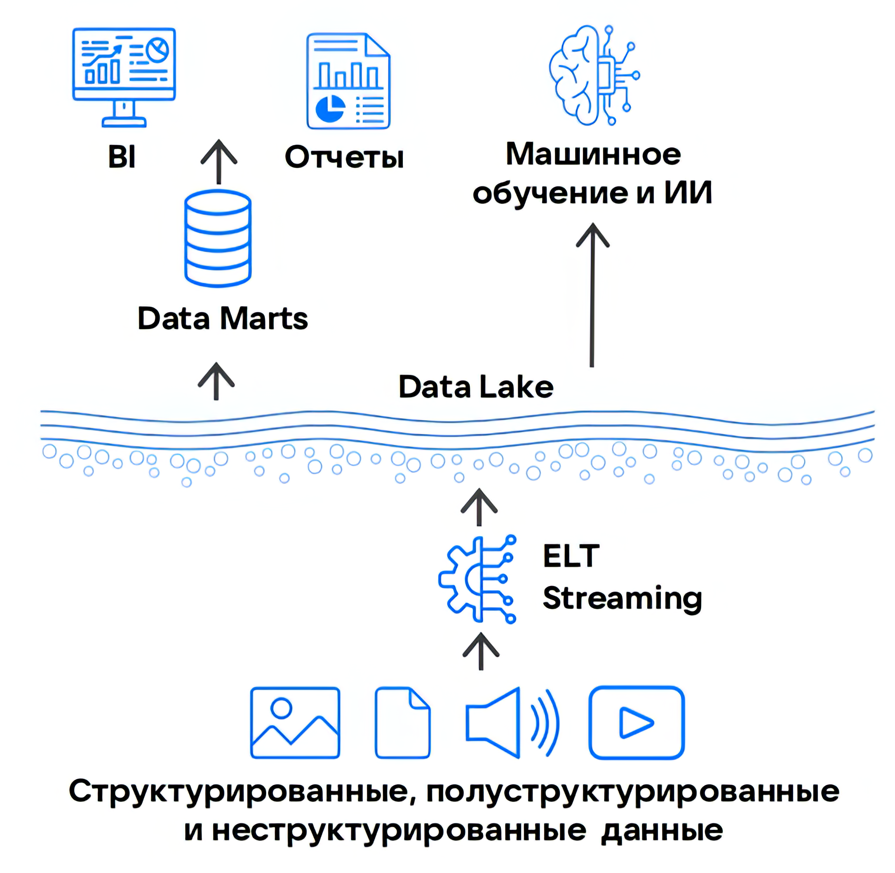

{include(/kz/_includes/_translated_by_ai.md)}

Data Lake немесе *деректер көлі* — бұл бастапқы форматында үлкен көлемдегі деректерді сақтау үшін [Data Warehouse](../dwh) (DWH) баламасы ретінде пайда болған корпоративтік деректер қоймаларының (КДҚ) архитектурасы.

Data Warehouse-тен айырмашылығы, Data Lake архитектурасында деректер құрылымдалған да, жартылай құрылымдалған да, құрылымдалмаған да болуы мүмкін. Сондықтан Data Lake-та деректерді сақтау сұлбасын алдын ала анықтау және оларды жүктеу кезеңінде өңдеу қажет емес.

{params[width=40%; noBorder=true]}

## Data Lake-тағы деректерді сақтау модельдері

Құрылымдалмаған деректердің едәуір көлемін өңдеу Data Warehouse-пен салыстырғанда сақтаудың түбегейлі басқа әдістерін талап етеді. Деректер көлін құруға жарайтын бірнеше сақтау моделі бар, бірақ ең кең таралғаны — екі шешім:

- Объектілік қойма — кез келген типтегі деректерді метадеректері бар объектілер түрінде сақтайды.

 Әдетте, pay-as-you-go төлем үлгісі бар бұлттық шешім түрінде іске асырылады және инфрақұрылымды әкімшілендіруге шығындарды талап етпейді.

 Мұндай сервистердің көпшілігі S3 API қолдайды, бұл аналитикалық, ETL, BI және ML платформаларымен жұмыс істеу үшін объектілік қойманы қосуға мүмкіндік береді. VK Cloud та осындай сервисті ұсынады — [VK Object Storage](/kz/data-platform/dlh/concepts/components/s3).

- [HDFS](https://hadoop.apache.org/docs/stable/hadoop-project-dist/hadoop-hdfs/HdfsDesign.html) кластері (Hadoop Distributed File System).

 Негізінен on-premise форматында, өзінің немесе жалға алынған инфрақұрылымда, дербес әкімшілендірумен іске асырылады.

 Hadoop-стекпен (MapReduce, Hive, HBase, Pig, Spark және т.б.) интеграцияны қолдайды, оны HDFS кластерімен бір инфрақұрылымда өрістетуге болады. Бұл деректерді жабық жүйеде локализациялауға және аз кідірістер есебінен өңдеу өнімділігін жақсартуға мүмкіндік береді.

## DWH-пен салыстырғандағы Data Lake артықшылықтары

- ELT-тәсілдеріндегі бағандық деректер қоймаларын пайдалану есебінен деректерді өңдеудің жоғары өнімділігі.
- Өңделмеген деректермен, мысалы, ML-міндеттеріне арналған датасеттерді дайындау үшін жұмыс істеу мүмкіндігі.
- Деректер көлінде кез келген типтегі деректерді үнемді сақтау.
- Деректер типіне байланысты құралдарды икемді таңдау. Мысалы, ETL/ELT процестерін құру үшін [Cloud Trino](/kz/data-platform/dlh/concepts/components/trino), немесе [Cloud Spark](/kz/data-platform/dlh/concepts/components/spark) ішіндегі MLlib кітапханасының көмегімен толық ML циклін құру.

## Data Lake шектеулері

- Кірістірілген SQL-үйлесімділіктің болмауы, бұл BI-жүйелерімен интеграцияны қиындатады.
- Аналитика үшін қосымша СУБД пайдаланылғанда деректер мен бизнес-логиканың қайталануы.
- Жүйелер арасындағы деректердің артық тасымалдануы, бұл кідірістер мен қауіпсіздік тәуекелдерін арттырады.

## Data Lake баламалары

Data Lake және оған дейінгі [Data Warehouse](../dwh) архитектурасының кейбір кемшіліктері бар және барлық бизнес-қажеттіліктерді толық жаппайды. Сондықтан үлкен деректермен жұмыс істеуге арналған неғұрлым әмбебап шешім — [Data Lakehouse](../dlh) пайда болды, ол екі архитектураның артықшылықтарын біріктіріп, олардың кемшіліктерін барынша азайтады.
