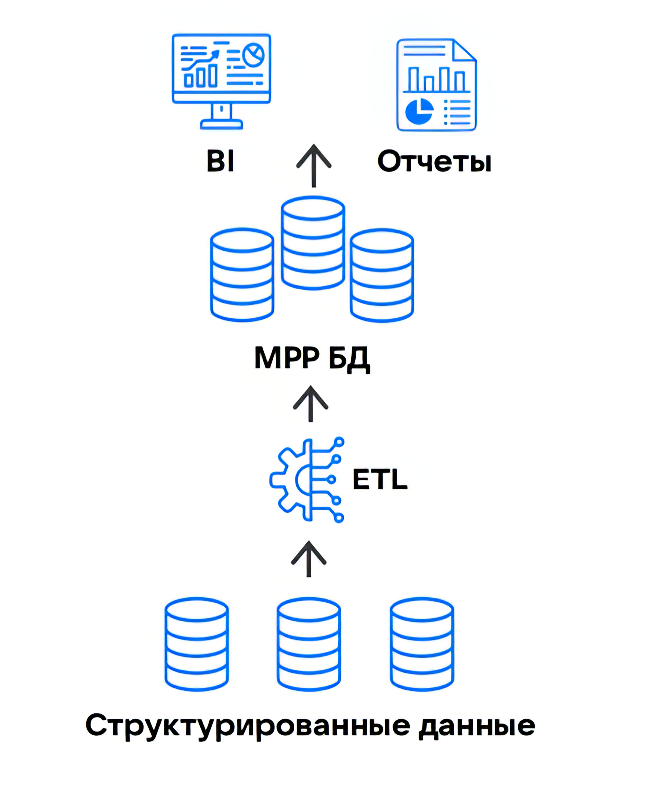

{include(/kz/_includes/_translated_by_ai.md)}

Data Warehouse (DWH) — *корпоративтік деректер қоймасы* (КДҚ) идеясын іске асыратын алғашқы архитектуралық тұжырымдамалардың бірі. КДҚ — бұл әртүрлі көздерден жиналған ұйымның үлкен көлемдегі деректерін сақтайтын және оларды басқаратын орталық репозиторий.

Корпоративтік деректер қоймаларында ақпарат әртүрлі бөлімшелерден (жүйелерден) жиналады, яғни оның құрылымы әртүрлі болады. Бұдан бөлек, мұндай қоймаларда тек ағымдағы ғана емес, архивтік деректер де болады, сондықтан олардың көлемі әдетте едәуір үлкен. Бұл КДҚ-ны ұйымдастыру кезінде шешілуі тиіс екі негізгі міндетті тудырады:
- деректерді қоймаға орналастыру алдында оларды алдын ала өңдеу және нормализациялау (бірыңғай форматтарға келтіру, қайталанулар мен қайшылықтарды жою);
- үлкен көлемдегі деректерді әртүрлі серверлерде үлестіріп сақтау және оларды бірыңғай жүйеге біріктіру.

DWH-те реляциялық СУБД-лардан алынған құрылымдалған деректер кейінгі өңдеуге арналған SQL-сұраулар арқылы қолжеткізуді қамтамасыз ететін көпөлшемді [OLAP](https://ru.wikipedia.org/wiki/OLAP)-қоймаға жиналады. Деректерді түрлендіру нәтижесі BI-жүйелеріне және аналитикалық есептілікті қалыптастыру сервистеріне беріледі.

{params[width=40%; noBorder=true]}

## DWH-тағы деректерді сақтау модельдері

КДҚ архитектурасын құруда деректерді сақтау құрылымын таңдау маңызды рөл атқарады. Data Warehouse-та құрылымға қатаң шектеулер бар, сондықтан деректерді сақтау модельдерінің бәрі бірдей DWH архитектурасын құруға жарамайды.

Стандарт ретінде келесі модельдер қолданылады:

- Кимбалл моделі, онда бір орталық кесте (фактілер кестесі) фактілер немесе оқиғалар туралы агрегатталған деректерді сақтайды, ал бірнеше байланысты көмекші өлшем кестелері әртүрлі мәндердің сипаттамалық атрибуттарын қамтиды.
- Артық деректерді барынша азайтатын [нормаланған](https://ru.wikipedia.org/wiki/%D0%9D%D0%BE%D1%80%D0%BC%D0%B0%D0%BB%D1%8C%D0%BD%D0%B0%D1%8F_%D1%84%D0%BE%D1%80%D0%BC%D0%B0) құрылымды пайдаланатын Инмон моделі. Көбіне бұл модель тез іске асыру маңызды және деректер қоймасына қойылатын талаптар минималды болатын пилоттық және MVP-жобаларда қолданылады.
- Data Vault 2.0 — Кимбалл және Инмон модельдерінің қағидаттарын біріктіретін деректер құрылымын жобалаудың гибридті тәсілі.

[cols="1,3,3", options="header"]
|===
| Модель
| Артықшылықтары
| Кемшіліктері

| Кимбалл
| - Қойма құрылымының ерекшелігі арқасында деректерді жылдам шығарып алу.
- Пайдаланудың қарапайымдылығы (құрылымы көпшілік дата-мамандарға түсінікті)
| - Фактілер кестесіне жаңа параметрлерді қосу өнімділікті төмендетеді.
- Бизнестің тез өзгеретін қажеттіліктеріне бейімдеу қиын

| Инмон
| - Орталық қойма түріндегі бірыңғай деректер көзі.
- Деректердің төмен артықтығы
| - Бизнес-процестердегі кез келген өзгеріс сұлбаны қайта жобалауды талап етеді.
- ETL-пайплайндарын өзгертпей жаңа дереккөздерді қосу қиын

| Data Vault 2.0
| - Жүйе дереккөздер мен бизнес-ережелердегі өзгерістерге төзімді.
- Жаңа деректерді қолданыстағы құрылымдарға елеулі әсер етпей интеграциялауға болады.
- Деректердің кез келген түрімен жұмыс істейді (құрылымдалған, жартылай құрылымдалған, шикі).
| - Көптеген кестелерді `JOIN` операторы арқылы біріктіру қателер қаупін арттырады және сұраулардың орындалуын Кимбалл және Инмон модельдерімен салыстырғанда баяулатады.
- Мәндердің көптігі мен олардың арасындағы күрделі байланыстарға байланысты деректерді тексеруді құру қиындайды.
- Мұндай модельмен жұмыс істеу үшін ерекше дағдылары және абстрактілі ойлауы дамыған мамандар қажет
|===

## DWH шектеулері

DWH-та қойма құрылымын жобалау кезінде қолданылатын деректер модельдерінің ерекшеліктері DWH архитектурасының өз шектеулерін қалыптастырады:

- сақтау және масштабтау құнының жоғарылығы;
- өңделмеген деректерге қолжетімділіктің болмауы;
- ETL-процестердегі күрделі логика;
- масштабтаудың шектеулі мүмкіндіктері;
- әзірлеу мен сүйемелдеуге жоғары шығындар;
- техникалық қолдау және ақауларды жою кезіндегі қиындықтар.

Нәтижесінде IT-инфрақұрылым бизнес сұраныстарының өзгеруіне бейімделіп үлгермейді, өйткені инфрақұрылымдағы кез келген өзгеріс (жаңа дереккөзді қосу немесе сақтау құрылымын өзгерту) ETL-процестерін ауқымды түрде пысықтауға әкеледі.

## DWH баламалары

КДҚ-мен өзара әрекеттесуді жеңілдету, яғни деректерді жүктеу және ұйымдастыру процесіне қойылатын талаптарды төмендету қажеттілігі жаңа шешімдердің пайда болуына алып келді:

- [Data Lake](../data-lake) — DWH-ке тән қатаң регламенттеусіз әлсіз құрылымдалған деректерді бастапқы түрінде сақтауға мүмкіндік беретін архитектуралық компонент.
- [Data Lakehouse](../dlh) — Data Warehouse және Data Lake архитектураларының артықшылықтарын біріктіретін үлкен деректермен жұмыс істеуге арналған әмбебап шешім.
