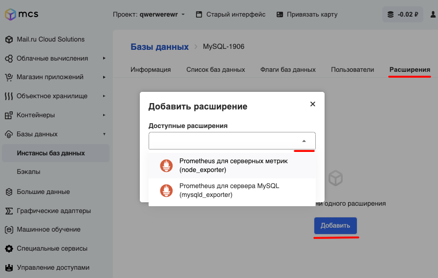

{include(/kz/_includes/_translated_by_ai.md)}

## Сипаттамасы

Кеңейтімдер дерекқорлардың функционалдығын арттырады және оларды кез келген уақытта орнатуға болады.

Prometheus - деректерді жинауға және сақтауға арналған орталық сервер. Деректер уақыт бойынша үнемі өзгеріп отырады (мысалы, дискінің толу деңгейі, желілік интерфейс арқылы өтетін трафик, сайттың жауап беру уақыты). Деректер элементтері метрикалар деп аталады. Prometheus сервері берілген кезеңділікпен метрикаларды оқып, алынған деректерді Time Series DB-ге орналастырады. Time Series DB - уақыттық қатарларды (уақытқа байланыстырылған мәндерді) сақтауға арналған дерекқор түрі. Бұдан бөлек, Prometheus сұрауларды орындау және алынған деректерді визуализациялау үшін интерфейс ұсынады. Prometheus сұрау тілі PromQL деп аталады. Prometheus Pull моделі бойынша жұмыс істейді, яғни деректерді алу үшін endpoints нүктелерін өзі сұратады.

Exporters - деректерді жинауды және оларды Prometheus серверіне беруді қамтамасыз ететін процестер. Әртүрлі exporters көп, мысалы:

- Node_exporter - жүйелік метрикаларды жинау (процессор, жад және т.б.).
- Mysqld_exporter - MySQL серверінің жұмыс метрикаларын жинау.

## Серверлік метрикаларға арналған Prometheus (node_exporter)

Әр операциялық жүйеде жинағыштарға әртүрлі қолдау бар. Төмендегі кестелерде кейбір жинағыштар және қолдау көрсетілетін жүйелер берілген.

| Name       | Description                                                               | OS                                         |
| ---------- |---------------------------------------------------------------------------| ------------------------------------------ |
| cpu        | Процессорды пайдалану статистикасын жинайды                               | Darwin, Dragonfly, FreeBSD, Linux, Solaris |
| cpufreq    | Процессор жиілігінің статистикасын жинайды                                | Linux, Solaris                             |
| diskstats  | Диск енгізу-шығару (I/O) статистикасын жинайды.                           | Darwin, Linux, OpenBSD                     |
| filesystem | Файлдық жүйе статистикасын, мысалы дискілердегі бос емес орынды жинайды.  | Darwin, Dragonfly, FreeBSD, Linux, OpenBSD |
| meminfo    | Жедел жадты пайдалану статистикасын жинайды.                              | Darwin, Dragonfly, FreeBSD, Linux, OpenBSD |
| vmstat     | /proc/vmstat ішіндегі процестер статистикасын жинайды.                    | Linux                                      |

Барлық жинағыштардың толық тізімін [осы сілтеме бойынша ресми ресурстан](https://github.com/prometheus/node_exporter#collectors) көре аласыз.

## Кеңейтімді орнату

Кеңейтімдерді орнату өте оңай. Ол үшін виртуалды машина карточкасындағы "Кеңейтімдер" қойындысында **Қосу** батырмасын басыңыз:

