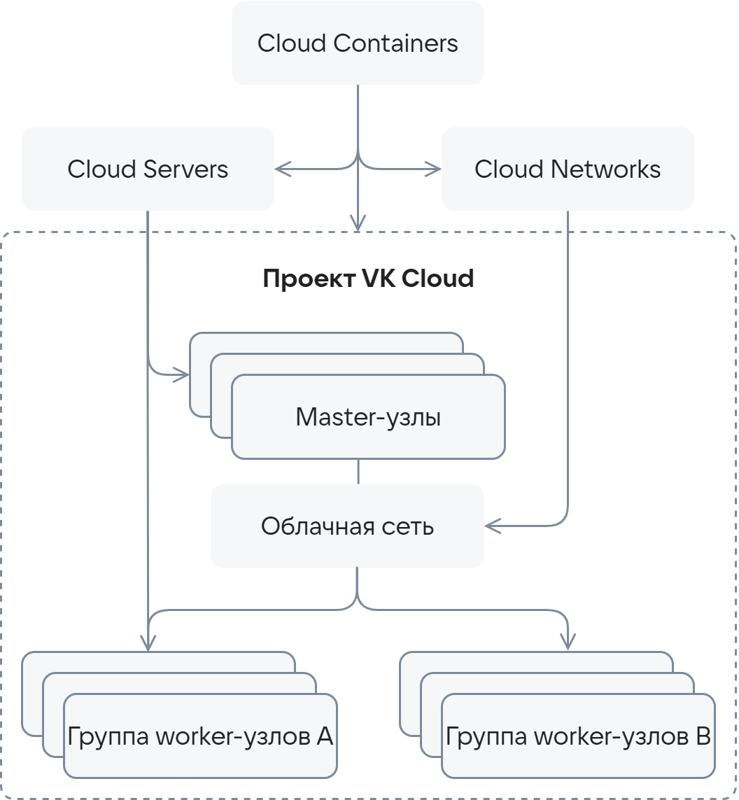
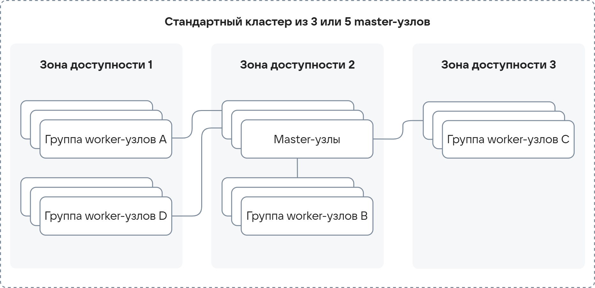

# {heading(Қызмет архитектурасы)[id=k8s-architecture]}

{include(/kz/_includes/_translated_by_ai.md)}

Cloud Containers сервисі {var(cloud)} платформасында Kubernetes кластерлерімен жұмыс істеу ортасын қамтамасыз етеді. [OpenStack](https://www.openstack.org/) негізіндегі сервис архитектурасы пайдаланушыларға жұмыс істеу үшін кең мүмкіндіктер береді, істен шығуға төзімділікті, масштабталуды және платформаның басқа сервистерімен интеграцияны қамтамасыз етеді.

{cut(Cloud Containers сервисінің {var(cloud)} басқа компоненттерімен өзара әрекеттесу сызбасы)}

Cloud Containers кластерлердің дұрыс жұмысын бақылайды, ал:

- {linkto(../../../../computing/iaas#iaas)[text=Cloud Servers]} кластер түйіндеріндегі ВМ-дерді басқарады.
- {linkto(../../../../networks/vnet#vnet)[text=Cloud Networks]} кластер желілерін басқарады.

{params[noBorder=true; width=50%]}

{/cut}

## {heading(Кластер топологиялары)[id=k8s-architecture-topology]}

Cloud Containers сервисіндегі Kubernetes кластеры екі түрлі түйіндерден (nodes) тұрады — master-түйіндер және worker-түйіндер:

- _Master-түйіндер_ бүкіл кластердің күйі туралы ақпаратты сақтайды және жұмыс жүктемесін worker-түйіндер арасында бөлуді басқарады. Пайдаланушыларға master-түйіндерді басқару қолжетімді емес, ол {var(cloud)} платформасы жағында жүзеге асырылады.

  Kubernetes кластерін {linkto(../../instructions/create-cluster/create-webui-gen-2#k8s-create-webui-gen-2)[text=құрған кезде]}, Cloud Containers оның master-түйіндері үшін ең аз сәйкес келетін {linkto(../../../../computing/iaas/concepts/vm/flavor#iaas-concepts-vm-flavor)[text=конфигурация үлгісін]} таңдайды. Әдепкі бойынша бұл Intel Cascade Lake процессоры, 2 CPU және 6 ГБ жедел жады бар ВМ. Master-түйіндердің {linkto(../storage#k8s-storage-supported-storage-types)[text=диск түрі]} — 20 ГБ көлеміндегі High-IOPS SSD.

  Master-түйіндерде {linkto(../scale#k8s-scale-types)[text=автоматты масштабтау]} әдепкі бойынша қосылған, сондықтан кластерге түсетін жүктеме өзгерген кезде оның есептеу ресурстарының саны автоматты түрде өзгертіледі.

- _Worker-түйіндер_ жұмыс жүктемесін ([workload](https://kubernetes.io/docs/concepts/workloads/)) орындайды. Олар worker-түйіндер топтарына ұйымдастырылуы мүмкін. Істен шығуға төзімділікті арттыру үшін топтарды әртүрлі {linkto(../../../../start/concepts/architecture#architecture-az)[text=қолжетімділік аймақтарында]} орналастырыңыз. Worker-түйіндерді басқару да {var(cloud)} платформасы жағында жүзеге асырылады, бірақ олар пайдаланушылар жобаларымен желілік байланысқа ие.

Кластердің істен шығуға төзімділігі master-түйіндердің санына және олардың қолжетімділік аймақтары бойынша бөлінуіне байланысты. Мүмкін конфигурациялар:

- Бір master-түйіні бар Kubernetes кластеры.

  Мұндай кластер істен шығуға төзімді емес: worker-түйіндер бірнешеу болса және олар топтарға ұйымдастырылса да, жалғыз master-түйін жоғалған жағдайда кластер жұмысқа жарамсыз болады.

  {cut(Бір master-түйіні бар кластер үшін түйіндердің өзара әрекеттесу сызбасы)}
  {params[noBorder=true; width=80%]}
  {/cut}

- 3 немесе 5 master-түйіннен тұратын стандартты Kubernetes кластеры.

  Мұндай кластер қолжетімділік аймағы деңгейінде істен шығуға төзімді: қолжетімділік аймағы тұрақты жұмыс істеген және бірнеше master-түйін жоғалған жағдайда, master-түйіндердің жартысынан көбі жұмыс істеп тұрғанша кластер жұмысын сақтайды. Бір master-түйін қалған кезде кластер жұмысын тоқтатады.

  {cut(Стандартты кластер үшін түйіндердің өзара әрекеттесу сызбасы)}  
  {params[noBorder=true; width=80%]}
  {/cut}

- 3 немесе 5 master-түйіннен тұратын істен шығуға төзімді Kubernetes кластеры.

  Істен шығуға төзімді кластерлердің master-түйіндері аймақтың барлық қолжетімділік аймақтары бойынша бөлінеді. Мұндай кластер барынша істен шығуға төзімді: бір қолжетімділік аймағы істен шыққан кезде жүктеме басқа қолжетімділік аймақтарында орналасқан master-түйіндер арасында бөлінеді. Алайда, стандартты кластерлердегідей, істен шығуға төзімді кластер master-түйіндердің жартысынан көбі жұмыс істеп тұрғанша жұмысқа қабілеттілігін сақтайды және бір master-түйін қалған кезде жұмысын тоқтатады.

  {cut(Істен шығуға төзімді кластер үшін түйіндердің өзара әрекеттесу сызбасы)}
  {params[noBorder=true; width=80%]}
  {/cut}

Таңдалған кластер топологиясына қарамастан, master-түйіндер кластер күйі туралы ақпаратты сақтау үшін [etcd](https://etcd.io/) таратылған «кілт-мән» сақтау қоймасын пайдаланады:

- Бір master-түйіні бар кластерде бір `etcd` данасы болады.
- Бірнеше master-түйіні бар кластерлерде істен шығуға төзімділік үшін кластерлік режимде жұмыс істейтін бірнеше `etcd` данасы бар.
- Әрбір `etcd` данасына бөлек жоғары өнімді SSD-диск (High-IOPS) бөлінген. Бұл минималды кідірістер кезінде кластердің API-эндпоинтімен барынша жылдам өзара әрекеттесуді ұйымдастыруға мүмкіндік береді.

Worker-түйіндер деңгейіндегі істен шығуға төзімділік үшін әртүрлі қолжетімділік аймақтарында бірнеше worker-түйіндер топтарын құру және қосымша репликаларын осы түйіндерде репликалар да әртүрлі қолжетімділік аймақтарында болатындай орналастыру ұсынылады.

## {heading(Кластер ортасы)[id=k8s-architecture-cluster-environment]}

Master- және worker-түйіндерде AlmaLinux операциялық жүйесі пайдаланылады (Kubernetes 1.31 нұсқасынан бастап).

Кластер контейнерлерді Kubernetes [Container Runtime Interface](https://kubernetes.io/docs/concepts/architecture/cri/) (CRI) арқылы CRI-O көмегімен іске қосады.

Толығырақ {linkto(../versions#k8s-versions)[text=Kubernetes қолжетімді нұсқалары және нұсқаларды қолдау саясаты]} бөлімінде.

## {heading(Kubernetes API-мен интеграция)[id=k8s-architecture-kubernetes-api-integration]}

Кластермен барлық өзара әрекеттесу [Kubernetes API](https://kubernetes.io/docs/concepts/overview/kubernetes-api/) арқылы жүзеге асырылады.

Cloud Containers кластерлерінің API-эндпоинті {linkto(../network#k8s-network)[text=жеке жүктеме теңгергішінің]} артында орналасқан, сондықтан кластер API-іне қолжетімділікті master-түйіндер санына қарамастан бір IP-мекенжай арқылы алуға болады.

## {heading({var(cloud)} платформасымен интеграция)[id=k8s-architecture-platform-integration]}

{var(cloud)} платформасымен интеграция стандартты Kubernetes интерфейстері арқылы жүзеге асырылады:

- [Container Storage Interface](https://kubernetes-csi.github.io/docs/) (CSI) — деректерді сақтау сервистерімен интеграция.

  Кластерлерде {var(cloud)} сақтау қоймасын тұрақты томдар ([persistent volumes](https://kubernetes.io/docs/concepts/storage/persistent-volumes/)) түрінде пайдалануға мүмкіндік береді.
  Persistent Volume Claim (PVC) пайдалану қолжетімді.

  Интеграция OpenStack Cinder API көмегімен жүзеге асырылады. Толығырақ {linkto(../storage#k8s-storage)[text=Кластердегі сақтау қоймасы]} бөлімінде.

- [Container Network Interface](https://kubernetes.io/docs/concepts/extend-kubernetes/compute-storage-net/network-plugins/) (CNI) — желілік ішкі жүйелермен интеграция.

  Cloud Containers сервисінде жасайтын Kubernetes кластерлерінде CNI қолдайтын плагиндер іске асырылған: [Calico](https://projectcalico.docs.tigera.io/about/about-calico) және [Cilium](https://docs.cilium.io/en/stable/index.html) (тек екінші буындағы кластерлер үшін қолжетімді). Олар мыналарды қамтамасыз етеді:

  - контейнерлер, {linkto(../../reference/pods#k8s-pods)[text=подтар]} және кластер түйіндері арасындағы желілік байланысты;
  - Kubernetes [желілік саясаттарын](https://kubernetes.io/docs/concepts/services-networking/network-policies/) (Network Policies) қолдану және сақтау.

  Calico және Cilium SDN Sprut көмегімен {var(cloud)} платформасымен интеграцияланады. Толығырақ {linkto(../network#k8s-network)[text=Кластердегі желі]} бөлімінде.

## {heading(Open Policy Agent кірістірілген қолдауы)[id=k8s-architecture-opa-gatekeeper]}

Cloud Containers кластерлеріне {linkto(../../reference/gatekeeper#k8s-gatekeeper)[text=Open Policy Agent Gatekeeper]} кірістірілген. Ол Kubernetes ресурстары үшін {linkto(../security-policies#k8s-security-policies)[text=қауіпсіздік саясаттарын]} қолдануға мүмкіндік береді. Сондай-ақ мұндай кластерлерде {linkto(../security-policies#k8s-security-policies-default)[text=әдепкі қауіпсіздік саясаттары]} қолданылады.

## {heading(Кластерді масштабтау мүмкіндіктері)[id=k8s-architecture-scaling-features]}

Cloud Containers кластеры {linkto(../scale#k8s-scale)[text=master-түйіндер мен worker-түйіндерді масштабтаудың кірістірілген мүмкіндіктеріне]} ие.

Соның ішінде, жұмыс жүктемесінің қажеттіліктеріне байланысты түйіндер саны автоматты түрде реттелетін кластер түйіндерін автоматты масштабтау қолдау табады:

- Master-түйіндер үшін ол әдепкі бойынша қосылған және оны өшіру мүмкін емес.
- Worker-түйіндер үшін ол {linkto(../cluster-autoscaler#k8s-cluster-autoscaler)[text=Cluster Autoscaler]} көмегімен жүзеге асырылады және {linkto(../../instructions/helpers/node-group-settings#k8s-node-group-settings)[text=әрбір түйін тобы үшін параметрлерді]} анықтау кезінде қолмен қосылады.
