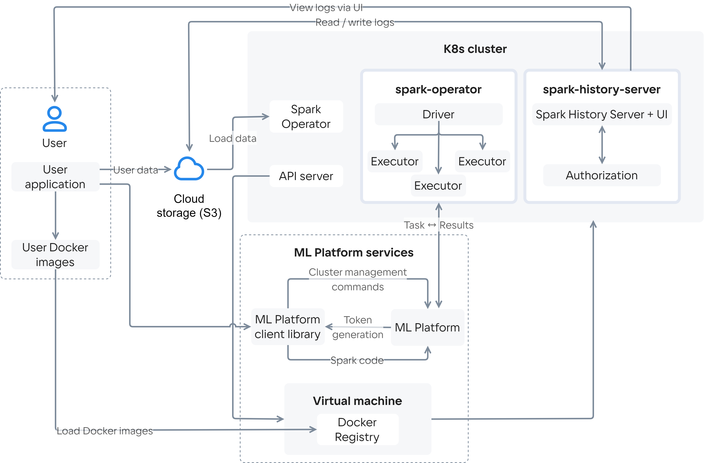

# {heading(Сервис архитектурасы)[id=mlspark-concepts-architecture]}

{include(/kz/_includes/_translated_by_ai.md)}

Cloud Spark сервисі келесі компоненттерді қамтиды:

- [Cloud Spark кластері](#mlspark-concepts-architecture-cluster_spark);
- [Docker Registry бар виртуалды машина](#mlspark-concepts-architecture-vm_docker_registry);
- [VK Object Storage](#mlspark-concepts-architecture-object_storage);
- [Cloud ML Platform сервисі](#mlspark-concepts-architecture-service_ml_platform).

## {heading(Cloud Spark кластері)[id=mlspark-concepts-architecture-cluster_spark]}

Cloud Spark кластері — Cloud Containers сервисі негізінде өрістетілген K8s кластері. Кластер құрамына мыналар кіреді:

- Spark Driver процесі іске қосылған master-түйін. Бұл процесс пайдаланушы қолданбасын *тапсырмаларға* (орындау бірліктеріне) бөледі және оларды параллель орындау үшін worker-түйіндерге таратады.
- Саны пайдаланушы қолданбасының қажеттіліктеріне байланысты берілген шектерде өзгеретін worker-түйіндер. Пайдаланушы қолданбасы іске қосылған кезде worker-түйіндерде Spark Executor процесі іске қосылады, ол Spark Driver процесінен келетін тапсырмаларды орындайды және нәтижені Spark Driver-ға қайтарады.
- Spark Operator — кластердің өмірлік циклін басқару құралы. Ол өрістету, масштабтау және жаңарту процестерін автоматтандырады. Spark Operator *тапсырмаларды* (пайдаланушы қолданбаларын орындау сұрауларын) қабылдайды және тапсырмаларды орындау мен нәтижелерді жинау үшін қажетті подтарды іске қосады.
- Spark History Server — тапсырмалардың орындалуы туралы ақпарат жинақталатын сервис. Сервис тапсырмалардың орындалу тарихын қарауға, кластер өнімділігін талдауға және мәселелерді диагностикалауға болатын интерфейс ұсынады.
- Authorization — Spark History Server үшін авторизация сервисі.
- API server — Spark компоненттерімен өзара әрекеттесуге арналған API қамтитын сервер.

## {heading(Docker Registry бар ВМ)[id=mlspark-concepts-architecture-vm_docker_registry]}

[Docker Registry](/kz/kubernetes/k8s/instructions/addons/advanced-installation/install-advanced-registry) ішінде әдепкі бойынша пайдаланылатын контейнердің Docker-бейнесі сақталады, оған Cloud Spark кластерін өрістетуге және онда пайдаланушы қолданбаларын іске қосуға арналған кітапханалар, тәуелділіктер және баптаулар кіреді.

Қажет болған жағдайда пайдаланушы Docker Registry-ге өз Docker-бейнелерін жүктеп, кейін оларды сервисте пайдалана алады.

## {heading(VK Object Storage)[id=mlspark-concepts-architecture-object_storage]}

[VK Object Storage](/kz/storage/s3) — S3 қолдауы бар {var(cloud)} платформасының объектілік қоймасы. Cloud Spark сервисін өрістету кезінде сервиспен біріктірілген [бакет](/kz/storage/s3/concepts/about#s3-concepts-about-bucket) автоматты түрде жасалады. Ол әдепкі бойынша Spark History Server үшін логтарды сақтау, тәуелділіктерді, пайдаланушы қолданбаларының коды бар файлдарды және пайдаланушы тапсырмаларын орындауға қажетті басқа артефактілерді жүктеу үшін пайдаланылады.

Cloud Spark сервисіне қосымша бакеттерді де қосуға болады.

## {heading(Cloud ML Platform сервисі)[id=mlspark-concepts-architecture-service_ml_platform]}

Cloud ML Platform сервисі Cloud Spark кластерімен жұмыс істеу әдістерін ұсынатын [кіріктірілген Python-кітапхананы](../../ml-platform-library) қамтиды. Кітапхананы пайдалану мыналарға мүмкіндік береді:

- Кластердің параметрлері мен күйі туралы ақпарат алып, оның жұмысын басқаруға.
- SparkApplication түріндегі пайдалануға дайын манифестерді алып, оларды өз қолданбаларыңызға бейімдеуге.
- SparkApplication түріндегі манифестер арқылы кластерде Spark тапсырмаларын іске қосуға.
- Spark тапсырмаларының орындалу барысы туралы ақпарат жинауға.
- [Kubernetes secrets](https://kubernetes.io/docs/concepts/configuration/secret/) жасауға. Secrets пайдаланушы тапсырмаларын орындау кезінде қажетті сезімтал деректерді қауіпсіз сақтауға және пайдалануға мүмкіндік береді.
- [ConfigMaps](https://kubernetes.io/docs/concepts/configuration/configmap/) жасауға — конфигурациялық деректерді сақтауға арналған Kubernetes объектілері. ConfigMaps пайдаланудың мақсаты — пайдаланушы қолданбасының кодын әртүрлі орындау орталары арасында тасымалдауды жеңілдету.
