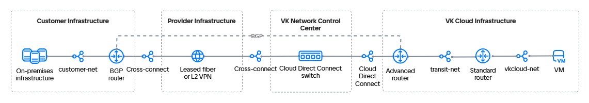

# {heading({var(cloud)} жүйесіне Cloud Direct Connect желісі және қосымша стандартты маршрутизатор арқылы қосылу)[id=directconnect-dc-standard-router]}

{include(/kz/_includes/_translated_by_ai.md)}

Cloud Direct Connect сіздің жергілікті инфрақұрылымыңыздағы желіні {var(cloud)} виртуалды желілеріне қосудың әртүрлі {linkto(../../../../networks/vnet/concepts/onpremise-connect#vnet-onpremise-connect)[text=нұсқаларын]} ұйымдастыруға мүмкіндік береді. Бұл мысалда қосылу Cloud Direct Connect бөлінген байланыс арнасы, [BGP](https://datatracker.ietf.org/doc/html/rfc1163) протоколы бойынша динамикалық маршруттауы бар жетілдірілген маршрутизатор және қосымша стандартты маршрутизатор көмегімен жасалады.

Бұл мысалда жетілдірілген маршрутизатор интеграцияға жауап береді және қашықтағы инфрақұрылыммен байланысты қамтамасыз етеді. Виртуалды машиналар орналастырылған желіге {var(cloud)} стандартты маршрутизаторы қызмет көрсетеді.

{note:info}
Мұндай қосылу нұсқасы үшін BGP протоколын пайдалану міндетті емес. Сіздің қосылу схемаңыз осы нұсқаулықта қолданылған схемадан өзгеше болуы мүмкін.
{/note}

Қарастырылып отырған қосылу нұсқасы үш виртуалды желіні пайдалануды болжайды:

- желілік түйісу желісі (Cloud Direct Connect);
- стандартты маршрутизаторды жетілдірілген маршрутизаторға қосуға арналған желі (транзиттік желі);
- виртуалды машиналарды орналастыруға арналған желі.

BGP протоколын пайдаланатын нұсқа үшін желілік байланыстылықты ұйымдастыру схемасы мынадай түрде көрінеді:

{params[noBorder=true]}

Стандартты және жетілдірілген маршрутизаторлардың комбинациясын пайдалану стандартты маршрутизаторды қолданбайтын {linkto(../../../../networks/directconnect/how-to-guides/dc-advanced-router#directconnect-dc-advanced-router)[text=қосылу]} шектеулерін айналып өтуге мүмкіндік береді.

{note:info}
{var(cloud)} қашықтағы инфрақұрылымға қосудың әртүрлі {linkto(../../../../networks/vnet/concepts/onpremise-connect#vnet-onpremise-connect)[text=нұсқаларын]} баптауға мүмкіндік береді. Нұсқаны таңдау жоба SDN-іне, қашықтағы инфрақұрылымнан интернетке қолжетімділікке және қосылымның ақауға төзімділігіне қойылатын талаптарға байланысты.
{/note}

## {heading(Дайындық қадамдары)[id=directconnect-dc-standard-router-prep]}

1. Егер бұл әлі жасалмаса, {linkto(../../../../tools-for-using-services/api/rest-api/enable-api#rest-api-enable-activate)[text=API арқылы қолжетімділікті белсендіріңіз]}.
1. OpenStack клиенті {linkto(../../../../tools-for-using-services/cli/openstack-cli#openstack-install)[text=орнатылғанына]} көз жеткізіңіз және жобада {linkto(../../../../tools-for-using-services/cli/openstack-cli#openstack-authorize)[text=аутентификациядан өтіңіз]}.
1. Компьютеріңізде [curl](https://curl.se/docs) және [jq](https://jqlang.org) пакеттері орнатылғанына көз жеткізіңіз.
1. Жергілікті инфрақұрылымыңыздағы желіні таңдаңыз немесе жасаңыз. Желіде интернетке қолжетімділік болмауы мүмкін, бірақ ол мынадай маршрутизаторға қосылған болуы тиіс:

    - BGP протоколы бойынша қосылуды қолдайды;
    - (опционалды) BFD протоколын қолдайды: бұл ақау болған жағдайда маршруттауды қалпына келтіру уақытын қысқартуға мүмкіндік береді;
    - клиент желісіндегі құрылғы немесе виртуалды машина болуы мүмкін.

   Келесі ақпаратты жазып алыңыз:

    - ішкі желінің атауы мен IP мекенжайы;
    - ішкі желі орналасқан желінің атауы;
    - желілер арасындағы байланысты тексеру үшін пайдаланылатын ішкі желідегі машинаның IP мекенжайы;
    - BGP маршрутизаторының атауы.

   Мысал үшін BGP маршрутизаторы функцияларын орындайтын Router OS 7.10 (MikroTik) виртуалды машинасы бар желі пайдаланылады.

1. {var(cloud)} жүйесіндегі жобаңызда виртуалды желіні таңдаңыз немесе {linkto(../../../../networks/vnet/instructions/net#vnet-net-add)[text=жасаңыз]}. Желі маршрутизаторға қосылмауы тиіс.

   Келесі ақпаратты жазып алыңыз:

    - ішкі желінің атауы мен IP мекенжайы;
    - ішкі желі орналасқан желінің атауы.

1. Таңдалған желіде {linkto(../../../../computing/iaas/instructions/vm/vm-create#iaas-vm-create)[text=виртуалды машина жасаңыз]}. Жасалған ВМ IP мекенжайын жазып алыңыз.
1. {var(cloud)} жүйесіндегі жобаңызда транзиттік виртуалды желіні {linkto(../../../../networks/vnet/instructions/net#vnet-net-add)[text=жасаңыз]}. Желі маршрутизаторға қосылмауы тиіс.
1. Транзиттік желінің {linkto(../../../../networks/vnet/instructions/net#vnet-net-view)[text=UUID мәнін біліңіз]}. Бұл мысалда: `323d97cf-aaaa-bbbb-cccc-deaa6a11ab25`.
1. Егер бұл әлі жасалмаса, [Cloud Direct Connect](/kz/networks/directconnect) сервисіне {linkto(../../../../networks/directconnect/connect#directconnect-connect)[text=қосылыңыз]}.
1. Қосылған желілік түйісу желісінің (Cloud Direct Connect) UUID мәнін біліңіз:

    1. [Жеке кабинетте](https://kz.cloud.vk.com/app/) **Виртуалды желілер** → **Желілер** бөліміне өтіңіз.
    1. Желілер тізімінен `external-vni-10XXX` атауы бар желілік түйісу желісін табыңыз. Мұндағы `XXX` — қосылымыңыздың жеке реттік нөмірі.
    1. Осы желінің UUID мәнін сақтаңыз. Бұл мысалда желілік түйісудің UUID мәні `b2b8468e-aaaa-bbbb-cccc-327c8c2670d4`.

1. Әрі қарай жұмыс істеу үшін қажет барлық мәлімет жиналғанына көз жеткізіңіз. Төменде мысал ретінде келесі деректер пайдаланылады:

   [cols="1,1,1,1,1", options="header"]
   |===
   |Нысан
   |Клиент желісі
   |Виртуалды желі
   |Транзиттік желі
   |Cloud Direct Connect желісі

   |Желі
   |`customer-net`
   |`vkcloud-net`
   |`transit-net`, `323d97cf-aaaa-bbbb-cccc-deaa6a11ab25`
   |`external-vni-10XXX`, `b2b8468e-aaaa-bbbb-cccc-327c8c2670d4`

   |Ішкі желі
   |`customer-subnet`, `10.0.0.0/24`
   |`vkcloud-subnet`, `172.17.0.0/24`
   |
   |

   |Виртуалды машина
   |`client-vm`, `10.0.0.5`
   |`vkcloud-vm`, `172.17.0.8`
   |
   |

   |BGP маршрутизаторы
   |`MikroTik`
   |
   |
   |
   |===

{note:info}
Төмендегі мысалда желілік түйісу мен транзиттік желі үшін `/30` маскасы бар ішкі желілер пайдаланылатын нұсқа қарастырылады. Сондай-ақ `/24` маскасы бар стандартты ішкі желілерді де {linkto(../../../../networks/vnet/instructions/net#vnet-net-subnet-add)[text=жасай аласыз]}.
{/note}

## {heading(1. Cloud Direct Connect үшін ішкі желі қосыңыз)[id=directconnect-dc-standard-router-add-cdc-subnet]}

Cloud Direct Connect желілік түйісу желісіне {linkto(../../../../networks/vnet/how-to-guides/custom-subnet#vnet-custom-subnet)[text=`/30` маскасы бар ішкі желіні]} қосыңыз.
Қоршаған орта айнымалыларын қосқанда келесі параметрлерді көрсетіңіз:

- `N_CIDR="192.168.0.0/30"`;
- `N_ID="<UUID_СЕТЕВОГО_СТЫКА>"`.

Ішкі желінің атауы мен CIDR мәнін жазып алыңыз. Бұл мысалда: `dc-subnet`, `192.168.0.0/30`.

## {heading(2. Транзиттік желі үшін ішкі желі қосыңыз)[id=directconnect-dc-standard-router-add-transit-subnet]}

Транзиттік желіге {linkto(../../../../networks/vnet/how-to-guides/custom-subnet#vnet-custom-subnet)[text=`/30` маскасы бар ішкі желіні]} қосыңыз.
Қоршаған орта айнымалыларын қосқанда келесі параметрлерді көрсетіңіз:

- `N_CIDR="192.168.1.0/30"`;
- `N_ID="<UUID_ТРАНЗИТНОЙ_СЕТИ>"`.

Ішкі желіні API арқылы жасағанда `"gateway_ip": <IP_АДРЕС_ШЛЮЗА_ДЛЯ_СТАНДАРТНОГО_МАРШРУТИЗАТОРА>` параметрін беріңіз.
Cloud Direct Connect ішкі желісінде бұл параметр `null` ретінде анықталған.

Ішкі желінің атауы мен CIDR мәнін жазып алыңыз. Бұл мысалда: `transit-subnet`, `192.168.1.0/30`.

## {heading(3. Стандартты маршрутизатор қосыңыз)[id=directconnect-dc-standard-router-add-standart-router]}

{linkto(../../../../networks/vnet/instructions/router#vnen-router-add)[text=Келесі параметрлермен]} стандартты маршрутизаторды жасаңыз:

- **SDN**: `Sprut`. Өріс жобаға SDN Sprut пен Neutron қосылған болса көрсетіледі.
- **Атауы**: бұл мысалда `Standard router`.
- **Сыртқы желіге қосылу**: опция қосылған.

## {heading(4. Жетілдірілген маршрутизатор қосыңыз)[id=directconnect-dc-standard-router-add-advanced-router]}

{linkto(../../../../networks/vnet/instructions/advanced-router/manage-advanced-routers#vnet-manage-advanced-routers-add)[text=Келесі параметрлермен]} жетілдірілген маршрутизаторды жасаңыз:

- **Атауы**: бұл мысалда `Advanced router`.
- **SNAT**: опция өшірілген.

## {heading(5. Жетілдірілген маршрутизатордың желілік интерфейстерін баптаңыз)[id=directconnect-dc-standard-router-advanced-router-network-configure]}

1. {linkto(../../../../networks/vnet/instructions/advanced-router/manage-interfaces#vnet-manage-interfaces-add)[text=Виртуалды желіге бағытталған]} жетілдірілген маршрутизатор интерфейсін қосыңыз:

    - **Атауы**: `transit-net-iface`;
    - **Ішкі желі**: `transit-subnet`;
    - **Интерфейстің IP мекенжайы**: `192.168.1.1`.
1. {linkto(../../../../networks/vnet/instructions/advanced-router/manage-interfaces#vnet-manage-interfaces-add)[text=Cloud Direct Connect желісіне бағытталған]} жетілдірілген маршрутизатор интерфейсін қосыңыз:

    - **Атауы**: `dc-iface`;
    - **Ішкі желі**: `dc-subnet`;
    - **Интерфейстің IP мекенжайы**: `192.168.0.1`.

## {heading(6. Клиент желісінің BGP маршрутизаторының желілік интерфейстерін баптаңыз)[id=directconnect-dc-standard-router-client-network-configure]}

1. Желілік интерфейстерді қосыңыз:

    - Cloud Direct Connect желісіне бағытталған — `dc-subnet`. Бұл интерфейс {var(cloud)} пен клиент желісі арасындағы байланыстылықты ұйымдастыруға көмектеседі.
    - BGP маршрутизаторы орналасқан клиент желісіне бағытталған. Бұл интерфейс желі ішіндегі ресурстарға қосылу үшін пайдаланылады. Мұндай интерфейстер саны желі құрылымына байланысты.

   Бұл мысалда:

    - `192.168.0.2` — `dc-subnet` ішкі желісіне интерфейс;
    - `10.0.0.15` — `10.0.0.5` виртуалды машинасына дейінгі клиент желісіне интерфейс.

1. Интерфейстерді DHCP арқылы баптаңыз.

1. Жүйелік идентификаторды (System ID) баптаңыз.

1. BGP анонсына арналған желілер тізімін дайындаңыз.

1. (Опционалды) Егер маршрутизатор BFD қолдаса, BFD протоколын баптаңыз.

{cut(MikroTik үшін баптау мысалы)}

1. Желілік интерфейстерді қосу үшін MikroTik құрылғысына SSH арқылы қосылып, команданы орындаңыз:

   ```console
    /ip address add address=192.168.0.2/30 interface ether1
    /ip address add address=10.0.0.15/24 interface ether2
   ```

1. Интерфейстерді DHCP арқылы баптаңыз:

   ```console
    /ip dhcp-client
    add add-default-route=no interface=ether1
    add add-default-route=no interface=ether2
   ```

1. Жүйелік идентификаторды (System ID) баптаңыз:

   ```console
    /system identity
    set name=bgp-customer
   ```

1. BGP анонсына арналған желілер тізімін дайындаңыз:

   ```console
    /ip firewall address-list
    add address=10.0.0.0/24 list=bgp_networks
   ```

1. BFD протоколын баптаңыз:

   ```console
    /routing bfd configuration
    add disabled=no interfaces=ether1
   ```

{/cut}

## {heading(7. Транзиттік желіні стандартты маршрутизаторға қосыңыз)[id=directconnect-dc-standard-router-connect-transit-network]}

1. [Жеке кабинетте](https://kz.cloud.vk.com/app) **Виртуалды желілер** → **Желілер** бөліміне өтіңіз.
1. `transit-net` транзиттік желісінің атауын басып, **Желіні баптау** қойындысына өтіңіз.
1. `Standard router` стандартты маршрутизаторын таңдаңыз.
1. **Интернетке қолжетімділік** опциясын қосыңыз.
1. **Өзгерістерді сақтау** батырмасын басыңыз.
1. Ішкі желі үшін шлюздің тіркелуін тексеріңіз:

    1. Жеке кабинетте **Виртуалды желілер** → **Желілер** бөліміне өтіңіз.
    1. `transit-net` транзиттік желісінің атауын, содан кейін `transit-subnet` ішкі желісінің атауын басып, **Порттар** қойындысына өтіңіз.
    1. Шлюздің IP мекенжайы бар порттың ішкі желіде тіркелгеніне және **Қосылған** күйіне ие екеніне көз жеткізіңіз.

## {heading(8. Жетілдірілген маршрутизатор үшін eBGP көршілестігін баптаңыз)[id=directconnect-dc-standard-router-bgp-advanced-router]}

BGP протоколы бойынша байланысты баптау үшін динамикалық маршруттарды қосып, BGP көршілерін көрсету керек. Динамикалық маршруттауды баптау үшін `64512`–`65534` ауқымындағы автономды желілердің (ASN) жеке нөмірлерін пайдаланыңыз. {var(cloud)} жүйесіндегі маршрутизаторлардағы және қашықтағы инфрақұрылым жағындағы ASN нөмірлері әртүрлі болуы тиіс. Мысалда келесі нөмірлер пайдаланылады:

- `65512` — `customer-net` желісі үшін;
- `64512` — `vkcloud-net` желісі үшін.

Жетілдірілген маршрутизаторда динамикалық маршруттарды баптау үшін:

1. [Жеке кабинетте](https://kz.cloud.vk.com/app/) **Виртуалды желілер** → **Маршрутизаторлар** бөліміне өтіңіз.
1. Қосылған жетілдірілген маршрутизаторды ашып, **Динамикалық маршруттау** қойындысына өтіңіз.
1. **BGP маршрутизаторын жасау** батырмасын басыңыз.
1. BGP маршрутизаторының параметрлерін көрсетіңіз:

    - **Атауы**: `to-MikroTik`;
    - **Router ID**: `192.168.0.1`;
    - **ASN**: `64512`.

1. **Жасау** батырмасын басыңыз.
1. Қосылған BGP маршрутизаторын ашып, **BGP көршілері** қойындысына өтіңіз.
1. BGP көршісін қосыңыз. Параметрлерін көрсетіңіз:

    - **Атауы**: `MikroTik`;
    - **Remote neighbor**: `192.168.0.2`;
    - **Remote ASN**: `65512`.

1. **Жасау** батырмасын басыңыз.

Маршрутизатор көршімен байланыс орнатқанына көз жеткізіңіз: атауының жанындағы маркер жасыл болуы тиіс. Егер BFD пайдалансаңыз, BFD маркері де жасыл болып тұрғанына көз жеткізіңіз.

Жетілдірілген маршрутизатор BGP көршілестігі сәтті келісілгеннен кейін бірден өз көршісіне BGP анонстарын жібере бастайды. **BGP анонстары** қойындысына өтіп, маршрутизатор интерфейстері бағытталған барлық желілердің анонстарын жіберетініне көз жеткізіңіз:

- `172.17.0.0/24`;
- `192.168.0.0/30`;
- `192.168.1.0/30`.

Барлық анонстарда жасыл маркерлер болуы тиіс.

## {heading(9. Клиент желісінің маршрутизаторы үшін BGP көршілестігін баптаңыз)[id=directconnect-dc-standard-router-bgp-client-network]}

1. Жергілікті желіңіздегі маршрутизаторға қосылыңыз.
1. BGP протоколы бойынша қосылу үшін параметрлерді көрсетіңіз:

    - жергілікті желінің ASN: `65512`;
    - маршрутизатор ID: `192.168.0.2`;
    - сыртқы желінің ASN: `64512`;
    - BGP көршісінің ID: `192.168.0.1`;
    - BFD пайдалану.

1. (Опционалды) BFD протоколы бойынша байланыс орнатылғанын тексеріңіз.
1. BGP көршісімен байланыс орнатылғанын тексеріңіз. Егер BGP қосылымы орнатылса, жауапта нөлден өзгеше `keepalive-time` және `uptime` мәндері келуі тиіс.
1. Барлық қолжетімді BGP маршруттарын қараңыз. Маршруттар тізімінде `172.17.0.0/24` және `192.168.0.0/30` желілері көрсетілуі тиіс.

{cut(MikroTik үшін баптау мысалы)}

1. MikroTik құрылғысына SSH арқылы қосылып, команданы орындаңыз:

    ```console
    /routing bgp connection
    add address-families=ip as=65512 local.address=192.168.0.2 .role=ebgp name=bgp-customer output.network=bgp_networks remote.address=192.168.0.1 .as=64512 router-id=192.168.0.2 use-bfd=yes
    ```
1. BFD протоколы бойынша байланыс орнатылғанын тексеріңіз. Команданы орындаңыз:

   ```console
   /routing bfd session print
   ```

   Жауап мысалы:

   ```console
      Flags: U - up, I - inactive 
   0 U multihop=no vrf=main remote-address=192.168.0.1%ether1 local-address=192.168.0.2 state=up state-changes=1 uptime=3h27m12s desired-tx-interval=200ms actual-tx-interval=100ms 
     required-min-rx=200ms remote-min-rx=10ms multiplier=5 hold-time=1s packets-rx=75343 packets-tx=72203
   ```

1. MikroTik жағында BGP көршісімен байланыс орнатылғанын тексеріңіз. Команданы орындаңыз:

   ```console
   /routing bgp session print
   ```

   Жауап мысалы:

   ```console
      Flags: E - established
   0 E name="tw-bgp-mikrotik-1"
        remote.address=192.168.0.1 .as=64512 .id=192.168.0.1 .capabilities=mp,rr,gr,as4,ap,err,llgr .hold-time=4m
       .messages=5 .bytes=131 .gr-time=120 .eor=ip
      local.address=192.168.0.2 .as=65512 .id=192.168.0.2 .capabilities=mp,rr,gr,as4 .messages=4 .bytes=105 .eor=""
        output.procid=20 .network=bgp_networks
       input.procid=20 ebgp
      hold-time=3m keepalive-time=1m uptime=2m51s380ms last-started=aug/28/2023 07:27:15
   ```
1. MikroTik құрылғысындағы барлық маршруттарды көру үшін команданы орындаңыз:

   ```console
   /ip route print where bgp
   ```

   Жауап мысалы:

   ```console
   Flags: D - DYNAMIC; A - ACTIVE; b, y - BGP-MPLS-VPN
   Columns: DST-ADDRESS, GATEWAY, DISTANCE
       DST-ADDRESS    GATEWAY       DISTANCE
   DAb 172.17.0.0/24  192.168.0.1        20
   D b 192.168.0.0/30 192.168.0.1        20
   ```

{/cut}

## {heading(10. Стандартты маршрутизаторда клиент желісіне статикалық маршруттарды баптаңыз)[id=directconnect-dc-standard-router-standart-static-routs]}

1. [Жеке кабинетте](https://kz.cloud.vk.com/app/) **Виртуалды желілер** → **Маршрутизаторлар** бөліміне өтіңіз.
1. `Standard router` стандартты маршрутизаторының атауын басып, **Статикалық маршруттар** қойындысына өтіңіз.
1. **Статикалық маршрутты қосу** батырмасын басыңыз.
1. Тағайындалған желіні көрсетіңіз: клиент желісінің мекенжай префиксі, бұл мысалда `10.0.0.0/24`.
1. Аралық торапты (Next HOP) көрсетіңіз: жетілдірілген маршрутизатордың IP мекенжайы.
1. **Маршрутты қосу** батырмасын басыңыз.

## {heading(11. Жетілдірілген маршрутизаторда виртуалды машиналар желісіне статикалық маршруттарды баптаңыз)[id=directconnect-dc-standard-router-advanced-static-routs]}

1. [Жеке кабинетте](https://kz.cloud.vk.com/app/) **Виртуалды желілер** → **Маршрутизаторлар** бөліміне өтіңіз.
1. `Advanced router` жетілдірілген маршрутизаторының атауын басып, **Статикалық маршруттар** қойындысына өтіңіз.
1. **Статикалық маршрутты қосу** батырмасын басыңыз.
1. Тағайындалған желіні көрсетіңіз: виртуалды машиналар желісінің мекенжай префиксі, бұл мысалда `172.17.0.0/24`.
1. Аралық торапты (Next HOP) көрсетіңіз: стандартты маршрутизатордың IP мекенжайы.
1. **Қосу** батырмасын басыңыз.

## {heading(12. Виртуалды машиналар желісіне арналған статикалық маршрутты BGP анонсына қосыңыз)[id=directconnect-dc-standard-router-bgp-static-route]}

1. [Жеке кабинетте](https://kz.cloud.vk.com/app/) **Виртуалды желілер** → **Маршрутизаторлар** бөліміне өтіңіз.
1. `Advanced router` жетілдірілген маршрутизаторының атауын басып, **Динамикалық маршруттау** қойындысына өтіңіз.
1. Бұрын жасалған BGP баптауын басып, **BGP анонстары** қойындысына өтіңіз.
1. **Жаңа анонс қосу** батырмасын басыңыз.
1. Параметрлерді көрсетіңіз:

    - **Анонс түрі**: статикалық.
    - **Тағайындалған желі**: виртуалды машиналар желісінің мекенжай префиксі, бұл мысалда `172.17.0.0/24`.
    - **Әдепкі шлюз**: стандартты маршрутизатордың IP мекенжайы.

1. **Қосу** батырмасын басыңыз.
1. Маршруттар олардың маршруттау желісіне түсуі үшін `172.17.0.8` және `10.0.0.5` машиналарын қайта жүктеңіз.

## {heading(13. Жұмысқа қабілеттілікті тексеріңіз)[id=directconnect-dc-standard-router-check]}

Тексеру үшін бір желіден қосылған желідегі машинаға дейін `ping` немесе `traceroute` жіберіңіз. Егер басқа желіден жауап келсе, онда желілер арасындағы байланыстылық дұрыс бапталған.

Мысалы, виртуалды желідегі `172.17.0.8` машинасынан клиент желісіндегі `10.0.0.5` машинасына пинг орындаңыз:

1. `vkcloud-vm` ВМ құрылғысымен терминал сессиясын ашыңыз.
1. Клиент желісіндегі машинаның ішкі IP мекенжайына пинг орындаңыз:

   ```console
   ping 10.0.0.5
   ```

IP мекенжайы пингке жауап беруі тиіс.

## {heading(Пайдаланылмайтын ресурстарды жойыңыз)[id=directconnect-dc-standard-router-delete]}

Егер жасалған ресурстар енді қажет болмаса, оларды жойыңыз:

1. {linkto(../../../../computing/iaas/instructions/vm/vm-manage#iaas-vm-delete)[text=Виртуалды машинаны жойыңыз]}.
1. {linkto(../../../../networks/vnet/instructions/router#vner-router-delete)[text=Маршрутизаторларды жойыңыз]}.
1. {linkto(../../../../networks/vnet/instructions/net#vnet-net-subnet-delete)[text=ішкі желілерді]} және {linkto(../../../../networks/vnet/instructions/net#vnet-net-delete)[text=желілерді]} жойыңыз: транзиттік желіні және виртуалды машиналарды орналастыруға арналған желіні.
