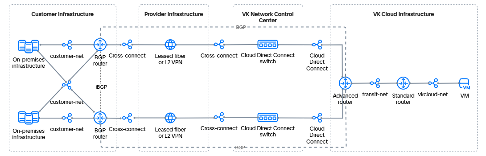

# {heading({var(cloud)} жүйесіне екі Cloud Direct Connect арнасы арқылы қосылу)[id=directconnect-dc-two-channels]}

{include(/kz/_includes/_translated_by_ai.md)}

Cloud Direct Connect жергілікті инфрақұрылымыңыздың желілерін {var(cloud)} виртуалды желілеріне қосуға мүмкіндік береді. Төменде келесілердің көмегімен қосылымды қалай жасау керектігі көрсетіледі:

- екі бөлінген Cloud Direct Connect байланыс арнасы;
- [BGP](https://datatracker.ietf.org/doc/html/rfc1163) протоколы бойынша динамикалық маршруттауы бар кеңейтілген маршрутизатор;
- қосымша стандартты маршрутизатор.

Екі бөлінген Cloud Direct Connect байланыс арнасы екі тәуелсіз {var(cloud)} ДОД-на тәуелсіз кабельдермен тартылған және ақауға төзімді конфигурацияны құрайды.

Бұл мысалда кеңейтілген маршрутизатор интеграцияға жауап береді және қашықтағы инфрақұрылыммен байланысты қамтамасыз етеді. Виртуалды машиналар орналастырылатын желіге {var(cloud)} стандартты маршрутизаторы қызмет көрсетеді.

Қарастырылып отырған қосылу нұсқасы төрт виртуалды желіні пайдалануды болжайды:

- желілік түйісудің екі тәуелсіз желісі (Cloud Direct Connect);
- стандартты маршрутизаторды кеңейтілген маршрутизаторға қосуға арналған желі (транзиттік желі);
- виртуалды машиналарды орналастыруға арналған желі.

Желілік байланысты ұйымдастыру сызбасы келесідей көрінеді:

{params[noBorder=true]}

{note:info}
{var(cloud)} қашықтағы инфрақұрылымға {linkto(../../../../networks/vnet/concepts/onpremise-connect#vnet-onpremise-connect)[text=қосылудың әртүрлі нұсқаларын]} баптауға мүмкіндік береді. Нұсқаны таңдау жоба SDN-іне, қашықтағы инфрақұрылымнан интернетке қолжетімділікке және қосылымның ақауға төзімділігіне қойылатын талаптарға байланысты.
{/note}

## {heading(Дайындық қадамдары)[id=directconnect-dc-two-channels-prep]}

1. Егер мұны әлі жасамаған болсаңыз, {linkto(../../../../tools-for-using-services/api/rest-api/enable-api#rest-api-enable-activate)[text=API арқылы қолжетімділікті белсендіріңіз]}.
1. OpenStack клиенті {linkto(../../../../tools-for-using-services/cli/openstack-cli#openstack-install)[text=орнатылғанына]} көз жеткізіңіз және жобада {linkto(../../../../tools-for-using-services/cli/openstack-cli#openstack-authorize)[text=аутентификациядан өтіңіз]}.
1. Компьютеріңізде [curl](https://curl.se/docs) және [jq](https://jqlang.org) пакеттері орнатылғанына көз жеткізіңіз.
1. Жергілікті инфрақұрылымыңыздағы желіні таңдаңыз немесе жасаңыз. Желінің интернетке қолжетімділігі болмауы мүмкін, бірақ ол келесі талаптарға сай екі маршрутизаторға қосылған болуы керек:

    - BGP протоколы арқылы қосылымды қолдайды;
    - (міндетті емес) BFD протоколын қолдайды: бұл ақау болған жағдайда маршруттауды қалпына келтіру уақытын қысқартуға мүмкіндік береді;
    - клиент желісіндегі құрылғы немесе виртуалды машина болуы мүмкін;
    - бір-бірімен iBGP протоколы арқылы өзара әрекеттеседі.

   Келесі ақпаратты жазып алыңыз:

    - ішкі желінің атауы мен IP мекенжайы;
    - ішкі желі орналасқан желінің атауы;
    - желілер арасындағы байланысты тексеру үшін пайдаланылатын ішкі желідегі машинаның IP мекенжайы;
    - BGP маршрутизаторларының атаулары.

   Мысал ретінде BGP маршрутизаторларының функцияларын орындайтын Router OS 7.10 (MikroTik) жүйесіндегі екі виртуалды машинасы бар желі пайдаланылады.

1. Жобаңызда {var(cloud)} ішінде виртуалды желіні таңдаңыз немесе {linkto(../../../../networks/vnet/instructions/net#vnet-net-add)[text=жасаңыз]}. Желіні маршрутизаторға қосуға болмайды.

   Келесі ақпаратты жазып алыңыз:

    - ішкі желінің атауы мен IP мекенжайы;
    - ішкі желі орналасқан желінің атауы.

1. Таңдалған желіде {linkto(../../../../computing/iaas/instructions/vm/vm-create#iaas-vm-create)[text=виртуалды машина жасаңыз]}. Жасалған ВМ IP мекенжайын жазып алыңыз.
1. Жобаңызда {var(cloud)} ішінде транзиттік виртуалды желіні {linkto(../../../../networks/vnet/instructions/net#vnet-net-add)[text=жасаңыз]}. Желіні маршрутизаторға қосуға болмайды.
1. Транзиттік желінің {linkto(../../../../networks/vnet/instructions/net#vnet-net-view)[text=UUID мәнін біліңіз]}. Бұл мысалда: `323d97cf-aaaa-bbbb-cccc-deaa6a11ab25`.
1. Егер мұны әлі жасамаған болсаңыз, Cloud Direct Connect сервисіне {linkto(../../../../networks/directconnect/connect#directconnect-connect)[text=қосылыңыз]}.
1. Cloud direct Connect желілік түйісуіне қосылған желілердің UUID мәндерін біліңіз:

    1. [Жеке кабинетте](https://kz.cloud.vk.com/app/) **Виртуалды желілер** → **Желілер** бөліміне өтіңіз.
    1. Желілер тізімінен атауы `external-vni-10XXX` түріндегі екі желілік түйісу желісін табыңыз. Мұндағы `XXX` — қосылымыңыздың жеке реттік нөмірі.
    1. Осы желілердің UUID мәндерін сақтаңыз. Бұл мысалда желілік түйісу желілерінің UUID мәндері:
        - бірінші түйісу желісі `external-vni-10XX1`: `b2b8468e-aaaa-bbbb-cccc-327c8c2670d4`;
        - екінші түйісу желісі `external-vni-10XX2`: `a2b8967e-aaaa-bbbb-cccc-327f9a2670e5`.
1. Әрі қарай жұмыс істеуге қажетті барлық мәлімет жиналғанына көз жеткізіңіз. Төменде мысал ретінде келесі деректер пайдаланылады:

   [cols="1,1,1,1,1", options="header"]
   |===
   |Нысан
   |Клиент желісі
   |Виртуалды желі
   |Транзиттік желі
   |Cloud Direct Connect желісі

   |Желі
   |`customer-net`
   |`vkcloud-net`
   |`transit-net`, `323d97cf-aaaa-bbbb-cccc-deaa6a11ab25`
   |`external-vni-10XX1`, `b2b8468e-aaaa-bbbb-cccc-327c8c2670d4`
   `external-vni-10XX2`, `a2b8967e-aaaa-bbbb-cccc-327f9a2670e5`

   |Ішкі желі
   |`customer-subnet`, `10.0.0.0/24`
   |`vkcloud-subnet`, `172.17.0.0/24`
   |
   |

   |Виртуалды машина
   |`client-vm`, `10.0.0.5`
   |`vkcloud-vm`, `172.17.0.8`
   |
   |

   |BGP маршрутизаторы
   |`MikroTik`
   |
   |
   |
   |===

{note:info}
Төменде мысалда желілік түйісу мен транзиттік желі үшін `/30` маскасы бар ішкі желілер пайдаланылатын нұсқа қарастырылады. Сондай-ақ `/24` маскасы бар стандартты ішкі желілерді {linkto(../../../../networks/vnet/instructions/net#vnet-net-subnet-add)[text=жасай]} аласыз.
{/note}

## {heading(1. Cloud Direct Connect үшін ішкі желілерді қосыңыз)[id=directconnect-dc-two-channels-add-cdc-subnets]}

1. Cloud Direct Connect желілік түйісуінің `external-vni-10XX1` желісіне {linkto(../../../../networks/vnet/how-to-guides/custom-subnet#vnet-custom-subnet)[text=`/30` маскасы бар ішкі желіні]} қосыңыз.
   Қоршаған орта айнымалыларын қосқанда келесі параметрлерді көрсетіңіз:

    - `N_CIDR="192.168.0.0/30"`;
    - `N_ID="<UUID_СЕТЕВОГО_СТЫКА_1>"`.

   Ішкі желінің атауы мен CIDR мәнін жазып алыңыз.

   Бұл мысалда `external-vni-10XX1` желісі үшін:

    - ішкі желі атауы: `dc-subnet1`;
    - CIDR: `192.168.0.0/30`;
    - UUID: `b2b8468e-aaaa-bbbb-cccc-327c8c2670d4`.

1. Cloud Direct Connect желілік түйісуінің `external-vni-10XX2` желісіне {linkto(../../../../networks/vnet/how-to-guides/custom-subnet#vnet-custom-subnet)[text=`/30` маскасы бар ішкі желіні]} қосыңыз.
   Қоршаған орта айнымалыларын қосқанда келесі параметрлерді көрсетіңіз:

    - `N_CIDR="192.168.1.0/30"`;
    - `N_ID="<UUID_СЕТЕВОГО_СТЫКА_2>"`.

   Ішкі желінің атауы мен CIDR мәнін жазып алыңыз.

   Бұл мысалда `external-vni-10XX2` желісі үшін:

    - ішкі желі атауы: `dc-subnet2`;
    - CIDR: `192.168.1.0/30`;
    - UUID: `a2b8967e-aaaa-bbbb-cccc-327f9a2670e5`.

## {heading(2. Транзиттік желі үшін ішкі желіні қосыңыз)[id=directconnect-dc-two-channels-add-transit-subnet]}

Транзиттік желіге {linkto(../../../../networks/vnet/how-to-guides/custom-subnet#vnet-custom-subnet)[text=`/30` маскасы бар ішкі желіні]} қосыңыз.
Қоршаған орта айнымалыларын қосқанда келесі параметрлерді көрсетіңіз:

- `N_CIDR="192.168.2.0/30"`;
- `N_ID="<UUID_ТРАНЗИТНОЙ_СЕТИ>"`.

Ішкі желіні API арқылы жасағанда `"gateway_ip": <IP-АДРЕС_ШЛЮЗА_ДЛЯ_СТАНДАРТНОГО_МАРШРУТИЗАТОРА>` параметрін жіберіңіз.
Cloud Direct Connect ішкі желісінде бұл параметр `null` ретінде анықталған.

Ішкі желінің атауы мен CIDR мәнін жазып алыңыз. Бұл мысалда: `transit-subnet`, `192.168.2.0/30`.

## {heading(3. Стандартты маршрутизаторды қосыңыз)[id=directconnect-dc-two-channels-add-standart-router]}

Келесі параметрлері бар стандартты маршрутизаторды {linkto(../../../../networks/vnet/instructions/router#vnen-router-add)[text=жасаңыз]}:

- **SDN**: `Sprut`. Өріс жобаға SDN Sprut және Neutron қосылған болса көрсетіледі.
- **Атауы**: бұл мысалда `Standard router`.
- **Сыртқы желіге қосылу**: опция қосулы.

## {heading(4. Кеңейтілген маршрутизаторды қосыңыз)[id=directconnect-dc-two-channels-add-advanced-router]}

Келесі параметрлері бар кеңейтілген маршрутизаторды {linkto(../../../../networks/vnet/instructions/advanced-router/manage-advanced-routers#vnet-manage-advanced-routers-add)[text=жасаңыз]}:

- **Атауы**: бұл мысалда `Advanced router`.
- **SNAT**: опция өшірулі.

## {heading(5. Кеңейтілген маршрутизатордың желілік интерфейстерін баптаңыз)[id=directconnect-dc-two-channels-advanced-network-configure]}

1. Виртуалды желіге бағытталған кеңейтілген маршрутизатор интерфейсін {linkto(../../../../networks/vnet/instructions/advanced-router/manage-interfaces#vnet-manage-interfaces-add)[text=қосыңыз]}:

    - **Атауы**: `transit-net-iface`;
    - **Ішкі желі**: `transit-subnet`;
    - **Интерфейс IP мекенжайы**: `192.168.2.1`.

1. Cloud Direct Connect `external-vni-10XX1` желісіне бағытталған кеңейтілген маршрутизатор интерфейсін {linkto(../../../../networks/vnet/instructions/advanced-router/manage-interfaces#vnet-manage-interfaces-add)[text=қосыңыз]}:

    - **Атауы**: `dc-iface1`;
    - **Ішкі желі**: `dc-subnet1`;
    - **Интерфейс IP мекенжайы**: `192.168.0.1`.

1. Cloud Direct Connect `external-vni-10XX1` желісіне бағытталған кеңейтілген маршрутизатор интерфейсін {linkto(../../../../networks/vnet/instructions/advanced-router/manage-interfaces#vnet-manage-interfaces-add)[text=қосыңыз]}:

    - **Атауы**: `dc-iface2`;
    - **Ішкі желі**: `dc-subnet2`;
    - **Интерфейс IP мекенжайы**: `192.168.1.1`.

## {heading(6. Клиент желісіндегі BGP маршрутизаторларының желілік интерфейстерін баптаңыз)[id=directconnect-dc-two-channels-client-network-configure]}

1. Бірінші маршрутизатор үшін желілік интерфейстерді қосыңыз:

    - Cloud Direct Connect `dc-subnet1` желісіне бағытталған. Бұл интерфейс {var(cloud)} пен клиент желісі арасындағы байланысты ұйымдастыруға көмектеседі.
    - BGP маршрутизаторы орналасқан клиент желісіне бағытталған. Бұл интерфейс желі ішіндегі ресурстарға қосылу үшін пайдаланылады. Мұндай интерфейстер саны желі құрылымына байланысты.

   Бұл мысалда:

    - `192.168.0.2` — `dc-subnet1` ішкі желісіне интерфейс;
    - `10.0.0.15` — `10.0.0.5` виртуалды машинасына дейінгі клиент желісіне интерфейс.

1. Бірінші маршрутизатордың интерфейстерін DHCP пайдаланып баптаңыз.

1. Жүйелік идентификаторды (System ID) баптаңыз.

1. BGP анонсына арналған желілер тізімін дайындаңыз.

1. (Міндетті емес) Егер маршрутизатор BFD-ні қолдаса, BFD протоколын баптаңыз.

   {cut(MikroTik үшін баптау мысалы)}

    1. Желілік интерфейстерді қосу үшін MikroTik-ке SSH арқылы қосылып, команданы орындаңыз:

       ```console
       /ip address add address=192.168.0.2/30 interface ether1
       /ip address add address=10.0.0.15/24 interface ether2
       ```

    1. Интерфейстерді DHCP пайдаланып баптаңыз:

       ```console
       /ip dhcp-client
       add add-default-route=no interface=ether1
       add add-default-route=no interface=ether2
       ```

    1. Жүйелік идентификаторды (System ID) баптаңыз:

       ```console
       /system identity
       set name=bgp-customer
       ```

    1. BGP анонсына арналған желілер тізімін дайындаңыз:

       ```console
       /ip firewall address-list
       add address=10.0.0.0/24 list=bgp_networks
       ```

    1. BFD протоколын баптаңыз:

       ```console
       /routing bfd configuration
       add disabled=no interfaces=ether1
       ```

   {/cut}

1. Екінші маршрутизатор үшін желілік интерфейстерді қосыңыз:

    - Cloud Direct Connect `dc-subnet2` желісіне бағытталған. Бұл интерфейс {var(cloud)} пен клиент желісі арасындағы байланысты ұйымдастыруға көмектеседі.
    - BGP маршрутизаторы орналасқан клиент желісіне бағытталған. Бұл интерфейс желі ішіндегі ресурстарға қосылу үшін пайдаланылады. Мұндай интерфейстер саны желі құрылымына байланысты.

   Бұл мысалда:

    - `192.168.1.2` — `dc-subnet2` ішкі желісіне интерфейс;
    - `10.0.0.16` — `10.0.0.5` виртуалды машинасына дейінгі клиент желісіне интерфейс.

1. Екінші маршрутизатордың интерфейстерін DHCP пайдаланып баптаңыз.

1. Жүйелік идентификаторды (System ID) баптаңыз.

1. BGP анонсына арналған желілер тізімін дайындаңыз.

1. (Міндетті емес) Егер маршрутизатор BFD-ні қолдаса, BFD протоколын баптаңыз.

   {cut(MikroTik үшін баптау мысалы)}

    1. Желілік интерфейстерді қосу үшін MikroTik-ке SSH арқылы қосылып, команданы орындаңыз:

       ```console
       /ip address add address=192.168.1.2/30 interface ether1
       /ip address add address=10.0.0.16/24 interface ether2
       ```

    1. Интерфейстерді DHCP пайдаланып баптаңыз:

       ```console
       /ip dhcp-client
       add add-default-route=no interface=ether1
       add add-default-route=no interface=ether2
       ```

    1. Жүйелік идентификаторды (System ID) баптаңыз:

       ```console
       /system identity
       set name=bgp-customer
       ```

    1. BGP анонсына арналған желілер тізімін дайындаңыз:

       ```console
       /ip firewall address-list
       add address=10.0.0.0/24 list=bgp_networks
       ```

    1. BFD протоколын баптаңыз:

       ```console
       /routing bfd configuration
       add disabled=no interfaces=ether1
       ```

   {/cut}

## {heading(7. Транзиттік желіні стандартты маршрутизаторға қосыңыз)[id=directconnect-dc-two-channels-connect-transit-network]}

1. [Жеке кабинетте](https://kz.cloud.vk.com/app) **Виртуалды желілер** → **Желілер** бөліміне өтіңіз.
1. `transit-net` транзиттік желісінің атауын басып, **Желіні баптау** қойындысына өтіңіз.
1. `Standard router` стандартты маршрутизаторын таңдаңыз.
1. **Интернетке қолжетімділік** опциясын қосыңыз.
1. **Өзгерістерді сақтау** түймесін басыңыз.
1. Ішкі желі үшін шлюздің тіркелуін тексеріңіз:

    1. [Жеке кабинетте](https://kz.cloud.vk.com/app) **Виртуалды желілер** → **Желілер** бөліміне өтіңіз.
    1. `transit-net` транзиттік желісінің атауын, содан кейін `transit-subnet` ішкі желісінің атауын басып, **Порттар** қойындысына өтіңіз.
    1. Шлюздің IP мекенжайы бар порт ішкі желіде тіркелгеніне және **Қосылған** мәртебесіне ие екеніне көз жеткізіңіз.

## {heading(8. Бірінші түйісу желісі арқылы кеңейтілген маршрутизатор үшін eBGP көршілігін баптаңыз)[id=directconnect-dc-two-channels-ebgp-advanced-first]}

BGP протоколы бойынша байланысты баптау үшін динамикалық маршруттарды қосып, BGP көршілерін көрсету керек. Динамикалық маршруттауды баптау үшін `64512`–`65534` ауқымындағы автономды жүйелердің (ASN) жеке нөмірлерін пайдаланыңыз. {var(cloud)} ішіндегі және қашықтағы инфрақұрылым жағындағы маршрутизаторлардағы ASN нөмірлері әртүрлі болуы керек. Мысалда келесі нөмірлер пайдаланылады:

- `65512` — `customer-net` желісі үшін;
- `64512` — `vkcloud-net` желісі үшін.

`external-vni-10XX1` түйісу желісі арқылы кеңейтілген маршрутизаторда динамикалық маршруттарды баптау үшін:

1. [Жеке кабинетте](https://kz.cloud.vk.com/app/) **Виртуалды желілер** → **Маршрутизаторлар** бөліміне өтіңіз.
1. Қосылған кеңейтілген маршрутизаторды ашып, **Динамикалық маршруттау** қойындысына өтіңіз.
1. **BGP маршрутизаторын жасау** түймесін басыңыз.
1. BGP маршрутизаторының параметрлерін көрсетіңіз:

    - **Атауы**: `to-MikroTik1`;
    - **Router ID**: `192.168.0.1`;
    - **ASN**: `64512`.

1. **Жасау** түймесін басыңыз.
1. Қосылған BGP маршрутизаторын ашып, **BGP көршілері** қойындысына өтіңіз.
1. BGP көршісін қосыңыз. Параметрлерді көрсетіңіз:

    - **Атауы**: `MikroTik1`;
    - **Remote neighbor**: `192.168.0.2`;
    - **Remote ASN**: `65512`.

1. **Жасау** түймесін басыңыз.

Маршрутизатордың көршімен байланыс орнатқанына көз жеткізіңіз: атаудың жанындағы маркер жасыл болуы керек. Егер BFD пайдалансаңыз, BFD маркері де жасыл болып тұрғанына көз жеткізіңіз.

Кеңейтілген маршрутизатор BGP көршілігі сәтті келісілгеннен кейін бірден көршісіне BGP анонстарын жібере бастайды. **BGP анонстары** қойындысына өтіп, маршрутизатор интерфейстері бағытталған барлық желілердің анонстарын беріп тұрғанына көз жеткізіңіз:

- `172.17.0.0/24`;
- `192.168.0.0/30`;
- `192.168.2.0/30`.

Барлық анонстардың маркерлері жасыл болуы керек.

## {heading(9. Екінші түйісу желісі арқылы кеңейтілген маршрутизатор үшін eBGP көршілігін баптаңыз)[id=directconnect-dc-two-channels-ebgp-advanced-second]}

BGP протоколы бойынша байланысты баптау үшін динамикалық маршруттарды қосып, BGP көршілерін көрсету керек. Динамикалық маршруттауды баптау үшін `64512`–`65534` ауқымындағы автономды жүйелердің (ASN) жеке нөмірлерін пайдаланыңыз. {var(cloud)} ішіндегі және қашықтағы инфрақұрылым жағындағы маршрутизаторлардағы ASN нөмірлері әртүрлі болуы керек. Мысалда келесі нөмірлер пайдаланылады:

- `65512` — `customer-net` желісі үшін;
- `64512` — `vkcloud-net` желісі үшін.

`external-vni-10XX2` түйісу желісі арқылы кеңейтілген маршрутизаторда динамикалық маршруттарды баптау үшін:

1. [Жеке кабинетте](https://kz.cloud.vk.com/app/) **Виртуалды желілер** → **Маршрутизаторлар** бөліміне өтіңіз.
1. Қосылған кеңейтілген маршрутизаторды ашып, **Динамикалық маршруттау** қойындысына өтіңіз.
1. **BGP маршрутизаторын жасау** түймесін басыңыз.
1. BGP маршрутизаторының параметрлерін көрсетіңіз:

    - **Атауы**: `to-MikroTik2`;
    - **Router ID**: `192.168.1.1`;
    - **ASN**: `64512`.

1. **Жасау** түймесін басыңыз.
1. Қосылған BGP маршрутизаторын ашып, **BGP көршілері** қойындысына өтіңіз.
1. BGP көршісін қосыңыз. Параметрлерді көрсетіңіз:

    - **Атауы**: `MikroTik`;
    - **Remote neighbor**: `192.168.1.2`;
    - **Remote ASN**: `65512`.

1. **Жасау** түймесін басыңыз.

Маршрутизатордың көршімен байланыс орнатқанына көз жеткізіңіз: атаудың жанындағы маркер жасыл болуы керек. Егер BFD пайдалансаңыз, BFD маркері де жасыл болып тұрғанына көз жеткізіңіз.

Кеңейтілген маршрутизатор BGP көршілігі сәтті келісілгеннен кейін бірден көршісіне BGP анонстарын жібере бастайды. **BGP анонстары** қойындысына өтіп, маршрутизатор интерфейстері бағытталған барлық желілердің анонстарын беріп тұрғанына көз жеткізіңіз:

- `172.17.0.0/24`;
- `192.168.1.0/30`;
- `192.168.2.0/30`.

Барлық анонстардың маркерлері жасыл болуы керек.

## {heading(10. Бірінші түйісу желісі арқылы клиент желісінің маршрутизаторы үшін BGP көршілігін баптаңыз)[id=directconnect-dc-two-channels-bgp-client-first]}

1. Жергілікті желіңіздегі маршрутизаторға қосылыңыз.
1. `external-vni-10XX1` желісі арқылы BGP протоколы бойынша қосылу үшін параметрлерді көрсетіңіз:

    - жергілікті желінің ASN: `65512`;
    - маршрутизатор ID: `192.168.0.2`;
    - сыртқы желінің ASN: `64512`;
    - BGP көршісінің ID: `192.168.0.1`;
    - BFD пайдалану.

1. (Міндетті емес) BFD протоколы бойынша байланыс орнатылғанын тексеріңіз.
1. BGP көршісімен байланыс орнатылғанын тексеріңіз. Егер BGP қосылымы орнатылса, жауапта нөлден өзгеше `keepalive-time` және `uptime` мәндері келуі керек.
1. Қолжетімді барлық BGP маршруттарын қарап шығыңыз. Маршруттар тізімінде `172.17.0.0/24` және `192.168.0.0/30` желілері көрсетілуі керек.

{cut(MikroTik үшін баптау мысалы)}

1. MikroTik-ке SSH арқылы қосылып, команданы орындаңыз:

    ```console
    /routing bgp connection
    add address-families=ip as=65512 local.address=192.168.0.2 .role=ebgp name=bgp-customer output.network=bgp_networks remote.address=192.168.0.1 .as=64512 router-id=192.168.0.2 use-bfd=yes
    ```
1. BFD протоколы бойынша байланыс орнатылғанын тексеріңіз. Команданы орындаңыз:

   ```console
   /routing bfd session print
   ```

   Жауап мысалы:

   ```console
      Flags: U - up, I - inactive 
   0 U multihop=no vrf=main remote-address=192.168.0.1%ether1 local-address=192.168.0.2 state=up state-changes=1 uptime=3h27m12s desired-tx-interval=200ms actual-tx-interval=100ms 
     required-min-rx=200ms remote-min-rx=10ms multiplier=5 hold-time=1s packets-rx=75343 packets-tx=72203
   ```

1. MikroTik жағында BGP көршісімен байланыс орнатылғанын тексеріңіз. Команданы орындаңыз:

   ```console
   /routing bgp session print
   ```

   Жауап мысалы:

   ```console
      Flags: E - established
   0 E name="tw-bgp-mikrotik-1"
        remote.address=192.168.0.1 .as=64512 .id=192.168.0.1 .capabilities=mp,rr,gr,as4,ap,err,llgr .hold-time=4m
       .messages=5 .bytes=131 .gr-time=120 .eor=ip
      local.address=192.168.0.2 .as=65512 .id=192.168.0.2 .capabilities=mp,rr,gr,as4 .messages=4 .bytes=105 .eor=""
        output.procid=20 .network=bgp_networks
       input.procid=20 ebgp
      hold-time=3m keepalive-time=1m uptime=2m51s380ms last-started=aug/28/2023 07:27:15
   ```
1. Барлық MikroTik маршруттарын көру үшін команданы орындаңыз:

   ```console
   /ip route print where bgp
   ```

   Жауап мысалы:

   ```console
   Flags: D - DYNAMIC; A - ACTIVE; b, y - BGP-MPLS-VPN
   Columns: DST-ADDRESS, GATEWAY, DISTANCE
       DST-ADDRESS    GATEWAY       DISTANCE
   DAb 172.17.0.0/24  192.168.0.1        20
   D b 192.168.0.0/30 192.168.0.1        20
   ```

{/cut}

## {heading(11. Екінші түйісу желісі арқылы клиент желісінің маршрутизаторы үшін BGP көршілігін баптаңыз)[id=directconnect-dc-two-channels-bgp-client-second]}

1. Жергілікті желіңіздегі маршрутизаторға қосылыңыз.
1. `external-vni-10XX2` желісі арқылы BGP протоколы бойынша қосылу үшін параметрлерді көрсетіңіз:

    - жергілікті желінің ASN: `65512`;
    - маршрутизатор ID: `192.168.1.2`;
    - сыртқы желінің ASN: `64512`;
    - BGP көршісінің ID: `192.168.1.1`;
    - BFD пайдалану.

1. (Міндетті емес) BFD протоколы бойынша байланыс орнатылғанын тексеріңіз.
1. BGP көршісімен байланыс орнатылғанын тексеріңіз. Егер BGP қосылымы орнатылса, жауапта нөлден өзгеше `keepalive-time` және `uptime` мәндері келуі керек.
1. Қолжетімді барлық BGP маршруттарын қарап шығыңыз. Маршруттар тізімінде `172.17.0.0/24` және `192.168.0.0/30` желілері көрсетілуі керек.

{cut(MikroTik үшін баптау мысалы)}

1. MikroTik-ке SSH арқылы қосылып, команданы орындаңыз:

    ```console
    /routing bgp connection
    add address-families=ip as=65512 local.address=192.168.1.2 .role=ebgp name=bgp-customer output.network=bgp_networks remote.address=192.168.1.1 .as=64512 router-id=192.168.1.2 use-bfd=yes
    ```

1. BFD протоколы бойынша байланыс орнатылғанын тексеріңіз. Команданы орындаңыз:

   ```console
   /routing bfd session print
   ```

   Жауап мысалы:

   ```console
      Flags: U - up, I - inactive 
   0 U multihop=no vrf=main remote-address=192.168.1.1%ether1 local-address=192.168.1.2 state=up state-changes=1 uptime=3h27m12s desired-tx-interval=200ms actual-tx-interval=100ms 
     required-min-rx=200ms remote-min-rx=10ms multiplier=5 hold-time=1s packets-rx=75343 packets-tx=72203
   ```

1. MikroTik жағында BGP көршісімен байланыс орнатылғанын тексеріңіз. Команданы орындаңыз:

   ```console
   /routing bgp session print
   ```

   Жауап мысалы:

   ```console
      Flags: E - established
   0 E name="tw-bgp-mikrotik-1"
        remote.address=192.168.1.1 .as=64512 .id=192.168.1.1 .capabilities=mp,rr,gr,as4,ap,err,llgr .hold-time=4m
       .messages=5 .bytes=131 .gr-time=120 .eor=ip
      local.address=192.168.1.2 .as=65512 .id=192.168.1.2 .capabilities=mp,rr,gr,as4 .messages=4 .bytes=105 .eor=""
        output.procid=20 .network=bgp_networks
       input.procid=20 ebgp
      hold-time=3m keepalive-time=1m uptime=2m51s380ms last-started=aug/28/2023 07:27:15
   ```
1. Барлық MikroTik маршруттарын көру үшін команданы орындаңыз:

   ```console
   /ip route print where bgp
   ```

   Жауап мысалы:

   ```console
   Flags: D - DYNAMIC; A - ACTIVE; b, y - BGP-MPLS-VPN
   Columns: DST-ADDRESS, GATEWAY, DISTANCE
       DST-ADDRESS    GATEWAY       DISTANCE
   DAb 172.17.0.0/24  192.168.1.1        20
   D b 192.168.1.0/30 192.168.1.1        20
   ```

{/cut}

## {heading(12. Стандартты маршрутизаторда клиент желісіне статикалық маршруттарды баптаңыз)[id=directconnect-dc-two-channels-standart-static-routs]}

1. [Жеке кабинетте](https://kz.cloud.vk.com/app/) **Виртуалды желілер** → **Маршрутизаторлар** бөліміне өтіңіз.
1. `Standard router` стандартты маршрутизаторының атауын басып, **Статикалық маршруттар** қойындысына өтіңіз.
1. **Статикалық маршрутты қосу** түймесін басыңыз.
1. Тағайындалған желіні көрсетіңіз: клиент желісінің адрестік префиксі, бұл мысалда `10.0.0.0/24`.
1. Аралық түйінді (Next HOP) көрсетіңіз: кеңейтілген маршрутизатордың IP мекенжайын.
1. **Маршрутты қосу** түймесін басыңыз.

## {heading(13. Кеңейтілген маршрутизаторда виртуалды машиналар желісіне статикалық маршруттарды баптаңыз)[id=directconnect-dc-two-channels-advanced-static-routs]}

1. [Жеке кабинетте](https://kz.cloud.vk.com/app/) **Виртуалды желілер** → **Маршрутизаторлар** бөліміне өтіңіз.
1. `Advanced router` кеңейтілген маршрутизаторының атауын басып, **Статикалық маршруттар** қойындысына өтіңіз.
1. **Статикалық маршрутты қосу** түймесін басыңыз.
1. Тағайындалған желіні көрсетіңіз: виртуалды машиналар желісінің адрестік префиксі, бұл мысалда `172.17.0.0/24`.
1. Аралық түйінді (Next HOP) көрсетіңіз: стандартты маршрутизатордың IP мекенжайын.
1. **Қосу** түймесін басыңыз.

## {heading(14. Виртуалды машиналар желісіне арналған статикалық маршрутты BGP анонсына қосыңыз)[id=directconnect-dc-two-channels-bgp-static-route]}

1. [Жеке кабинетте](https://kz.cloud.vk.com/app/) **Виртуалды желілер** → **Маршрутизаторлар** бөліміне өтіңіз.
1. `Advanced router` кеңейтілген маршрутизаторының атауын басып, **Динамикалық маршруттау** қойындысына өтіңіз.
1. Бұрын жасалған BGP баптауын басып, **BGP анонстары** қойындысына өтіңіз.
1. **Жаңа анонс қосу** түймесін басыңыз.
1. Параметрлерді көрсетіңіз:

    - **Анонс түрі**: статикалық.
    - **Тағайындалған желі**: виртуалды машиналар желісінің адрестік префиксі, бұл мысалда `172.17.0.0/24`.
    - **Әдепкі шлюз**: стандартты маршрутизатордың IP мекенжайы.
1. **Қосу** түймесін басыңыз.
1. `172.17.0.8` және `10.0.0.5` машиналарын маршруттар олардың маршруттау желісіне түсуі үшін қайта жүктеңіз.

## {heading(15. Жұмысқа қабілеттілікті тексеріңіз)[id=directconnect-dc-two-channels-check]}

Бір желіден қосылған желідегі машинаға дейін `ping` немесе `traceroute` жіберіңіз. Егер басқа желіден жауап келсе, онда желілердің байланысын баптау дұрыс орындалған.

Мысалы, виртуалды желідегі `172.17.0.8` машинасынан клиент желісіндегі `10.0.0.5` машинасына пинг орындаңыз:

1. `vkcloud-vm` ВМ үшін терминал сессиясын ашыңыз.
1. Клиент желісіндегі машинаның ішкі IP мекенжайына пинг орындаңыз:

   ```console
   ping 10.0.0.5
   ```

IP мекенжайы пингке жауап беруі керек.

## {heading(Пайдаланылмайтын ресурстарды жойыңыз)[id=directconnect-dc-two-channels-delete]}

Егер жасалған ресурстар енді қажет болмаса, оларды жойыңыз:

1. Виртуалды машинаны {linkto(../../../../computing/iaas/instructions/vm/vm-manage#iaas-vm-manage-delete)[text=жойыңыз]}.
1. Маршрутизаторларды {linkto(../../../../networks/vnet/instructions/router#vner-router-delete)[text=жойыңыз]}.
1. Транзиттік және виртуалды машиналарды орналастыруға арналған {linkto(../../../../networks/vnet/instructions/net#vnet-net-subnet-delete)[text=ішкі желілер мен]} {linkto(../../../../networks/vnet/instructions/net#vnet-net-delete)[text=желілерді]} жойыңыз.
