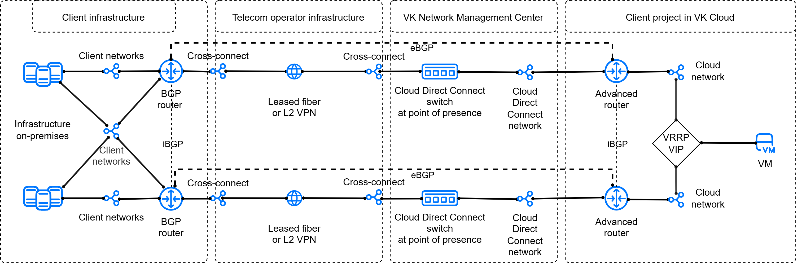
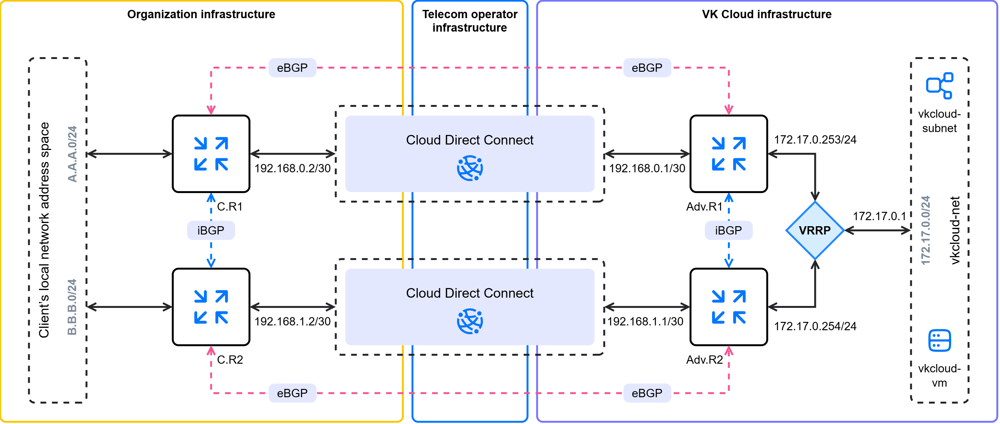

# {heading({var(cloud)} жүйесіне Cloud Direct Connect арқылы VRRP бар ақауға төзімді конфигурацияда қосылу)[id=directconnect-dc-vrrp]}

{include(/kz/_includes/_translated_by_ai.md)}

{note:info}
{var(cloud)} қашықтағы инфрақұрылымға әртүрлі {linkto(../../../vnet/concepts/onpremise-connect#vnet-onpremise-connect)[text=қосылу нұсқаларын]} баптауға мүмкіндік береді. Нұсқаны таңдау SDN жобасына, қашықтағы инфрақұрылымнан интернетке қолжетімділікке және қосылымның ақауға төзімділігіне қойылатын талаптарға байланысты.
{/note}

Cloud Direct Connect VRRP протоколына негізделген ақауға төзімді L3-қосылымды пайдаланып, {var(cloud)} виртуалды желілері мен сыртқы желілік инфрақұрылым (мысалы, сіздің жергілікті желілеріңіз) арасында қосылым ұйымдастыруға мүмкіндік береді. Ол үшін желілік шлюздің виртуалды IP-адресі (VRRP VIP) қолданылады. Белсенді маршрутизатор істен шыққан кезде VRRP VIP-ке бағытталған трафик резервтік маршрутизаторға ауыстырылады.

L2-қосылымның ақауға төзімділігі екі тәуелсіз қатысу нүктесінде байланыс арнасын физикалық түрде қосарлау арқылы қамтамасыз етіледі.

Cloud Direct Connect пен VRRP арқылы қосылым ұйымдастырылғанда мыналар қолданылады:

- Cloud Direct Connect-тің екі бөлінген байланыс арнасы;
- [BGP](https://datatracker.ietf.org/doc/html/rfc1163) протоколы бойынша динамикалық маршрутизациясы бар екі кеңейтілген маршрутизатор;
- бұлт желісінде шлюз ретінде виртуалды IP-адрес құруға арналған VRRP протоколы.

Осы конфигурациядағы кеңейтілген маршрутизаторлар интеграцияға жауап береді және қашықтағы инфрақұрылыммен байланысты қамтамасыз етеді, сондай-ақ виртуалды машиналар орналастырылатын желіге қызмет көрсетеді.

Қарастырылып отырған қосылу нұсқасы үш виртуалды желіні пайдалануды көздейді:

- желілік түйісудің (Cloud Direct Connect) екі тәуелсіз желісі;
- виртуалды машиналар орналасқан және шлюздің виртуалды IP-адресі қалыптасатын бұлт желісі.

Бұл нұсқа желілік түйісу желілерінің әрқайсысы өз кеңейтілген маршрутизаторына жеке жеткізілетінін және келесі ерекшеліктерге ие екенін білдіреді:

- қашықтағы инфрақұрылым мен бұлт арасындағы адрестік префикстер алмасуы eBGP протоколы арқылы жүзеге асырылады;
- кеңейтілген маршрутизаторлар арасындағы адрестік префикстер алмасуы iBGP протоколы арқылы жүзеге асырылады.

Осының бәрі бұлттың сыртқы инфрақұрылыммен сенімді, ақауға төзімді желілік интеграциясын қалыптастыруға мүмкіндік береді.

Желілік байланыстылықты ұйымдастыру сызбасы төмендегідей:

{params[noBorder=true]}

## {heading(Дайындық қадамдары)[id=directconnect-dc-vrrp-prep]}

1. Егер әлі жасалмаған болса, Cloud Direct Connect сервисіне {linkto(../../../../networks/directconnect/connect#directconnect-connect)[text=қосылыңыз]}.
1. Егер әлі жасалмаған болса, {linkto(../../../../tools-for-using-services/api/rest-api/enable-api#rest-api-enable-activate)[text=API арқылы қолжетімділікті белсендіріңіз]}.
1. OpenStack клиенті {linkto(../../../../tools-for-using-services/cli/openstack-cli#openstack-install)[text=орнатылғанына]} көз жеткізіңіз және жобаға {linkto(../../../../tools-for-using-services/cli/openstack-cli#openstack-authorize)[text=аутентификациядан өтіңіз]}.
1. Компьютеріңізде [curl](https://curl.se/docs) және [jq](https://jqlang.org) пакеттері орнатылғанына көз жеткізіңіз.
1. Қосылған Cloud Direct Connect желілік түйісу желілерінің UUID мәндерін біліңіз:

    1. [Жеке кабинетте](https://kz.cloud.vk.kz/app) **Виртуалды желілер** → **Желілер** бөліміне өтіңіз.
    1. Желілер тізімінен `external-vni-10XXX` түріндегі атаулары бар екі желілік түйісу желісін табыңыз. Мұнда `XXX` — қосылымыңыздың жеке реттік нөмірі.
    1. Осы желілердің UUID мәндерін сақтаңыз. Бұл мысалда желілік түйісу желілерінің UUID мәндері:
        - бірінші түйісу желісі `external-vni-10XX1` — `b2b8468e-aaaa-bbbb-cccc-327c8c2670d4`;
        - екінші түйісу желісі `external-vni-10XX2`— `a2b8967e-aaaa-bbbb-cccc-327f9a2670e5`.
1. BGP-маршрутизациясын пайдаланып бұлтқа жарияланатын жергілікті инфрақұрылымдағы ішкі желілердің адрестік префикстерін (CIDR) анықтаңыз.
1. Cloud Direct Connect сервисіне қосылған жергілікті инфрақұрылым маршрутизаторларының:

    - бұрын анықталған адрестік префикстер туралы хабардар екеніне және оларды BGP-маршрутизациясын пайдаланып бұлт жағына жариялай алатынына;
    - iBGP протоколы арқылы бір-бірімен өзара әрекеттесетініне;
    - (қосымша) BFD протоколын қолдайтынына көз жеткізіңіз: бұл ақау болған жағдайда маршрутизацияны қалпына келтіру уақытын қысқартуға мүмкіндік береді.

1. Желілер арасындағы байланысты тексеру үшін пайдаланылатын жергілікті инфрақұрылымдағы машинаның IP-адресін жазып алыңыз.

1. {var(cloud)} жүйесіндегі жобаңызда виртуалды желіні таңдаңыз немесе {linkto(../../../../networks/vnet/instructions/net#vnet-net-add)[text=жасаңыз]}. Желі маршрутизаторға қосылмауы тиіс.

    Келесі ақпаратты жазып алыңыз:

    - Ішкі желінің атауы және CIDR.
    - Әдепкі шлюз ретінде анықталған IP-адрес, мысалы `172.17.0.1`. Бұл адрес {linkto(#directconnect-dc-vrrp-set-vrrp)[text=VRRP баптауы кезінде]} пайдаланылады.
    - Ішкі желі орналасқан желінің атауы.

1. Таңдалған желіде виртуалды машинаны {linkto(../../../../computing/iaas/instructions/vm/vm-create#iaas-vm-create)[text=жасаңыз]}. Оған берілген IP-адресті жазып алыңыз.
1. Әрі қарай жұмыс істеуге қажетті барлық мәліметтер жиналғанына көз жеткізіңіз. Бұдан әрі мысал ретінде келесі деректер пайдаланылады:

   [cols="1,1,1", options="header"]
   |===
   |Нысан
   |Бұлт желісі
   |Cloud Direct Connect желісі

   |Желі
   |`vkcloud-net`
   |- `external-vni-10XX1`, `b2b8468e-aaaa-bbbb-cccc-327c8c2670d4`;
- `external-vni-10XX2`, `a2b8967e-aaaa-bbbb-cccc-327f9a2670e5`

   |Ішкі желі
   |`vkcloud-subnet`, `172.17.0.0/24`
   |

   |Виртуалды машина
   |`vkcloud-vm`, `172.17.0.8`
   |
   |===

{note:info}
Бұдан әрі мысалда желілік түйісу үшін `/30` маскасы бар ішкі желілер пайдаланылатын нұсқа қарастырылады. Сондай-ақ `/24` маскасы бар стандартты ішкі желілерді {linkto(../../../vnet/instructions/net#vnet-net-subnet-add)[text=жасай аласыз]}.
{/note}

Төменде сипатталған әрекеттер орындалғаннан кейін адрестеуді ескере отырып, желілік байланыстылықты ұйымдастырудың қорытынды сызбасы төмендегідей болуы тиіс:

{params[noBorder=true]}

Мұнда:

- `C.R1` (`ClientRouter1`) — жергілікті инфрақұрылымдағы бірінші BGP-маршрутизатор;
- `C.R2` (`ClientRouter2`) — жергілікті инфрақұрылымдағы екінші BGP-маршрутизатор;
- `A.A.A.0/24` — жергілікті желілердің адрестік кеңістігінен жарияланатын бірінші CIDR;
- `B.B.B.0/24` — жергілікті желілердің адрестік кеңістігінен жарияланатын екінші CIDR;
- `Adv.R1` (`AdvancedRouter1`) — бұлттағы бірінші кеңейтілген маршрутизатор;
- `Adv.R2` (`AdvancedRouter2`) — бұлттағы екінші кеңейтілген маршрутизатор;
- `172.17.0.0/24` — бұлттан жарияланатын CIDR.

## {heading({counter(dc-vrrp)}. Cloud Direct Connect үшін ішкі желілерді қосыңыз)[id=directconnect-dc-vrrp-add-cdc-subnets]}

1. Cloud Direct Connect желілік түйісу желісі `external-vni-10XX1` ішіне {linkto(../../../vnet/how-to-guides/custom-subnet#vnet-custom-subnet)[text=`/30` маскасы бар ішкі желіні қосыңыз]}.
Қоршаған орта айнымалыларын қосқанда параметрлерді көрсетіңіз:

    - `N_CIDR="192.168.0.0/30"`;
    - `N_ID="<UUID_СЕТЕВОГО_СТЫКА_1>"`.

    Ішкі желінің атауы мен CIDR мәнін жазып алыңыз.

    Бұл мысалда `external-vni-10XX1` желісі үшін:

    - ішкі желі атауы: `dc-subnet1`;
    - CIDR: `192.168.0.0/30`;
    - UUID: `b2b8468e-aaaa-bbbb-cccc-327c8c2670d4`.

1. Cloud Direct Connect желілік түйісу желісі `external-vni-10XX2` ішіне {linkto(../../../vnet/how-to-guides/custom-subnet#vnet-custom-subnet)[text=`/30` маскасы бар ішкі желіні қосыңыз]}.
Қоршаған орта айнымалыларын қосқанда параметрлерді көрсетіңіз:

    - `N_CIDR="192.168.1.0/30"`;
    - `N_ID="<UUID_СЕТЕВОГО_СТЫКА_2>"`.

    Ішкі желінің атауы мен CIDR мәнін жазып алыңыз.

    Бұл мысалда `external-vni-10XX2` желісі үшін:

    - ішкі желі атауы: `dc-subnet2`;
    - CIDR: `192.168.1.0/30`;
    - UUID: `a2b8967e-aaaa-bbbb-cccc-327f9a2670e5`.

## {heading({counter(dc-vrrp)}. Кеңейтілген маршрутизаторларды қосыңыз)[id=directconnect-dc-vrrp-add-routers]}

1. Келесі параметрлермен бірінші кеңейтілген маршрутизаторды {linkto(../../../vnet/instructions/advanced-router/manage-advanced-routers#vnet-manage-advanced-routers-add)[text=жасаңыз]}:

    - **Атауы**: бұл мысалда `AdvancedRouter1`;
    - **SNAT**: опция өшірулі.
1. Келесі параметрлермен екінші кеңейтілген маршрутизаторды {linkto(../../../vnet/instructions/advanced-router/manage-advanced-routers#vnet-manage-advanced-routers-add)[text=жасаңыз]}:

    - **Атауы**: бұл мысалда `AdvancedRouter2`;
    - **SNAT**: опция өшірулі.

## {heading({counter(dc-vrrp)}. Кеңейтілген маршрутизаторлардың желілік интерфейстерін баптаңыз)[id=directconnect-dc-vrrp-set-advanced-routers]}

1. Бұлт желісіне бағытталған бірінші кеңейтілген маршрутизатордың интерфейсін {linkto(../../../vnet/instructions/advanced-router/manage-interfaces#vnet-manage-interfaces-add)[text=қосыңыз]}:

    - **Атауы**: `vkcloud-net-iface1`;
    - **Ішкі желі**: `vkcloud-subnet`;
    - **Интерфейс IP-адресі**: `172.17.0.253`.
1. Cloud Direct Connect `external-vni-10XX1` желісіне бағытталған бірінші кеңейтілген маршрутизатордың интерфейсін {linkto(../../../vnet/instructions/advanced-router/manage-interfaces#vnet-manage-interfaces-add)[text=қосыңыз]}:

    - **Атауы**: `dc-iface1`;
    - **Ішкі желі**: `dc-subnet1`;
    - **Интерфейс IP-адресі**: `192.168.0.1`.
1. Бұлт желісіне бағытталған екінші кеңейтілген маршрутизатордың интерфейсін {linkto(../../../vnet/instructions/advanced-router/manage-interfaces#vnet-manage-interfaces-add)[text=қосыңыз]}:

    - **Атауы**: `vkcloud-net-iface2`;
    - **Ішкі желі**: `vkcloud-subnet`;
    - **Интерфейс IP-адресі**: `172.17.0.254`.

1. Cloud Direct Connect `external-vni-10XX2` желісіне бағытталған екінші кеңейтілген маршрутизатордың интерфейсін {linkto(../../../vnet/instructions/advanced-router/manage-interfaces#vnet-manage-interfaces-add)[text=қосыңыз]}:

    - **Атауы**: `dc-iface2`;
    - **Ішкі желі**: `dc-subnet2`;
    - **Интерфейс IP-адресі**: `192.168.1.1`.

## {heading({counter(dc-vrrp)}. Жергілікті желідегі BGP-маршрутизаторлардың желілік интерфейстерін баптаңыз)[id=directconnect-dc-vrrp-set-client-routers]}

1. Cloud Direct Connect сервисіне қосылған жергілікті инфрақұрылым маршрутизаторларының (`ClientRouter1`, `ClientRouter2`) интерфейстері белсенді екеніне көз жеткізіңіз.
1. Cloud Direct Connect желілерінің CIDR ішіндегі бос IP-адрестерді пайдаланып, маршрутизаторларда статикалық IP-адрестеуді баптаңыз.

   Бұл мысалда:

    - `192.168.0.2` — `external-vni-10XX1` түйісу желісінің `dc-subnet1` ішкі желісіндегі бірінші маршрутизатордың интерфейсі;
    - `192.168.1.2` — `external-vni-10XX2` түйісу желісінің `dc-subnet2` ішкі желісіндегі екінші маршрутизатордың интерфейсі;

1. (Қосымша) Егер маршрутизатор BFD қолдаса, BFD протоколын баптаңыз.

   {note:info}
   {var(cloud)} виртуалды маршрутизаторлары BFD протоколымен жұмысты қолдайды, оны жергілікті инфрақұрылымдағы маршрутизаторларда конвергенцияны жеделдету үшін пайдалануға болады.
   {/note}

## {heading({counter(dc-vrrp)}. Бірінші түйісу желісі арқылы бірінші кеңейтілген маршрутизатор үшін eBGP көршілігін баптаңыз)[id=directconnect-dc-vrrp-set-first-bgp]}

BGP протоколы бойынша байланысты баптау үшін динамикалық маршруттарды қосып, BGP көршілерін көрсету қажет. Динамикалық маршрутизацияны баптау үшін `64512`–`65534` диапазонындағы автономды жүйелердің (ASN) жеке нөмірлерін пайдаланыңыз. {var(cloud)} жүйесіндегі маршрутизаторлардағы және қашықтағы инфрақұрылым жағындағы ASN нөмірлері әртүрлі болуы тиіс. Мысалда келесі нөмірлер пайдаланылады:

- жергілікті инфрақұрылым желісі үшін `65512`;
- `vkcloud-net` бұлт желісі үшін `64512`.

`external-vni-10XX1` түйісу желісі арқылы кеңейтілген маршрутизаторда динамикалық маршруттарды баптау үшін:

1. [Жеке кабинетте](https://kz.cloud.vk.kz/app/) **Виртуалды желілер** → **Маршрутизаторлар** бөліміне өтіңіз.
1. `AdvancedRouter1` кеңейтілген маршрутизаторын ашып, **Динамикалық маршрутизация** қойындысына өтіңіз.
1. **BGP маршрутизаторын жасау** батырмасын басыңыз.
1. BGP-маршрутизатор параметрлерін көрсетіңіз:

    - **Атауы**: `to-ClientRouter1`;
    - **Router ID**: `192.168.0.1`;
    - **ASN**: `64512`.

1. **Жасау** батырмасын басыңыз.
1. Қосылған BGP-маршрутизаторын ашып, **BGP көршілері** қойындысына өтіңіз.
1. BGP көршісін қосыңыз. Параметрлерді көрсетіңіз:

    - **Атауы**: `ClientRouter1`;
    - **Remote neighbor**: `192.168.0.2`;
    - **Remote ASN**: `65512`.

1. **Жасау** батырмасын басыңыз.
1. Маршрутизатордың көршімен байланыс орнатқанын тексеріңіз: атаудың жанындағы маркер жасыл. Егер BFD қолдансаңыз, BFD маркері де жасыл жанып тұрғанына көз жеткізіңіз.

    Кеңейтілген маршрутизатор BGP көршілігі сәтті келісілгеннен кейін бірден өз көршісіне BGP-анонстарды жібере бастайды. **BGP анонстары** қойындысына өтіп, маршрутизатор интерфейстері бағытталған барлық желілердің анонстарын жіберіп тұрғанына көз жеткізіңіз:

    - `172.17.0.0/24`;
    - `192.168.0.0/30`.

    Барлық анонстарда жасыл маркерлер болуы тиіс.

## {heading({counter(dc-vrrp)}. Екінші түйісу желісі арқылы екінші кеңейтілген маршрутизатор үшін eBGP көршілігін баптаңыз)[id=directconnect-dc-vrrp-set-second-bgp]}

BGP протоколы бойынша байланысты баптау үшін динамикалық маршруттарды қосып, BGP көршілерін көрсету қажет. Динамикалық маршрутизацияны баптау үшін `64512`–`65534` диапазонындағы автономды жүйелердің (ASN) жеке нөмірлерін пайдаланыңыз. {var(cloud)} жүйесіндегі маршрутизаторлардағы және қашықтағы инфрақұрылым жағындағы ASN нөмірлері әртүрлі болуы тиіс. Мысалда келесі нөмірлер пайдаланылады:

- жергілікті желі үшін `65512`;
- `vkcloud-net` бұлт желісі үшін `64512`.

`external-vni-10XX2` түйісу желісі арқылы кеңейтілген маршрутизаторда динамикалық маршруттарды баптау үшін:

1. [Жеке кабинетте](https://kz.cloud.vk.kz/app/) **Виртуалды желілер** → **Маршрутизаторлар** бөліміне өтіңіз.
1. `AdvancedRouter2` кеңейтілген маршрутизаторын ашып, **Динамикалық маршрутизация** қойындысына өтіңіз.
1. **BGP маршрутизаторын жасау** батырмасын басыңыз.
1. BGP-маршрутизатор параметрлерін көрсетіңіз:

    - **Атауы**: `to-ClientRouter2`;
    - **Router ID**: `192.168.1.1`;
    - **ASN**: `64512`.

1. **Жасау** батырмасын басыңыз.
1. Қосылған BGP-маршрутизаторын ашып, **BGP көршілері** қойындысына өтіңіз.
1. BGP көршісін қосыңыз. Параметрлерді көрсетіңіз:

    - **Атауы**: `ClientRouter2`;
    - **Remote neighbor**: `192.168.1.2`;
    - **Remote ASN**: `65512`.

1. **Жасау** батырмасын басыңыз.
1. Маршрутизатордың көршімен байланыс орнатқанын тексеріңіз: атаудың жанындағы маркер жасыл. Егер BFD қолдансаңыз, BFD маркері де жасыл жанып тұрғанына көз жеткізіңіз.

    Кеңейтілген маршрутизатор BGP көршілігі сәтті келісілгеннен кейін бірден өз көршісіне BGP-анонстарды жібере бастайды. **BGP анонстары** қойындысына өтіп, маршрутизатор интерфейстері бағытталған барлық желілердің анонстарын жіберіп тұрғанына көз жеткізіңіз:

    - `172.17.0.0/24`;
    - `192.168.1.0/30`.

    Барлық анонстарда жасыл маркерлер болуы тиіс.

## {heading({counter(dc-vrrp)}. Бірінші түйісу желісі арқылы жергілікті желідегі бірінші маршрутизатор үшін BGP көршілігін баптаңыз)[id=directconnect-dc-vrrp-set-third-bgp]}

1. Жергілікті желіңіздегі маршрутизаторға қосылыңыз.
1. `external-vni-10XX1` желісі арқылы BGP протоколы бойынша қосылу параметрлерін көрсетіңіз:

    - Жергілікті желінің ASN: `65512`.
    - (Қосымша) Маршрутизатор ID: `192.168.0.2`.

       {note:warn}
       ID тек бір рет тағайындалады.
       {/note}
    - Сыртқы желінің ASN: `64512`.
    - BGP көршісінің ID: `192.168.0.1`.
    - BFD пайдалану — егер оны бұрын бұлт желісінің кеңейтілген маршрутизаторлары үшін қосқан болсаңыз, опцияны қосыңыз. BFD протоколы қолданылған жағдайда BFD байланысы орнатылғанына көз жеткізіңіз.
1. BGP көршісімен байланыс орнатылғанын тексеріңіз. Егер BGP қосылымы орнатылса, жауапта нөлден өзгеше `keepalive-time` және `uptime` мәндері келуі тиіс.
1. Қолжетімді барлық BGP маршруттарын қараңыз. Маршруттар тізімінде `172.17.0.0/24` және `192.168.0.0/30` желілері көрсетілуі тиіс.

## {heading({counter(dc-vrrp)}. Екінші түйісу желісі арқылы жергілікті желідегі екінші маршрутизатор үшін BGP көршілігін баптаңыз)[id=directconnect-dc-vrrp-set-fourth-bgp]}

1. Жергілікті желіңіздегі маршрутизаторға қосылыңыз.
1. `external-vni-10XX2` желісі арқылы BGP протоколы бойынша қосылу параметрлерін көрсетіңіз:

    - Жергілікті желінің ASN: `65512`.
    - (Қосымша) Маршрутизатор ID: `192.168.1.2`.

       {note:warn}
       ID тек бір рет тағайындалады.
       {/note}
    - Сыртқы желінің ASN: `64512`.
    - BGP көршісінің ID: `192.168.1.1`.
    - BFD пайдалану — егер оны бұрын бұлт желісінің кеңейтілген маршрутизаторлары үшін қосқан болсаңыз, опцияны қосыңыз. BFD протоколы қолданылған жағдайда BFD байланысы орнатылғанына көз жеткізіңіз.
1. BGP көршісімен байланыс орнатылғанын тексеріңіз. Егер BGP қосылымы орнатылса, жауапта нөлден өзгеше `keepalive-time` және `uptime` мәндері келуі тиіс.
1. Қолжетімді барлық BGP маршруттарын қараңыз. Маршруттар тізімінде `172.17.0.0/24` және `192.168.0.0/30` желілері көрсетілуі тиіс.

## {heading({counter(dc-vrrp)}. Кеңейтілген маршрутизаторлар арасында iBGP көршілігін баптаңыз)[id=directconnect-dc-vrrp-set-bgp-advanced-routers]}

1. [Жеке кабинетте](https://kz.cloud.vk.kz/app/) **Виртуалды желілер** → **Маршрутизаторлар** бөліміне өтіңіз.
1. Бірінші кеңейтілген маршрутизатор үшін BGP көршілігін баптаңыз:

    1. `AdvancedRouter1` кеңейтілген маршрутизаторын ашып, **Динамикалық маршрутизация** қойындысына өтіңіз.
    1. {linkto(#directconnect-dc-vrrp-set-first-bgp)[text=Бұрын қосылған]} BGP-маршрутизаторын ашып, **BGP көршілері** қойындысына өтіңіз.
    1. Параметрлерді көрсетіңіз:
        - **Атауы**: BGP көршісін оңай сәйкестендіруге мүмкіндік беретін логикалық атау, бұл мысалда `to-AdvancedRouter2`;
        - **Remote neighbor**: {var(cloud)} жүйесіндегі BGP көршісінің IP-адресі, бұл мысалда `172.17.0.254`;
        - **Remote ASN**: {var(cloud)} жүйесіндегі маршрутизаторда пайдаланылған қашықтағы ASN нөмірі, бұл мысалда `64512`.
    1. **Жасау** батырмасын басыңыз.
1.	Екінші кеңейтілген маршрутизатор үшін BGP көршілігін баптаңыз:

    1. `AdvancedRouter2` кеңейтілген маршрутизаторын ашып, **Динамикалық маршрутизация** қойындысына өтіңіз.
    1. {linkto(#directconnect-dc-vrrp-set-second-bgp)[text=Бұрын қосылған]} BGP-маршрутизаторын ашып, **BGP көршілері** қойындысына өтіңіз.
    1. Параметрлерді көрсетіңіз:
        - **Атауы**: BGP көршісін оңай сәйкестендіруге мүмкіндік беретін логикалық атау, бұл мысалда `to-AdvancedRouter1`;
        - **Remote neighbor**: {var(cloud)} жүйесіндегі BGP көршісінің IP-адресі, бұл мысалда `172.17.0.253`;
        - **Remote ASN**: {var(cloud)} жүйесіндегі маршрутизаторда пайдаланылған қашықтағы ASN нөмірі, бұл мысалда `64512`.
    1. **Жасау** батырмасын басыңыз.

## {heading({counter(dc-vrrp)}. VRRP-адресті баптаңыз)[id=directconnect-dc-vrrp-set-vrrp]}

1.	[Жеке кабинетте](https://kz.cloud.vk.kz/app/) **Виртуалды желілер** → **Маршрутизаторлар** бөліміне өтіңіз.
1.	**VRRP** қойындысына өтіп, **VRRP тобын қосу** батырмасын басыңыз.
1.	VRRP тобының атауын көрсетіңіз. Бұл мысалда: `vrrp-group`.
1.	Виртуалды IP-адрес жасалатын ішкі желіні көрсетіңіз.
1.	(Қосымша) Ұсынылған **Advertise timer** параметрін өзгертіңіз — мастер VRRP хабарландыру пакеттерін жіберетін интервал.
1. (Қосымша) VRRP тобына сипаттама қосыңыз.
1.	(Қосымша) Ұсынылған **Топ нөмірі** параметрін өзгертіңіз.
1.	Ауыстырып-қосқыш арқылы VRRP тобын қосыңыз.
1.	**Қосу** батырмасын басыңыз.
1.	Тізімдегі жасалған VRRP тобының атауын басып, **Интерфейстер** қойындысына өтіңіз.
1. Бірінші маршрутизатор үшін интерфейс қосыңыз:

    1. **Интерфейс қосу** батырмасын басыңыз.
    1. Топтағы бірінші маршрутизаторға тиесілі интерфейстің атауын көрсетіңіз.
    1. Қажетті күйді көрсетіңіз: `Master` немесе `Slave`.
    1. (Қосымша) 0-ден 255-ке дейінгі диапазонда приоритет мәнін өзгертіңіз.
    1. (Қосымша) **Preempt** опциясын өзгертіңіз. Опция қосулы болғанда ең жоғары приоритеті бар маршрутизатор әрқашан жетекші болады.
    1. Тізімнен бірінші маршрутизаторға тиесілі интерфейс адресін таңдаңыз.
    1. **Қосу** батырмасын басыңыз.
1.	Екінші маршрутизатор үшін интерфейсті дәл осылай қосыңыз.
1.	**IP-адрестер** қойындысына өтіп, **Виртуалды IP қосу** батырмасын басыңыз.
1.	(Қосымша) Виртуалды IP-адрестің атауын көрсетіңіз.
1. VRRP тобының виртуалды IP-адресі ретінде пайдаланылатын IP-адресті көрсетіңіз. Ішкі желіні жасаған кезде әдепкі шлюз ретінде анықталған IP-адресті пайдаланыңыз. Бұл мысалда `172.17.0.1`.

## {heading({counter(dc-vrrp)}. Жұмысқа қабілеттілігін тексеріңіз)[id=directconnect-dc-vrrp-check]}

Бір желіден қосылған желідегі машинаға дейін `ping` немесе `traceroute` жіберіңіз. Егер басқа желіден жауап келсе, онда желілердің байланыстылығын баптау дұрыс орындалған.

Мысалы, виртуалды желідегі `172.17.0.8` машинасынан жергілікті желідегі `10.0.0.5` машинасына пинг орындаңыз:

1. `vkcloud-vm` ВМ үшін терминал сессиясын ашыңыз.
1. Жергілікті желідегі машинаның ішкі IP-адресіне пинг орындаңыз:

      ```console
      ping 10.0.0.5
      ```

IP-адрес пингке жауап беруі тиіс.

## {heading(Пайдаланылмайтын ресурстарды жойыңыз)[id=directconnect-dc-vrrp-delete]}

Егер жасалған ресурстар енді қажет болмаса, оларды жойыңыз:

1. Виртуалды машинаны {linkto(../../../../computing/iaas/instructions/vm/vm-manage#iaas-vm-manage-delete)[text=жойыңыз]}.
1. Маршрутизаторларды {linkto(../../../../networks/vnet/instructions/router#vnet-router-delete)[text=жойыңыз]}.
1. {linkto(../../../../networks/vnet/instructions/net#vnet-net-subnet-delete)[text=ішкі желілерді]} және {linkto(../../../../networks/vnet/instructions/net#vnet-net-delete)[text=желілерді]} жойыңыз: транзиттік және виртуалды машиналарды орналастыруға арналған.
