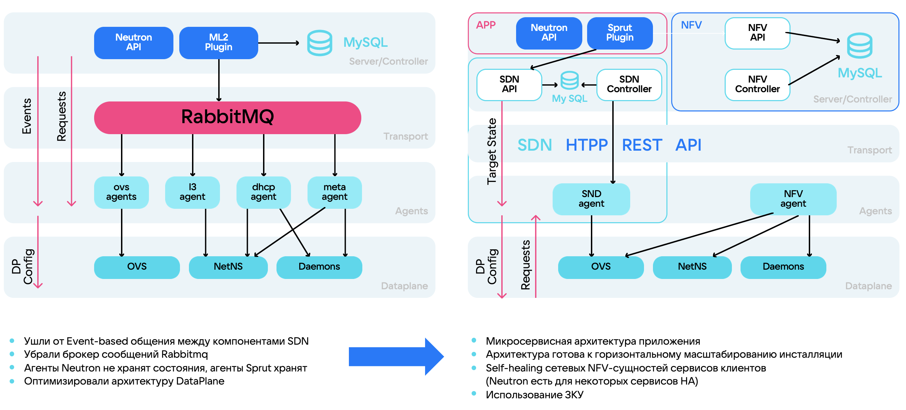

# {heading(Қолданылатын SDN)[id=vnet-sdn]}

{include(/kz/_includes/_translated_by_ai.md)}

## {heading(SDN дегеніміз не)[id=vnet-sdn-concept]}

SDN (Software Defined Network, [бағдарламалық түрде анықталатын желі](https://ru.wikipedia.org/wiki/Программно-определяемая_сеть)) — бұл басқару деңгейі деректерді жіберу деңгейінен бөлінетін желіні басқару тәсілі.

Егер дәстүрлі желілерде барлық құрылғылар (коммутаторлар, маршрутизаторлар) деректерді жіберу кезінде өздерінің бағыттау кестелерін пайдаланса, SDN ішінде бүкіл желіні орталықтандырылған контроллер басқарады.

Мұндай тәсілдің келесі артықшылықтары бар:

- Желілік күй мен инфрақұрылымды басқару, масштабтау және істен шығуға төзімді инфрақұрылымдар құру оңайырақ.
- Желіні өзгеріп отыратын қажеттіліктерге оңай бейімдеуге, соның ішінде желіні баптауды автоматтандыруға және икемдеуге болады.
- Трафикті өңдеуді икемдірек баптау.
- Желілік элементтерді түгендеуді жеңілдету. Мысалы, істен шыққан кезде объектілерді жоюды автоматтандыруға немесе желілік күйді қайта теңгеруді баптауға болады.
- Жеткізушіге тәуелсіз желіні басқару шешімдерін пайдалану.

SDN — overlay-желілерді (физикалық желінің үстіндегі виртуалды желі) басқару құралы және бұлттық инфрақұрылымның негізі. SDN бағыттауды, трафикті шектеу ережелерін басқаруды және сервистер арасындағы желілік байланыстылықты қамтамасыз етеді. {var(cloud)} өзінің SDN-шешімін — {linkto(#vnet-sdn-sprut)[text=Sprut]} пайдаланады.

SDN пайдалану конфигурацияны жылдам өзгертуге және инфрақұрылым ішіндегі ресурстарды көшіруге мүмкіндік береді, бұл 1000 және одан да көп сервері бар таратылған инфрақұрылымды ұйымдастырудың міндетті шарты болып табылады.

SDN пайдалану сценарийлері:

- Жоба ішіндегі желілік байланыстылықты ұйымдастыру.
- Виртуалды маршрутизаторларды, желілер мен ішкі желілерді пайдалану.
- Интернетке қолжетімділікті және жобаға сыртқы желілерден қосылуды ұйымдастыру.
- Жобадағы IP-адрестерді басқару.
- Бағыттау ережелерін баптау.

{params[noBorder=true]}

Бұлт архитектурасындағы барлық сервистер мен өнімдер SDN-пен байланысты, сондықтан {var(cloud)} үшін сенімді, икемді және істен шығуға төзімді SDN-шешімі болуы маңызды.

## {heading(Sprut)[id=vnet-sdn-sprut]}

_Sprut_ — {var(cloud)} әзірлеген, {linkto(#vnet-sdn-neutron)[text=SDN Neutron]} ауыстыру үшін жасалған және OpenStack Neutron API-мен толық үйлесімді жеке әзірлеме. Барлық жаңа жобалар SDN Sprut пайдаланады, ал ескі жобалар үшін [миграцияны](../../../../cases/sprut-migration) орындау ұсынылады, өйткені SDN Neutron пайдаланудан шығарылып жатыр.

SDN Sprut осы желілердің үстіндегі желілер мен желілік функциялардың ірі ауқымда тұрақты жұмысын қамтамасыз етеді.

SDN Sprut архитектурасының ерекшеліктері:

- Хабарламалар кезегінің орнына HTTP REST API пайдаланылады, бұл компоненттер арасындағы синхронды байланысты қамтамасыз етеді.
- Барлық агенттер өздерінің ағымдағы күйін сақтайды. Агенттер SDN-контроллерден болуы тиіс мақсатты күйді алады және өз күйін талап етілетін күйге келтіреді.
- Микросервистік архитектура іске асырылған. Әрбір сервис өз функционалдығына жауап береді және басқаларынан тәуелсіз жайылтыла алады.
- Көпдеңгейлі архитектура деректерді жіберу деңгейін (dataplane) оңтайландыруға мүмкіндік берді.
- Тұйық басқару контуры жүйеге бұлттық платформаның сенімді жұмысы үшін автоматты түрде бейімделуге мүмкіндік береді.

Сызбада SDN Neutron және SDN Sprut архитектураларының салыстырмасы көрсетілген.

{params[noBorder=true]}

{note:info}
Жобаңызға SDN Sprut қосуды қаласаңыз, [техникалық қолдауға хабарласыңыз](/kz/contacts).

Егер бұлттық ресурстарыңызды SDN Sprut-қа көшіргіңіз келсе, [миграция жөніндегі құжаттаманы](../../../../cases/sprut-migration) пайдаланыңыз.
{/note}

SDN Sprut туралы қосымша материалдар:

- [Жоғары жүктемелер үшін SDN қалай таңдауға болады](https://www.youtube.com/watch?v=iqSXRZ8b_bk) баяндамасы;
- Хабрдағы мақалалар:
   - [VK Cloud ішінде SDN-дерді қалай жаздық](https://habr.com/kz/companies/vk/articles/763760/);
   - [Бұлттық желілер қалай құрылған және олардың On-premise-тен айырмашылығы неде](https://habr.com/kz/company/vk/blog/656797/).

## {heading(Neutron)[id=vnet-sdn-neutron]}

_Neutron_ — OpenStack платформасының бөлігі болып табылатын және оның басқа компоненттерімен (ВМ, сақтау, сәйкестендіру) интеграцияланған SDN. {var(cloud)} ішінде SDN Neutron пайдаланудан шығарылып жатыр және жаңа жобалар үшін қосылмайды. Сондай-ақ SDN Neutron {linkto(../../../../start/concepts/architecture#architecture-az)[text=қолжетімділік аймағында]} қолданылмайды.

SDN Neutron архитектурасының ерекшеліктері:

- SDN компоненттері арасындағы өзара әрекеттесу асинхронды түрде жүреді және оқиғаларға негізделген.
- Оқиғалар RabbitMQ арқылы өңделеді.
- Желіні автоматтандыру және басқару Neutron API арқылы жүзеге асырылады.
- Әртүрлі желілік сервистерді іске асыруға және әртүрлі технологияларды қолдауға жауап беретін плагиндерді пайдаланады ([VLAN](https://ru.wikipedia.org/wiki/VLAN), [VXLAN](https://ru.wikipedia.org/wiki/Virtual_Extensible_LAN), [GRE](https://ru.wikipedia.org/wiki/GRE_(%D0%BF%D1%80%D0%BE%D1%82%D0%BE%D0%BA%D0%BE%D0%BB)), [geneve](https://www.protokols.ru/WP/wp-content/uploads/2020/11/rfc8926.pdf), [Flat](https://opg.optica.org/jocn/abstract.cfm?uri=jocn-9-3-b90)).
- Желілік объектілер мен конфигурация туралы ақпарат дерекқорда сақталады.
- Деректерді жіберу үшін әртүрлі агенттерді пайдаланады.

Әдепкі бойынша SDN Neutron ішінде келесі желілік сервистер қолжетімді:

- виртуалды маршрутизаторлар;
- жүктеме теңгергіштері;
- VPN;
- DNS;
- қауіпсіздік топтары.

Сызбада SDN Neutron архитектурасы мен жұмыс схемасы берілген.

{params[noBorder=true]}

Ұзақ уақыт бойы {var(cloud)} ішінде тек SDN Neutron пайдаланылды, бұл келесі мәселелер мен шектеулерді тудырды:

- Neutron архитектурасын масштабтау қиын және ол бұлт инфрақұрылымын тиімді ұлғайтуға мүмкіндік бермейді.
- Деректерді жіберу деңгейінің (dataplane) шамадан тыс күрделілігі салдарынан оқиғалар саны өседі.
- Оқиғалардың көп болуына байланысты олар RabbitMQ кезегінде жоғалады.
- Жаңа функционалдылықты қосу қиын немесе мүмкін емес.
- Көптеген агенттер өз күйін сақтамайды және нашар синхрондалады.
- SDN Neutron желіні ауқымды қайта құрулармен (full-sync) нашар жұмыс істейді.

SDN Neutron масштабталуы мен сенімділігіне қатысты мәселелерді шешу SDN Sprut атты жеке {linkto(#vnet-sdn-sprut)[text=SDN-шешімді]} әзірлеу болды.
