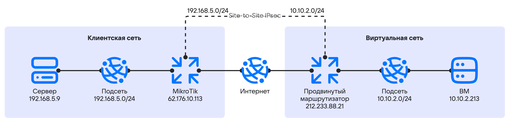

# {heading(SDN Sprut пайдаланып VPN-туннелін ұйымдастыру)[id=vnet-site-to-site-vpn]}

{include(/kz/_includes/_translated_by_ai.md)}

{linkto(../../../../../networks/vnet/how-to-guides/onpremise-connect/advanced-router#vnet-advanced-router)[text=Продвинутый маршрутизатордың]} көмегімен жергілікті инфрақұрылымыңыздың желісі мен {var(cloud)} виртуалды желілері арасында VPN-туннелін баптай аласыз.

Продвинутый маршрутизаторды баптауды көрсету үшін екі тәуелсіз желі байланыстырылады:

* Клиенттік желі — тапсырыс берушінің ішкі желісі.
* Виртуалды желі — {var(cloud)} ішінде орналасқан және платформалық маршрутизаторға қосылған.

{var(cloud)} жеке кабинетінде қосылымды баптауды көрсету үшін мыналар жасалады:

* `vRouter01` продвинутый маршрутизаторы;
* `212.233.88.21` мекенжайы бар интернетке қол жеткізуге арналған маршрутизатор интерфейсі;
* `priv_net_demo` жеке желісі;
* `10.10.2.0/24` мекенжайы бар `priv_subnet_demo` жеке ішкіжелісі;
* `10.10.2.213` мекенжайы бар `test-vm` ВМ;
* `permit-remote-cidr-in` қауіпсіздік тобы.

Клиенттік желіде мыналар пайдаланылады:

* RouterOS 7.19.3 операциялық жүйесі бар MikroTik маршрутизаторы;
* Debian 12 ОС бар сервер;
* IPsec баптау үшін IKEv2;
* IKE фазасын келісу үшін ортақ пайдалану кілті (PSK).

Желі топологиясы келесі түрде көрінеді:

{params[noBorder=true]}

## {heading(Дайындық әрекеттері)[id=vnet-site-to-site-vpn-prep]}

1. OpenStack клиенті {linkto(../../../../../tools-for-using-services/cli/openstack-cli#openstack-install)[text=орнатылғанына]} көз жеткізіңіз және жобаға {linkto(../../../../../tools-for-using-services/cli/openstack-cli#openstack-authorize)[text=аутентификациядан өтіңіз]}.
1. {var(cloud)} жеке кабинетіне [өтіңіз](https://cloud.vk.com/app/).
1. Жобаны таңдаңыз.
1. Келесі параметрлері бар желіні {linkto(../../../../../networks/vnet/instructions/net#vnet-net-add)[text=жасаңыз]}:

    - **Желі атауы**: `priv_net_demo`.
    - **SDN**: `Sprut`.
    - **Жеке DNS аймағы**: `mcs.local`.
    - **Маршрутизатор**: `Қолданбау`.
    - **Ішкіжелілер тізімі**: тізімдегі жалғыз ішкіжеліні өңдеңіз. Ішкіжелі үшін келесі параметрлерді орнатыңыз:

        - **Атауы**: `priv_subnet_demo`.
        - **Мекенжайы**: `10.10.2.0/24`.
        - **Шлюз**: `10.10.2.1`.
        - **DHCP қосу**: бұл опция таңдалғанына көз жеткізіңіз.
        - **DHCP IP-мекенжайлар пулы**: `10.10.2.100 - 10.10.2.200`.
        - **Жеке DNS**: бұл опция таңдалғанына көз жеткізіңіз.

1. Келесі параметрлері бар продвинутый маршрутизаторды {linkto(../../../../../networks/vnet/instructions/advanced-router/manage-advanced-routers#vnet-manage-advanced-routers-add)[text=жасаңыз]}:

    - **Маршрутизатор түрі**: `Продвинутый`.
    - **Атауы**: `vRouter01`.
    - **Қолжетімділік аймағы**: `Москва ME1`.
    - **SNAT**: опцияны қосыңыз.

1. Жасалған маршрутизаторға екі интерфейсті {linkto(../../../../../networks/vnet/instructions/advanced-router/manage-interfaces#vnet-manage-interfaces-add)[text=қосыңыз]}:

    - жеке ішкіжеліге қосылу үшін;
    - интернетке қолжетімділігі бар ішкіжеліге қосылу үшін.

    Жеке ішкіжеліге қосылуға арналған интерфейсті жасау кезінде келесі параметрлерді орнатыңыз:

    - **Атауы**: `internal`.
    - **Ішкіжелі**: `priv_subnet_demo`.
    - **Интерфейстің IP-мекенжайын көрсету**: опцияны қосыңыз.
    - **Интерфейстің IP-мекенжайы**: `10.10.2.1`.

1. Келесі параметрлері бар виртуалды машинаны {linkto(../../../../../computing/iaas/instructions/vm/vm-create#iaas-vm-create-step)[text=жасаңыз]}:

    - **Виртуалды машинаның атауы**: `test-vm`.
    - **Желі**: `priv_net_demo`.

    Виртуалды машинаның ішкі IP-мекенжайын жазып алыңыз. Мысалда `10.10.2.213` пайдаланылады.

1. `permit-remote-cidr-in` қауіпсіздік тобын {linkto(../../../../../networks/vnet/instructions/secgroups#vnet-secgroups-add)[text=жасаңыз]}.

1. `permit-remote-cidr-in` қауіпсіздік тобында келесі параметрлері бар кіріс трафигі үшін ережені {linkto(../../../../../networks/vnet/instructions/secgroups#vnet-secgroups-add-rule)[text=қосыңыз]}:

   - **Түрі**: `Барлық протоколдар және барлық порттар`.
   - **Қашықтағы мекенжай** блогында **IP мекенжайлар ауқымы** қойындысына өтіп, жеке ішкіжелі CIDR мәнін көрсетіңіз: `192.168.5.0/24`.

1. `permit-remote-cidr-in` қауіпсіздік тобын `test-vm` ВМ-ге {linkto(../../../../../networks/vnet/instructions/secgroups#vnet-secgroups-instance-add-sg)[text=қолданыңыз]}.

## {heading(1. VPN-туннелін бұлттық желі жағында баптаңыз)[id=vnet-site-to-site-vpn-cloud-network-tunnel]}

1. **Виртуальные сети** → **VPN** бөліміне өтіңіз.
1. **Добавить VPN** немесе **Добавить** түймесін басыңыз.
1. VPN параметрлерін көрсетіңіз:

   - **SDN**: `Sprut`.
   - **IKE-саясаты**: келесі параметрлері бар IKE саясатын жасаңыз:

       - **Саясат атауы**: `Demo_IKEv2_Policy`.
       - **Кілттің өмір сүру уақыты**: `28800`.
       - **Авторизация алгоритмі**: `sha256`.
       - **Шифрлау алгоритмі**: `aes-256`.
       - **IKE нұсқасы**: `v2`.
       - **Диффи — Хеллман тобы**: `group14`.

1. **Следующий шаг** түймесін басыңыз.

1. IPsec саясатын баптаңыз:

    - **Саясат атауы**: `Demo_IPSec_Policy`.
    - **Кілттің өмір сүру уақыты**: `7200`.
    - **Авторизация алгоритмі**: `sha256`.
    - **Шифрлау алгоритмі**: `aes-256`.
    - **Диффи — Хеллман тобы**: `group14`.

1. Endpoint топтарын баптаңыз:

    - **Маршрутизатор**: `vRouter01`.
    - **Local Endpoint**: келесі параметрлері бар жергілікті endpoint тобын жасаңыз:

        - **Атауы**: `my_local_demo_endpoint`.
        - **Ішкіжелі мекенжайы**: `10.10.2.0/24`.

    - **Remote Endpoint**: келесі параметрлері бар қашықтағы (remote) endpoint тобын жасаңыз:

        - **Топ атауы**: `my_remote_demo_endpoint`.
        - **Ішкіжелі мекенжайы**: `192.168.5.0/24`.

1. **Следующий шаг** түймесін басыңыз.

1. VPN-туннелін баптаңыз:

    - **Баптаулар**: `Расширенные`.
    - **Туннель атауы**: `demo_tun`.
    - **Пирдің жария IPv4 мекенжайы (Peer IP)**: `62.176.10.113`.
    - **Ортақ пайдалану кілті (PSK)**: тиісті түймені басып кілтті жасаңыз. Кілт мәнін клиенттік желі жағында баптау үшін жазып алыңыз.
    - **Аутентификацияға арналған пир маршрутизаторының идентификаторы (Peer ID)**: `62.176.10.113`.
    - **Трафик ағындарының селекторы**: `Разделить`.
    - **Инициатор күйі**: `bi-directional`
    - Қашықтағы пирдің қолжетімсіздігін анықтау баптаулары (Dead Peer Detection, DPD):

        - **Пирдің қолжетімсіздігі анықталғанда**: `restart`.
        - **Пирдің қолжетімсіздігін анықтау аралығы**: `15`.
        - **Пирдің қолжетімсіздігін анықтау уақыты**: `60`.

1. **Создать VPN-туннель** түймесін басыңыз.

## {heading(2. VPN-туннелін клиенттік желі жағында баптаңыз)[id=vnet-site-to-site-vpn-client-network-tunnel]}

MikroTik жабдығын WinBox 4 немесе CLI арқылы баптаңыз.

1. IPSec Profile дайындаңыз:

   {tabs}

   {tab(WinBox)}

   1. **IP** → **IPsec** бөліміне өтіңіз.
   1. **Profile** қойындысына өтіңіз.
   1. **New** түймесін басыңыз.
   1. Параметр мәндерін көрсетіңіз:

      - **Name**: `vk-dc-prof`.
      - **Hash Algorithms**: `sha256`.
      - **PRF Algorithms**: `auto`.
      - **Encryption Algorithms**: `aes-256`.
      - **DH Group**: `modp2048`.
      - **Proposal Check**: `obey`.
      - **Lifetime**: `28800`.
      - **NAT Traversal**: опцияны қосыңыз.
      - **DPD Interval**: `15`.
      - **DPD Maximum Failures**: `4`.

   1. **ОК** түймесін басыңыз.

   {/tab}

   {tab(CLI)}

   Команданы орындаңыз:

   ```console
   /ip ipsec profile
   add dh-group=modp2048 enc-algorithm=aes-256 hash-algorithm=sha256 lifetime=8h name=vk-dc-prof
   ```

   {note:info}Кейбір параметрлер үшін әдепкі мәндер пайдаланылады. Олар сұрау жолында көрсетілмейді.{/note}

   {/tab}

   {/tabs}

1. IPSec Proposal дайындаңыз:

   {tabs}

   {tab(WinBox)}

   1. **IP** → **IPsec** бөліміне өтіңіз.
   1. **Proposal** қойындысына өтіңіз.
   1. **New** түймесін басыңыз.
   1. Параметр мәндерін көрсетіңіз:

      - **Name**: `vk-dc-prof`.
      - **Hash Algorithms**: `sha256`.
      - **Encryption Algorithms**: `aes-256-cbc`.
      - **Lifetime**: `7200`.
      - **PFS Group**: `modp2048`.

   1. **ОК** түймесін басыңыз.

   {/tab}

   {tab(CLI)}

   Команданы орындаңыз:

   ```console
   /ip ipsec proposal
   add auth-algorithms=sha256 enc-algorithms=aes-256-cbc lifetime=2h name=vk-dc-prop pfs-group=modp2048
   ```

   {note:info}Кейбір параметрлер үшін әдепкі мәндер пайдаланылады. Олар сұрау жолында көрсетілмейді.{/note}

   {/tab}

   {/tabs}

1. IPsec Peer баптаңыз:

   {tabs}

   {tab(WinBox)}

   1. **IP** → **IPsec** бөліміне өтіңіз.
   1. **Peer** қойындысына өтіңіз.
   1. **New** түймесін басыңыз.
   1. Параметр мәндерін көрсетіңіз:

      - **Enabled**: опцияны қосыңыз.
      - **Name**: `vk-dc-peer`.
      - **Address**: `212.233.88.21`.
      - **Local address**: `62.176.10.113`.
      - **Profile**: `vk-dc-prof` (бұрын жасалған).
      - **Exchange mode**: `IKE2`
      - **Send INITAL_CONTRACT**: опцияны қосыңыз.

   1. **ОК** түймесін басыңыз.

   {/tab}

   {tab(CLI)}

   Команданы орындаңыз:

   ```console
   /ip ipsec peer
   add address=212.233.88.21/32 exchange-mode=ike2 local-address=62.176.10.113 name=vk-dc-peer profile=vk-dc-prof
   ```

   {/tab}

   {/tabs}

1. IPsec Identity баптаңыз:

   {tabs}

   {tab(WinBox)}

   1. **IP** → **IPsec** бөліміне өтіңіз.
   1. **Identities** қойындысына өтіңіз.
   1. **New** түймесін басыңыз.
   1. Параметр мәндерін көрсетіңіз:

      - **Enabled**: опцияны қосыңыз.
      - **Peer**: `vk-dc-peer`.
      - **Auth. Method**: `pre shared key`.
      - **Secret**: бұлттық желі жағында VPN-туннелін баптау кезінде орнатылған **Ортақ пайдалану кілті (PSK)** параметрінің мәнін көрсетіңіз.

   1. **ОК** түймесін басыңыз.

   {/tab}

   {tab(CLI)}

   Команданы орындаңыз:

   ```console
   /ip ipsec identity
   add peer=vk-dc-peer secret=<PSK>
   ```

   Мұнда `<PSK>` — бұлттық желі жағында VPN-туннелін баптау кезінде орнатылған **Ортақ пайдалану кілті (PSK)** параметрінің мәні.

   {/tab}

   {/tabs}

1. IPSec Policy дайындаңыз:

   {tabs}

   {tab(WinBox)}

   1. **IP** → **IPsec** бөліміне өтіңіз.
   1. **Policy** қойындысына өтіңіз.
   1. **New** түймесін басыңыз.
   1. **General** қойындысында параметр мәндерін көрсетіңіз:

      - **Enabled**: опцияны қосыңыз.
      - **Peer**: `vk-dc-peer`.
      - **Src. Address**: `192.168.5.0.24`.
      - **Dst. Address**: `10.10.2.0/24`.

   1. **Action** қойындысына өтіп, параметр мәндерін көрсетіңіз:

      - **Action**: `encrypt`.
      - **Level**: `require`.
      - **IPsec Protocol**: `esp`.
      - **Proposal**: `vk-dc-prop`.

   1. **ОК** түймесін басыңыз.

   {/tab}

   {tab(CLI)}

   Команданы орындаңыз:

   ```console
   /ip ipsec policy
   add dst-address=10.10.2.0/24 peer=vk-dc-peer proposal=vk-dc-prop src-address=192.168.5.0/24 tunnel=yes
   ```

   {/tab}

   {/tabs}

1. Ерекшеліктерді баптаңыз:

   1. NAT ерекшеліктерін баптаңыз.

      NAT трансляциясынан ерекшеліктер интернетке трафикті шығару үшін SNAT ережесінен жоғары орналасуы керек (`action = masquerade` және `action = src-nat to address` түріндегі ережелер).

      Команданы орындаңыз:

      ```console
      /ip firewall nat
      add action=accept chain=srcnat comment=srcnat_fix_for_vk_dc_router dst-address=10.10.2.0/24 src-address=192.168.5.0/24
      ```

   1. {var(cloud)} желісінен жергілікті желіге IPsec VPN-туннелі арқылы трафиктің өтуіне рұқсат беру үшін Forward тізбегіндегі Firewall рұқсатын баптаңыз.

      Рұқсат беретін ереже интерфейске келіп түсетін белгісіз трафикке тыйым салатын ережеден жоғары орналасуы керек.

      Команданы орындаңыз:

      ```console
      /ip firewall filter
      add action=accept chain=forward src-address=10.10.2.0/24 dst-address=192.168.5.0/24 ipsec-policy=in,ipsec in-interface=ether1
      ```

      Мұнда `ether1` — интернетке қосылған MikroTik физикалық интерфейсінің (порттың) атауы.

   1. MSS Window оңтайландыру үшін Mangle ережелерін баптаңыз:

      ```console
      /ip firewall mangle
      add action=change-mss chain=forward dst-address=192.168.5.0/24 new-mss=1360 protocol=tcp src-address=10.10.2.0/24 tcp-flags=syn tcp-mss=!0-1360
      add action=change-mss chain=forward dst-address=10.10.2.0/24 new-mss=1360 protocol=tcp src-address=192.168.5.0/24 tcp-flags=syn tcp-mss=!0-1360
      ```

## {heading(3. VPN-туннелінің күйін тексеріңіз)[id=vnet-site-to-site-vpn-check]}

1. Бұлттық желі жағындағы күйді тексеріңіз:

   1. Жобадағы VPN сервистерін шығарыңыз:

      ```console
      openstack vpn service list
      ```

      {cut(Команда шығысының мысалы)}
      ```console
      +--------------------------------------+------+--------------------------------------+--------+--------+-------+--------+
      | ID                                   | Name | Router                               | Subnet | Flavor | State | Status |
      +--------------------------------------+------+--------------------------------------+--------+--------+-------+--------+
      | 7a60f4c3-5684-43d8-b5d7-a0********** |      | 9556d397-97e7-4daf-8ee4-f9********** | None   |        | True  | ACTIVE |
      +--------------------------------------+------+--------------------------------------+--------+--------+-------+--------+
      ```
      {/cut}

   1. Сервис туралы толық ақпаратты шығарыңыз:

      ```console
      openstack vpn service show 7a60f4c3-5684-43d8-b5d7-a0**********
      ```

      {cut(Команда шығысының мысалы)}
      ```console
      +--------------+--------------------------------------+
      | Field        | Value                                |
      +--------------+--------------------------------------+
      | Description  |                                      |
      | Ext v4 IP    | 212.233.88.21                        |
      | Ext v6 IP    | None                                 |
      | Flavor       |                                      |
      | ID           | 7a60f4c3-5684-43d8-b5d7-a0********** |
      | Name         |                                      |
      | Project      | 366fdd4249984226a023f1**********     |
      | Router       | 9556d397-97e7-4daf-8ee4-f9********** |
      | State        | True                                 |
      | Status       | ACTIVE                               |
      | Subnet       | None                                 |
      | created_at   | 2024-12-27T18:36:27                  |
      | interface_id | 6bcaacdb-54e0-452a-9f1a-3f********** |
      | sdn          | sprut                                |
      | updated_at   | 2024-12-27T18:36:27                  |
      +--------------+--------------------------------------+
      ```
      {/cut}

      `Active` күйі сервистің белсенді екенін және трафиктің қашықтағы алаңдар арасында беріле алатынын білдіреді.

1. Клиенттік желі жағындағы күйді тексеріңіз:

   {tabs}

   {tab(WinBox)}

   1. **IP** → **IPsec** бөліміне өтіңіз.
   1. **Policy** қойындысына өтіңіз.
   1. Бапталған саясаттың күйін тексеріңіз: **PH2 State** бағанында `established` көрсетілуі керек.

   {/tab}

   {tab(CLI)}

   Команданы орындаңыз:

   ```console
   ip ipsec policy print detail where peer=vk-dc-peer
   ```

   {cut(Команда шығысының мысалы)}
   ```console
   Flags: T - template; B - backup; X - disabled, D - dynamic, I - invalid, A - active; * - default
   0   A  peer=vk-dc-peer tunnel=yes src-address=192.168.5.0/24 src-port=any dst-address=10.10.2.0/24 dst-port=any protocol=all action=encrypt level=require ipsec-protocols=esp
   sa-src-address=62.176.10.113 sa-dst-address=212.233.88.21 proposal=vk-dc-prop ph2-count=1 ph2-state=established
   ```
   {/cut}

   {/tab}

   {/tabs}

1. `192.168.5.0/24` және `10.10.2.0/24` ішкіжелілері арасындағы байланысты ICMP Ping арқылы тексеріңіз:

   1. `192.168.5.9` мекенжайы бар клиенттік желідегі ВМ немесе сервердің терминал сессиясын ашыңыз.
   1. `10.10.2.213` бұлттық желідегі машинаның ішкі IP-мекенжайын ping арқылы тексеріңіз.

      ```console
      ping 10.10.2.213 -c 3
      ```

      {cut(Команда шығысының мысалы)}
      ```console
      PING 10.10.2.213 (10.10.2.213) 56(84) bytes of data.
      64 bytes from 10.10.2.213: icmp_seq=1 ttl=64 time=4.715 ms
      64 bytes from 10.10.2.213: icmp_seq=2 ttl=64 time=4.249 ms
      64 bytes from 10.10.2.213: icmp_seq=3 ttl=64 time=4.282 ms

      --- 10.10.2.213 ping statistics ---
      3 packets transmitted, 3 received, 0% packet loss, time 2026ms
      rtt min/avg/max/mdev = 4.249/4.415/4.715/0.212 ms
      ```
      {/cut}

      IP-мекенжай ping сұрауына жауап беруі керек.

{note:info}
Егер қосылым орнатылып, оның күйі `established` болса, бірақ ішкіжелілердегі тораптар арасында трафик берілмесе:

- {var(cloud)} жеке кабинетінде NAT және қауіпсіздік топтарының баптауларын тексеріңіз;
- клиенттік желіде IPsec VPN ұйымдастыру үшін пайдаланылатын физикалық немесе виртуалды жабдықтың баптауларын тексеріңіз.
{/note}

## {heading(Пайдаланылмайтын ресурстарды жойыңыз)[id=vnet-site-to-site-vpn-delete]}

Егер жасалған ресурстар енді қажет болмаса, оларды жойыңыз:

1. Виртуалды машинаны {linkto(../../../../../computing/iaas/instructions/vm/vm-manage#iaas-vm-manage-delete)[text=жойыңыз]}.
1. Маршрутизаторды {linkto(../../../../../networks/vnet/instructions/router#vnet-router-delete)[text=жойыңыз]}.
1. ВМ орналастырылған {linkto(../../../../../networks/vnet/instructions/router#vnet-net-subnet-delete)[text=ішкіжеліні]} және {linkto(../../../../../networks/vnet/instructions/router#vnet-net-delete)[text=желіні]} жойыңыз.
