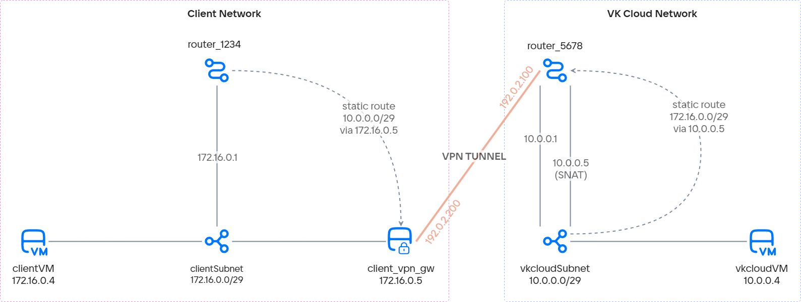

# {heading(VPN-туннелін SDN Neutron арқылы ұйымдастыру)[id=vnet-vpn-tunnel]}

{include(/kz/_includes/_translated_by_ai.md)}

{var(cloud)} on-premises инфрақұрылымы мен {linkto(../../../../../networks/vnet/concepts/sdn#vnet-sdn-neutron)[text=SDN Neutron]} бар {var(cloud)} виртуалды желісі арасында VPN-туннелі арқылы желілік байланыс орнатуға мүмкіндік береді.

Мысал ретінде {var(cloud)} ішіндегі басқа желіге дейін стандартты маршрутизатор негізінде VPN-туннелі құрылады. VPN-эндпоинт ретінде виртуалды машина пайдаланылады. VPN-туннелін баптау жөніндегі нұсқауларды кез келген басқа VPN-эндпоинтпен, мысалы, корпоративтік файерволмен немесе басқа желілік жабдықпен жұмыс істеуге бейімдеуге болады.

Мысалдағы VPN-туннелі келесі желілерді байланыстырады:

- Клиенттік желі — on-premises инфрақұрылымындағы желіні еліктейтін {var(cloud)} ішіндегі желі.
- Виртуалды желі — стандартты маршрутизаторға қосылған {var(cloud)} ішіндегі желі.

Әр желіде туннельдің жұмысқа қабілеттілігін тексеру үшін виртуалды машиналар жасалады.

{note:warn}
Төменде SDN {linkto(../../../../../networks/vnet/concepts/sdn#vnet-sdn-neutron)[text=Neutron]} бар желілер үшін VPN-туннелін баптау мысалы келтірілген.
SDN {linkto(../../../../../networks/vnet/concepts/sdn#vnet-sdn-sprut)[text=Sprut]} бар желілерде {var(cloud)} виртуалды желісін клиенттік желімен қосу {linkto(../../../../../networks/vnet/how-to-guides/onpremise-connect/advanced-router#vnet-advanced-router)[text=кеңейтілген маршрутизатор]} арқылы бапталады.
{/note}

## {heading(Дайындық қадамдары)[id=vnet-vpn-tunnel-prep]}

1. OpenStack клиенті {linkto(../../../../../tools-for-using-services/cli/openstack-cli#openstack-install)[text=орнатылғанына]} көз жеткізіңіз және жобада {linkto(../../../../../tools-for-using-services/cli/openstack-cli#openstack-authorize)[text=аутентификациядан өтіңіз]}.

1. {linkto(../../../../../networks/vnet/instructions/net#vnet-net-add)[text=Желілерді жасаңыз]}.

   {note:info}
   Қалауыңыз бойынша кез келген параметрлері бар желіні жасауға болады. Қажет болған жағдайда осы сценарийдегі келесі қадамдарды түзетіңіз.
   {/note}

   {tabs}

   {tab(Клиенттік желі)}

   Бұл желі клиенттік желі рөлін атқарады.

   Желіні жасау кезінде келесі параметрлерді орнатыңыз:

    - **Желі атауы**: `clientNet`.
    - **SDN**: `Neutron`. Әдепкі бойынша SDN Sprut жасалады.
    - **Интернетке қолжетімділік**: бұл опцияның таңдалғанына көз жеткізіңіз. Ол осы желідегі виртуалды машиналарға жария Floating IP мекенжайларын тағайындауға мүмкіндік береді.
    - **Маршрутизатор**: `Жаңасын жасау`.
    - **Ішкі желілер тізімі**: тізімдегі жалғыз ішкі желіні өңдеңіз. Ішкі желі үшін келесі параметрлерді орнатыңыз:

        - **Атауы**: `clientSubnet`.
        - **Мекенжайы**: `172.16.0.0/29`.
        - **Шлюз**: `172.16.0.1`.
        - **DHCP қосу**: бұл опцияның таңдалғанына көз жеткізіңіз.
        - **DHCP IP мекенжайлары пулы**: `172.16.0.2 - 172.16.0.6`.
        - **Жеке DNS**: бұл опцияның таңдалғанына көз жеткізіңіз.

   {/tab}

   {tab(Виртуалды желі)}

   Бұл желі виртуалды желі рөлін атқарады.

   Желіні жасау кезінде келесі параметрлерді орнатыңыз:

    - **Желі атауы**: `vkcloudNet`.
    - **SDN**: `Neutron`. Әдепкі бойынша SDN Sprut жасалады.
    - **Интернетке қолжетімділік**: бұл опцияның таңдалғанына көз жеткізіңіз. Ол VPN-туннелінің жұмысын қамтамасыз етуге және осы желідегі виртуалды машиналарға жария Floating IP мекенжайларын тағайындауға мүмкіндік береді.
    - **Маршрутизатор**: `Жаңасын жасау`.
    - **Ішкі желілер тізімі**: тізімдегі жалғыз ішкі желіні өңдеңіз. Ішкі желі үшін келесі параметрлерді орнатыңыз:

        - **Атауы**: `vkcloudSubnet`.
        - **Мекенжайы**: `10.0.0.0/29`.
        - **Шлюз**: `10.0.0.1`.
        - **DHCP қосу**: бұл опцияның таңдалғанына көз жеткізіңіз.
        - **DHCP IP мекенжайлары пулы**: `10.0.0.2 - 10.0.0.6`.
        - **Жеке DNS**: бұл опцияның таңдалғанына көз жеткізіңіз.

   {/tab}

   {/tabs}

1. Осы желілер үшін қандай маршрутизаторлар жасалғанын анықтаңыз. Бұл ақпарат VPN-ді әрі қарай баптау үшін қажет болады.

   Бұдан әрі мыналар болжанады:

    - `clientNet` желісі үшін `router_1234` маршрутизаторы жасалған;
    - `vkcloudNet` желісі үшін `router_5678` маршрутизаторы жасалған.

1. `router_5678` маршрутизаторы үшін `SNAT` интерфейсінің IP мекенжайын анықтаңыз:

    1. `vkcloudNet` желісіне арналған ішкі желілер тізімі бар бетті ашыңыз.
    1. `vkcloudSubnet` ішкі желісінің атауын басыңыз.
    1. **Порттар** қойындысына өтіңіз.
    1. Порттар тізімінен `SNAT` құрылғысының портын тауып, оның IP мекенжайын көшіріңіз.

       {note:info}
       Егер порттар тізімінен `SNAT` құрылғысының портын таппасаңыз, виртуалды желіні жасау кезінде SDN Neutron таңдалғанына көз жеткізіңіз.
       {/note}

1. `clientNet` клиенттік желісінде VPN-шлюз ретінде қызмет ететін виртуалды машинаны келесі параметрлермен жасаңыз:

    - **Виртуалды машина атауы**: `client_vpn_gw`.
    - **Виртуалды машина түрі**: `STD3-2-4`.
    - **Конфигурациядағы машиналар саны**: біреу.
    - **Операциялық жүйе**: `Ubuntu 22.04`.
    - **Желі**: клиенттік желі және оған сәйкес `clientNet: clientSubnet` ішкі желісі.
    - **Виртуалды машина кілті**: SSH арқылы қосылу орындалатын кілт.
    - **Firewall баптаулары**: барлығы рұқсат етілген (`all`).
    - **Сыртқы IP тағайындау**: бұл опцияның таңдалғанына көз жеткізіңіз.

   Виртуалды машинаның қалған параметрлерін өз қалауыңызша таңдаңыз.

1. Әрі қарай жұмыс істеу үшін қажетті мәліметтерді жинаңыз. Бұдан әрі мыналар болжанады:

[cols="5,1", options="header"]
|===
|Нысан
|Мәні

|`router_5678` маршрутизаторының жария IP мекенжайы
|`192.0.2.100`

|`clientSubnet` ішкі желісіндегі `client_vpn_gw` виртуалды машинасының IP мекенжайы
|`172.16.0.5`

|`client_vpn_gw` виртуалды машинасының Floating IP мекенжайы
|`192.0.2.200`

|`client_vpn_gw` клиенттік VPN-шлюзі жағындағы клиенттік ішкі желі
|`172.16.0.0/29`

|Бұлттық VPN-шлюзі жағындағы виртуалды ішкі желі
|`10.0.0.0/29`

|Бұлттық ішкі желідегі `SNAT` портының IP мекенжайы
|`10.0.0.5`
|===

{params[noBorder=true]}

## {heading(1. Бұлттық желі жағында VPN-туннелін баптаңыз)[id=vnet-vpn-tunnel-cloud-network-tunnel]}

{linkto(../../../../../networks/vnet/instructions/vpn#vnet-vpn)[text=VPN-туннелін жасаңыз]} келесі параметрлермен:

{tabs}

{tab(1. IKE баптауы)}

**IKE-саясаты** ретінде `Жаңа IKE-саясаты` таңдаңыз және мыналарды орнатыңыз:

- **Саясат атауы**: `vkcloud-client-ike`.
- **Кілттің өмір сүру уақыты**: 3600 секунд.
- **Авторизация алгоритмі**: `sha256`.
- **Шифрлау алгоритмі**: `aes-256`.
- **IKE нұсқасы**: `v2`.
- **Диффи—Хеллман тобы**: `group14`.

{/tab}

{tab(2. IPsec баптауы)}

**IPsec-саясаты** ретінде `Жаңа IPsec-саясаты` таңдаңыз және мыналарды орнатыңыз:

- **Саясат атауы**: `vkcloud-client-ipsec`.
- **Кілттің өмір сүру уақыты**: 3600 секунд.
- **Авторизация алгоритмі**: `sha256`.
- **Шифрлау алгоритмі**: `aes-256`.
- **Диффи—Хеллман тобы**: `group14`.

{/tab}

{tab(3. Endpoint Groups жасау)}

Таңдаңыз:

- **Маршрутизатор**: `router_5678`.

- **Local Endpoint**: `Жаңа endpoint-топ`.
    - **Атауы**: `vkcloud-endpoint-group`.
    - **Ішкі желілер**: `vkcloudSubnet`.

- **Remote Endpoint**: `Жаңа endpoint-топ`.
    - **Топ атауы**: `client-endpoint-group`.
    - **Ішкі желі мекенжайы**: `172.16.0.0/29`.

{/tab}

{tab(4. Туннельді баптау)}

**Баптаулар** ретінде `Негізгі` таңдаңыз және мыналарды орнатыңыз:

- **Туннель атауы**: `vkcloud-client-vpn`.
- **Пирдің жария IPv4 мекенжайы (Peer IP)**: `192.0.2.200`.
- **Ортақ пайдалану кілті (PSK)**: талаптарға сай келетін кез келген ортақ пайдалану кілті.

  Кілт:

    - ұзындығы кемінде 16 таңба болуы;
    - кемінде бір әріп немесе бір сан қамтуы;
    - тек келесі рұқсат етілген таңбалардан тұруы тиіс:
        - латын әліпбиінің бас және кіші әріптері;
        - сандар;
        - арнайы таңбалар `-`, `+`, `&`, `!`, `@`, `#`, `$`, `%`, `^`, `*`, `(`, `)`, `,`, `.`, `:`, `;`, `_`, `=`, `<`, `>`, `{`, `}`, `/`.

{/tab}

{/tabs}

## {heading(2. Клиенттік желі жағында VPN-туннелін баптаңыз)[id=vnet-vpn-tunnel-client-network-tunnel]}

1. VPN-шлюз порты кез келген трафикті қайта жібере алуы үшін, сол порт үшін {linkto(../../../../../networks/vnet/concepts/traffic-limiting#vnet-traffic-limiting-source-guard)[text=IP Source Guard]} функциясын өшіріңіз:

    1. `client_vpn_gw` виртуалды машинасының `172.16.0.5` жеке IP мекенжайы бар портын табыңыз. Осы порттың идентификаторын {linkto(../../../../../networks/vnet/instructions/ports#vnet-ports-view)[text=алыңыз]}.

    1. Осы порт арқылы кез келген мекенжайлардан трафик өтуіне рұқсат беріңіз:

       ```console
       openstack port set <ID_ПОРТА> --allowed-address ip-address=0.0.0.0/0
       ```

1. `client_vpn_gw` виртуалды машинасына SSH арқылы қосылыңыз. Бұдан кейінгі барлық әрекеттер осы виртуалды машинада орындалуы тиіс.

1. Виртуалды машина жеке желіден VPN-туннеліне трафикті маршрутизациялай алуы үшін, IP Forwarding функциясын қосыңыз:

   ```console
   echo 'net.ipv4.ip_forward = 1' | sudo tee -a /etc/sysctl.conf
   sudo sysctl -p
   ```

1. Linux үшін IPsec VPN іске асыруы болып табылатын StrongSwan орнатыңыз:

   ```console
   sudo apt update
   sudo apt install -y strongswan libcharon-extra-plugins libcharon-extauth-plugins libstrongswan-extra-plugins
   ```

1. `/etc/ipsec.conf` файлына клиенттік желі жағындағы VPN-қосылым параметрлерін қосыңыз. Бұл параметрлер {linkto(#vnet-vpn-tunnel-cloud-network-tunnel)[text=бұлттық желі жағында]} жасалған туннель баптауларының айнадағы көрінісі болып табылады.

   ```ini
   conn client-vkcloud-vpn
      authby=secret
      left=%defaultroute
      leftid=192.0.2.200
      leftsubnet=172.16.0.0/29
      right=192.0.2.100
      rightsubnet=10.0.0.0/29
      ike=aes256-sha2_256-modp2048!
      esp=aes256-sha2_256!
      keyingtries=0
      ikelifetime=3600
      lifetime=8h
      dpddelay=30
      dpdtimeout=120
      dpdaction=hold
      auto=start
   ```

   {note:info}
   `group14` Диффи—Хеллман тобы үшін баламалы белгілеу — `modp_2048`. `modp` атауларының топ атауларымен сәйкестігі [RFC 3526](https://www.rfc-editor.org/rfc/rfc3526) құжатында келтірілген.
   {/note}

1. `/etc/ipsec.secrets` файлында ортақ пайдалану кілтін (PSK) көрсетіңіз. Кілт {linkto(#vnet-vpn-tunnel-cloud-network-tunnel)[text=бұлттық желі жағында]} көрсетілген кілтпен сәйкес келуі тиіс:

   ```ini
   192.0.2.200 192.0.2.100 : PSK "<КЛЮЧ_СОВМЕСТНОГО_ИСПОЛЬЗОВАНИЯ_ЗАДАННЫЙ_ЗАРАНЕЕ>"
   ```

   {note:warn}
   Кейбір арнайы таңбалар, мысалы `#`, `&` немесе `{`, операциялық жүйе арқылы интерпретациялануы мүмкін. Бұл жағдайда кілт қате болады да, VPN-туннелі жұмыс істемейді, сондықтан кілтті міндетті түрде `""` таңбалары арқылы экранирлеңіз.

   Мысал:

    ```plaintext
    192.0.2.200 192.0.2.100 : PSK "k7@Jm4Px&9Lq#Wn2!v5*Cz8$Ys3%Ft6^Rg1=Hd0+Bl9}Qw7{Ko5&Np3@Xr1*Mj4"
    ```
   {/note}

1. StrongSwan сервисін қайта іске қосыңыз:

   ```console
   sudo systemctl restart strongswan-starter
   ```

## {heading(3. Статикалық маршруттарды қосыңыз)[id=vnet-vpn-tunnel-add-static-routs]}

Трафик VPN-туннелі арқылы өтуі үшін статикалық маршруттарды қосу қажет:

{tabs}

{tab(Бұлттық желі жағында)}

1. Жеке кабинетте `vkcloudNet` желісіне арналған ішкі желілер тізімі бар бетті ашыңыз.
1. `vkcloudSubnet` ішкі желісі үшін  басып, `Ішкі желіні өңдеу` тармағын таңдаңыз.
1. **Статикалық маршруттар өрісін көрсету** опциясының таңдалғанына көз жеткізіңіз.
1. Өріске `172.16.0.0/29` клиенттік желісіне дейінгі статикалық маршрутты жазыңыз. next hop ретінде `vkcloudSubnet` бұлттық ішкі желісіндегі `router_5678` маршрутизаторының `SNAT` интерфейсінің IP мекенжайын көрсету қажет.

   ```text
   172.16.0.0/29 - 10.0.0.5
   ```

{/tab}

{tab(Клиенттік желі жағында)}

1. Жеке кабинетте `clientSubnet` клиенттік ішкі желісі мен `client_vpn_gw` VPN-шлюзі қосылған `router_1234` маршрутизаторы туралы ақпараты бар бетті ашыңыз.
1. **Статикалық маршруттар** қойындысында **Статикалық маршрут қосу** батырмасын басыңыз.
1. `10.0.0.0/29` бұлттық желісіне дейінгі статикалық маршрутты жазыңыз:

    - **Мақсатты желі**: `10.0.0.0/29`.
    - **Аралық түйін (Next HOP)**: `172.16.0.5` (клиенттік ішкі желідегі VPN-шлюздің IP мекенжайы).

1. **Маршрут қосу** батырмасын басыңыз.

{/tab}

{/tabs}

## {heading(4. VPN-туннелінің жұмыс қабілетін тексеріңіз)[id=vnet-vpn-tunnel-check]}

1. {var(cloud)} платформасы жағынан VPN-туннелінің күйін қараңыз.

   Ол үшін жеке кабинетте `vkcloud-client-vpn` VPN бетiн ашып, **Туннель параметрлері** қойындысына өтіңіз. VPN `ACTIVE` мәртебесінде болуы тиіс.

1. ICMP-трафикке рұқсат беретін `icmp` қауіпсіздік тобын {linkto(../../../../../networks/vnet/instructions/secgroups#vnet-secgroups-add)[text=жасаңыз]}.

   Осы топта кіріс ережесін жасаңыз:

    - **Түрі**: `ICMP`.
    - **Қашықтағы мекенжай**: `Барлық IP мекенжайлар`.

   Бұл тестілік виртуалды машиналардың бір-бірін ping арқылы тексере алуы үшін қажет.

1. Екі виртуалды машинаны {linkto(../../../../../computing/iaas/instructions/vm/vm-create#iaas-vm-create-step)[text=жасаңыз]}:

    - `clientVM`:

        - `clientNet` желісінде, `clientSubnet` ішкі желісінде;
        - SSH арқылы оған қосылу үшін Floating IP мекенжайымен;
        - `default`, `ssh`, `icmp` қауіпсіздік топтарымен.

    - `vkcloudVM`:
        - `vkcloudNet` желісінде, `vkcloudSubnet` ішкі желісінде;
        - SSH арқылы оған қосылу үшін Floating IP мекенжайымен;
        - `default`, `ssh`, `icmp` қауіпсіздік топтарымен.

1. Виртуалды машиналардың тиісті ішкі желілердегі жеке IP мекенжайларын анықтаңыз. Мынадай болсын:

    - `clientVM` IP мекенжайы `172.16.0.4`;
    - `vkcloudVM` IP мекенжайы `10.0.0.4`.

1. `vkcloudVM` виртуалды машинасына SSH арқылы қосылыңыз.

1. `vkcloudVM` виртуалды машинасынан `clientVM` виртуалды машинасына ping орындаңыз:

   ```console
   ping 172.16.0.4
   ```

   `clientVM` хосты ping-ке жауап беруі тиіс.

## {heading(Пайдаланылмайтын ресурстарды жойыңыз)[id=vnet-vpn-tunnel-delete]}

Егер жасалған ресурстар енді қажет болмаса, оларды жойыңыз:

1. {linkto(../../../../../computing/iaas/instructions/vm/vm-manage#iaas-vm-manage-delete)[text=Виртуалды машиналарды жойыңыз]}.
1. {linkto(../../../../../networks/vnet/instructions/vpn#vnet-vpn-delete)[text=VPN-туннелін жойыңыз]}.
1. {linkto(../../../../../networks/vnet/instructions/router#vnet-router-static-routs-manage)[text=Клиенттік желі жағында]} жазылған статикалық маршруттарды жойыңыз.

   {note:info}
   Бұлттық желі жағындағы статикалық маршруттар олар жазылған ішкі желімен бірге жойылады.
   {/note}

1. {linkto(../../../../../networks/vnet/instructions/router#vnet-router-delete)[text=Клиенттік және бұлттық желілердің маршрутизаторларын жойыңыз]}.
1. Клиенттік және бұлттық {linkto(../../../../../networks/vnet/instructions/net#vnet-net-subnet-delete)[text=ішкі желілерді]} және {linkto(../../../../../networks/vnet/instructions/net#vnet-net-delete)[text=желілерді]} жойыңыз.
1. {linkto(../../../../../networks/vnet/instructions/ip/floating-ip#vnet-floating-ip-delete)[text=Floating IP мекенжайларын жойыңыз]}.
