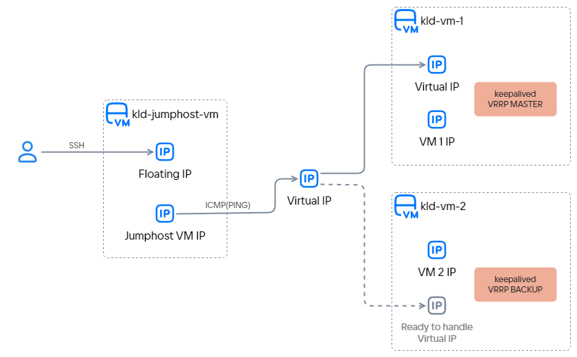

{include(/kz/_includes/_translated_by_ai.md)}

Егер кіріс трафикті бірнеше біртипті виртуалды машиналардан тұратын кластер өңдесе, олар үшін виртуалды IP мекенжайын (Virtual IP, VIP) жасауға болады. Мұндай мекенжай осы виртуалды машиналар арқылы кіріс трафикті ақауға төзімді түрде өңдеуді ұйымдастыру үшін қолданылады. Технология былай жұмыс істейді: VIP кластердегі виртуалды машиналардың біріне тағайындалады, ол осы VIP-тен келетін трафикті өңдейді. Осындай мекенжайға жүгінген клиенттер осы виртуалды машинаға бағытталады. Егер виртуалды машина істен шықса, VIP кластердегі басқа виртуалды машинаға ауысады, ал трафикті өңдеу жалғасады. Виртуалды машиналар өз күйін бақылап, VIP тағайындауын [VRRP](https://www.rfc-editor.org/rfc/rfc3768).

Виртуалды IP мекенжайын баптауды көрсету үшін:

- екі виртуалды машина жасалады, олар үшін:
  - виртуалды IP мекенжайы жасалады;
  - осы IP мекенжайына қызмет көрсету үшін [keepalived](https://keepalived.readthedocs.io/en/latest/introduction.html) іске асырылымындағы VRRP бапталады.
- барлық қажетті баптаулар мен жұмысқа қабілеттілікті тексеру орындалатын Floating IP мекенжайы бар үшінші виртуалды машина жасалады.

{params[noBorder=true]}

## 1. Дайындық қадамдары

1. OpenStack клиенті [орнатылғанына](/kz/tools-for-using-services/cli/openstack-cli#1_openstack_klientin_ornatynyz), көз жеткізіңіз және жобада [аутентификациядан өтіңіз](/kz/tools-for-using-services/cli/openstack-cli#3_autentifikaciyadan_otiniz) жобада.

1. Виртуалды машиналар мен виртуалды IP мекенжайы орналастырылатын ішкі желіні таңдаңыз. Олар бір ішкі желіде орналасуы керек.

   Егер қажетті ішкі желі болмаса, [оны жасаңыз](../../instructions/net#ishki_zhelini_zhasau).

   Келесі ақпаратты жазып алыңыз:
   - ішкі желінің атауы;
   - ішкі желі орналасқан желінің атауы.

   Мысал ретінде `mysubnet` желісіндегі `mynetwork`.

1. Виртуалды IP мекенжайы ретінде қай IP мекенжай қолданылатынын анықтаңыз. Бұл IP мекенжайды ешбір объект (мысалы, виртуалды машина немесе жүктеме теңгергіші) пайдаланбауы керек).

   мекенжайы пайдаланылады `192.168.0.254/24`.

1. Бұл IP мекенжайдың басқа объектілер тарапынан қолданылмайтынына көз жеткізіңіз (мысалы, виртуалды машинаның немесе жүктеме теңгергішінің портына тағайындалмауы керек). Бұған қол жеткізудің ең қарапайым тәсілдерінің бірі — таңдалған мекенжаймен OpenStack портын жасап, кейін бұл портты еш жерде қолданбау.

   Осындай портты жасау үшін OpenStack CLI ішінде команданы орындаңыз:

   ```console
   openstack port create <имя порта> --network mynetwork --fixed-ip subnet=mysubnet,ip-address=192.168.0.254
   ```

1. және `kld-vm1`, `kld-vm-2` виртуалды машиналарын жасаңыз `kld-jumphost-vm`.

   Бұл виртуалды машиналар тобының өз ішіндегі кез келген кіріс және шығыс трафикке рұқсат етілген қауіпсіздік тобына орналастырылуы керек.
   Мысалы, мұндай топ `default`.

   Егер стандартты емес қауіпсіздік топтары қолданылса, оларда мыналарға рұқсат берілуі керек:
   - және `kld-vm1` үшін SSH трафигіне `kld-vm-2`;
   - мен `kld-vm1` арасындағы VRRP трафигіне `kld-vm-2`;
   - таңдалған виртуалды IP мекенжайына ICMP трафигіне (жұмысқа қабілеттілікті тексеру үшін).

   {tabs}

   {tab(kld-vm-1)}

   Келесі параметрлерді орнатыңыз:

   - **Виртуалды машинаның атауы:** `kld-vm-1`.
   - **Конфигурациядағы машиналар саны:** `1`.
   - **Операциялық жүйе:** `Ubuntu 22.04`.
   - **Желі:** бұрын таңдалған желі мен ішкі желі.
   - **DNS атауы:** `kld-vm-1`.
   - **Firewall баптаулары:** `default`.
   - **Сыртқы IP тағайындау:** опция таңдалмағанына көз жеткізіңіз.

   Виртуалды машинаның қалған параметрлерін өз қалауыңыз бойынша таңдаңыз.

   {/tab}

   {tab(kld-vm-2)}

   Келесі параметрлерді орнатыңыз:

   - **Виртуалды машинаның атауы:** `kld-vm-2`.
   - **Конфигурациядағы машиналар саны:** `1`.
   - **Операциялық жүйе:** `Ubuntu 22.04`.
   - **Желі:** бұрын таңдалған желі мен ішкі желі.
   - **DNS атауы:** `kld-vm-2`.
   - **Firewall баптаулары:** `default`.
   - **Сыртқы IP тағайындау:** опция таңдалмағанына көз жеткізіңіз.

   Виртуалды машинаның қалған параметрлерін өз қалауыңыз бойынша таңдаңыз.

   {/tab}

   {tab(kld-jumphost-vm)}

   Келесі параметрлерді орнатыңыз:

   - **Виртуалды машинаның атауы:** `kld-jumphost-vm`.
   - **Конфигурациядағы машиналар саны:** `1`.
   - **Операциялық жүйе:** `Ubuntu 22.04`.
   - **Желі:** бұрын таңдалған желі мен ішкі желі.
   - **DNS атауы:** `kld-jumphost-vm`.
   - **Firewall баптаулары:** `default`, `ssh`.
   - **Сыртқы IP тағайындау:** опция таңдалғанына көз жеткізіңіз. Интернеттен виртуалды машинаға SSH арқылы қосылу үшін сыртқы IP мекенжайы ([Floating IP](/kz/networks/vnet/concepts/ips-and-inet#floating-ip)) қажет.

   Виртуалды машинаның қалған параметрлерін өз қалауыңыз бойынша таңдаңыз.

   {/tab}

   {/tabs}

1. Определите порт OpenStack, через который виртуальные машины `kld-vm-1` және `kld-vm-2` виртуалды машиналары виртуалды IP мекенжайымен жұмыс істейтін OpenStack портын анықтаңыз:

   1. виртуалды машинасы үшін `kld-vm-1`:

      1. [SSH арқылы қосылыңыз](/kz/computing/iaas/instructions/vm/vm-connect/vm-connect-nix) виртуалды машинасына `kld-jumphost-vm` виртуалды машинасына SSH арқылы қосылыңыз.
      1. Виртуалды машинаға қосылыңыз `kld-vm-1` виртуалды машинасына SSH арқылы қосылыңыз.
      1. Команданы орындаңыз:

         ```console
         ip route | grep default
         ```

         Шығыс мысалы:

         ```text
         default via 192.168.0.1 dev ens3 proto dhcp src 192.168.0.11 metric 100
         ```

         Шығыстан келесі ақпаратты жазып алыңыз:

         - Желілік интерфейс атауы `dev`): кейін келеді): бұл мысалда `ens3`.
         - Желілік интерфейстің IP мекенжайы `src`): кейін келеді): бұл мысалда `192.168.0.11`.

      1. OpenStack CLI командасын орындаңыз:

         ```console
         openstack port list -c ID --server kld-vm-1 --fixed-ip ip-address=<IP-адрес сетевого интерфейса из предыдущего шага>
         ```

         Шығыс мысалы:

         ```text
         +--------------------------------------+
         | ID                                   |
         +--------------------------------------+
         | e1bd636a-aaaa-bbbb-cccc-a673e7cbef83 |
         +--------------------------------------+
         ```

         Шығыстан OpenStack портының идентификаторын жазып алыңыз.

   1. виртуалды машинасында дәл осы әрекеттерді орындаңыз `kld-vm-2`.

Барлық алынған деректерді жазып алыңыз. Келтірілген мысал үшін нәтиже:

<!-- prettier-ignore-start -->
| Нысан                                                  | Мәні                                      |
| ------------------------------------------------------ | ----------------------------------------- |
| **`kld-vm-1` виртуалды машинасы үшін**                 |                                           |
| Желілік интерфейс атауы                                | `ens3`                                    |
| Желілік интерфейстің IP-мекенжайы                      | `192.168.0.11`                            |
| Желілік интерфейске арналған OpenStack порт идентификаторы | `e1bd636a-aaaa-bbbb-cccc-a673e7cbef83` |
| **`kld-vm-2` виртуалды машинасы үшін**                 |                                           |
| Желілік интерфейс атауы                                | `ens3`                                    |
| Желілік интерфейстің IP-мекенжайы                      | `192.168.0.22`                            |
| Желілік интерфейске арналған OpenStack порт идентификаторы | `74268d00-xxxx-yyyy-zzzz-cf9f93536d5c` |
| **Басқасы**                                            |                                           |
| Виртуалды машиналар мен виртуалды IP-мекенжайға арналған ішкі желі | `192.168.0.0/24`               |
| Ішкі желінің атауы                                     | `mysubnet`                                |
| Ішкі желі орналасқан желінің атауы                     | `mynetwork`                               |
| Виртуалды IP-мекенжай                                  | `192.168.0.254/24`                        |
<!-- prettier-ignore-end -->

## 2. keepalived орнатыңыз және баптаңыз

1. орнатыңыз `keepalived`:

   1. виртуалды машинасы үшін `kld-vm-1`:

      1. [SSH арқылы қосылыңыз](/kz/computing/iaas/instructions/vm/vm-connect/vm-connect-nix) виртуалды машинасына `kld-jumphost-vm` виртуалды машинасына SSH арқылы қосылыңыз.
      1. Виртуалды машинаға қосылыңыз `kld-vm-1` виртуалды машинасына SSH арқылы қосылыңыз.
      1. Командаларды орындаңыз:

         ```console
         sudo apt update
         sudo apt install keepalived

         ```

   1. виртуалды машинасында дәл осы әрекеттерді орындаңыз `kld-vm-2`.

1. баптаңыз `keepalived`:

   {tabs}

   {tab(kld-vm-1)}

   1. Виртуалды машинаға қосылыңыз `kld-jumphost-vm` виртуалды машинасына SSH арқылы қосылыңыз.
   1. Виртуалды машинаға қосылыңыз `kld-vm-1` виртуалды машинасына SSH арқылы қосылыңыз.
   1. `/etc/keepalived/keepalived.conf` файлын өңдеп, оның мазмұнын келесімен ауыстырыңыз:

      ```conf
      global_defs
      {
        router_id KLD-VM-1
      }
      
      vrrp_instance VI_254
      {
        state MASTER
        interface ens3
        virtual_router_id 254
        priority 120
        advert_int 1

        authentication
        {
          auth_type PASS
          auth_pass <пароль для аутентификации>
        }
      
        virtual_ipaddress
        {
          192.168.0.254/24
        }
      }
      ```

   {/tab}

   {tab(kld-vm-2)}

   1. Виртуалды машинаға қосылыңыз `kld-jumphost-vm` виртуалды машинасына SSH арқылы қосылыңыз.
   1. Виртуалды машинаға қосылыңыз `kld-vm-2` виртуалды машинасына SSH арқылы қосылыңыз.
   1. `/etc/keepalived/keepalived.conf` файлын өңдеп, оның мазмұнын келесімен ауыстырыңыз:

      ```conf
      global_defs
      {
        router_id KLD-VM-2
      }
      
      vrrp_instance VI_254
      {
        state BACKUP
        interface ens3
        virtual_router_id 254
        priority 90
        advert_int 1

        authentication
        {
          auth_type PASS
          auth_pass <пароль для аутентификации>
        }
      
        virtual_ipaddress
        {
          192.168.0.254/24
        }
      }
      ```

   {/tab}

   {/tabs}

   Конфигурациялық файлда:

   - `router_id` — маршрутизатор идентификаторы `keepalived`, маршрутизаторының идентификаторы, бұл мән әр конфигурация үшін әртүрлі.
   - `vrrp_instance` — VRRP инстансының баптаулары. VRRP инстансының атауы тек жергілікті деңгейде ғана маңызды, сондықтан әртүрлі виртуалды машиналардағы конфигурациялар үшін бірдей болуы мүмкін.

     - `state` — жұмысты бастайтын рөл `keepalived`: `MASTER` немесе `SLAVE`. Кейін шеберді таңдау нәтижесіне қарай рөл өзгеруі мүмкін.
     - `interface` — VRRP жұмыс істейтін интерфейс атауы. Интерфейс атауы тек жергілікті деңгейде ғана маңызды, сондықтан әртүрлі виртуалды машиналардағы конфигурациялар үшін бірдей болуы мүмкін.
     - `virtual_router_id` — ден 255-ке дейінгі VRRP маршрутизаторының идентификаторы. Екі конфигурацияда да бірдей болуы керек.
     - `priority` — VRRP шеберін таңдау жүргізілетін басымдық. Бұл жағдайда шебер `kld-vm-1`, болады, өйткені оның басымдығы ең жоғары.
     - `advert_int` — VRRP хабарламаларын тарату аралығы (секундпен).
     - `authentication` — аутентификация параметрлері. Бұл жағдайда аутентификация пароль (`PASS`). бойынша орындалады. Парольдер `auth_pass`) мәні) барлық конфигурацияларда бірдей болуы керек.
     - `virtual_ipaddress` — виртуалды IP мекенжайы. Мәндер барлық конфигурацияларда бірдей болуы керек.

     Параметрлер туралы толығырақ [keepalived құжаттамасында](https://keepalived.readthedocs.io/en/latest/configuration_synopsis.html#vrrp-instance-definitions-synopsis).

1. іске қосыңыз `keepalived`:

   1. виртуалды машинасы үшін `kld-vm-1`:

      1. Виртуалды машинаға қосылыңыз `kld-jumphost-vm` виртуалды машинасына SSH арқылы қосылыңыз.
      1. Виртуалды машинаға қосылыңыз `kld-vm-1` виртуалды машинасына SSH арқылы қосылыңыз.
      1. Команданы орындаңыз:

         ```console
         sudo systemctl start keepalived

         ```

      1. күйін тексеру үшін команданы орындаңыз `keepalived`:

         ```console
         sudo systemctl status keepalived
         ```

         Шығыс мысалы:

         ```text
         ● keepalived.service - Keepalive Daemon (LVS and VRRP)
              Loaded: loaded (/lib/systemd/system/keepalived.service; enabled; vendor preset: enabled)
              Active: active (running) since Mon 2023-01-09 10:55:35 UTC; 21h ago
              ...
         ```

         `keepalived` күйінде болуы керек `running`.

   1. виртуалды машинасында дәл осы әрекеттерді орындаңыз `kld-vm-2`.

## 3. IP Source Guard баптаңыз

Виртуалды машиналарда орнатылған `keepalived` тек `192.168.0.11` және `192.168.0.22`, IP мекенжайларынан ғана емес, сонымен қатар `192.168.0.254`. виртуалды IP мекенжайынан да трафик жібере алуы керек. VK Cloud ішіндегі OpenStack порттарында [IP Source Guard механизмі](/kz/networks/vnet/concepts/traffic-limiting#source_guard), қолданылатындықтан, виртуалды машиналар порттары үшін виртуалды IP мекенжайынан келетін трафикке рұқсат беріңіз:

1. үшін `kld-vm-1`:

   ```console
   openstack port set e1bd636a-aaaa-bbbb-cccc-a673e7cbef83 --allowed-address ip-address=192.168.0.254/24
   ```

1. үшін `kld-vm-2`:

   ```console
   openstack port set 74268d00-xxxx-yyyy-zzzz-cf9f93536d5c --allowed-address ip-address=192.168.0.254/24
   ```

## 4. Виртуалды IP мекенжайының жұмысқа қабілеттілігін тексеріңіз

Екі терминал сессиясын ашыңыз:

1. Бірінші сессияда:
   1. [SSH арқылы қосылыңыз](/kz/computing/iaas/instructions/vm/vm-connect/vm-connect-nix) виртуалды машинасына `kld-jumphost-vm` виртуалды машинасына SSH арқылы қосылыңыз.
   1. Виртуалды IP мекенжайын үздіксіз пингтеуді іске қосыңыз:

      ```console
      ping 192.168.0.254
      ```

      IP мекенжайы сәтті пингтелуі керек.

1. Екінші сессияда:

   1. Виртуалды машинаға қосылыңыз `kld-jumphost-vm` виртуалды машинасына SSH арқылы қосылыңыз.
   1. Виртуалды машинаға қосылыңыз `kld-vm-1` виртуалды машинасына SSH арқылы қосылыңыз.
   1. процесін тоқтатыңыз `keepalived`:

      ```console
      sudo systemctl stop keepalived
      ```

      Бұл виртуалды машина шебер рөлінде болғандықтан және трафикті өңдеуді тоқтатқандықтан, енді виртуалды IP мекенжайына келіп түсетін трафикті өңдеу `kld-vm-2`.
      Бірінші терминал сессиясында іске қосылған пинг процесі үзілмеуі керек.

   1. процесін қайта іске қосыңыз `keepalived`:

      ```console
      sudo systemctl start keepalived
      ```

      Виртуалды машина қайтадан шебер рөлін өзіне алып, виртуалды IP мекенжайына келіп түсетін трафикті өңдей бастайды.

   1. Команданы орындаңыз:

      ```console
      ip address show dev ens3
      ```

      Виртуалды IP мекенжайы шығыста бар екенін тексеріңіз:

      ```text
      ens3: <BROADCAST,MULTICAST,UP,LOWER_UP> mtu 1500 qdisc fq_codel state UP group default qlen 1000
          link/ether fa:16:3e:a3:82:f2 brd ff:ff:ff:ff:ff:ff
          altname enp0s3
          inet 192.168.0.4/24 metric 100 brd 192.168.0.255 scope global dynamic ens3
             valid_lft 523420sec preferred_lft 523420sec
          inet 192.168.0.254/24 scope global secondary ens3
             valid_lft forever preferred_lft forever
      ```

## Пайдаланылмайтын ресурстарды жойыңыз

Егер жасалған ресурстар енді қажет болмаса, оларды жойыңыз:

1. [Виртуалды машиналарды жойыңыз](/kz/computing/iaas/instructions/vm/vm-manage#delete_vm) виртуалды машиналар.
1. [жойыңыз](../../instructions/ip/floating-ip#delete) виртуалды машинасына тағайындалған Floating IP мекенжайын `kld-jumphost-vm`.
1. [жойыңыз](../../instructions/ports#portty_zhoyu) порт, которому назначен виртуальный IP-адрес.
1. Виртуалды машиналар орналастырылған [ішкі желіні](../../instructions/net#ishki_zhelini_zhoyu) және [желіні](../../instructions/net#zhelini_zhoyu), жойыңыз.
