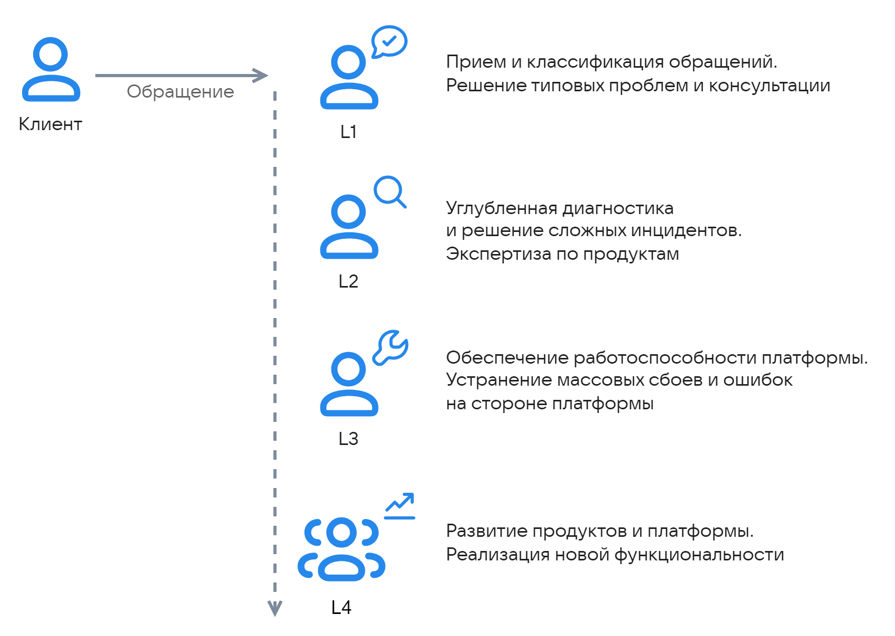

{include(/kz/_includes/_translated_by_ai.md)}

VK Cloud платформасындағы өтініштерді шешу үшін көпдеңгейлі техникалық қолдау моделі қолданылады:

{params[noBorder=true; width=60%; printWidth=60%]}

Өтініштерге кепілдендірілген жауап беру уақыты [қызмет көрсету деңгейі туралы келісіммен (SLA)](../sla) айқындалады.

## Бірінші қолдау желісі (L1)

L1 инженерлері барлық кіріс өтініштерін бастапқы өңдеуді орындайды.

L1 жауапкершілік аймағы:

- Өтініштерді қабылдау, тіркеу және жіктеу.
- Бастапқы диагностика, қажетті ақпаратты жинау.
- Типтік техникалық проблемаларды шешу.
- Сервистердің жұмысы мен бапталуы бойынша консультация беру.
- Төлем тәсілдерін баптау, балансты және есептен шығаруларды тексеру мәселелері бойынша консультация беру.
- Жеке кабинетке қолжетімділікті қалпына келтіру.
- Сұрау бойынша ВМ квотасы мен конфигурациясын өзгерту.
- Техникалық іркілістерге әрекет ету және клиенттерге хабарлау.
- Marketplace өнімдері бойынша вендорлармен өзара әрекеттесу.

## Екінші қолдау желісі (L2)

Екінші желіге терең техникалық сараптаманы талап ететін күрделі сұрақтар беріледі. L2 инженерлерінің сервистер мен өнімдік бағыттардың техникалық ерекшеліктері бойынша арнайы білімі бар.

L2 жауапкершілік аймағы:

- Типтік емес және күрделі сұрақтарды шешу.
- Проблемаларға егжей-тегжейлі диагностика жүргізу.
- Сервистердің күйін проактивті мониторингтеу және ескертулерге әрекет ету.

## Үшінші қолдау желісі (L3)

Үшінші желінің сарапшылары платформа инфрақұрылымының пайдаланылуы мен тұрақтылығына жауап береді.

L3 жауапкершілік аймағы:

- Провайдер жағындағы жаппай іркілістерді шешу.
- Бағдарламалық қателерді жою, осалдықтарды анықтау.
- Сервистердің өсу нүктелері туралы хабарлау үшін өнімдік командалармен өзара әрекеттесу.

## Өнімдік команда (L4)

Өнімдік команда нақты сервистің немесе платформаның дамуы мен өмірлік цикліне жауап береді.

L4 жауапкершілік аймағы:

- Жаппай проблемаларды түзетуді қамтитын БҚ-ның жаңартылған нұсқаларын шығару.
- Сервистердің өнімділігін, бас тартуға төзімділігін және пайдалану ыңғайлылығын арттыру.
- Жаңа функционалдылықты әзірлеу және іске асыру.
