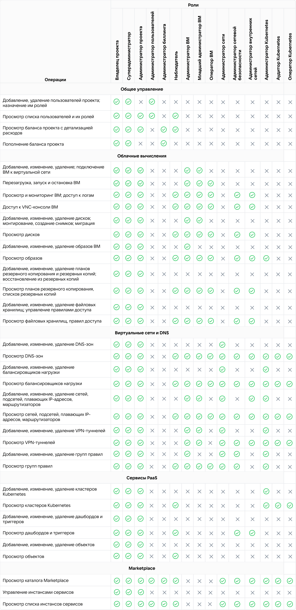

# {heading(Пайдаланушының жеке кабинеттегі рөлдері мен құқықтары)[id=tools-account-concepts-rolesandpermissions]}

{include(/kz/_includes/_translated_by_ai.md)}

[жоба](../projects) жасалғаннан кейін онда бір ғана пайдаланушы болады — оның иесі. Иесі жобаға басқа қатысушыларды шақырып, оларға рөлдер тағайындай алады. Рөл жеке кабинет функционалымен және бұлтты сервистермен жұмыс істеу кезінде қолжетімді [құқықтар](#rolesandpermissions-permissions) тізімін анықтайды.

Бір пайдаланушы бірнеше жобаның қатысушысы бола алады және олардың әрқайсысында әртүрлі рөлдерге ие болуы мүмкін. Бір қатысушыға бір жобада бірнеше рөл тағайындалуы мүмкін, бұл жағдайда рөлдердің құқықтары жинақталады.

Пайдаланушылардан бөлек, жобаға бағдарламалар мен сервистер арасындағы өзара әрекеттесуге арналған [сервистік тіркелгі жазбалары](../service-accounts) (СУЗ) да қосылуы мүмкін. СУЗ үшін төменде келтірілген кез келген рөлдер тағайындалады, `Жоба иесі` рөлінен басқа.

Жоба қатысушыларының тізімін және оларға тағайындалған рөлдерді жеке кабинеттегі **Қолжетімділікті басқару** бетінде [көруге](../../instructions/project-settings/access-manage) болады.

Жеке кабинеттегі әр рөлдің жобаны және сервистерді [API](../../../api) және [Terraform](../../../terraform) арқылы басқару үшін пайдаланылатын техникалық атауы бар.

Қолжетімділікті неғұрлым икемді басқару үшін құқықтар жиынтығы шектеулі рөлдер мен рұқсаттар пайдаланылады. Рөлдер мен рұқсаттардың толық тізімімен [IAM](../../../../access/iam) бөлімінде таныса аласыз:

- [Рөлдер анықтамалығы](../../../../access/iam/concepts/roles-reference).
- [Рұқсаттар анықтамалығы](../../../../access/iam/concepts/permissions-reference).

## {heading(Жобаны жалпы басқаруға арналған рөлдер)[id=rolesandpermissions-general]}

[cols="1,1,3", options="header"]
|===

| Рөл
| Рөлдің техникалық атауы
| Сипаттамасы

| Жоба иесі
| `mcs_owner`
| Құқықтардың барынша кең жиынтығына ие пайдаланушы.

Иесі болып жобаны жасаған пайдаланушы немесе тіркелгіні тіркеу кезінде жоба платформа арқылы кім үшін жасалса, сол пайдаланушы саналады.

Жобада тек бір ғана иесі болуы мүмкін. Бұл рөлді тағайындауға немесе оған шақыруға болмайды

| Суперадминистратор
| `mcs_co_owner`
| Иесімен бірдей құқықтар жиынтығына ие пайдаланушы, соның ішінде картаны байланыстыру және теңгерімді толықтыру

| Жоба әкімшісі
| `mcs_admin`
| Барлық сервистерде объектілерді жасауға және өңдеуге толық құқықтар жиынтығына ие пайдаланушы.

Әкімші мыналарды орындай алмайды:

- сервистерді белсендіру;
- жоба теңгерімін толықтыру (оған тек теңгерімді көру қолжетімді);
- пайдаланушыларды шақыру

| Пайдаланушылар әкімшісі (IAM)
|`mcs_admin_security`
| Қолжетімділікті басқару бетінде [жоба қатысушыларымен жұмыс істеуге](../../instructions/project-settings/access-manage) арналған рөл.

Пайдаланушылар әкімшісі (IAM) қатысушыларды жобаға шақыра алады және оларды жобадан жоя алады, қатысушыларға тағайындалған рөлдерді өңдей алады.

Бұл рөлге сервистер мен жоба теңгерімі туралы ақпарат қолжетімсіз

| Биллинг әкімшісі
| `mcs_admin_billing`
| Жоба теңгерімін басқаруға арналған рөл.

Биллинг әкімшісі мыналарды орындай алады:

- төлем картасын жобаға, егер ол әлі байланыстырылмаған болса, [байланыстыра](/kz/intro/billing/instructions/add-card) алады;
- жоба теңгерімін [толықтыра](/kz/intro/billing/instructions/payment) алады немесе автотолықтыруды баптай алады.

Бұл рөлге сервистер мен жоба қатысушыларының тізімі қолжетімсіз

| Бақылаушы
|`mcs_viewer`
| Жоба туралы ақпаратты, соның ішінде қатысушылар тізімін, барлық сервистердің деректерін, жоба теңгерімін және шығындардың егжей-тегжейін көруге толық рұқсаттары бар пайдаланушы.

Бақылаушы өз аккаунтының баптауларынан басқа ештеңе жасай да, өңдей де алмайды

|===

## {heading(Мамандандырылған рөлдер)[id=rolesandpermissions-special]}

Төмендегі рөлдердің әрқайсысы платформа сервистерінің біреуімен жұмыс істеуге арналған. Бұл рөлдерге мыналар қолжетімді:

- олардың мақсатты сервисіндегі рұқсаттар;
- мақсатты сервисте толыққанды жұмыс істеу мүмкін емес болатын ілеспе сервистердегі бірқатар рұқсаттар.

Бұл рөлдердің барлығында жоба қатысушыларының тізіміне және теңгерім туралы ақпаратқа қолжетімділік жоқ.

Осы рөлдердің рұқсаттары туралы толық мәлімет [Барлық рөлдерге арналған құқықтар](#rolesandpermissions-permissions) бөлімінде берілген.

Мамандандырылған рөлдерге қолжетімді барлық операциялар жоба иесіне, суперадминистраторға және жоба әкімшісіне де қолжетімді.

[cols="1,1,3", options="header"]
|===

| Рөл
| Рөлдің техникалық атауы
| Сипаттамасы

| Виртуалды машиналар әкімшісі
| `mcs_admin_vm`
| Бұл рөлі бар пайдаланушы Cloud Servers сервисінде негізгі операцияларды орындай алады.

Бұл ретте оған тек мыналарды көру қолжетімді:

- резервтік көшіру жоспарларын;
- файлдық қоймаларды.

Виртуалды желілер сервисінде ол қауіпсіздік топтарын жасай және өңдей алады

| Кіші ВМ әкімшісі
| `mcs_admin_vm_junior`
| Бұл рөлі бар пайдаланушы қауіпсіздік ережелері мен топтарын жасау, өңдеу және жоюдан басқа, виртуалды машиналар әкімшісімен бірдей операцияларды орындай алады

| Виртуалды машиналар операторы
| `mcs_operator_vm`
| Бұл рөлі бар пайдаланушы виртуалды машинада жұмыс істей алады, бірақ оның баптауларын басқара алмайды.

ВМ операторы мыналарды орындай алады:

- ВМ-ді іске қоса немесе тоқтата алады;
- [VNC-консоль](/kz/computing/iaas/instructions/vm/vm-console) арқылы ВМ-де жұмыс істей алады;
- [SSH](/kz/computing/iaas/instructions/vm/vm-connect/vm-connect-nix) немесе [RDP](/kz/computing/iaas/instructions/vm/vm-connect/vm-connect-win) арқылы ВМ-ге қосыла алады;
- ВМ конфигурациясы мен желілік баптауларын көре алады.

ВМ операторы резервтік көшірмелерді жасай алмайды

| Желі әкімшісі
| `mcs_admin_network`
| Бұл рөлі бар пайдаланушы виртуалды желілер және DNS сервистерінде операциялардың толық жиынтығын орындай алады

| Желілік қауіпсіздік әкімшісі
| `mcs_admin_network_security`
| Бұл рөлі бар пайдаланушы виртуалды желілер және DNS сервистеріндегі барлық деректерді көре алады.

Бұдан бөлек, пайдаланушы тек қауіпсіздік топтарын жасай және өңдей алады

| Ішкі желілер әкімшісі
| `mcs_admin_network_objects`
| Бұл рөлі бар пайдаланушы мыналарды орындай алады:

- виртуалды желілер және DNS сервистеріндегі барлық деректерді көре алады;
- виртуалды желілер мен ішкі желілерді, маршрутизаторларды жасай және өңдей алады;
- жобаға Floating IP қоса алады

| Kubernetes әкімшісі
| `mcs_k8s_admin`
| Рөл туралы толық ақпарат [Cloud Containers сервисі рөлдерінің рұқсаттары](#rolesandpermissions-k8s) бөлімінде берілген

| Kubernetes операторы
| `mcs_k8s_editor`
| Рөл туралы толық ақпарат [Cloud Containers сервисі рөлдерінің рұқсаттары](#rolesandpermissions-k8s) бөлімінде берілген

| Kubernetes аудиторы
| `mcs_k8s_viewer`
| Рөл туралы толық ақпарат [Cloud Containers сервисі рөлдерінің рұқсаттары](#rolesandpermissions-k8s) бөлімінде берілген

|===

## {heading(Барлық рөлдерге арналған құқықтар)[id=rolesandpermissions-permissions]}

Әр рөлге операцияларды орындауға арналған белгілі бір құқықтар жиынтығы сәйкес келеді.

{params[noBorder=true]}

## {heading(Cloud Logging сервисіндегі құқықтар)[id=rolesandpermissions-logging]}

[cols="2,1,1,1", options="header"]
|===
|Рөлдер
|Логтарды және сервис конфигурациясын көру
|Логтар баптауларын өзгерту
|Сервистік пайдаланушыларды және сервис атауларын жасау

|Жоба иесі
| 
| 
| 

|Суперадминистратор
| 
| 
| 

|Жоба әкімшісі
| 
| 
| 

|Пайдаланушылар әкімшісі (IAM)
| 
| 
| 

|Биллинг әкімшісі
| 
| 
| 

|Бақылаушы
| 
| 
| 

|Әкімші, кіші әкімші, ВМ операторы
| 
| 
| 

|Желі әкімшісі
| 
| 
| 

|Желілік қауіпсіздік әкімшісі
| 
| 
| 

|Ішкі желілер әкімшісі
| 
| 
| 

|Әкімші, оператор, Kubernetes аудиторы
| 
| 
| 
|===

## {heading(Cloud Monitoring сервисіндегі құқықтар)[id=rolesandpermissions-monitoring]}

[cols="2,1,1,1,1", options="header"]
|===
|Рөлдер
|Дашбордтарды көру
|Prometheus метрикаларын көру
|Мониторинг жүйесіне жазу
|Дашбордтарды жасау және өңдеу

|Жоба иесі
| 
| 
| 
| 

|Суперадминистратор
| 
| 
| 
| 

|Жоба әкімшісі
| 
| 
| 
| 

|Пайдаланушылар әкімшісі (IAM)
| 
| 
| 
| 

|Биллинг әкімшісі
| 
| 
| 
| 

|Бақылаушы
| 
| 
| 
| 

|Әкімші, кіші әкімші
| 
| 
| 
| 

|ВМ операторы
| 
| 
| 
| 

|Желі әкімшісі
| 
| 
| 
| 

|Желілік қауіпсіздік әкімшісі
| 
| 
| 
| 

|Ішкі желілер әкімшісі
| 
| 
| 
| 

|Әкімші, оператор, Kubernetes аудиторы
| 
| 
| 
| 
|===

## {heading(Cloud Audit сервисіндегі құқықтар)[id=rolesandpermissions-audit]}

[cols="2,2,1,1", options="header"]
|===
|Рөлдер
|Оқиғаларды көру
|Деректерді жүктеп шығару
|Сервисті баптау

|Жоба иесі
| Жобаның барлық оқиғалары
| 
| 

|Суперадминистратор
| Жобаның барлық оқиғалары
| 
| 

|Жоба әкімшісі
| Жобаның барлық оқиғалары
| 
| 

|Пайдаланушылар әкімшісі (IAM)
| IAM сервисінің барлық оқиғалары және өзінің барлық әрекеттері
| 
| 

|Биллинг әкімшісі
| Billing сервисінің барлық оқиғалары және өзінің барлық әрекеттері
| 
| 

|Бақылаушы
| Жобаның барлық оқиғалары
| 
| 

|Әкімші, кіші әкімші
| Жобаның барлық оқиғалары
| 
| 

|ВМ операторы
| 
| 
| 

|Желі әкімшісі
| Cloud Network сервисінің барлық оқиғалары және өзінің барлық әрекеттері
| 
| 

|Желілік қауіпсіздік әкімшісі
| 
| 
| 

|Ішкі желілер әкімшісі
| 
| 
| 

|Әкімші, оператор, Kubernetes аудиторы
| Cloud Containers сервисінің барлық оқиғалары және өзінің барлық әрекеттері
| 
| 
|===

## {heading(Cloud Containers сервисі рөлдеріне арналған құқықтар)[id=rolesandpermissions-k8s]}

Жеке кабинетте [Cloud Containers сервисімен](/kz/kubernetes/k8s) жұмыс істеуге арналған мамандандырылған рөлдер қолжетімді:

- Kubernetes әкімшісі,
- Kubernetes операторы,
- Kubernetes аудиторы.

Kubernetes әкімшісіне қолжетімді операциялар жоба иесіне, суперадминистраторға және жоба әкімшісіне де қолжетімді.

Қалған рөлдер үшін бұл операциялар қолжетімсіз.

1.23 және одан жоғары нұсқадағы Kubernetes кластерлері үшін Kubernetes әкімшісі, операторы немесе аудиторы рөлі пайдаланушыға қолжетімді ішкі [Kubernetes рөлін](/kz/kubernetes/k8s/concepts/access-management#k8s-access-management-kubernetes-roles) де анықтайды.

{note:info}

Кейбір әрекеттер тек кластердің белгілі бір күйінде ғана қолжетімді. Мысалы, аддондарды орнату және жою тек кластер іске қосылған болса ғана мүмкін.

{/note}

[cols="2,1,1,1,1"]
|===
.2+| Операциялар
4+| Рөлдер

| Kubernetes әкімшісі
| Kubernetes операторы
| Kubernetes аудиторы
| Бақылаушы

| Кластер жасау
| 
| 
| 
| 

| Кластерді жою
| 
| 
| 
| 

| Кластерді іске қосу
| 
| 
| 
| 

| Кластерді тоқтату
| 
| 
| 
| 

| Кластер, нода топтары туралы ақпаратты көрсету
| 
| 
| 
| 

| kubeconfig алу
| 
| 
| 
| 

| Kubernetes Dashboard жүйесіне қол жеткізу үшін құпияны алу
| 
| 
| 
| 

| Нұсқаны жаңарту
| 
| 
| 
| 

| Виртуалды машина түрін өзгерту
| 
| 
| 
| 

| Prometheus дискісінің өлшемін өзгерту
| 
| 
| 
| 

| Тораптар тобын қосу
| 
| 
| 
| 

| Тораптар тобын жою
| 
| 
| 
| 

| Масштабтау баптауларын өзгерту
| 
| 
| 
| 

| Labels және Taints өзгерту
| 
| 
| 
| 

| Аддонды орнату және жою
| 
| 
| 
| 
|===

## {heading(Security Gate сервисіндегі құқықтар)[id=rolesandpermissions-security-gate]}

Жеке кабинеттегі [Security Gate](https://cloud.vk.com/security-gate) сервисі келесі рөлдер үшін қолжетімді:

- жоба иесі,
- суперадминистратор,
- жоба әкімшісі,
- желілік қауіпсіздік әкімшісі,
- ішкі желілер әкімшісі,
- виртуалды машиналар әкімшісі,
- кіші ВМ әкімшісі,
- ВМ операторы,
- бақылаушы.

Қалған рөлдер үшін Security Gate сервисі қолжетімсіз.
