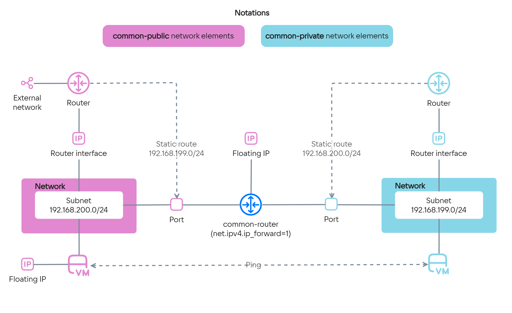

{include(/kz/_includes/_translated_by_ai.md)}

Төменде Terraform көмегімен екі желі арасындағы бағдарлауды баптау мысалы келтірілген.

Мысал инфрақұрылымы:

- Мысалда екі желі жасалған: `common-private` жеке желісі және `common-public` жария желісі. Әрбір желі бір ішкі желіден тұрады.
- Әрбір желі үшін тиісті ішкі желілерде интерфейстері бар бағдарлауыштар жасалған.
- Жария желі бағдарлауышы үшін сыртқы желіге қатынау бапталған, сондықтан осы желідегі объектілерге Floating IP мекенжайларын тағайындауға болады.
- Әрбір желіде оның жалғыз ішкі желісіне сәйкес келетін порт жасалған. Осы порттарға екі желі арасындағы бағдарлауыш рөлін атқаратын `common-router` виртуалды машинасы қосылады.
- Бағдарлауыштарда виртуалды машина порты арқылы басқа ішкі желіге апаратын статикалық маршруттар бапталған.
- Әрбір ішкі желіде бір виртуалды машинадан жасалған. Жария желідегі виртуалды машинада Floating IP мекенжайы бар.

  Бұл машиналар [желілер арасындағы бағдарлаудың бапталуын тексеру](#5_mysaldyn_zhumyska_kabilettiligin_tekseriniz) үшін пайдаланылады: олардың арасындағы сәтті ping дұрыс баптауды білдіреді.

{params[noBorder=true]}

Параметрлердің толық сипаттамасы — [Terraform провайдерінің құжаттамасында](https://github.com/vk-cs/terraform-provider-vkcs/tree/master/docs).

## Жұмысты бастамас бұрын

1. [Квоталарды](/kz/tools-for-using-services/account/concepts/quotasandlimits) тексеріңіз. Таңдалған [аймақта](/kz/tools-for-using-services/account/concepts/regions) желілер мен виртуалды машиналарды жасау үшін ресурстар жеткілікті екеніне көз жеткізіңіз. Әртүрлі аймақтар үшін әртүрлі квоталар бапталуы мүмкін.

   Қажет болса, [квоталарды](/kz/tools-for-using-services/account/instructions/project-settings/manage#increase-quota) ұлғайтыңыз.

1. OpenStack клиенті [орнатылғанына](/kz/tools-for-using-services/cli/openstack-cli#1_openstack_klientin_ornatynyz) көз жеткізіңіз және жоба ішінде [аутентификациядан өтіңіз](/kz/tools-for-using-services/cli/openstack-cli#3_autentifikaciyadan_otiniz).

1. Бұл әлі жасалмаған болса, [Terraform орнатып, ортаны баптаңыз](/kz/tools-for-using-services/terraform/quick-start).

   Провайдер баптауларын Terraform конфигурациясының `provider.tf` файлына орналастырыңыз.

1. Айнымалылары бар Terraform конфигурациясының `variables.tf` файлын жасаңыз:

   ```hcl
   variable "image_flavor" {
     type = string
     default = "Ubuntu-22.04-202208"
   }

   variable "compute_flavor" {
     type = string
     default = "STD2-2-4"
   }

   variable "key_pair_name" {
     type = string
     default = "default"
   }

   variable "availability_zone_name" {
     type = string
     default = "MS1"
   }
   ```

   Бұл файлда келесі айнымалылар жарияланады:

   - `image_flavor`: виртуалды машина бейнесінің атауы;
   - `compute_flavor`: виртуалды машина конфигурациясы қалыбының атауы;
   - `key_pair_name`: виртуалды машинаға SSH арқылы қосылу үшін пайдаланылатын кілт жұбының атауы;
   - `availability_zone_name`: виртуалды машина орналастырылатын қолжетімділік аймағының атауы.

   Қажет болса, олардың рұқсат етілген мәндерін нақтылап, айнымалылар мәндерін түзетіңіз:

   {tabs}

   {tab(image_flavor)}

   OpenStack CLI көмегімен:

   ```console
   openstack image list
   ```

   {/tab}

   {tab(compute_flavor)}

   OpenStack CLI көмегімен:

   ```console
   openstack flavor list
   ```

   {/tab}

   {tab(key_pair_name)}

   OpenStack CLI көмегімен:

   ```console
   openstack keypair list
   ```

   {/tab}

   {tab(availability_zone_name)}

   [Қолжетімділік аймақтарына](/kz/start/concepts/architecture#az) арналған құжаттан.

   {/tab}

   {/tabs}

## 1. Базалық желілік инфрақұрылым сипатталған файлдарды жасаңыз

1. Terraform конфигурациясының `common-public.tf` файлын жасаңыз. Онда мыналар сипатталады:

   - жария желі мен ішкі желі;
   - `internet` сыртқы желісіне қатынауы және жария ішкі желідегі интерфейсі бар бағдарлауыш.

   ```hcl
   data "vkcs_networking_network" "extnet" {
     name = "internet"
   }

   resource "vkcs_networking_network" "common-public" {
     name = "common-public-net"
   }

   resource "vkcs_networking_subnet" "common-public" {
     name            = "common-public-subnet"
     network_id      = vkcs_networking_network.common-public.id
     cidr            = "192.168.200.0/24"
     dns_nameservers = ["8.8.8.8", "8.8.4.4"]
   }

   resource "vkcs_networking_router" "common-public" {
     name                = "common-public-router"
     admin_state_up      = true
     external_network_id = data.vkcs_networking_network.extnet.id
   }

   resource "vkcs_networking_router_interface" "common-public" {
     router_id = vkcs_networking_router.common-public.id
     subnet_id = vkcs_networking_subnet.common-public.id
   }
   ```

1. Terraform конфигурациясының `common-private.tf` файлын жасаңыз. Онда мыналар сипатталады:

   - жеке желі мен ішкі желі;
   - жеке ішкі желідегі интерфейсі бар бағдарлауыш.

   ```hcl
   resource "vkcs_networking_network" "common-private" {
     name = "common-private-net"
   }

   resource "vkcs_networking_subnet" "common-private" {
     name            = "common-private-subnet"
     network_id      = vkcs_networking_network.common-private.id
     cidr            = "192.168.199.0/24"
     dns_nameservers = ["8.8.8.8", "8.8.4.4"]
   }

   resource "vkcs_networking_router" "common-private" {
     name           = "common-private-router"
     admin_state_up = true
   }

   resource "vkcs_networking_router_interface" "common-private" {
     router_id = vkcs_networking_router.common-private.id
     subnet_id = vkcs_networking_subnet.common-private.id
   }
   ```

## 2. Бағдарлауыш рөліндегі виртуалды машинаға арналған инфрақұрылым сипатталған файлды жасаңыз

Terraform конфигурациясының `main.tf` файлын жасаңыз. Онда мыналар сипатталады:

- Виртуалды машина қосылатын жария және жеке ішкі желілердегі порттар.
- Виртуалды машинаның конфигурациясы.

  Конфигурацияда бағдарлауды қосатын команданы `user_data` көмегімен орындау үшін `cloud-init` параметрі пайдаланылады:

  ```console
  sysctl -w net.ipv4.ip_forward=1
  ```

- Виртуалды машина порттары арқылы қажетті желілерге арналған статикалық маршруттар.
- Виртуалды машинаға SSH арқылы қосылуға арналған Floating IP мекенжайы.

```hcl
data "vkcs_compute_flavor" "router-compute" {
  name = var.compute_flavor
}

data "vkcs_images_image" "router-image" {
  name = var.image_flavor
}

resource "vkcs_networking_port" "common-private" {
  name       = "common-private"
  network_id = vkcs_networking_network.common-private.id
  allowed_address_pairs {
    ip_address = vkcs_networking_subnet.common-public.cidr
  }
  admin_state_up = "true"
}

resource "vkcs_networking_port" "common-public" {
  name       = "common-public"
  network_id = vkcs_networking_network.common-public.id
  allowed_address_pairs {
    ip_address = vkcs_networking_subnet.common-private.cidr
  }
  admin_state_up = "true"
}

resource "vkcs_compute_instance" "common-router" {
  name              = "common-router"
  flavor_id         = data.vkcs_compute_flavor.router-compute.id
  security_groups   = ["default", "ssh"]
  availability_zone = var.availability_zone_name
  key_pair          = var.key_pair_name
  config_drive      = true

  user_data = <<EOF
#cloud-config
runcmd:
- sysctl -w net.ipv4.ip_forward=1
EOF

  block_device {
    uuid                  = data.vkcs_images_image.router-image.id
    source_type           = "image"
    volume_size           = 10
    volume_type           = "ceph-ssd"
    boot_index            = 0
    destination_type      = "volume"
    delete_on_termination = true
  }

  network {
    port = vkcs_networking_port.common-public.id
  }

  network {
    port = vkcs_networking_port.common-private.id
  }

  depends_on = [
    vkcs_networking_network.common-private,
    vkcs_networking_subnet.common-private,
    vkcs_networking_network.common-public,
    vkcs_networking_subnet.common-public
  ]
}

resource "vkcs_networking_router_route" "common-public" {
  router_id        = vkcs_networking_router.common-public.id
  destination_cidr = vkcs_networking_subnet.common-private.cidr
  next_hop         = vkcs_networking_port.common-public.all_fixed_ips[0]
  depends_on = [
    vkcs_networking_router_interface.common-public,
    vkcs_networking_port.common-public,
    vkcs_compute_instance.common-router
  ]
}

resource "vkcs_networking_router_route" "common-private" {
  router_id        = vkcs_networking_router.common-private.id
  destination_cidr = vkcs_networking_subnet.common-public.cidr
  next_hop         = vkcs_networking_port.common-private.all_fixed_ips[0]
  depends_on = [
    vkcs_networking_router_interface.common-private,
    vkcs_networking_port.common-private,
    vkcs_compute_instance.common-router
  ]
}

resource "vkcs_networking_floatingip" "fip-router" {
  pool = data.vkcs_networking_network.extnet.name
}

resource "vkcs_compute_floatingip_associate" "fip-router" {
  floating_ip = vkcs_networking_floatingip.fip-router.address
  instance_id = vkcs_compute_instance.common-router.id
}
```

## 3. Сынақ виртуалды машиналары сипатталған файлды жасаңыз

Terraform конфигурациясының `test-vms.tf` файлын жасаңыз. Онда мыналар сипатталады:

- Виртуалды машиналар:

  - Floating мекенжайы бар жария ішкі желідегі `common-instance-public`. Мұндай виртуалды машинаға интернеттен SSH арқылы қосылуға болады.
  - Жеке ішкі желідегі `common-instance-private`. Мұндай виртуалды машинаға басқа виртуалды машинадан SSH арқылы қосылуға болады.

  Бұл виртуалды машиналар [екі желі арасындағы бағдарлаудың жұмысқа қабілеттілігін тексеру](#5_mysaldyn_zhumyska_kabilettiligin_tekseriniz) үшін пайдаланылады.

- Виртуалды машиналардың IP мекенжайлары бар Terraform шығулары ([output](https://developer.hashicorp.com/terraform/language/values/outputs)).

```hcl
data "vkcs_compute_flavor" "vm-compute" {
  name = var.compute_flavor
}

data "vkcs_images_image" "vm-image" {
  name = var.image_flavor
}

resource "vkcs_compute_instance" "common-private" {
  name              = "common-instance-private"
  flavor_id         = data.vkcs_compute_flavor.vm-compute.id
  security_groups   = ["default", "ssh"]
  availability_zone = var.availability_zone_name
  key_pair          = var.key_pair_name

  block_device {
    uuid                  = data.vkcs_images_image.vm-image.id
    source_type           = "image"
    volume_size           = 10
    volume_type           = "ceph-ssd"
    boot_index            = 0
    destination_type      = "volume"
    delete_on_termination = true
  }

  network {
    uuid = vkcs_networking_network.common-private.id
  }

  depends_on = [
    vkcs_networking_network.common-private,
    vkcs_networking_subnet.common-private
  ]
}

resource "vkcs_compute_instance" "common-public" {
  name              = "common-instance-public"
  flavor_id         = data.vkcs_compute_flavor.vm-compute.id
  security_groups   = ["default", "ssh"]
  availability_zone = var.availability_zone_name
  key_pair          = var.key_pair_name

  block_device {
    uuid                  = data.vkcs_images_image.vm-image.id
    source_type           = "image"
    volume_size           = 10
    volume_type           = "ceph-ssd"
    boot_index            = 0
    destination_type      = "volume"
    delete_on_termination = true
  }

  network {
    uuid = vkcs_networking_network.common-public.id
  }

  depends_on = [
    vkcs_networking_network.common-public,
    vkcs_networking_subnet.common-public
  ]
}

resource "vkcs_networking_floatingip" "fip" {
  pool = data.vkcs_networking_network.extnet.name
}

resource "vkcs_compute_floatingip_associate" "fip" {
  floating_ip = vkcs_networking_floatingip.fip.address
  instance_id = vkcs_compute_instance.common-public.id
}

output "common-instance-public-floating-ip" {
  description = "The common-public VM floating IP address"
  value       = vkcs_networking_floatingip.fip.address
}

output "common-instance-public-ip" {
  description = "The common-public VM IP address"
  value       = vkcs_compute_instance.common-public.network[0].fixed_ip_v4
}

output "common-instance-private-ip" {
  description = "The common-private VM IP address"
  value       = vkcs_compute_instance.common-private.network[0].fixed_ip_v4
}
```

## 4. Terraform көмегімен қажетті ресурстарды жасаңыз

1. Жасалған Terraform конфигурация файлдарын бір директорияға орналастырыңыз:

   - `provider.tf`;
   - `variables.tf`;
   - `main.tf`;
   - `common-public.tf`;
   - `common-private.tf`;
   - `test-vms.tf`.

1. Осы директорияға өтіңіз.

1. Команданы орындаңыз:

   ```console
   terraform init
   ```

1. Команданы орындаңыз:

   ```console
   terraform apply
   ```

   Растауды сұрағанда, `yes` енгізіңіз.

1. Операцияның аяқталуын күтіңіз.

   Ресурстарды жасау аяқталғаннан кейін Terraform мынадай шығуларды көрсетеді:

   - `common-instance-private-ip`: жеке ішкі желідегі виртуалды машинаның IP мекенжайы.
   - `common-instance-public-ip`: жария ішкі желідегі виртуалды машинаның IP мекенжайы.
   - `common-instance-public-floating-ip`: жария ішкі желідегі виртуалды машинаның Floating IP мекенжайы.

   Бұл IP мекенжайларын [мысалдың жұмысқа қабілеттілігін тексеру](#5_mysaldyn_zhumyska_kabilettiligin_tekseriniz) кезінде пайдаланыңыз.

## 5. Мысалдың жұмысқа қабілеттілігін тексеріңіз

1. `common-instance-public` виртуалды машинасына [SSH арқылы қосылыңыз](/kz/computing/iaas/instructions/vm/vm-connect/vm-connect-nix).

   Қосылу үшін мыналарды пайдаланыңыз:

   - `common-instance-public-floating-ip` шығуындағы IP мекенжайы.
   - `key_pair_name` файлындағы `variables.tf` айнымалысында көрсетілген атауы бар SSH кілті.

1. `common-instance-private-ip` шығуындағы IP мекенжайға ping орындаңыз:

   ```console
   ping 192.168.199.XXX
   ```

   Сәтті ping мысалдың дұрыс жұмыс істейтінін білдіреді:

   ```text
   PING 192.168.199.XXX (192.168.199.XXX) 56(84) bytes of data.
   64 bytes from 192.168.199.XXX: icmp_seq=1 ttl=63 time=1.82 ms
   64 bytes from 192.168.199.XXX: icmp_seq=2 ttl=63 time=0.875 ms
   64 bytes from 192.168.199.XXX: icmp_seq=3 ttl=63 time=0.903 ms
   64 bytes from 192.168.199.XXX: icmp_seq=4 ttl=63 time=0.966 ms
   ^C
   --- 192.168.199.10 ping statistics ---
   4 packets transmitted, 4 received, 0% packet loss, time 3004ms
   rtt min/avg/max/mdev = 0.875/1.139/1.815/0.391 ms
   ```

## Пайдаланылмайтын ресурстарды жойыңыз

Егер Terraform көмегімен жасалған ресурстар енді қажет болмаса, оларды жойыңыз:

1. Terraform конфигурация файлдары бар директорияға өтіңіз.

1. Команданы орындаңыз:

   ```console
   terraform destroy
   ```

   Растауды сұрағанда, `yes` енгізіңіз.

1. Операцияның аяқталуын күтіңіз.
