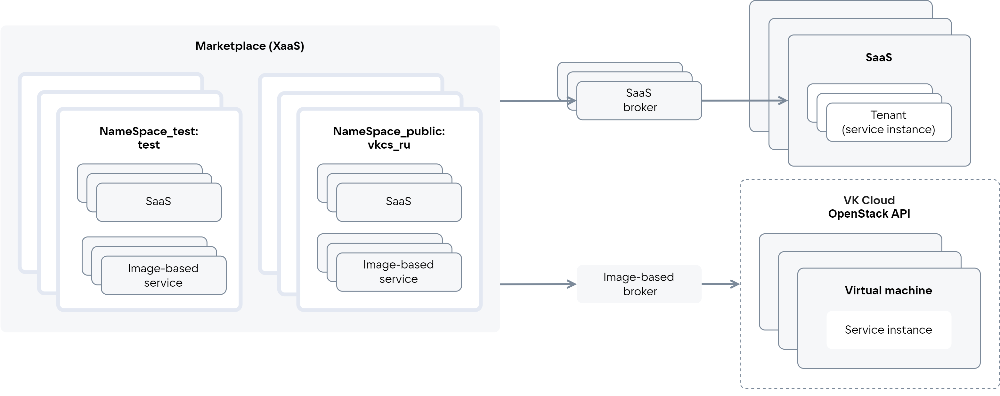
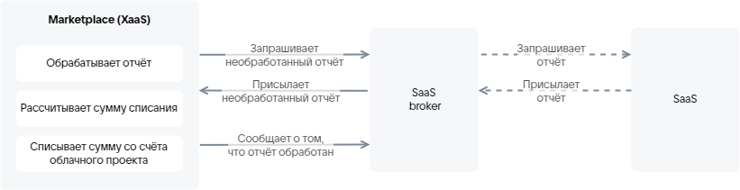
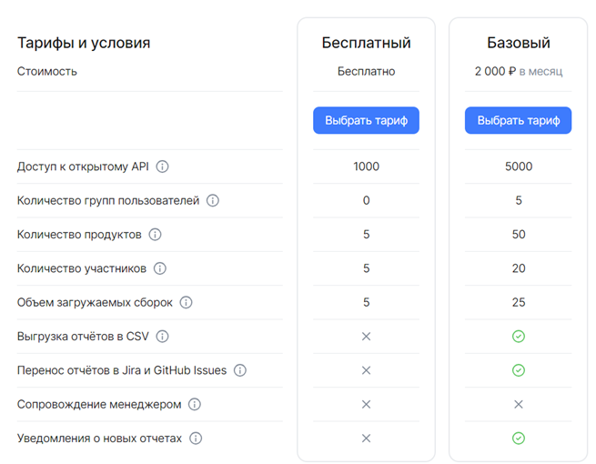
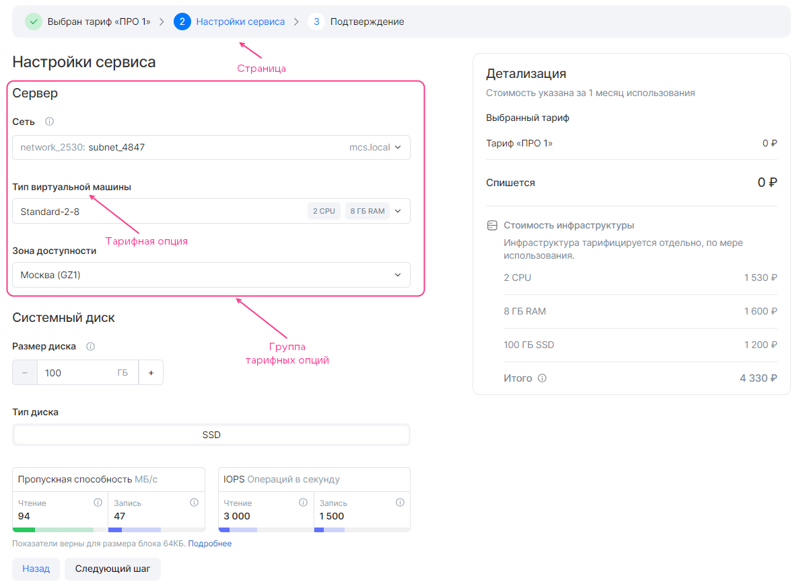

{include(/kz/_includes/_translated_by_ai.md)}

# {heading(Жалпы ақпарат)[id=index]}

Сервистер орналастырылатын жүйенің толық атауы: VK Cloud (XaaS).

Жүйенің қысқаша атаулары: Marketplace, қолданбалар дүкені, дүкен.

Marketplace VK Cloud бұлттық платформасымен интеграцияланған. Marketplace бұлттық платформа пайдаланушыларына онда орналастырылған сервистерге қолжетімділікті қамтамасыз етеді.

{note:info}

Дүкенге қосылған сервистер бұлттық платформаның ЛК-сындағы **Қолданбалар дүкені** бөлімінде көрсетіледі.

{/note}

Дүкенмен өзара әрекеттесетін пайдаланушылардың рөлдері:

* Жеткізуші — сервисті дүкенге қосады. Дүкеннің тестілік және ашық атаулар кеңістіктері қолжетімді.
* Тұтынушы — дүкенде орналастырылған сервисті пайдаланады. Тек дүкеннің ашық атаулар кеңістіктері қолжетімді.

Осы құжат жеткізушілерге арналған.

Осы құжат сервистерді дүкенге қосу тәртібін сипаттайды.

## {heading(Сервистер түрлері)[id=xaas_vendor_index_type_services]}

Дүкен келесі сервис түрлерін орналастыруға мүмкіндік береді:

* SaaS-қолданба — орталықтандырылған орнатылған мультитенантты өнім. Сервистің жұмыс істеуіне арналған инфрақұрылымды жеткізуші ұсынады. Жеткізуші сервисті не бөгде инфрақұрылымда, не өз жобасындағы бұлттық платформа инфрақұрылымында жаяды. Пайдаланушыға сервис инстансына жеке тенант/аккаунт арқылы қолжетімділік беріледі.
* Image-based қолданба — пайдаланушының бұлттық жобасындағы виртуалды машиналар образдарының негізінде жайылатын өнім. Сервистің жұмысы үшін бұлттық платформаның қосымша инфрақұрылымы пайдаланылуы мүмкін: виртуалды желілер, жүктеме теңгергіштері, DBaaS кластерлері, VK Object Storage, резервтік көшіру. Сервистің жұмыс істеуіне арналған инфрақұрылымды бұлттық платформа ұсынады. Сервис инстанстары пайдаланушының жобасында жайылады.

   Marketplace бір ВМ-де де, кластерде де жайылатын image-based қолданбаларды орналастыруға мүмкіндік береді.

Сервис ұсынатын қызметтер тарифтік жоспарлар мен опциялар арқылы сипатталады. Тарифтік опция — бұл жоспардың нақты параметрі.

Дүкеннің сервистермен өзара әрекеттесуі VK OSB протоколы бойынша брокерлер арқылы жүзеге асырылады ({linkto(#pic_xaas)[text=сурет %number]}). Брокер сервис конфигурациясын дүкенге жеткізуді қамтамасыз етеді: дүкен брокерден сервис конфигурациясының ағымдағы күйін мерзімді түрде сұратады.

{caption(Сурет {counter(pic)[id=numb_pic_xaas]} — Дүкеннің сервистермен өзара әрекеттесуі)[align=center;position=under;id=pic_xaas;number={const(numb_pic_xaas)} ]}
{params[noBorder=true]}
{/caption}

SaaS-брокер нақты SaaS-қолданбаның дүкенмен өзара әрекеттесуін қамтамасыз етеді. Image-based брокер image-based қолданбалардың дүкенмен өзара әрекеттесуін қамтамасыз етеді. Image-based брокердің ішінде бір жеткізушінің image-based қолданбаларын біріктіретін тенанттар болады.

{note:warn}

SaaS-қолданба жеткізушісі SaaS-брокерді әзірлейді.

Image-based қолданба жеткізушісі image-based брокерге арналған сервистік пакетті әзірлейді.

Image-based қолданбаларға арналған брокерді VK әзірлеген.

{/note}

Дүкенге мыналар кіреді:

* Қызмет жарияланар алдында оның конфигурациясы тексерілетін тестілік атаулар кеңістіктері (`NameSpace_test`). Сервистің барлық ревизиялары қолжетімді.
* Сервис жарияланатын ашық атаулар кеңістіктері (`NameSpace_public`). Тек соңғы жарияланған сервис ревизиясы қолжетімді.

Тестілік атаулар кеңістіктеріне қолжетімділік тек жеткізушілерге беріледі. Егер пайдаланушының бірнеше атаулар кеңістігіне қолжетімділігі болса, онда ол дүкен каталогында өзі қол жеткізе алатын кем дегенде бір атаулар кеңістігінде орналастырылған барлық сервистер мен олардың ревизияларын көреді.

Image-based қолданба үшін тестілік және ашық атаулар кеңістіктері сервистік кілтте және image-based брокерде, ал SaaS-қолданба үшін Marketplace-те брокерді тіркеу кезінде SaaS-брокерде беріледі.

Сервіспен байланысты және дүкенмен интеграция кезінде пайдаланылатын мәндер {linkto(#tab_entities)[text=%number-кестеде]} келтірілген.

{caption(Кесте {counter(table)[id=numb_tab_entities]} — Сервіспен байланысты мәндер)[align=right;position=above;id=tab_entities;number={const(numb_tab_entities)}]}
[cols="2,5", options="header"]
|===
|Атауы
|Сипаттамасы

|Сервис инстансы (Service instance)
|
Пайдаланушыда жайылған сервис данасы

|Сервистік байланыс (Service binding)
|
Бұлттық платформадан брокерге түскен сұрау негізінде сервис инстансы жайылғаннан кейін жасалатын және сервис инстансымен байланыстырылатын мән.

Көбіне сервистік байланыс пайдаланушыға сервиске қол жеткізуге арналған сезімтал ақпаратты беру үшін қолданылады. Егер сервис дүкеннің қатысуынсыз қолжетімділік деректерін жібере алса, онда бұл міндет үшін сервистік байланысты пайдалану талап етілмейді. Сервистік байланыстар қолданылатын міндеттер нақты сервиске байланысты
|===
{/caption}

{note:info}

SaaS-қолданба сервисінің инстансы — бұл SaaS-қолданбаның тенанты/аккаунты. Мысалы, VK Testers SaaS-қолданбасының инстансы VK Testers-тегі бір компанияға сәйкес келеді.

{/note}

## {heading(Тарифтік опциялардың түрлері)[id=xaas_option_types]}

{linkto(#tab_tariff_options_types)[text=%number-кестеде]} келтірілген тарифтік опция түрлері қолдау көрсетіледі.

{caption(Кесте {counter(table)[id=numb_tab_tariff_options_types]} — Тарифтік опциялардың түрлері)[align=right;position=above;id=tab_tariff_options_types;number={const(numb_tab_tariff_options_types)}]}
[cols="4,2,2", options="header"]
|===
|Тарифтік опция түрі
|SaaS-қолданба
|Image-based қолданба

|Сандық (integer, number)
| 
| 

|Жолдық (string)
| 
| 

|Логикалық (boolean)
| 
| 

|Datasource
| 
| 
|===
{/caption}

`datasource` опция түрі бұлттық платформа мәндерімен байланысты опцияларды сипаттау үшін қолданылады. Мұндай түр бұлттық платформа деректерін нақты уақыт режимінде пайдалануға мүмкіндік береді. Осы деректердің негізінде сервисті қосу немесе тарифтік жоспарды жаңарту кезінде опцияның ықтимал мәндері қалыптастырылады.

Қолдау көрсетілетін `datasource` түрлері:

* Бұлттық платформа пайдаланушысының жобасында қолжетімді ВМ түрлері.
* Бұлттық платформаның қолжетімділік аймақтары.
* Бұлттық платформа жобасында қолжетімді виртуалды желілер.
* Диск түрі.

## {heading(Тарифтеу)[id=xaas_billing]}

Тарифтік жоспарлар ақылы немесе тегін болуы мүмкін.

Тарифтік жоспарларда ақылы тарифтік опциялар болуы мүмкін. Келесі түрдегі ақылы опциялар қолдау көрсетіледі:

* Сандық.
* Логикалық.

Тарифтік жоспарлар мен опциялардың құны сервис конфигурациясында сипатталады.

Тарифтеу түрлерінің (төлеу тәсілдерінің) сипаттамасы {linkto(#tab_tariff_types)[text=%number-кестеде]} келтірілген.

{caption(Кесте {counter(table)[id=numb_tab_tariff_types]} — Тарифтеу түрлері)[align=right;position=above;id=tab_tariff_types;number={const(numb_tab_tariff_types)}]}
[cols="2,5", options="header"]
|===
|Атауы
|Сипаттамасы

|Тегін (Free)
|
Сервисті пайдалану үшін төлем алынбайды.

Image-based қолданба үшін бұлттық платформа инфрақұрылымы төленеді

|Алдын ала төленетін (Upfront Commitment)
|
Сервис үшін төлем есептік кезеңде бір рет сервисті қосу күні немесе тарифтік жоспарды ауыстыру күні есептен шығарылады. Есептік кезеңнің ұзақтығы мен есептен шығару күні сервис конфигурациясында бапталады (толығырақ — {linkto(/kz/tools-for-using-services/vendor-account/manage-apps/ibservice_add/ibservice_configure/ibplan#ibplan)[text=%text]}, {linkto(/kz/tools-for-using-services/vendor-account/manage-apps/saas_add/saas_configure/saas_plan#saas_plan_param)[text=%text]} бөлімдерінде).

Құны бекітілген.

Егер есептен шығару сәтінде жоба шотында қаражат жеткіліксіз болса, пайдаланушы мәжбүрлі түрде тегін тарифтік жоспарға ауыстырылады.

Егер сервисте тегін тарифтік жоспар болмаса, сервис инстансы өшіріледі, пайдаланушы оған қолжетімділігін жоғалтады

|Кейін төленетін (Usage Based)
|
Сервис үшін төлем есептік кезең ішінде нақты пайдаланылған сервис ресурстарының санына қарай есептеледі (мысалы, пайдаланылатын сақтау қоймасының көлемі).

Пайдаланылған сервис ресурстарының (тарифтік опциялардың) төлемі дүкен алған метрикалар негізінде нақты пайдалану фактісі бойынша жүргізіледі. Метрикаларды алу тәсілдері:

* Pull-модель.
* Push-модель.

Дүкен метрикаларды алатын тарифтік опциялар сервис конфигурациясында сипатталуы тиіс.

Есептен шығарулардың мерзімділігі метрикаларды алу мерзімділігіне байланысты. Мысалы, егер дүкен метрикаларды айына бір рет алса, төлем де айына бір рет есептен шығарылады.

Егер есептен шығару сәтінде жоба шотында қаражат жеткіліксіз болса, soft-кезең басталады:

* Пайдаланушыға шотты толықтыру қажеттігі туралы email-хабарлама жіберіледі, әйтпесе soft-кезең аяқталғаннан кейін сервис инстансы өшіріледі (тоқтатылады).
* Soft-кезең ішінде жоба шотының балансы күн сайын тексеріледі. Қаражат жеткілікті болған жағдайда есептен шығару жүргізіледі.

Егер soft-кезең аяқталғанға дейін шот қажетті сомаға толықтырылмаса, hard-кезең басталады:

* Қаражат жоба шотынан мәжбүрлі түрде есептен шығарылады, жоба бұғатталады.
* Сервис инстансы өшіріледі, пайдаланушы оған қолжетімділігін жоғалтады.
* Пайдаланушыға шотты толықтыру қажеттігі туралы email-хабарлама жіберіледі, әйтпесе hard-кезең аяқталғаннан кейін сервис инстансы жойылады.

{note:err}

Егер hard-кезең аяқталғанға дейін жоба шотының балансы оң мәнге дейін толықтырылмаса, сервис инстансы жойылады.

{/note}

{note:warn}

Кейін төленетін есептен шығару тәсілі тек тегін тарифтік жоспардағы тарифтік опцияларға ғана қолданылады.

{/note}

|BYOL (Bring Your Own License)
|
Сервистер үшін бөгде лицензияларды пайдалану. Сервис инстансы лицензиясыз жайылады
|===
{/caption}

{note:warn}

Бұлттық платформа сервистері кейінгі төлем шарттарымен ұсынылатын жобаларда сервис инстанстарын өшіру қолданылмайды.

{/note}

### {heading(Кейін төленетін тарифтеудің Pull-моделі)[id=billing_pull]}

{note:warn}

Кейін төленетін тарифтеудің Pull-моделі тек SaaS-қолданбалар үшін қолдау көрсетіледі.

{/note}

Pull-модель — сервис ұсынған есеп негізінде нақты пайдаланылған ресурстар бойынша метрикаларды алу тәсілі. Дүкен жағынан брокерге өңделмеген есептердің бар-жоғы туралы сұрау белгіленген мерзімділікпен жіберіледі ({linkto(#pic_xaas_saas_broker_resource_usage)[text=сурет %number]}):

1. Егер брокерде өңделмеген есептер болса, брокер оларды дүкенге береді.
1. Егер брокерде өңделмеген есептер болмаса, келесі әрекеттер орындалады:

   1. Брокер сервистен есеп сұратады.
   1. Брокердің сұрауы бойынша сервис оған барлық қолданыстағы сервис инстанстары бойынша есеп береді.
   1. Брокер есепке `batch_id` идентификаторын тағайындайды.
   1. Брокер дүкеннің сұрауына жауап ретінде оған өңделмеген есепті береді.

1. Дүкен алынған есеп негізінде пайдаланылған ресурстардың құнын есептейді.
1. Есеп өңделгеннен кейін (осы есеп бойынша қаражатты есептен шығару орындалды немесе жоспарланды) дүкен брокерге осы есептің `batch_id` мәнін хабарлайды. Бұдан әрі брокер өңделген есептерді дүкенге бермейді.

Дүкеннен брокерге сұраулар жіберілетін мерзімділік сервис конфигурациясындағы `billing_cycle_step` параметрінде бапталады (толығырақ — {linkto(/kz/tools-for-using-services/vendor-account/manage-apps/saas_add/saas_configure/saas_plan#saas_plan_param)[text=%text]} бөлімінде).

{caption(Сурет {counter(pic)[id=numb_pic_xaas_saas_broker_resource_usage]} — Дүкен мен брокер арасындағы есепті беру)[align=center;position=under;id=pic_xaas_saas_broker_resource_usage;number={const(numb_pic_xaas_saas_broker_resource_usage)} ]}
{params[noBorder=true]}
{/caption}

SaaS-брокерде есепті дүкенге беретін әдістер іске асырылуы тиіс. Есеп пішімі {linkto(/kz/tools-for-using-services/vendor-account/manage-apps/saas_add/saas_broker#saas_broker)[text=%text]} бөлімінде келтірілген.

### {heading(Кейін төленетін тарифтеудің Push-моделі)[id=billing_push]}

Push-модель — сервис жіберетін API-сұрау көмегімен нақты пайдаланылған ресурстар бойынша метрикаларды алу тәсілі. API-сұраудың параметрлері {linkto(#tab_metrics_request)[text=%number-кестеде]} келтірілген.

{caption(Кесте {counter(table)[id=numb_tab_metrics_request]} — Дүкенге метрикаларды жіберу сұрауының параметрлері)[align=right;position=above;id=tab_metrics_request;number={const(numb_tab_metrics_request)}]}
[cols="2,5", options="header"]
|===
|Параметр
|Мәні

|
Сұрау әдісі
|
`POST`

|
Сұрау жолы
|
`https://<CLOUD_HOST>/marketplace/api/infra-api/api/v1-public/usages`

Мұнда `<CLOUD_HOST>` — `https://cloud.vk.com` бұлттық платформасының домендік атауы

|
`Content-Type`
|
`application/json`

|
Сұрау денесі (`--data`)
|
Сұрау денесінде сервис инстанстары бойынша метрикалар беріледі. Келесі параметрлерді көрсетіңіз:

* `base_date` — RFC3339 форматындағы метрикаларды жіберу күні.

   Егер күн көрсетілмесе, API-сұрауды орындаудың ағымдағы күні мен уақыты қолданылады.
* `broker_id` — брокердің дүкенде тіркелген ID-і. Брокер ID-ін алу үшін [marketplace@cloud.vk.com](mailto:marketplace@cloud.vk.com) мекенжайына келесі ақпаратпен хат жіберіңіз:

   * Компания атауы.
   * Сервис атауы.

   Егер компанияда тек бір SaaS-брокер немесе image-based брокерде тек бір тенант болса, бұл параметрді көрсетпеңіз.
* `usages` — сервистің пайдаланылған ресурстары бойынша метрикалар.

   * `usages.instance_uuid` — сервис инстансының ID-і.
   * `usages.param` — тарифтік опцияның атауы. SaaS-қолданба үшін атау JSON-файлда көрсетілген атауға, image-based қолданба үшін — опцияның YAML-файлы атауына сәйкес болуы тиіс.
   * `usages.value` — тарифтік опцияның тұтынылған саны

|
`x-service-token`
|
`<SERVICE_TOKEN_USAGES>` — метрикаларды жіберуге арналған сервистік кілт. Метрикаларға арналған сервистік кілтті алу үшін [marketplace@cloud.vk.com](mailto:marketplace@cloud.vk.com) мекенжайына келесі ақпаратпен хат жіберіңіз:

* Компания атауы.
* Метрикаларды жіберуге арналған сервистік кілт иесі болып тағайындалатын пайдаланушының Email-ы.

Әдепкі бойынша метрикаларға арналған сервистік кілттің жарамдылық мерзімі — 1 жыл.

{note:warn}

Image-based қолданбаның сервистік пакетін жүктеу кезінде пайдаланылатын сервистік кілт арқылы дүкенге метрикаларды жіберу мүмкін емес.

{/note}
|===
{/caption}

{caption(Дүкенге метрикаларды жіберу сұрауының мысалы)[align=left;position=above]}
```console
$ curl -v -X POST https://cloud.vk.com/marketplace/api/infra-api/api/v1-public/usages \
-H "Content-Type: application/json" \
-H 'x-service-token: <SERVICE_TOKEN_USAGES>' \
--data '{
      "broker_id": "7",
      "usages: [
        {
        "instance_uuid": "078621f1-ebe3-4f16-b998-503c487e4bfc",
        "param": "storage", // Имя опции в JSON-файле или имя YAML-файла
        "value": 2.55786
        }
      ]
}'
```
{/caption}

Жауаптың HTTP-кодтары {linkto(#tab_http_response_codes)[text=%number-кестеде]} келтірілген.

{caption(Кесте {counter(table)[id=numb_tab_http_response_codes]} — HTTP жауап кодтары)[align=right;position=above;id=tab_http_response_codes;number={const(numb_tab_http_response_codes)}]}
[cols="2,5", options="header"]
|===
|Код
|Сипаттамасы

|200
|Метрикалар жіберілді

|400, 500
|Сұрауды орындау қатесі

|401
|Авторизация қатесі
|===
{/caption}

## {heading(Тарифтік жоспарлар матрицасы)[id=xaas_tariff_matrix]}

Тарифтік жоспарлар матрицасы ({linkto(#pic_preview)[text=сурет %number]}) сервис туралы ақпаратты қарау кезінде тарифтер бетінде көрсетіледі. Матрица негізінде пайдаланушы сервис тарифтерін өзара салыстыра алады: қай тарифтік жоспарға қандай опциялар кіреді.

{caption(Сурет {counter(pic)[id=numb_pic_preview]} — Тарифтік жоспарлар матрицасы)[align=center;position=under;id=pic_preview;number={const(numb_pic_preview)} ]}

{/caption}

Тарифтік жоспарлар матрицасы сервис конфигурациясында сипатталады. Онда пайдаланушы тарифтік жоспарды таңдау кезінде сүйенетін сервис тарифтік опциялары көрсетіледі.

## {heading(Тарифтік жоспар конфигурациясының шебері)[id=xaas_wizard]}

Сервисті қосу кезінде және тарифтік жоспарды жаңарту кезінде пайдаланушыға тарифтік жоспар конфигурациясының шебері көрсетіледі.

Тарифтік жоспар конфигурациясының шебері пайдаланушыға нақты тарифтік жоспар үшін тарифтік опцияларды баптауға мүмкіндік береді.

Дүкен интерфейсінде тарифтік жоспар конфигурациясының шебері жеке беттерге бөлінген ({linkto(#pic_xaas_wizard)[text=сурет %number]}). Әр бет тарифтік жоспарды баптаудың нақты кезеңін сипаттайды. Бетте осы кезеңде бапталатын тарифтік опциялар көрсетіледі. Опциялар топтарға біріктірілген.

{caption(Сурет {counter(pic)[id=numb_pic_xaas_wizard]} — Тарифтік жоспар конфигурациясының шебері)[align=center;position=under;id=pic_xaas_wizard;number={const(numb_pic_xaas_wizard)} ]}

{/caption}

Тарифтік жоспар конфигурациясының шеберінің бірінші және соңғы беттері автоматты түрде қосылады. Қалған беттер сервис конфигурациясында сипатталады.

Тарифтік жоспар конфигурациясының шеберінде тарифтік жоспар мен ақылы тарифтік опциялардың құны көрсетіледі. Image-based қолданбалар үшін қосымша түрде бұлттық платформа инфрақұрылымының құны көрсетіледі, ол бұлттық платформа тарифтеріне сәйкес автоматты түрде есептеледі. Есептеуге арналған параметрлер image-based қолданбаның конфигурациясында сипатталады.
