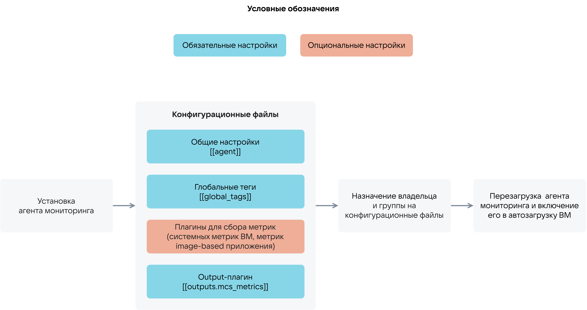

{include(/kz/_includes/_translated_by_ai.md)}

# {heading(Мониторинг агенті)[id=ib_cloud_monitoring_telegraf]}

Marketplace image-based қолданбалар үшін метрикаларды жинауға мүмкіндік беретін бұлттық платформаның [Cloud Monitoring](/kz/monitoring-services/monitoring) сервисімен интеграцияланған. Метрикаларды жинау мониторинг агенті (Telegraf) арқылы орындалады. Мониторинг агентін пайдалану сызбасы {linkto(#pic_use_agent)[text=%number-суретте]} келтірілген.

{caption(Сурет {counter(pic)[id=numb_pic_use_agent]} — Мониторинг агентін пайдалану)[align=center;position=under;id=pic_use_agent;number={const(numb_pic_use_agent)} ]}
{params[noBorder=true]}
{/caption}

Мониторинг агентін пайдалану туралы толығырақ — {linkto(../ib_cloud_monitoring_vm#ib_cloud_monitoring_vm)[text=%text]} және {linkto(../ib_cloud_monitoring_app#ib_cloud_monitoring_app)[text=%text]} бөлімдерінде.
