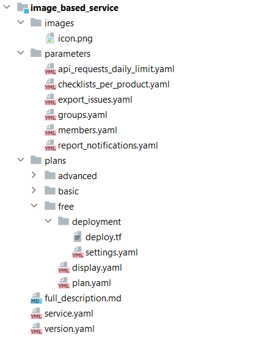

# {heading(Сервис пакетінің құрылымы)[id=ib_structure]}

{include(/kz/_includes/_translated_by_ai.md)}

Сервис пакеті файлдарының құрылымы JSON-файл генераторының нұсқасымен анықталады. Генератор сервис пакетінің файлдарын JSON-файлға түрлендіреді, ол брокерге image-based қолданбасын дүкенмен интеграциялау үшін қажет. Генератор нұсқасы `version.yaml` файлында көрсетіледі.

## {heading(JSON-файл генераторы 0.0.1)[id=ib_structure_file]}

JSON-файл генераторы 0.0.1 үшін файл құрылымын жасау үшін ({linkto(#pic_structure)[text=%number сурет]}):

1. `<SERVICE_NAME>` сервис директориясын жасаңыз.
1. Сервис директориясында `version.yaml` файлын жасаңыз. Файл ішінде `version` параметрінде `0.0.1` генератор нұсқасын көрсетіңіз:

   ```yaml
   version: 0.0.1
   ```

1. Сервис директориясында келесі директориялар мен файлдарды жасаңыз:

   * `full_description.md` файлы — сервистің толық сипаттамасын қамтиды.
   * `service.yaml` файлы — сервис параметрлері мен оның тарифтік жоспарларын сипаттайды.
   * `images` директориясы — дүкендегі сервис белгішесінің кескіні бар файлды қамтиды.

      * `png` немесе `svg` кеңейтімі бар, сервис белгішесі ретінде пайдаланылатын файл (толығырақ — {linkto(../../service_description#service_description_icon)[text=%text]} бөлімінде). Файл атауы `icon` файлын толтырған кезде `service.yaml` параметрінде пайдаланылады.

         Файл өлшемі 1 МБ-тан аспауы керек. Кескін өлшемі кемінде 62×62 пиксель болуы керек.

   * `parameters` директориясы — сервистің барлық тарифтік жоспарларының опцияларын сипаттайтын файлдарды қамтиды:

      * `<OPTION_NAME>.yaml` файлдары — тарифтік жоспарлардың опцияларын сипаттайды. Әрбір жеке файл бір опцияға сәйкес келеді. Бұл опциялар нақты тарифтік жоспарды сипаттайтын файлды (`plan.yaml` файлы, нақты жоспар директориясында) қалыптастыру кезінде пайдаланылады.

   * `plans` директориясы — сервистің барлық тарифтік жоспарларын қамтиды. Ішінде әр жоспар үшін бөлек директориялар орналасады:

      * Әр жоспар үшін жеке `<PLAN_NAME>` директориялары — нақты тарифтік жоспарды сипаттайтын файлдарды қамтиды. Бір директория бір жоспарға сәйкес келеді:

         * `plan.yaml` файлы — нақты тарифтік жоспардың параметрлерін сипаттайды.
         * `display.yaml` файлы — тарифтік жоспардың конфигурация шеберін сипаттайды. Тарифтік жоспар конфигурациясының шебері сервисті қосу және тарифтік жоспарды жаңарту кезінде дүкенде көрсетіледі.
         * `deployment` директориясы — Terraform манифесін қамтиды.

            * `deploy.tf` файлы — бұлтты платформада сервистің нақты тарифтік жоспарын өрістету инфрақұрылымын және процесін сипаттайтын манифест.
            * `settings.yaml` файлы (опционалды) — манифестті орындау баптаулары.

{note:warn}

Файлдар мен директория атаулары үшін латын әріптерін және бөлгіш ретінде төменгі сызықша белгілерін пайдаланыңыз. Атауларда бос орындарды пайдалану ұсынылмайды.

{/note}

{caption({counter(pic)[id=numb_pic_structure]} сурет — 0.0.1 JSON-файл генераторы үшін сервис пакеті файлдарының құрылымы)[align=center;position=under;id=pic_structure;number={const(numb_pic_structure)} ]}
{params[width=40%]}
{/caption}

{note:info}

`deployment` директориясында орналастырылатын Terraform баптаулары бір `deploy.tf` файлының орнына бірнеше `.tf` манифесінде сипатталуы мүмкін.

{/note}

{caption(Бірнеше `deployment` манифесі бар `.tf` директориясы мазмұнының мысалы)[align=left;position=above]}
```text
image_based_service/plans/free/deployment
│
├── common.tf
├── compute.tf
├── network.tf
├── output.tf
├── secgroup.tf
└── variables.tf
```
{/caption}
