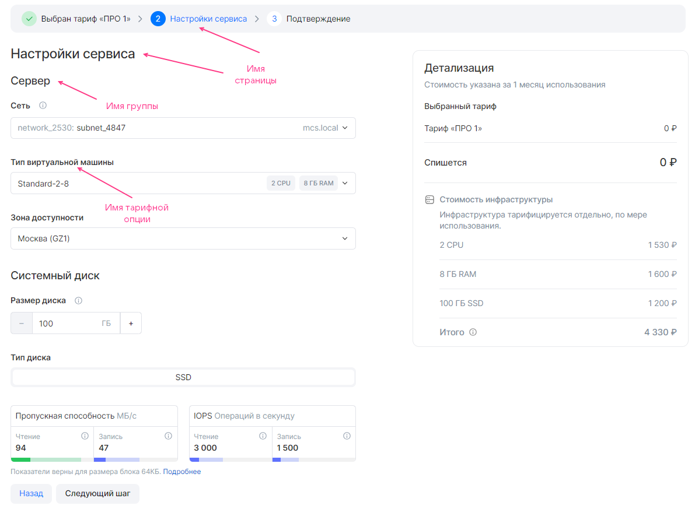
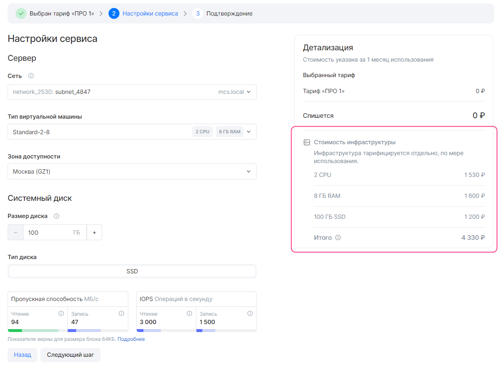
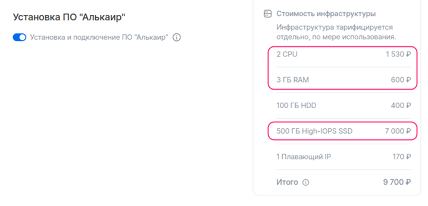

# {heading(display.yaml файлы)[id=ib_display]}

{include(/kz/_includes/_translated_by_ai.md)}

{linkto(/kz/tools-for-using-services/vendor-account/manage-apps/concepts/about#xaas_wizard)[text=%text]} сипаттау үшін `plans/<PLAN_NAME>/display.yaml` файлында {linkto(#tab_plans)[text=%number кестесінде]} келтірілген параметрлерді көрсетіңіз.

{caption(Кесте {counter(table)[id=numb_tab_plans]} — plans/<PLAN_NAME>/display.yaml файлының параметрлері)[align=right;position=above;id=tab_plans;number={const(numb_tab_plans)}]}
[cols="2,5,2,2", options="header"]
|===
|Атауы
|Сипаттамасы
|Форматы
|Міндетті

|pages
|
Бірінші және соңғы беттен басқа тарифтік жоспарды конфигурациялау шеберінің барлық беттерін сипаттайды.

Егер параметр көрсетілмесе, конфигурациялау шебері тек автоматты түрде қалыптастырылатын беттерден тұрады
|Массив (толығырақ — {linkto(../ib_display#IBdisplay_pages)[text=%text]} бөлімінде)
|
Жоқ

|entities
|
Бұлттық платформа инфрақұрылымының элементтерін сипаттайды, осылайша тарифтік жоспарды конфигурациялау шеберінде олардың құнының есебі көрсетіледі:

* ВМ.
* Жүктеме теңгергіштері.
* Сыртқы IP-мекенжайлар.

Құн бұлттық платформаның тарифтеріне сәйкес автоматты түрде есептеледі
|Массив (толығырақ — {linkto(../ib_display#IBdisplay_entities)[text=%text]} бөлімінде)
|
Иә
|===
{/caption}

## {heading(pages массиві)[id=IBdisplay_pages]}

Әдепкі бойынша тарифтік жоспарды конфигурациялау шеберінде `groups` тарифтік опция топтарының барлығы көрсетіледі және бапталады. Шарттарға байланысты топтардың көрсетілуін баптау үшін `when` конструкциясын пайдаланыңыз (толығырақ — {linkto(../ib_display#IBdisplay_when)[text=%text]} бөлімінде).

Тарифтік жоспарды конфигурациялау шеберінің беттерін сипаттау үшін ({linkto(#pic_wizard_ib_page)[text=%number суреті]}):

1. `plans/<PLAN_NAME>/display.yaml` файлында `pages` массивін көрсетіңіз.
1. `pages` ішінде мынаны беріңіз:

   * `name` параметрі — беттің атауы. 32 таңбадан аспауы тиіс.
   * `groups` массиві.

1. `groups` ішінде тарифтік жоспарды конфигурациялау шеберінің нақты бетіне арналған тарифтік опциялар топтарын сипаттаңыз. Әр топ үшін мынаны беріңіз:

   * `name` параметрі — тарифтік опциялар тобының атауы. 255 таңбадан аспауы тиіс.
   * `parameters` массиві — топқа кіретін тарифтік опциялар.

1. `parameters` ішінде әр тарифтік опция үшін `name` параметрін — оның YAML-файлының атауын көрсетіңіз.

   Дүкен интерфейсінде тарифтік опциялар олардың YAML-файлдарындағы `schema` секциясында берілген атаулармен көрсетіледі.

   {note:warn}

   Бір тарифтік опцияны тек бір топта ғана көрсетуге болады.

   {/note}
1. Тарифтік жоспарды конфигурациялау шеберінің кейінгі беттерін де дәл осылай сипаттаңыз. Беттердің ең көп саны — 5.

{caption(Сурет {counter(pic)[id=numb_pic_wizard_ib_page]} — Тарифтік жоспарды конфигурациялау шебері)[align=center;position=under;id=pic_wizard_ib_page;number={const(numb_pic_wizard_ib_page)} ]}

{/caption}

{caption(Тарифтік жоспарды конфигурациялау шеберіндегі **Сервис баптаулары** бетінің сипаттамасының мысалы)[align=left;position=above]}
```yaml
pages:
- name: Настройки сервиса # Имя страницы
  groups:
  - name: Сервер # Имя группы тарифных опций
    parameters:
    - name: network # Имя YAML-файла тарифной опции
    - name: vm
    - name: az

  - name: Системный диск
    parameters:
    - name: volume_size
    - name: volume_type
```
{/caption}

{note:warn}

Жоспардың барлық тарифтік опциялары `plans/<PLAN_NAME>/display.yaml` файлында көрсетілуі тиіс.

{/note}

## {heading(entities массиві)[id=IBdisplay_entities]}

Әдепкі бойынша тарифтік жоспарды конфигурациялау шеберінде `entities` массивінде сипатталған инфрақұрылымның барлық элементтерінің құны есептеледі. Шарттарға байланысты инфрақұрылым құнының көрсетілуін баптау үшін `when` конструкциясын пайдаланыңыз (толығырақ — {linkto(../ib_display#IBdisplay_when)[text=%text]} бөлімінде).

Инфрақұрылым элементінің түрі `entities.entity` параметрінде анықталады:

* `vm` — ВМ.
* `load_balancing` — жүктеме теңгергіші.
* `floating_ip` — сыртқы IP-мекенжай.

{note:warn}

Terraform манифестері `entities` ішіндегі инфрақұрылым элементтерінің сипаттамасын қамтуы тиіс.

{/note}

### {heading(ВМ)[id=IBdisplay_vm]}

Тарифтік жоспарды конфигурациялау шеберінде ВМ құны есептелуі үшін ({linkto(#pic_wizard_ib_price)[text=%number суреті]}):

1. `plans/<PLAN_NAME>/display.yaml` файлында `entities` массивін көрсетіңіз.
1. `entities` ішінде келесі параметрлерді беріңіз:

   * `entity` — инфрақұрылым элементінің түрі. `vm` көрсетіңіз.
   * `description` — ВМ сипаттамасы (опционалды).
   * `count.const` немесе `count.param` — ВМ саны.

      Тұрақты мәнді беру үшін `count.const` параметрін және оның мәнін көрсетіңіз.

      ВМ саны тарифтік опцияның мәнімен анықталуы үшін `count.param` параметрін және тиісті YAML-файлдың атауын көрсетіңіз.
   * `flavor.const` немесе `flavor.param` — ВМ түрі.

      Тұрақты мәнді беру үшін `flavor.const` параметрін және ВМ түрінің ID-сін көрсетіңіз.

      ВМ түрі тарифтік опция мәнімен анықталуы үшін `flavor.param` параметрін және ВМ түрін сипаттайтын YAML-файлдың атауын көрсетіңіз (`datasource.type` = `flavor`).

1. ВМ дискілерін `disks` массиві арқылы сипаттаңыз (егер инфрақұрылым конфигурациясында `datasource.type` = `volume_type` түріндегі тарифтік опция болмаса, опционалды).

   1. Әр диск үшін келесі параметрлерді беріңіз:

      * `type.const` немесе `type.param` — диск түрі.

         Диск түрі тарифтік опцияның мәнімен анықталуы үшін `type.param` параметрін және диск түрін сипаттайтын тарифтік опцияның YAML-файлының атауын көрсетіңіз (`datasource.type` = `volume_type`).

         Тұрақты мәнді беру үшін `type.const` параметрін және келесі мәндердің бірін көрсетіңіз:

         * `ceph-ssd` — SSD түріндегі диск.
         * `ceph-hdd` — HDD түріндегі диск.
         * `high-iops` — High-IOPS SSD түріндегі диск (өнімділігі жоғары SSD).

      * `size.const` немесе `size.param` — диск өлшемі.

         Тұрақты мәнді беру үшін `size.const` параметрін және оның мәнін көрсетіңіз.

         Диск өлшемі тарифтік опцияның мәнімен анықталуы үшін `size.param` параметрін және тиісті тарифтік опцияның YAML-файлының атауын көрсетіңіз.


{caption(Сурет {counter(pic)[id=numb_pic_wizard_ib_price]} — Тарифтік жоспарды конфигурациялау шебері. Инфрақұрылым құны туралы ақпарат)[align=center;position=under;id=pic_wizard_ib_price;number={const(numb_pic_wizard_ib_price)} ]}

{/caption}

{caption(Тарифтік жоспарды конфигурациялау шебері үшін ВМ сипаттамасының мысалы)[align=left;position=above]}
```yaml
entities:
  - entity: vm
    description: Виртуальная машина
    count:
      const: 1
    flavor:
      param: ds-flavor # Имя YAML-файла тарифной опции
    disks:
      - type:
          param: root_type
        size:
          param: root_size
      - type:
          param: data_type
        size:
          param: data_size
```
{/caption}

{note:warn}

Егер сервис инфрақұрылымының конфигурациясында диск түрін сипаттайтын `datasource` түріндегі тарифтік опция қолданылса, онда ВМ сипатталғанда `disks` массиві міндетті түрде толтырылуы тиіс.

{/note}

### {heading(Жүктеме теңгергіші)[id=IBdisplay_lb]}

Тарифтік жоспарды конфигурациялау шеберінде жүктеме теңгергішінің құны есептелуі үшін:

1. `plans/<PLAN_NAME>/display.yaml` файлында `entities` массивін көрсетіңіз.
1. `entities` ішінде келесі параметрлерді беріңіз:

   * `entity` — инфрақұрылым элементінің түрі. `load_balancing` көрсетіңіз.
   * `count.const` немесе `count.param` — жүктеме теңгергіштерінің саны.

      Тұрақты мәнді беру үшін `count.const` параметрін және оның мәнін көрсетіңіз.

      Жүктеме теңгергіштерінің саны тарифтік опцияның мәнімен анықталуы үшін `count.param` параметрін және тиісті YAML-файлдың атауын көрсетіңіз.

{caption(Тарифтік жоспарды конфигурациялау шебері үшін жүктеме теңгергішін сипаттау мысалы)[align=left;position=above]}
```yaml
entities:
  - entity: load_balancing
    count:
      param: number_balancing # Имя YAML-файла тарифной опции
```
{/caption}

### {heading(Сыртқы IP-мекенжай)[id=IBdisplay_floating_ip]}

Тарифтік жоспарды конфигурациялау шеберінде сыртқы IP-мекенжай құны есептелуі үшін:

1. `plans/<PLAN_NAME>/display.yaml` файлында `entities` массивін көрсетіңіз.
1. `entities` ішінде келесі параметрлерді беріңіз:

   * `entity` — инфрақұрылым элементінің түрі. `floating_ip` көрсетіңіз.
   * `count.const` немесе `count.param` — сыртқы IP-мекенжайлар саны.

      Тұрақты мәнді беру үшін `count.const` параметрін және оның мәнін көрсетіңіз.

      Сыртқы IP-мекенжайлар саны тарифтік опцияның мәнімен анықталуы үшін `count.param` параметрін және тиісті YAML-файлдың атауын көрсетіңіз.

{caption(Тарифтік жоспарды конфигурациялау шебері үшін сыртқы IP-мекенжайды сипаттау мысалы)[align=left;position=above]}
```yaml
entities:
  - entity: floating_ip
    count:
      const: 1
```
{/caption}

## {heading(when конструкциясы)[id=IBdisplay_when]}

`when` конструкциясы шартты тармақталуды басқарады. Ол мыналарды қамтиды:

* Шарт түрі:

   * `when.in` — `key` және `values` параметрлерінде берілген мәндердің теңдігін тексеру. Егер `key` ішіндегі мән `values` ішіндегі кемінде бір мәнге тең болса, шарт орындалады.
   * `when.not_in` — `key` және `values` параметрлерінде берілген мәндердің тең еместігін тексеру. Егер `key` ішіндегі мән `values` ішіндегі барлық мәндерге тең болмаса, шарт орындалады.

* Критерийлер. `key` және `values` параметрлерінде келесі тәсілдердің бірімен беріледі:

   * `param` параметрі арқылы — нақты тарифтік опцияның мәнін пайдалану үшін.
   * `const` параметрі арқылы — тұрақты мәнді пайдалану үшін.

   `key` ішінде бір мәнді, `values` ішінде бір немесе бірнеше мәнді беруге болады.

{caption(YAML форматындағы `when` құрылымы)[align=left;position=above]}
```yaml
when:
  in: # Или not_in
    key:
      param: <OPTION> # Или const: <VALUE>
    values:
      - const: <VALUE>
      - param: <OPTION>
      ...
```
{/caption}

Мұнда:

* `<OPTION>` — тарифтік опцияның YAML-файлының атауы.
* `<VALUE>` — тұрақты мән.

{note:warn}

Terraform манифестеріндегі ресурстар `when` конструкцияларында берілген шарттарды ескере отырып сипатталуы тиіс.

{/note}

### {heading(pages ішінде массиві)[id=IBdisplay_when_in_pages]}

`pages` массивінде `when` конструкциясында тарифтік опциялар тобын көрсету не көрсетпеу шартын анықтайтын шарт беріледі.

{note:warn}

Топтар арасындағы тәуелділіктерде иерархияның тек бірінші деңгейі ғана қолданылады. Егер топта `when` конструкциясы көрсетілсе, осы топтың тарифтік опцияларын (`parameters` ішінде көрсетілген) басқа топтардағы `when` конструкциясында пайдалануға болмайды.

{/note}

`when` конструкциясын пайдаланған кезде тарифтік опциялар топтары бар бет келесі шарттар орындалса, жасырылады:

* Бір бет аясында барлық топтарда `when` конструкциясы бар.
* Тарифтік жоспарды конфигурациялау шеберінде тарифтік опциялардың сондай мәндері берілген, сол себепті осы беттегі барлық топтардағы шарттар орындалмайды.

Бір тарифтік опцияны әртүрлі топтардағы `when` конструкцияларында пайдалануға болады. Тарифтік опцияның мәніне байланысты сол не өзге топтар көрсетіледі.

{caption(`when` массивінде `pages` конструкциясын пайдалану мысалы)[align=left;position=above]}
```yaml
pages:
- name: Настройки бекапа # Имя страницы
  groups:
  - name: High-frequency бекап # Имя группы тарифных опций
    parameters:
    - name: frequency_per_day # Имя YAML-файла тарифной опции
    when:
      in:
        key:
          param: backup_method # Имя YAML-файла тарифной опции
        values:
          - const: high-frequency
```
{/caption}

Жоғарыдағы мысалда high-frequency әдісі үшін бэкаптар жасау жиілігі бапталады: егер `backup_method` тарифтік опциясының мәні `high-frequency` болса, тарифтік жоспарды конфигурациялау шеберінде `High-frequency бекап` тарифтік опциясы бар `frequency_per_day` тобын көрсету керек.

`backup_method` тарифтік опциясы:

* Басқа топтардағы `when` конструкциясында пайдаланылуы мүмкін.
* Басқа топтағы `parameters` ішінде берілуі тиіс.

`frequency_per_day` тарифтік опциясын басқа топтарда пайдалануға болмайды:

* `when` конструкциясында, себебі тәуелділіктер иерархиясының бір ғана деңгейі қолданылады.
* `parameters` ішінде, себебі бір тарифтік опция тек бір топта ғана көрсетілуі мүмкін.

### {heading(entities ішінде массиві)[id=IBdisplay_when_in_entities]}

`entities` массивінде `when` конструкциясында `entities` ішінде сипатталған элементтің құнын сервис инстансының инфрақұрылым құнына қосу не қоспау шарты беріледі. Құн тарифтік жоспарды конфигурациялау шеберінде көрсетіледі.

{caption(`when` массивінде `entities` конструкциясын пайдалану мысалы)[align=left;position=above]}
```yaml
entities:
  - entity: vm
    description: alkair_software
    when:
      in:
        key:
          param: need_install_alkair_software # Имя YAML-файла тарифной опции
        values:
          - const: true
    flavor:
      const: 6a7a0690-943a-4921-936e-2849970ccfba # Тип ВМ (CPU, RAM). В данном примере тип ВМ с 2 CPU и 3 ГБ RAM
    count:
      const: 1
    disks:
      - type:
          const: high-iops # Тип диска
        size:
          const: 500 # Размер диска
```
{/caption}

Жоғарыдағы мысалда Алькаир БҚ үшін ВМ құнын көрсетуді баптау келтірілген: егер `need_install_alkair_software` тарифтік опциясының мәні `true` болса, тарифтік жоспарды конфигурациялау шеберінде `entities.entity` ішінде сипатталған ВМ құнын көрсету керек ({linkto(#pic_alkair_included)[text=%number суреті]}).

{caption(Сурет {counter(pic)[id=numb_pic_alkair_included]} — Тарифтік опция қосылған, Алькаир БҚ үшін ВМ құны инфрақұрылым құнына есептеледі)[align=center;position=under;id=pic_alkair_included;number={const(numb_pic_alkair_included)} ]}

{/caption}
