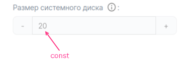
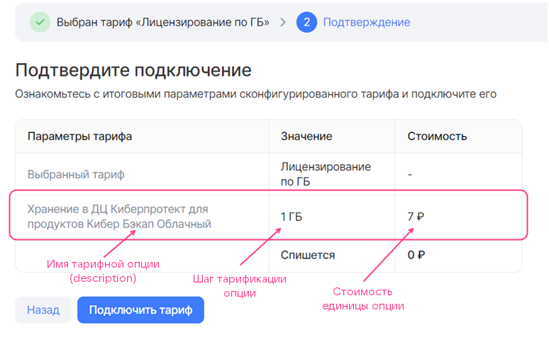
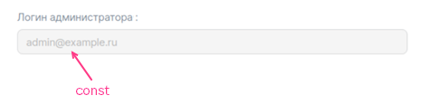
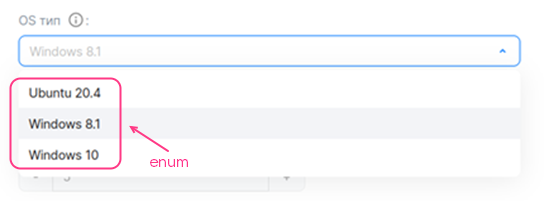
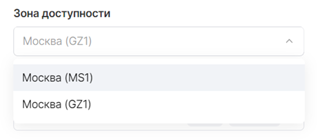
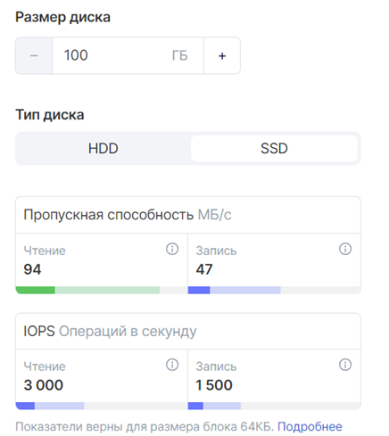

# {heading(YAML тарифтік опциялар файлдарын толтыру)[id=IB_option_fill_in]}

{include(/kz/_includes/_translated_by_ai.md)}

`parameters/<OPTION_NAME>.yaml` файлдарында кемінде бір тарифтік жоспарда қолданылатын барлық тарифтік опцияларды сипаттаңыз (толығырақ — {linkto(/kz/tools-for-using-services/vendor-account/manage-apps/concepts/about#xaas_option_types)[text=%text]} бөлімінде).

Әрбір жеке YAML-файл бір тарифтік опцияға сәйкес келеді. Онда тарифтік опцияның баптаулары, ал ақылы опциялар үшін — құны сипатталады.

Тарифтік опцияларды сипаттау үшін қолданылатын параметрлердің толық сипаттамасы [Тарифтік опцияның YAML-файлы](../iboption) бөлімінде берілген.

## {heading(integer типті тегін тарифтік опция-тұрақты)[id=option_int_const]}

`parameters/<OPTION_NAME>.yaml` файлын келесі түрде толтырыңыз:

1. `actions` параметрін көрсетіңіз.
1. `schema` секциясында келесі параметрлерді беріңіз:

    * `description` — тарифтік опцияның атауы.
    * `hint` — тарифтік опцияның сипаттамасы (опционалды).
    * `type` — тарифтік опцияның типі. `integer` көрсетіңіз.
    * `const` — тарифтік опцияның мәні.

{caption(`integer` типті опция-тұрақтыны сипаттау мысалы, `YAML` пішімі)[align=left;position=above]}
```yaml
actions:
- create
- update

schema:
  description: Размер системного диска
  hint: В ГБ
  type: integer
  const: 20
```
{/caption}

{linkto(#pic_option_int_const)[text=%number-суретте]} жоғарыда сипатталған опцияның тарифтік жоспарды баптау шеберінде қалай көрсетілетіні берілген.

{caption(Сурет {counter(pic)[id=numb_pic_option_int_const]} — integer типті тарифтік опция-тұрақты)[align=center;position=under;id=pic_option_int_const;number={const(numb_pic_option_int_const)} ]}
{params[width=40%]}
{/caption}

## {heading(Тізімнен мәнді таңдауы бар integer типті тегін тарифтік опция)[id=option_int_enum]}

`parameters/<OPTION_NAME>.yaml` файлын келесі түрде толтырыңыз:

1. `actions` параметрін көрсетіңіз.
1. `schema` секциясында келесі параметрлерді беріңіз:

    * `description` — тарифтік опцияның атауы.
    * `hint` — тарифтік опцияның сипаттамасы (опционалды).
    * `type` — тарифтік опцияның типі. `integer` көрсетіңіз.
    * `enum` — тарифтік опцияның мүмкін мәндері.
    * `default` — әдепкі мән.

{caption(Тізімнен мәнді таңдауы бар `integer` типті опцияны сипаттау мысалы, `YAML` пішімі)[align=left;position=above]}
```yaml
actions:
- create
- update

schema:
  description: Количество серверов в кластере
  type: integer
  enum: [3, 5, 7]
  default: 5
```
{/caption}

{linkto(#pic_option_int_enum)[text=%number-суретте]} жоғарыда сипатталған опцияның тарифтік жоспарды баптау шеберінде қалай көрсетілетіні берілген.

{caption(Сурет {counter(pic)[id=numb_pic_option_int_enum]} — Тізімнен мәнді таңдауы бар integer типті тарифтік опция)[align=center;position=under;id=pic_option_int_enum;number={const(numb_pic_option_int_enum)} ]}
{params[width=60%]}
{/caption}

## {heading(Өзгерту қадамы 1 болатын integer типті тегін тарифтік опция)[id=option_int_step]}

`parameters/<OPTION_NAME>.yaml` файлын келесі түрде толтырыңыз:

1. `actions` параметрін көрсетіңіз.
1. `schema` секциясында келесі параметрлерді беріңіз:

    * `description` — тарифтік опцияның атауы.
    * `hint` — тарифтік опцияның сипаттамасы (опционалды).
    * `type` — тарифтік опцияның типі. `integer` көрсетіңіз.
    * `default` — әдепкі мән (опционалды).

      Егер параметр берілмесе, әдепкі мән `0` болады.
    * `minimum` және `maximum` — тарифтік опцияның ең үлкен және ең кіші мәндері (опционалды).

{caption(Өзгерту қадамы 1 болатын `integer` типті тегін опцияны сипаттау мысалы, `YAML` пішімі)[align=left;position=above]}
```yaml
actions:
- create
- update

schema:
  description: Количество участников
  hint: Количество сотрудников компании заказчика, которые могут использовать инфраструктуру тестирования и обрабатывать отчеты от тестировщиков VK Testers.
  type: integer
  default: 20
  minimum: 20
```
{/caption}

3, 4-суреттерде жоғарыда сипатталған опцияның тарифтік жоспарды баптау шеберінде қалай көрсетілетіні берілген.

{caption(Сурет {counter(pic)[id=numb_pic_option_int_step]} — Өзгерту қадамы 1 болатын integer типті тегін тарифтік опция)[align=center;position=under;id=pic_option_int_step;number={const(numb_pic_option_int_step)} ]}

{/caption}

{caption(Сурет {counter(pic)[id=numb_pic_option_int_step_plus]} — Өзгерту қадамы 1 болатын integer типті тегін тарифтік опция, мән 1 қадамға ұлғайтылған)[align=center;position=under;id=pic_option_int_step_plus;number={const(numb_pic_option_int_step_plus)} ]}

{/caption}

## {heading(Пайдаланушы анықтайтын өзгерту қадамы бар integer типті тегін тарифтік опция)[id=option_int_with_user_step_free]}

`parameters/<OPTION_NAME>.yaml` файлын келесі түрде толтырыңыз:

1. `actions` параметрін көрсетіңіз.
1. `billing` секциясында келесі параметрлерді беріңіз:

    * `base` — стандартты мән.
    * `cost` — өзгерту қадамының құны. `0` көрсетіңіз.
    * `unit.size` — өзгерту қадамының өлшемі.
    * `unit.measurement` — тарифтік опцияның өлшем бірліктері (опционалды).

   {caption(`billing` секциясын толтыру мысалы)[align=left;position=above]}
   ```yaml
   billing:
     base: 25
     cost: 0
     unit:
        size: 100
   ```
   {/caption}
1. `schema` секциясында келесі параметрлерді беріңіз:

    * `description` — тарифтік опцияның атауы.
    * `hint` — тарифтік опцияның сипаттамасы (опционалды).
    * `type` — тарифтік опцияның типі. `integer` көрсетіңіз.
    * `default` — әдепкі мән (опционалды). Опцияның стандартты мәніне қатысты беріледі:

        * Әдепкі мән стандартты мәнге тең болуы үшін `default` параметрін көрсетпеңіз немесе `0` көрсетіңіз ({linkto(#pic_option_int_with_user_step_free)[text=%number-сурет]}).

          {caption(Сурет {counter(pic)[id=numb_pic_option_int_with_user_step_free]} — integer типті тегін тарифтік опция, пайдаланушы анықтайтын өзгерту қадамымен (billing.base = 25, schema.default = 0, billing.unit.size = 100))[align=center;position=under;id=pic_option_int_with_user_step_free;number={const(numb_pic_option_int_with_user_step_free)} ]}
          
          {/caption}
        * Әдепкі мән `n` және стандартты мән негізінде формула бойынша есептелуі үшін `n` көрсетіңіз ({linkto(#pic_option_int_with_user_step_free1)[text=%number-сурет]}, {linkto(#pic_option_int_with_user_step_free2)[text=%number-сурет]}):

           ```txt
         billing.base + n * billing.unit.size
         ```

          {caption(Сурет {counter(pic)[id=numb_pic_option_int_with_user_step_free1]} — integer типті тегін тарифтік опция, пайдаланушы анықтайтын өзгерту қадамымен (billing.base = 25, schema.default = 1, billing.unit.size = 100))[align=center;position=under;id=pic_option_int_with_user_step_free1;number={const(numb_pic_option_int_with_user_step_free1)} ]}
          
          {/caption}

          {caption(Сурет {counter(pic)[id=numb_pic_option_int_with_user_step_free2]} — integer типті тегін тарифтік опция, пайдаланушы анықтайтын өзгерту қадамымен (billing.base = 25, schema.default = 2, billing.unit.size = 100))[align=center;position=under;id=pic_option_int_with_user_step_free2;number={const(numb_pic_option_int_with_user_step_free2)} ]}
          
          {/caption}

    * `minimum` және `maximum` — тарифтік опцияның ең үлкен және ең кіші мәндері (опционалды). Әдепкі мән үшін қалай берілсе, дәл солай беріледі.

{caption(Пайдаланушы анықтайтын өзгерту қадамы бар `integer` типті тегін опцияны сипаттау мысалы, `YAML` пішімі)[align=left;position=above]}
```yaml
actions:
- create
- update

billing:
  base: 25
  cost: 0
  unit:
     size: 100

schema:
  description: Объем загружаемых сборок
  hint: На платформу можно загружать тестовые сборки приложений для раздачи сотрудникам заказчика и тестировщикам VK Testers. Чем больше хранилище, тем больше версий ваших продуктов можно сохранять на платформе тестирования. Поддерживаемые платформы: iOS, Android, Windows, MacOS, Linux.
  type: integer
  default: 0
```
{/caption}

{note:info}

`billing` және `schema` секцияларының параметрлерінің толық сипаттамасы тиісінше {linkto(/kz/tools-for-using-services/vendor-account/manage-apps/ibservice_add/ibservice_configure/iboption#iboption_billing)[text=%text]} және {linkto(/kz/tools-for-using-services/vendor-account/manage-apps/ibservice_add/ibservice_configure/iboption#iboption_schema)[text=%text]} бөлімдерінде берілген.

{/note}

## {heading(Өзгерту қадамы бар integer типті алдын ала төленетін тарифтік опция)[id=option_int_step_prepayed]}

`parameters/<OPTION_NAME>.yaml` файлын келесі түрде толтырыңыз:

1. `actions` параметрін көрсетіңіз.
1. `billing` секциясында келесі параметрлерді беріңіз ({linkto(#pic_option_int_step_prepayed)[text=%number-сурет]}, {linkto(#pic_option_int_step_prepayed1)[text=%number-сурет]}, {linkto(#pic_option_int_step_prepayed2)[text=%number-сурет]}):

    * `base` — стандартты мән. Стандартты мән тарифтік жоспар құнына кіреді.
    * `cost` — өзгерту қадамының құны.
    * `unit.size` — өзгерту қадамының өлшемі.
    * `unit.measurement` — тарифтік опцияның өлшем бірліктері (опционалды).

      {caption(`billing` секциясын толтыру мысалы)[align=left;position=above]}
       ```yaml
      billing:
        base: 25
        cost: 150
        unit:
           size: 100
      ```
      {/caption}

      Жоғарыдағы мысалда опцияның стандартты мәнінен асатын әрбір қосымша 100 бірлік 150 ақша бірлігі тұрады.

   {caption(Сурет {counter(pic)[id=numb_pic_option_int_step_prepayed]} — Өзгерту қадамы бар integer типті ақылы тарифтік опция (billing.base = 25, billing.cost = 150, billing.unit.size = 100))[align=center;position=under;id=pic_option_int_step_prepayed;number={const(numb_pic_option_int_step_prepayed)} ]}
   
   {/caption}

   {caption(Сурет {counter(pic)[id=numb_pic_option_int_step_prepayed1]} — Өзгерту қадамы бар integer типті ақылы тарифтік опция, мән 1 қадамға ұлғайтылған (billing.base = 25, billing.cost = 150, billing.unit.size = 100))[align=center;position=under;id=pic_option_int_step_prepayed1;number={const(numb_pic_option_int_step_prepayed1)} ]}
   
   {/caption}

   {caption(Сурет {counter(pic)[id=numb_pic_option_int_step_prepayed2]} — Өзгерту қадамы бар integer типті ақылы тарифтік опция, мән 2 қадамға ұлғайтылған (billing.base = 25, billing.cost = 150, billing.unit.size = 100))[align=center;position=under;id=pic_option_int_step_prepayed2;number={const(numb_pic_option_int_step_prepayed2)} ]}
   
   {/caption}
1. `schema` секциясын пайдаланушы анықтайтын өзгерту қадамы бар тегін тарифтік опциядағыдай толтырыңыз (толығырақ — {linkto(../ibopt_fill_in#option_int_with_user_step_free)[text=%text]} бөлімінде).

   Егер тарифтік опция үшін әдепкі мән стандартты мәнге тең болмаса (`schema.default ≠ 0`), онда пайдаланушы тарифтік жоспарды баптау шеберіне өткен кезде мұндай тарифтік опция үшін оның құны көрсетіледі ({linkto(#pic_option_int_step_prepayed3)[text=%number-сурет]}). Пайдаланушы опция мәнін тарифтік жоспар құнына кіретін стандартты мәнге дейін азайта алады.

   {caption(Сурет {counter(pic)[id=numb_pic_option_int_step_prepayed3]} — Өзгерту қадамы бар integer типті ақылы тарифтік опция (billing.base = 25, billing.cost = 150, billing.unit.size = 100, schema.default = 1))[align=center;position=under;id=pic_option_int_step_prepayed3;number={const(numb_pic_option_int_step_prepayed3)} ]}
   
   {/caption}

{note:info}

`billing` және `schema` секцияларының параметрлерінің толық сипаттамасы тиісінше {linkto(/kz/tools-for-using-services/vendor-account/manage-apps/ibservice_add/ibservice_configure/iboption#iboption_billing)[text=%text]} және {linkto(/kz/tools-for-using-services/vendor-account/manage-apps/ibservice_add/ibservice_configure/iboption#iboption_schema)[text=%text]} бөлімдерінде берілген.

{/note}

## {heading(integer немесе number типті кейін төленетін тарифтік опция)[id=option_postpayed_ib]}

{note:warn}

Кейін төленетін тарифтік опцияның YAML-файлының атауы метрикаларды жіберуге арналған API-сұраудағы `param` мәніне сәйкес келуі керек (толығырақ — {linkto(/kz/tools-for-using-services/vendor-account/manage-apps/concepts/about#billing_push)[text=%text]} бөлімінде).

{/note}

`parameters/<OPTION_NAME>.yaml` файлын келесі түрде толтырыңыз:

1. `actions` параметрінің мәнін `resource_usages` етіп орнатыңыз.
1. `billing` секциясында келесі параметрлерді беріңіз:

    * `cost` — тарифтік опция бірлігінің құны.
    * `unit.size` — тарификация қадамы. `1` көрсетіңіз.
    * `unit.measurement` — тарифтік опцияның өлшем бірліктері (опционалды).

1. `schema` секциясында келесі параметрлерді беріңіз:

    * `description` — тарифтік опцияның атауы.
    * `hint` — тарифтік опцияның сипаттамасы (опционалды).
    * `type` — тарифтік опцияның типі. `integer` немесе `number` көрсетіңіз.

{caption(Кейін төленетін сандық тарифтік опцияны сипаттау мысалы)[align=left;position=above]}
```yaml
actions:
- resource_usages

billing:
  cost: 7
  unit:
    size: 1
    measurement: ГБ

schema:
  description: Хранение в ДЦ Киберпротект для продуктов Бэкап Облачный
  type: number
```
{/caption}

{linkto(#pic_option_postpayed_ib)[text=%number-суретте]} жоғарыда сипатталған опцияның тарифтік жоспарды баптау шеберінде қалай көрсетілетіні берілген. Тарифтік опцияның бірлігі 7 ақша бірлігі тұрады.

{caption(Сурет {counter(pic)[id=numb_pic_option_postpayed_ib]} — Кейін төленетін тарифтік опция)[align=center;position=under;id=pic_option_postpayed_ib;number={const(numb_pic_option_postpayed_ib)} ]}
{params[width=75%]}
{/caption}

## {heading(string типті тегін тарифтік опция-тұрақты)[id=option_string]}

`parameters/<OPTION_NAME>.yaml` файлын келесі түрде толтырыңыз:

1. `actions` параметрін көрсетіңіз.
1. `schema` секциясында келесі параметрлерді беріңіз:

    * `description` — тарифтік опцияның атауы.
    * `hint` — тарифтік опцияның сипаттамасы (опционалды).
    * `type` — тарифтік опцияның типі. `string` көрсетіңіз.
    * `const` — тарифтік опцияның мәні.

{caption(`string` типті опция-тұрақтыны сипаттау мысалы, `YAML` пішімі)[align=left;position=above]}
```yaml
actions:
- create
- update

schema:
  description: Логин администратора
  type: string
  const: admin@example.ru
```
{/caption}

{linkto(#pic_option_string)[text=%number-суретте]} жоғарыда сипатталған опцияның тарифтік жоспарды баптау шеберінде қалай көрсетілетіні берілген.

{caption(Сурет {counter(pic)[id=numb_pic_option_string]} — string типті тарифтік опция-тұрақты)[align=center;position=under;id=pic_option_string;number={const(numb_pic_option_string)} ]}
{params[width=60%]}
{/caption}

## {heading(Мән енгізілетін string типті тегін тарифтік опция)[id=option_string_input]}

`parameters/<OPTION_NAME>.yaml` файлын келесі түрде толтырыңыз:

1. `actions` параметрін көрсетіңіз.
1. `schema` секциясында келесі параметрлерді беріңіз:

    * `description` — тарифтік опцияның атауы.
    * `hint` — тарифтік опцияның сипаттамасы (опционалды).
    * `type` — тарифтік опцияның типі. `string` көрсетіңіз.
    * `default` — әдепкі мән.
    * {linkto(/kz/tools-for-using-services/vendor-account/manage-apps/ibservice_add/ibservice_configure/iboption#iboption_option_string)[text=%text]} бөлімінде келтірілген қосымша параметрлер (опционалды).

{caption(Мән енгізілетін `string` типті опцияны сипаттау мысалы, `YAML` пішімі)[align=left;position=above]}
```yaml
actions:
- create
- update

schema:
  description: Email администратора
  hint: Email для выпуска SSL-сертификата
  type: string
```
{/caption}

{linkto(#pic_option_string_input)[text=%number-суретте]} жоғарыда сипатталған опцияның тарифтік жоспарды баптау шеберінде қалай көрсетілетіні берілген.

{caption(Сурет {counter(pic)[id=numb_pic_option_string_input]} — Мән енгізілетін string типті тарифтік опция)[align=center;position=under;id=pic_option_string_input;number={const(numb_pic_option_string_input)} ]}
{params[width=40%]}
{/caption}

## {heading(Тізімнен мәнді таңдауы бар string типті тегін тарифтік опция)[id=option_string_enum]}

`parameters/<OPTION_NAME>.yaml` файлын келесі түрде толтырыңыз:

1. `actions` параметрін көрсетіңіз.
1. `schema` секциясында келесі параметрлерді беріңіз:

    * `description` — тарифтік опцияның атауы.
    * `hint` — тарифтік опцияның сипаттамасы (опционалды).
    * `type` — тарифтік опцияның типі. `string` көрсетіңіз.
    * `enum` — тарифтік опцияның мүмкін мәндері.
    * `default` — әдепкі мән.

{caption(Тізімнен мәнді таңдауы бар `string` типті опцияны сипаттау мысалы, `YAML` пішімі)[align=left;position=above]}
```yaml
actions:
- create
- update

schema:
  description: OS тип
  hint: Операционная система
  type: string
  enum: ["Ubuntu 20.4", "Windows 8.1", "Windows 10"]
  default: Windows 8.1
```
{/caption}

{linkto(#pic_option_string_enum)[text=%number-суретте]} жоғарыда сипатталған опцияның тарифтік жоспарды баптау шеберінде қалай көрсетілетіні берілген.

{caption(Сурет {counter(pic)[id=numb_pic_option_string_enum]} — Тізімнен мәнді таңдауы бар string типті тарифтік опция)[align=center;position=under;id=pic_option_string_enum;number={const(numb_pic_option_string_enum)} ]}
{params[width=55%]}
{/caption}

## {heading(boolean типті тегін тарифтік опция-тұрақты)[id=option_bool_const]}

`parameters/<OPTION_NAME>.yaml` файлын келесі түрде толтырыңыз:

1. `actions` параметрін көрсетіңіз.
1. `schema` секциясында келесі параметрлерді беріңіз:

    * `description` — тарифтік опцияның атауы.
    * `hint` — тарифтік опцияның сипаттамасы (опционалды).
    * `type` — тарифтік опцияның типі. `boolean` көрсетіңіз.
    * `const` — тарифтік опцияның мәні.

{caption(`boolean` типті опция-тұрақтыны сипаттау мысалы, `YAML` пішімі)[align=left;position=above]}
```yaml
actions:
- create
- update

schema:
  description: Premium поддержка
  hint: Техническая поддержка 24/7
  type: boolean
  const: false
```
{/caption}

{linkto(#pic_option_bool_const)[text=%number-суретте]} жоғарыда сипатталған опцияның тарифтік жоспарды баптау шеберінде қалай көрсетілетіні берілген.

{caption(Сурет {counter(pic)[id=numb_pic_option_bool_const]} — boolean типті тарифтік опция-тұрақты (const = false))[align=center;position=under;id=pic_option_bool_const;number={const(numb_pic_option_bool_const)} ]}
{params[width=40%]}
{/caption}

## {heading(boolean типті тегін тарифтік опция-қосқыш)[id=option_bool]}

`parameters/<OPTION_NAME>.yaml` файлын келесі түрде толтырыңыз:

1. `actions` параметрін көрсетіңіз.
1. `schema` секциясында келесі параметрлерді беріңіз:

    * `description` — тарифтік опцияның атауы.
    * `hint` — тарифтік опцияның сипаттамасы (опционалды).
    * `type` — тарифтік опцияның типі. `boolean` көрсетіңіз.
    * `default` — әдепкі мән (опционалды).

      Егер `default` параметрі берілмесе, әдепкі мән `false` болады.

{caption(`boolean` типті тегін опция-қосқышты сипаттау мысалы, `YAML` пішімі)[align=left;position=above]}
```yaml
actions:
- create
- update

schema:
  description: Уведомления об обновлениях
  hint: Получать ли на почту уведомления о новых версиях сервиса.
  type: boolean
  default: true
```
{/caption}

{linkto(#pic_option_bool)[text=%number-суретте]} жоғарыда сипатталған опцияның тарифтік жоспарды баптау шеберінде қалай көрсетілетіні берілген.

{caption(Сурет {counter(pic)[id=numb_pic_option_bool]} — boolean типті тарифтік опция-қосқыш)[align=center;position=under;id=pic_option_bool;number={const(numb_pic_option_bool)} ]}
{params[width=50%]}
{/caption}

## {heading(boolean типті алдын ала төленетін тарифтік опция-қосқыш)[id=option_bool_paid]}

`parameters/<OPTION_NAME>.yaml` файлын келесі түрде толтырыңыз:

1. `actions` параметрін көрсетіңіз.
1. `schema` секциясында келесі параметрлерді беріңіз:

    * `description` — тарифтік опцияның атауы.
    * `hint` — тарифтік опцияның сипаттамасы (опционалды).
    * `type` — тарифтік опцияның типі. `boolean` көрсетіңіз.
    * `default` — әдепкі мән (опционалды).

      Егер `default` параметрі берілмесе, әдепкі мән `false` болады.

1. `billing` секциясында `cost` параметрін беріңіз — қосқыш белсенді күйде болған кездегі опция құны.

{caption(`boolean` типті ақылы опция-қосқышты сипаттау мысалы, `YAML` пішімі)[align=left;position=above]}
```yaml
actions:
- create
- update

schema:
  description: Уведомления о новых отчетах
  hint: Получать ли на почту уведомления о новых отчетах
  type: boolean
  default: true

billing:
  cost: 50
```
{/caption}

{linkto(#pic_option_bool_paid)[text=%number-суретте]} жоғарыда сипатталған опцияның тарифтік жоспарды баптау шеберінде қалай көрсетілетіні берілген.

{caption(Сурет {counter(pic)[id=numb_pic_option_bool_paid]} — boolean типті ақылы тарифтік опция-қосқыш)[align=center;position=under;id=pic_option_bool_paid;number={const(numb_pic_option_bool_paid)} ]}
{params[width=90%]}
{/caption}

## {heading(datasource типті тарифтік опция (ВМ типі))[id=option_datasource_flavor]}

`parameters/<OPTION_NAME>.yaml` файлын келесі түрде толтырыңыз:

1. `actions` параметрін көрсетіңіз.
1. `schema` секциясында келесі параметрлерді беріңіз:

    * `description` — тарифтік опцияның атауы.
    * `hint` — тарифтік опцияның сипаттамасы (опционалды).
    * `type` — тарифтік опцияның типі. `string` көрсетіңіз.
    * `datasource.type` — бұлттық платформа нысанының типі. `flavor` көрсетіңіз.
    * `datasource.filter` — сүзгілер (опционалды). Мүмкін сүзгілер {linkto(/kz/tools-for-using-services/vendor-account/manage-apps/ibservice_add/ibservice_configure/iboption#iboption_option_datasource)[text=%text]} бөлімінде келтірілген.

{caption(ВМ типі үшін `datasource` опциясын сипаттау мысалы, `YAML` пішімі)[align=left;position=above]}
```yaml
actions:
- create
- update

schema:
  description: Тип виртуальной машины
  type: string
  datasource:
    type: flavor
```
{/caption}

{linkto(#pic_option_datasource_flavor)[text=%number-суретте]} жоғарыда сипатталған опцияның тарифтік жоспарды баптау шеберінде қалай көрсетілетіні берілген.

{caption(Сурет {counter(pic)[id=numb_pic_option_datasource_flavor]} — datasource тарифтік опциясы (ВМ типі))[align=center;position=under;id=pic_option_datasource_flavor;number={const(numb_pic_option_datasource_flavor)} ]}
{params[width=45%]}
{/caption}

## {heading(datasource типті тарифтік опция (қолжетімділік аймағы))[id=option_datasource_az]}

`parameters/<OPTION_NAME>.yaml` файлын келесі түрде толтырыңыз:

1. `actions` параметрін көрсетіңіз.
1. `schema` секциясында келесі параметрлерді беріңіз:

    * `description` — тарифтік опцияның атауы.
    * `hint` — тарифтік опцияның сипаттамасы (опционалды).
    * `type` — тарифтік опцияның типі. `string` көрсетіңіз.
    * `default` — әдепкі мән (опционалды). Мүмкін мәндер {linkto(/kz/tools-for-using-services/vendor-account/manage-apps/ibservice_add/ibservice_configure/iboption#iboption_option_datasource)[text=%text]} бөлімінде келтірілген.
    * `datasource.type` — бұлттық платформа нысанының типі. `az` көрсетіңіз.

{caption(Қолжетімділік аймағы үшін `datasource` опциясын сипаттау мысалы, `YAML` пішімі)[align=left;position=above]}
```yaml
actions:
- create
- update

schema:
  description: Зона доступности
  type: string
  default: gz1
  datasource:
    type: az
```
{/caption}

{linkto(#pic_option_datasource_az)[text=%number-суретте]} жоғарыда сипатталған опцияның тарифтік жоспарды баптау шеберінде қалай көрсетілетіні берілген.

{caption(Сурет {counter(pic)[id=numb_pic_option_datasource_az]} — datasource тарифтік опциясы (қолжетімділік аймағы))[align=center;position=under;id=pic_option_datasource_az;number={const(numb_pic_option_datasource_az)} ]}
{params[width=45%]}
{/caption}

## {heading(datasource типті тарифтік опция опциясы (ішкі желі))[id=option_datasource_subnet]}

`parameters/<OPTION_NAME>.yaml` файлын келесі түрде толтырыңыз:

1. `actions` параметрін көрсетіңіз.
1. `schema` секциясында келесі параметрлерді беріңіз:

    * `description` — тарифтік опцияның атауы.
    * `hint` — тарифтік опцияның сипаттамасы (опционалды).
    * `type` — тарифтік опцияның типі. `string` көрсетіңіз.
    * `datasource.type` — бұлттық платформа нысанының типі. `subnet` көрсетіңіз.

{caption(Ішкі желі үшін `datasource` опциясын сипаттау мысалы, `YAML` пішімі)[align=left;position=above]}
```yaml
actions:
- create
- update

schema:
  description: Сеть
  type: string
  datasource:
    type: subnet
```
{/caption}

{linkto(#pic_option_datasource_subnet)[text=%number-суретте]} жоғарыда сипатталған опцияның тарифтік жоспарды баптау шеберінде қалай көрсетілетіні берілген.

{caption(Сурет {counter(pic)[id=numb_pic_option_datasource_subnet]} — datasource тарифтік опциясы (ішкі желі))[align=center;position=under;id=pic_option_datasource_subnet;number={const(numb_pic_option_datasource_subnet)} ]}
{params[width=40%]}
{/caption}

## {heading(datasource типті тарифтік опция (желі))[id=option_datasource_net]}

`parameters/<OPTION_NAME>.yaml` файлын келесі түрде толтырыңыз:

1. `actions` параметрін көрсетіңіз.
1. `schema` секциясында келесі параметрлерді беріңіз:

    * `description` — тарифтік опцияның атауы.
    * `hint` — тарифтік опцияның сипаттамасы (опционалды).
    * `type` — тарифтік опцияның типі. `string` көрсетіңіз.
    * `datasource.type` — бұлттық платформа нысанының типі. `network` көрсетіңіз.
    * `datasource.value_is` — ақпаратты шығару типі. Қолжетімді мәндер:
        * `uuid` — желінің UUID мәнін көрсету.
        * `name` — желі атауын көрсету.
    * `datasource.filter` — сүзгілер (опционалды). Мүмкін сүзгілер {linkto(/kz/tools-for-using-services/vendor-account/manage-apps/ibservice_add/ibservice_configure/iboption#iboption_option_datasource)[text=%text]} бөлімінде келтірілген.

{caption(Желі үшін `datasource` опциясын сипаттау мысалы, `YAML` пішімі)[align=left;position=above]}
```yaml
actions:
- create
- update

schema:
  description: Внутренняя сеть
  hint: Внутренняя сеть
  type: string
  datasource:
    type: network
    value_is: name
    filter:
      kind: private
      shared: false
```
{/caption}

{linkto(#pic_option_datasource_net)[text=%number-суретте]} жоғарыда сипатталған опцияның тарифтік жоспарды баптау шеберінде қалай көрсетілетіні берілген.

{caption(Сурет {counter(pic)[id=numb_pic_option_datasource_net]} — datasource тарифтік опциясы (желі))[align=center;position=under;id=pic_option_datasource_net;number={const(numb_pic_option_datasource_net)} ]}
{params[width=55%]}
{/caption}

## {heading(Дискіні тарифтік опция файлдарының көмегімен сипаттау)[id=IBoption_fill_in_volume]}

Диск екі тарифтік опциямен (екі бөлек YAML-файлмен) сипатталады:

* Диск типі — `datasource` типті тарифтік опцияның көмегімен.
* Диск өлшемі — өзгерту қадамы 1 болатын `integer` типті тарифтік опцияның көмегімен.

Дискіні сипаттау үшін:

1. `datasource` файлында бұлттық платформадан диск типтері туралы деректерді алатын `parameters/<OPTION_NAME>.yaml` типті тарифтік опцияны сипаттаңыз:

    1. `actions` параметрін көрсетіңіз.
    1. `schema` секциясында келесі параметрлерді беріңіз:

        * `description` — тарифтік опцияның атауы.
        * `hint` — тарифтік опцияның сипаттамасы (опционалды).
        * `type` — тарифтік опцияның типі. `string` көрсетіңіз.
        * `default` — әдепкі мән (опционалды). Мүмкін мәндер {linkto(/kz/tools-for-using-services/vendor-account/manage-apps/ibservice_add/ibservice_configure/iboption#iboption_option_datasource)[text=%text]} бөлімінде келтірілген.
        * `tag` — тег. Тег диск типін сипаттайтын опцияны диск өлшемін сипаттайтын опциямен байланыстырады.
        * `datasource.type` — бұлттық платформа нысанының типі. `volume_type` көрсетіңіз.
        * `datasource.filter` — сүзгілер (опционалды). Мүмкін сүзгілер {linkto(/kz/tools-for-using-services/vendor-account/manage-apps/ibservice_add/ibservice_configure/iboption#iboption_option_datasource)[text=%text]} бөлімінде келтірілген.

          Егер сүзгілер көрсетілмесе, бұлттық платформа қолдайтын барлық диск типтері көрсетіледі.

   {caption(Диск типі үшін `datasource` опциясын сипаттау мысалы, `YAML` пішімі)[align=left;position=above]}
   ```yaml
   actions:
   - create
   - update

   schema:
     description: Тип диска
     type: string
     default: ceph-ssd
     tag: disk1
     datasource:
       type: volume_type
       filter:
         disk_class:
           enum: ["ssd", "hdd"]
   ```
   {/caption}
1. Жеке `parameters/<OPTION_NAME>.yaml` файлында диск өлшемін өзгерту қадамы 1 болатын `integer` типті тарифтік опцияның көмегімен сипаттаңыз:

    1. `actions` параметрін көрсетіңіз.
    1. `schema` секциясында келесі параметрлерді беріңіз:

        * `description` — тарифтік опцияның атауы.
        * `hint` — тарифтік опцияның сипаттамасы (опционалды).
        * `type` — тарифтік опцияның типі. `integer` көрсетіңіз.
        * `default` — әдепкі мән (опционалды).
        * `maximum` және `minimum` — ең үлкен және ең кіші мәндер (опционалды).
        * `tag` — тег. Мәні диск типін сипаттайтын файлдағыдай болуы керек.

       {note:info}

       Диск өлшемі ГБ-мен өлшенеді.

       {/note}

   {caption(Өзгерту қадамы 1 болатын `integer` типті тарифтік опция арқылы диск өлшемін сипаттау мысалы, `YAML` пішімі)[align=left;position=above]}
   ```yaml
   actions:
   - create
   - update

   schema:
     description: Размер диска
     type: integer
     default: 100
     minimum: 100
     tag: disk1
   ```
   {/caption}

{note:warn}

Диск құны бұлттық платформа тарифтерімен анықталады, сондықтан оны тарифтік опция сипаттамасында көрсетуге болмайды.

{/note}

{linkto(#pic_option_fill_in_volume)[text=%number-суретте]} жоғарыда сипатталған опциялардың (диск типі мен өлшемі) тарифтік жоспарды баптау шеберінде қалай көрсетілетіні берілген.

{caption(Сурет {counter(pic)[id=numb_pic_option_fill_in_volume]} — Диск өлшемі мен типін баптауға мүмкіндік беретін integer және datasource типті тарифтік опциялар)[align=center;position=under;id=pic_option_fill_in_volume;number={const(numb_pic_option_fill_in_volume)} ]}
{params[width=40%]}
{/caption}
