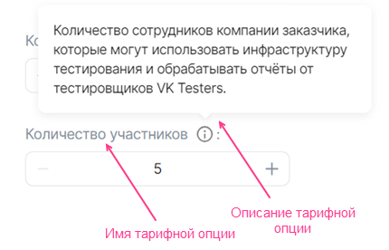
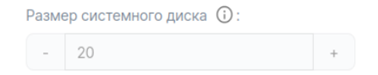
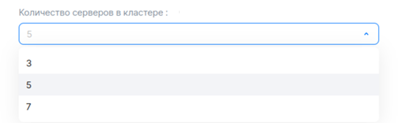
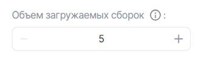
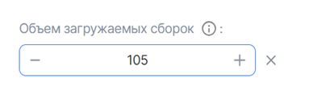
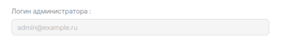
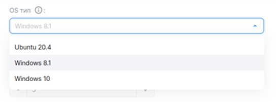
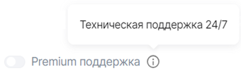

## {heading(Құрылымы)[id=iboption_structure]}

{include(/kz/_includes/_translated_by_ai.md)}

{note:warn}

Кейін төленетін тарифтік опцияның YAML-файл атауы метрикаларды жіберуге арналған API-сұраудағы `param` мәніне сәйкес келуі керек (толығырақ {linkto(/kz/tools-for-using-services/vendor-account/manage-apps/concepts/about#billing_push)[text=%text]} бөлімінде).

{/note}

Тарифтік опция {linkto(#tab_top_level_options)[text=%number кестеде]} келтірілген параметрлер мен секциялар арқылы сипатталады.

{caption(Кесте {counter(table)[id=numb_tab_top_level_options]} — Тарифтік опцияны сипаттауға арналған параметрлер мен секциялар)[align=right;position=above;id=tab_top_level_options;number={const(numb_tab_top_level_options)}]}
[cols="2,5,2", options="header"]
|===
|Атауы
|Сипаттамасы
|Міндетті

|actions
|
Параметр опцияны тарификациялау тәсілін анықтайды (толығырақ {linkto(/kz/tools-for-using-services/vendor-account/manage-apps/concepts/about#xaas_billing)[text=%text]} бөлімінде). Мүмкін мәндер:

* Тегін немесе алдын ала төленетін тарификация үшін бір немесе екі мәнді көрсетіңіз:

    * `create` — сервис қосылған кезде опция белсенді болады.
    * `update` — тарифтік жоспар жаңартылған кезде опция белсенді болады.

  Егер опция белсенді болса, пайдаланушы оның мәнін өзгерте алады.
* Кейін төленетін тарификация үшін `resource_usages` мәнін көрсетіңіз

| 

|schema
|
Секция мыналарды анықтайды:

* Тарифтік опцияның түрін.
* Тарифтік опцияның атауы мен сипаттамасын ({linkto(#pic_tariff_option)[text=%number сурет]}).
* Тарифтік опция мәнінің баптауларын.

Секция параметрлері {linkto(#iboption_schema)[text=%text]} бөлімінде келтірілген
| 

|billing
|
Секция мыналарды анықтайды:

* Тарифтік опцияның құнын.
* `integer` түріндегі тарифтік опция үшін пайдаланушылық өзгерту қадамын.

Секция параметрлері {linkto(#iboption_billing)[text=%text]} бөлімінде келтірілген
| 
|===
{/caption}

{caption(Сурет {counter(pic)[id=numb_pic_tariff_option]} — Тарифтік опция)[align=center;position=under;id=pic_tariff_option;number={const(numb_pic_tariff_option)} ]}
{params[width=45%]}
{/caption}

Тарифтік опциялардың әртүрлі түрлерін сипаттау мысалдары {linkto(../ibopt_fill_in#IB_option_fill_in)[text=%text]} бөлімінде келтірілген.

## {heading(billing секциясы)[id=iboption_billing]}

Келесі түрлердегі опциялар ақылы тарифтік опциялар бола алады:

* Сандық (`integer`, `number`). Алдын ала төленетін және кейін төленетін тарификация қолдау көрсетіледі.
* Логикалық (`boolean`). Алдын ала төленетін тарификация қолдау көрсетіледі.

Тарификация түрлері туралы толығырақ {linkto(/kz/tools-for-using-services/vendor-account/manage-apps/concepts/about#xaas_billing)[text=%text]} бөлімінде.

Тарификация түріне және опция түріне байланысты `billing` секциясында {linkto(#tab_billing_integer)[text=%number кестеде]}, {linkto(#tab_billing_boolean)[text=%number кестеде]}, {linkto(#tab_billing_number)[text=%number кестеде]} келтірілген параметрлер мен еншілес секцияларды көрсетіңіз.

{caption(Кесте {counter(table)[id=numb_tab_billing_integer]} — Өзгерту қадамы бар integer түріндегі алдын ала төленетін опцияға арналған billing секциясының параметрлері)[align=right;position=above;id=tab_billing_integer;number={const(numb_tab_billing_integer)}]}
[cols="2,5,2,2", options="header"]
|===
|Атауы
|Сипаттамасы
|Пішімі
|Міндетті

|base
|Тарифтік жоспар құнына кіретін тарифтік опцияның стандартты мәнін анықтайды.

Стандартты мән — пайдаланушы орната алатын ең аз мән.

Егер параметр берілмесе, тарифтік опцияның стандартты мәні автоматты түрде `0`-ге тең болады
|integer
| 

|cost
|Тарифтік опция мәнін өзгертуге болатын қадамның құнын анықтайды.

Егер опцияны өзгерту тегін болса, `0` көрсетіңіз. Қадам параметрлері `unit` секциясында анықталады
|float64, >= 0
| 

|unit
|Опцияны өзгерту қадамының параметрлерін анықтайды
| 
| 

4+|`unit` секциясының параметрлері

|unit.size
|Тарифтік опция мәнін өзгертуге болатын қадам өлшемін анықтайды.

Осы параметрде көрсетілген мән `billig.cost` параметрінде берілген құнға сәйкес тарификацияланады
|integer, > 0
| 

|unit.measurement
|`unit.size` параметрінде берілген қадамның өлшем бірліктерін анықтайды
|string, 255 таңбаға дейін
| 
|===
{/caption}

{caption(Кесте {counter(table)[id=numb_tab_billing_boolean]} — Алдын ала төленетін boolean ауыстырғыш-опцияға арналған billing секциясының параметрлері)[align=right;position=above;id=tab_billing_boolean;number={const(numb_tab_billing_boolean)}]}
[cols="2,5,2,2", options="header"]
|===
|Атауы
|Сипаттамасы
|Пішімі
|Міндетті

|cost
|
Опцияның құнын анықтайды
|float64, >= 0
| 
|===
{/caption}

{caption(Кесте {counter(table)[id=numb_tab_billing_number]} — Кейін төленетін integer немесе number түріндегі опцияға арналған billing секциясының параметрлері)[align=right;position=above;id=tab_billing_number;number={const(numb_tab_billing_number)}]}
[cols="2,5,2,2", options="header"]
|===
|Атауы
|Сипаттамасы
|Пішімі
|Міндетті

|cost
|Тарифтік опция бірлігінің құнын анықтайды
|float64, >= 0
| 

|unit
|Опцияның өлшем бірліктерін анықтайды
| 
| 

4+|`unit` секциясының параметрлері

|unit.size
|Опцияны тарификациялау қадамы. Мәні `1` болуы керек
|integer
| 

|unit.measurement
|Опцияның өлшем бірліктерін анықтайды
|string, 255 таңбаға дейін
| 
|===
{/caption}

{note:warn}

Кейін төленетін тарифтік опциялар тек тегін тарифтік жоспарда ғана бола алады.

{/note}

## {heading(schema секциясы)[id=iboption_schema]}

### {heading(Сандық тарифтік опцияларға арналған schema секциясы)[id=iboption_numeric_schemas]}

#### {heading(integer түріндегі тегін немесе алдын ала төленетін тарифтік опция)[id=iboption_option_integer]}

`integer` тарифтік опциясының ішкі түрлері:

* Константа ({linkto(#pic_tariff_option_integer)[text=%number сурет]}).

  {caption(Сурет {counter(pic)[id=numb_pic_tariff_option_integer]} — integer түріндегі тұрақты тарифтік опция)[align=center;position=under;id=pic_tariff_option_integer;number={const(numb_pic_tariff_option_integer)} ]}
  {params[width=40%]}
  {/caption}
* Тізімнен мән таңдау мүмкіндігімен ({linkto(#pic_tariff_option_select)[text=%number сурет]}).

  {caption(Сурет {counter(pic)[id=numb_pic_tariff_option_select]} — Тізімнен мән таңдау мүмкіндігі бар integer түріндегі тарифтік опция)[align=center;position=under;id=pic_tariff_option_select;number={const(numb_pic_tariff_option_select)} ]}
  {params[width=60%]}
  {/caption}
* Өзгерту қадамымен ({linkto(#pic_tariff_option_step)[text=%number сурет]}, {linkto(#pic_tariff_option_step_plus)[text=%number сурет]}).

  Әдепкі бойынша опцияны өзгерту қадамы 1-ге тең. Қадам өлшемін өзгертуге, сондай-ақ оны ақылы етуге {linkto(#iboption_billing)[text=%text]} секциясында болады.

  {caption(Сурет {counter(pic)[id=numb_pic_tariff_option_step]} — Өзгерту қадамы бар integer түріндегі тарифтік опция)[align=center;position=under;id=pic_tariff_option_step;number={const(numb_pic_tariff_option_step)} ]}
  {params[width=35%]}
  {/caption}

  {caption(Сурет {counter(pic)[id=numb_pic_tariff_option_step_plus]} — Өзгерту қадамы бар integer түріндегі тарифтік опция, мәні өзгерту қадамына ұлғайтылған)[align=center;position=under;id=pic_tariff_option_step_plus;number={const(numb_pic_tariff_option_step_plus)} ]}
  {params[width=40%]}
  {/caption}

`integer` түріндегі тегін немесе алдын ала төленетін тарифтік опцияға арналған параметрлер {linkto(#tab_tariff_option_integer)[text=%number кестеде]} келтірілген. Опцияның құны {linkto(#iboption_billing)[text=%text]} секциясында сипатталады.

{caption(Кесте {counter(table)[id=numb_tab_tariff_option_integer]} — integer түріндегі тарифтік опцияға арналған schema секциясы)[align=right;position=above;id=tab_tariff_option_integer;number={const(numb_tab_tariff_option_integer)}]}
[cols="2,5,2,2", options="header"]
|===
|Атауы
|Сипаттамасы
|Пішімі
|Міндетті

4+|**Барлық ішкі түрлер үшін бірдей тарифтік опцияның негізгі параметрлері**

|description
|Тарифтік опцияның атауы
|string, 255 таңбаға дейін
| 

|hint
|Тарифтік опция сипаттамасы бар көмекші мәтін
|string, 255 таңбаға дейін
| 

|type
|Тарифтік опция түрін анықтайды. `integer` мәнін көрсетіңіз
| 
| 

4+|**Тарифтік опцияның ішкі түрін баптауға арналған параметрлер**

4+|**Тұрақты опцияға арналған параметр**

|const
|Тұрақты тарифтік опцияның мәнін анықтайды
|integer
| 

4+|**Мән таңдауы бар опцияға арналған параметрлер**

|enum
|Пайдаланушы біреуін таңдай алатын мәндер тізімін анықтайды
|Тізім, тізім ішінде — integer
| 

|default
|Әдепкі тарифтік опция мәнін анықтайды
|integer
| 

4+|**1 өзгерту қадамы бар опцияға арналған параметрлер**

|default
|Әдепкі тарифтік опция мәнін анықтайды.

Егер параметр берілмесе, әдепкі мән `0`-ге тең болады
|integer, >= 0 немесе `minimum`, &#8656; `maximum`
| 

|minimum
|Тарифтік опцияның ең аз мәнін анықтайды
|integer, >= 0 және &#8656; `maximum`
| 

|maximum
|Тарифтік опцияның ең көп мәнін анықтайды
|integer, > 0 және >= `minimum`
| 

|tag
|Тег. Бірнеше опцияны өзара байланыстыруға мүмкіндік береді.

Дискіні сипаттау үшін қолданылады (толығырақ {linkto(../ibopt_fill_in#IBoption_fill_in_volume)[text=%text]} бөлімінде)
|string
| 

4+|**Пайдаланушылық өзгерту қадамы бар опцияға арналған параметрлер. Өзгерту қадамы {linkto(#iboption_billing)[text=%text]} секциясында бапталады**

|default
|`billing.base` параметрінде берілетін стандартты мәнге қатысты есептелген әдепкі тарифтік опция мәнін анықтайды (стандартты мән `billing.base` параметрінде беріледі):

* Егер `0` мәні берілсе, тарифтік опцияның әдепкі мәні стандартты мәнге тең болады (`billing.base` параметрінде берілген).
* Егер `n > 0` мәні берілсе, тарифтік опцияның әдепкі мәні стандартты мәннен және `n` еселі өзгерту қадамынан құралады:

   ```
   billing.base + n * billing.unit.size
   ```

|integer, >= 0 немесе `minimum`, &#8656; `maximum`
| 

|minimum
|`billing.base` параметрінде берілген стандартты мәнге қатысты есептелген тарифтік опцияның ең аз мәнін анықтайды (стандартты мән `billing.base` параметрінде беріледі) :

* Егер `0` мәні берілсе, тарифтік опцияның ең аз мәні стандартты мәнге тең болады.
* Егер `n > 0` мәні берілсе, тарифтік опцияның ең аз мәні стандартты мәннен және `n` еселі өзгерту қадамынан құралады:

   ```
   billing.base + n * billing.unit.size
   ```

|integer, >= 0 және &#8656; `maximum`
| 

|maximum
|`billing.base` параметрінде берілген стандартты мәнге қатысты есептелген тарифтік опцияның ең көп мәнін анықтайды (стандартты мән `billing.base` параметрінде беріледі):

* Егер `0` мәні берілсе, тарифтік опцияның ең көп мәні стандартты мәнге тең болады.
* Егер `n > 0` мәні берілсе, тарифтік опцияның ең көп мәні стандартты мәннен және `n` еселі өзгерту қадамынан құралады:

   ```
   billing.base + n * billing.unit.size
   ```

|integer, > 0 и >= `minimum`
| 
|===
{/caption}

#### {heading(integer немесе number түріндегі кейін төленетін тарифтік опция)[id=iboption_option_postpaid]}

Кейін төленетін сандық тарифтік опцияға арналған параметрлер {linkto(#tab_tariff_option_postpaid)[text=%number кестеде]} келтірілген. Опцияның құны {linkto(#iboption_billing)[text=%text]} секциясында сипатталады.

{caption(Кесте {counter(table)[id=numb_tab_tariff_option_postpaid]} — Кейін төленетін опцияға арналған schema секциясы)[align=right;position=above;id=tab_tariff_option_postpaid;number={const(numb_tab_tariff_option_postpaid)}]}
[cols="2,5,2,2", options="header"]
|===
|Атауы
|Сипаттамасы
|Пішімі
|Міндетті

|description
|Тарифтік опцияның атауы
|string, 255 таңбаға дейін
| 

|hint
|Тарифтік опция сипаттамасы бар көмекші мәтін
|string, 255 таңбаға дейін
| 

|type
|Тарифтік опция түрін анықтайды. `integer` немесе `number` мәнін көрсетіңіз
| 
| 
|===
{/caption}

### {heading(string түріндегі тарифтік опцияға арналған schema секциясы)[id=iboption_option_string]}

`string` тарифтік опциясының ішкі түрлері:

* Константа ({linkto(#pic_option_string_const)[text=%number сурет]}).

  {caption(Сурет {counter(pic)[id=numb_pic_option_string_const]} — string түріндегі тұрақты тарифтік опция)[align=center;position=under;id=pic_option_string_const;number={const(numb_pic_option_string_const)} ]}
  {params[width=60%]}
  {/caption}
* Мән енгізу мүмкіндігімен ({linkto(#pic_option_string_input)[text=%number сурет]}).

  {caption(Сурет {counter(pic)[id=numb_pic_option_string_input]} — Мән енгізу мүмкіндігі бар string түріндегі тарифтік опция)[align=center;position=under;id=pic_option_string_input;number={const(numb_pic_option_string_input)} ]}
  {params[width=45%]}
  {/caption}
* Тізімнен мән таңдау мүмкіндігімен ({linkto(#pic_option_string_enum)[text=%number сурет]}).

  {caption(Сурет {counter(pic)[id=numb_pic_option_string_enum]} — Тізімнен мән таңдау мүмкіндігі бар string түріндегі тарифтік опция)[align=center;position=under;id=pic_option_string_enum;number={const(numb_pic_option_string_enum)} ]}
  {params[width=60%]}
  {/caption}

`string` түріндегі тарифтік опцияға арналған параметрлер {linkto(#tab_option_string)[text=%number кестеде]} келтірілген.

{caption(Кесте {counter(table)[id=numb_tab_option_string]} — string түріндегі тарифтік опцияға арналған schema секциясы)[align=right;position=above;id=tab_option_string;number={const(numb_tab_option_string)}]}
[cols="2,5,2,2", options="header"]
|===
|Атауы
|Сипаттамасы
|Пішімі
|Міндетті

4+|**Барлық ішкі түрлер үшін бірдей тарифтік опцияның негізгі параметрлері**

|description
|Тарифтік опцияның атауы
|string, 255 таңбаға дейін
| 

|hint
|Тарифтік опция сипаттамасы бар көмекші мәтін
|string, 255 таңбаға дейін
| 

|type
|Тарифтік опция түрін анықтайды. `string` мәнін көрсетіңіз
| 
| 

4+|**Тарифтік опцияның ішкі түрін баптауға арналған параметрлер**

4+|**Тұрақты опцияға арналған параметр**

|const
|Тұрақты тарифтік опцияның мәнін анықтайды
|string
| 

4+|**Мән енгізу мүмкіндігі бар опцияға арналған параметрлер**

|default
|Әдепкі мәнді анықтайды
|string
| 

|pattern
|Тарифтік опция мәні сәйкес келуі тиіс үлгіні анықтайды
|regex
| 

|minLength
|Тарифтік опция мәні үшін ең аз таңба санын анықтайды
|integer, > 0 және &#8656; `maxLength`
| 

|maxLength
|Тарифтік опция мәні үшін ең көп таңба санын анықтайды
|integer, > 0 және >= `minLength`
| 

4+|**Тізімнен мән таңдау мүмкіндігі бар опцияға арналған параметрлер**

|enum
|Пайдаланушы біреуін таңдай алатын мәндер тізімін анықтайды
|Тізім, тізім ішінде — string
| 

|default
|Әдепкі мәнді анықтайды
|string
| 
|===
{/caption}

### {heading(boolean түріндегі тарифтік опцияға арналған schema секциясы)[id=iboption_option_boolean]}

`boolean` тарифтік опциясының ішкі түрі:

* Константа ({linkto(#pic_option_boolean_const)[text=%number сурет]}).

  {caption(Сурет {counter(pic)[id=numb_pic_option_boolean_const]} — boolean түріндегі тұрақты тарифтік опция)[align=center;position=under;id=pic_option_boolean_const;number={const(numb_pic_option_boolean_const)} ]}
  {params[width=35%]}
  {/caption}
* Ауыстырғыш ({linkto(#pic_option_boolean)[text=%number сурет]}).

  {caption(Сурет {counter(pic)[id=numb_pic_option_boolean]} — boolean ауыстырғышы)[align=center;position=under;id=pic_option_boolean;number={const(numb_pic_option_boolean)} ]}
  {params[width=50%]}
  {/caption}

`boolean` түріндегі тарифтік опцияға арналған параметрлер {linkto(#tab_option_boolean)[text=%number кестеде]} келтірілген.

{caption(Кесте {counter(table)[id=numb_tab_option_boolean]} — boolean түріндегі тарифтік опцияға арналған schema секциясы)[align=right;position=above;id=tab_option_boolean;number={const(numb_tab_option_boolean)}]}
[cols="2,5,2,2", options="header"]
|===
|Атауы
|Сипаттамасы
|Пішімі
|Міндетті

4+|**Барлық ішкі түрлер үшін бірдей тарифтік опцияның негізгі параметрлері**

|description
|Тарифтік опцияның атауы
|string, 255 таңбаға дейін
| 

|hint
|Тарифтік опция сипаттамасы бар көмекші мәтін
|string, 255 таңбаға дейін
| 

|type
|Тарифтік опция түрін анықтайды. `boolean` мәнін көрсетіңіз
| 
| 

4+|**Тарифтік опцияның ішкі түрін баптауға арналған параметрлер**

4+|**Тұрақты опцияға арналған параметр**

|const
|Тұрақты тарифтік опцияның мәнін анықтайды
|boolean
| 

4+|**Ауыстырғыш-опцияға арналған параметр**

|default
|Әдепкі тарифтік опция мәнін анықтайды.

{note:warn}

Егер `boolean` ауыстырғышы үшін `default` параметрі берілмесе, әдепкі мән `false` болады.

{/note}
|boolean
| 
|===
{/caption}

`boolean` түріндегі тарифтік опцияны ақылы ету үшін оның құнын {linkto(#iboption_billing)[text=%text]} секциясында сипаттаңыз.

### {heading(datasource түріндегі тарифтік опцияға арналған schema секциясы)[id=iboption_option_datasource]}

`datasource` түріндегі тарифтік опцияға арналған параметрлер {linkto(#pic_option_datasource)[text=%number кестеде]} келтірілген.

{caption(Кесте {counter(table)[id=numb_pic_option_datasource]} — datasource түріндегі тарифтік опцияға арналған schema секциясы)[align=right;position=above;id=pic_option_datasource;number={const(numb_pic_option_datasource)}]}
[cols="2,5,2,2", options="header"]
|===
|Атауы
|Сипаттамасы
|Пішімі
|Міндетті

|description
|Тарифтік опцияның атауы
|string, 255 таңбаға дейін
| 

|hint
|Тарифтік опция сипаттамасы бар көмекші мәтін
|string, 255 таңбаға дейін
| 

|type
|`datasource` секциясымен бірге тарифтік опцияны бұлттық платформа мәндерімен байланысқан опция ретінде анықтайды.

`string` мәнін көрсетіңіз
| 
| 

|default
|Әдепкі мәнді анықтайды.

Тек келесі `datasource` түрлері үшін берілуі мүмкін:

* `az`.
* `volume_type`.

`az` үшін мүмкін мәндер (Мәскеу өңірі):

* `ms1`.
* `gz1`.

`volume_type` үшін мүмкін мәндер:

* `ceph-ssd` — SSD түріндегі диск.
* `ceph-hdd` — HDD түріндегі диск.
* `high-iops` — High-IOPS SSD түріндегі диск (өнімділігі жоғары SSD)

| 
| 

|tag
|Тег. Бірнеше опцияны өзара байланыстыруға мүмкіндік береді.

Дискіні сипаттау үшін қолданылады (толығырақ {linkto(../ibopt_fill_in#IBoption_fill_in_volume)[text=%text]} бөлімінде)
|string
| 

|datasource
|`type` параметрімен бірге тарифтік опцияны бұлттық платформа мәндерімен байланысқан опция ретінде анықтайтын секция.

Секция бұлттық платформа мәнінің нақты түрін сипаттайды
| 
| 

4+|`datasource` секциясының параметрлері

|datasource.type
|Бұлттық платформа мәнінің түрін анықтайтын параметр.

Мүмкін мәндер:

* `flavor` — пайдаланушының бұлттық платформа жобасында қолжетімді ВМ түрлері.
* `az` — бұлттық платформаның қолжетімділік аймақтары.
* `network` — бұлттық платформа жобасында қолжетімді желілер.
* `subnet` — бұлттық платформа жобасында қолжетімді ішкі желілер.
* `volume_type` — диск түрі.

Пайдаланушыға көрсетілген түрге сәйкес, сүзгілерді ескере отырып (сүзгілер `datasource.filter` секциясында беріледі), мәндер тізімі көрсетіледі. Осы мәндердің ішінен пайдаланушы біреуін таңдауы керек
| 
| 

|datasource.filter
|Секция тек келесі `datasource` түрлері үшін берілуі мүмкін:

* `flavor`
* `network`
* `volume_type`

ВМ, желі немесе диск түріне арналған сүзгілерді анықтайды
| 
| 

4+|ВМ түріне арналған `datasource.filter` сүзгілері

|datasource.filter.vcpus
|ВМ CPU үшін сүзгілерді анықтайды
|{linkto(#tab_CPU_RAM)[text=ВМ үшін CPU және RAM шектеулері]} кестесінде келтірілген
| 

|datasource.filter.ram
|ВМ RAM үшін сүзгілерді анықтайды
|{linkto(#tab_CPU_RAM)[text=ВМ үшін CPU және RAM шектеулері]} кестесінде келтірілген
| 

4+|Желіге арналған `datasource.filter` сүзгілері

|datasource.filter.kind
|Желі түрі бойынша сүзгілерді анықтайды.

Мүмкін мәндер:

* `external` — тек сыртқы желілер.
* `internal` — тек ішкі желілер.
* `all` — барлық желілер
  |Тізім
  | 

|datasource.filter.shared
|Желіні бірлесіп пайдалану бойынша сүзгілерді анықтайды.

Мүмкін мәндер:

* `true` — желі барлық жобалар пайдалана алатындай қолжетімді.
* `false` — желі тек пайдаланушы жобасында ғана қолжетімді.

Әдепкі мән: `false`
|Тізім
| 

4+|Диск түріне арналған `datasource.filter` сүзгілері

|datasource.filter.disk_class.enum
|Диск түрі бойынша сүзгілерді анықтайды.

Мүмкін мәндер:

* `ssd` — SSD түріндегі диск.
* `hdd` — HDD түріндегі диск.
* `high_iops_disk` — High-IOPS SSD түріндегі диск (өнімділігі жоғары SSD)

|Тізім
| 

|datasource.filter.name.enum
|Диск атауы бойынша сүзгілерді анықтайды.

Мүмкін мәндер:

* `ceph-ssd` — SSD түріндегі диск.
* `ceph-hdd` — HDD түріндегі диск.
* `high-iops` — High-IOPS SSD түріндегі диск (өнімділігі жоғары SSD)

|Тізім
| 
|===
{/caption}

ВМ үшін CPU және RAM шектеулері {linkto(#tab_CPU_RAM)[text=%number кестеде]} келтірілген параметрлер арқылы беріледі.

{caption(Кесте {counter(table)[id=numb_tab_CPU_RAM]} — ВМ үшін CPU және RAM шектеулері)[align=right;position=above;id=tab_CPU_RAM;number={const(numb_tab_CPU_RAM)}]}
[cols="2,5,2,2", options="header"]
|===
|Атауы
|Сипаттамасы
|Пішімі
|Міндетті

|minimum
|CPU немесе RAM үшін ең аз мәнді анықтайды — бұл параметр қай секцияда берілгеніне байланысты.

RAM үшін мән МБ түрінде көрсетіледі
|integer, > 0 және &#8656;  `maximum`
| 

|maximum
|CPU немесе RAM үшін ең көп мәнді анықтайды — бұл параметр қай секцияда берілгеніне байланысты
|integer, > 0 және >= `minimum`
| 
|===
{/caption}
