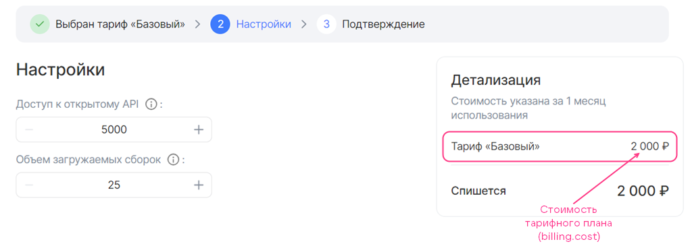

{include(/kz/_includes/_translated_by_ai.md)}

# {heading(plan.yaml файлы)[id=ibplan]}

`plans/<PLAN_NAME>/plan.yaml` файлында нақты тарифтік жоспардың параметрлері сипатталады. Сервистік пакетті жүктеп, сервисті жариялағаннан кейін тарифтік жоспар сервистік кілтте көрсетілген дүкеннің ашық атаулар кеңістіктерінде (`namespace_public`) қолжетімді болады (толығырақ — [Image-based қолданбаны дүкенге жүктеу](../../ibservice_upload) бөлімінде).

`plans/<PLAN_NAME>/plan.yaml` файлында {linkto(#tab_plan_param)[text=%number кестесінде]} келтірілген параметрлер мен секцияларды көрсетіңіз.

{caption(Кесте {counter(table)[id=numb_tab_plan_param]} — plans/<PLAN_NAME>/plan.yaml файлының параметрлері)[align=right;position=above;id=tab_plan_param;number={const(numb_tab_plan_param)}]}
[cols="2,5,2,2", options="header"]
|===
| Атауы
| Сипаттамасы
| Форматы
| Міндетті

| id
| UUID4 генераторының көмегімен қалыптастырылған UUID4 (ID) тарифтік жоспар идентификаторы
| string (UUID4)
| 

| revision
| Тарифтік жоспар ревизиясы. Тарифтік жоспар ревизиясы мен ID комбинациясы оның сервистегі бірегейлігін анықтайды. Қалған параметрлер тарифтік жоспардың нақты ревизиясының сипаттамаларын сипаттайды
| string, 255 таңбаға дейін
| 

| name
| Дүкен интерфейсінде көрсетілмейтін тарифтік жоспардың техникалық атауы. Бос орындардың орнына астыңғы сызу белгісін пайдаланып, латын әріптерімен көрсетілуі тиіс
| string, 255 таңбаға дейін
| 

| description
| Дүкен интерфейсінде көрсетілетін тарифтік жоспар атауы
| string, 255 таңбаға дейін
| 

| free
| Бұл тарифтік жоспардың тегін екенін не емес екенін анықтайды
| boolean
| 

| billing
| Ақылы тарифтік опцияларды есепке алмағанда тарифтік жоспардың құнын анықтайды (толығырақ — {linkto(#plan_billing)[text=%text]} бөлімінде)
| 
| 

| parameters_patch
| Нақты жоспар үшін тарифтік опциялардың параметрлерін қайта анықтауға мүмкіндік береді (толығырақ — {linkto(#plan_options)[text=%text]} бөлімінде)
| 
| 

| resource_usages
| Постоплаталық тарифтік опциялардың тізімін қамтиды
| Массив
| Иә — постоплаталық опциялары бар жоспар үшін
|===
{/caption}

{note:err}

Тарифтік жоспар ID-і мен ревизиясының комбинациясы сервис аясында бірегей болуы керек. Егер осы сервисте дәл сондай идентификаторы мен ревизиясы бар жоспар бұрыннан бар болса, тарифтік жоспар жаңартылмайды.

{/note}

{note:warn}

Бір тарифтік жоспар аясында тарификацияның бір ғана түріне жататын опцияларға рұқсат етіледі: алдын ала төленетін опциялары бар тарифтік жоспар немесе постоплаталық опциялары бар тарифтік жоспар.

{/note}

`plans/<PLAN_NAME>/plan.yaml` файлдарының мысалдары {linkto(#ibexample_plan)[text=%text]} бөлімінде келтірілген.

## {heading(Тарифтік жоспардың billing секциясы)[id=plan_billing]}

Тарифтік жоспар құны үшін тек алдын ала төленетін тарификация түрі қолданылады (толығырақ — {linkto(/kz/tools-for-using-services/vendor-account/manage-apps/concepts/about#xaas_billing)[text=%text]} бөлімінде).

Тарифтік жоспардың құнын сипаттау үшін ({linkto(#pic_plan_billing)[text=%number суреті]}), `plans/<PLAN_NAME>/plan.yaml` файлында `billing` секциясын көрсетіп, {linkto(#tab_plan_billing)[text=%number кестесінде]} келтірілген параметрлерді орнатыңыз.

{caption(Кесте {counter(table)[id=numb_tab_plan_billing]} — billing секциясының параметрлері)[align=right;position=above;id=tab_plan_billing;number={const(numb_tab_plan_billing)}]}
[cols="3,5,2,1,2", options="header"]
|===
|Атауы
|Сипаттамасы
|Форматы
|Міндетті
|Әдепкі мәні

|cost
|
Ақылы тарифтік опцияларды есепке алмағанда есептік кезең үшін тарифтік жоспардың құнын анықтайды.

Егер жоспар тегін болса, `0` көрсетіңіз. Құн дүкен жайғастырылған елдің валютасында беріледі
|float
| 
|
—

|refundable
|
Пайдаланушы тарифтік жоспарды өзгерткенде немесе сервис инстансын жойғанда, есептік кезеңнің қалған күндері үшін қаражатты жобаның бонустық шотына қайтару-қайтармауды анықтайды.

Параметр пайдаланушы тарифтік жоспарды өзгерткен кезде сервис үшін төлемді есептен шығару күніне әсер етеді (тарифтік опцияларды өңдейді немесе жаңасына ауысады):

* Егер мәні `true` болса, күн өзгермейді.
* Егер мәні `false` болса, күн тарифтік жоспар өзгертілген күнге жаңартылады

|boolean
| 
|
`true`

|billing_cycle_flat
|
Тарификация үшін есептік кезеңнің ұзақтығын анықтайды.

Жазылу форматы: `<КОЛИЧЕСТВО_МЕСЯЦЕВ> mons <КОЛИЧЕСТВО_ДНЕЙ> days`. Мысалы, `1 mons 15 days`, `30 days`.

{note:info}

`mons` ішіндегі ай күндерінің саны күнтізбелік мән негізінде есептеледі. Сондықтан `1 mons 0 days` және `0 mons 31 days` кезеңдері өзара тең емес.

{/note}
|string
| 
|
`1 mons 0 days`
|===
{/caption}

{caption(`billing` секциясын толтыру мысалы)[align=left;position=above]}
```yaml
billing:
  cost: 2000
  refundable: true
  billing_cycle_flat: 1 mons 0 days
```
{/caption}

{caption(Сурет {counter(pic)[id=numb_pic_plan_billing]} — Тарифтік жоспар құны)[align=center;position=under;id=pic_plan_billing;number={const(numb_pic_plan_billing)} ]}

{/caption}

{note:warn}

Бұлттық платформаның есептеу ресурстарын пайдалану құны сервис тарифтік жоспарының құнына кірмейді.

{/note}

Жоспар құнына ақылы тарифтік опцияларды қосуға болады. Ол үшін олардың құнын YAML-файлдарда сипаттаңыз (толығырақ — {linkto(../ibopt_fill_in#IB_option_fill_in)[text=%text]} бөлімінде).

{note:info}

Дүкенде сервисті тестілеу және баптау үшін берілетін бонустарды тиімді пайдалану үшін (толығырақ — {linkto(../../ibservice_upload/ibservice_upload_package#ibservice_upload_package)[text=%text]} бөлімінде) тарифтік жоспар мен оның опцияларының тестілік құнын көрсетіңіз.

{/note}

## {heading(parameters_patch секциясы)[id=plan_options]}

Нақты тарифтік жоспар үшін тарифтік опциялардың параметрлерін қайта анықтау немесе YAML-файлдарда берілмеген жаңаларын қосу үшін:

1. `plans/<PLAN_NAME>/plan.yaml` файлында мынаны көрсетіңіз:

   * `parameters_patch` секциясын.
   * `parameters_patch` ішінде — тарифтік опциялардың YAML-файлдарының атауларын.

1. Тарифтік опция параметрлерінің мәндерін орнатыңыз. Параметр атауларын түбірлік секцияға дейінгі жолымен бірге көрсетіңіз. Параметр атауын және оның ата-аналық секцияларының атауларын нүктемен бөліңіз.

   Тарифтік опция түріне байланысты ықтимал параметрлер [Тарифтік опцияның YAML-файлы](../iboption) бөлімінде келтірілген.

   {caption(Тарифтік опция параметрлерін қайта анықтау мысалы)[align=left;position=above]}
   ```yaml
   parameters_patch:
     users:
       schema.const: 5000
     volume_data_size:
       schema.default: 550
       schema.minimum: 550
   ```
   {/caption}

   Тарифтік опцияның YAML-файлында көрсетілген параметр мәндері тарифтік жоспарда қолданылмайды.

Тарифтік опция секциясын толықтай қайта анықтау үшін:

1. `plans/<PLAN_NAME>/plan.yaml` файлында мынаны көрсетіңіз:

   * `parameters_patch` секциясын.
   * `parameters_patch` ішінде — тарифтік опция секциясын. Мысалы, `billing`.

1. Секция параметрлерін орнатыңыз (толығырақ — [Тарифтік опцияның YAML-файлы](../iboption) бөлімінде).

   {caption(Тарифтік опцияның `billing` секциясын қайта анықтау мысалы)[align=left;position=above]}
   ```yaml
   parameters_patch:
     assemblies_size:
       billing:
         base: 25
         cost: 0
         unit:
           size: 100
   ```
   {/caption}

   Осы секция үшін тарифтік опцияның YAML-файлында көрсетілген параметрлер тарифтік жоспарда қолданылмайды.

{note:warn}

Секцияны толықтай және осы секциядағы жеке параметрді бір уақытта қайта анықтауға тыйым салынады.

{/note}

{note:info}

Егер тарифтік жоспарларда бір-бірінен қатты ерекшеленетін опциялар қолданылса, онда әр опцияны `parameters` директориясында бөлек YAML-файлмен сипаттау ұсынылады. Бір опцияны сипаттап, оның параметрлерінің көпшілігін тарифтік жоспарлар аясында қайта анықтау ұсынылмайды.

{/note}

## {heading(plan.yaml мысалдары файлы)[id=ibexample_plan]}

{caption(Тарифтік опция параметрлерін қайта анықтайтын тарифтік жоспар мысалы)[align=left;position=above]}
```yaml
id: b2b42648-XXXX-b4cddbf010b2
revision: v. 1.0
name: basic
description: Базовый
free: false

billing:
  cost: 2000
  refundable: true
  billing_cycle_flat: 1 mons

parameters_patch:
  users:
    schema.const: 5000
  volume_data_size:
    schema.default: 550
    schema.minimum: 550
```
{/caption}

{caption(Постоплаталық тарифтік опциясы бар тарифтік жоспар мысалы)[align=left;position=above]}
```yaml
id: 3aa541d8-XXXX-6dbf542b3f90
revision: v. 1.1
name: postpaid
description: Постоплатный
free: true

billing:
  cost: 0

resource_usages:
  - storage
```
{/caption}
