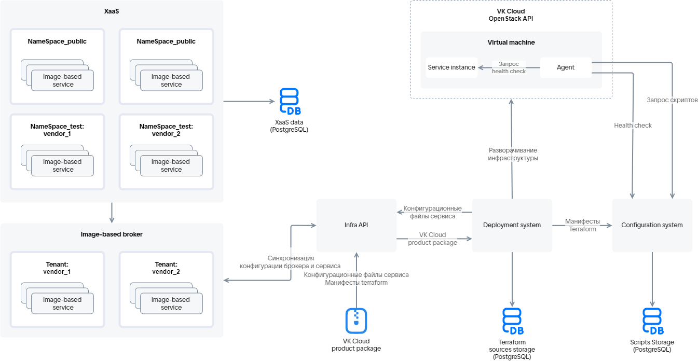

# {heading(Сервистік пакетті дүкенге жүктеу)[id=ibservice_upload_package]}

{include(/kz/_includes/_translated_by_ai.md)}

## {heading(Жүктеу сызбасы)[id=upload_scheme]}

Сервистік пакетті дүкенге жүктеу deployment system арқылы Infra API сервисінің көмегімен орындалады. Жүктеу сызбасы {linkto(#pic_ib_upload)[text=%number суретте]} берілген.

{caption({counter(pic)[id=numb_pic_ib_upload]} сурет — сервистік пакетті жүктеу сызбасы)[align=center;position=under;id=pic_ib_upload;number={const(numb_pic_ib_upload)} ]}
{params[noBorder=true]}
{/caption}

Сызбаның негізгі элементтерінің сипаттамасы {linkto(#tab_scheme_elements)[text=%number кестеде]} берілген.

{caption({counter(table)[id=numb_tab_scheme_elements]} кесте — сызбаның негізгі элементтерінің сипаттамасы)[align=right;position=above;id=tab_scheme_elements;number={const(numb_tab_scheme_elements)}]}
[cols="2,5", options="header"]
|===
|Атауы
|Сипаттамасы

|
Infra API
|
Дүкен мен бұлтты платформаның image-based қолданбаларды орналастыруға арналған интеграция нүктесі болып табылады. Infra API сервистік пакетті жүктейтін немесе қызмет инстансын орналастыратын пайдаланушының деректерін тексереді. Тексеру сәтті өткеннен кейін Infra API Terraform манифесінде сипатталған ресурстарды құру үшін сервистераралық өзара әрекеттесуге қол жеткізеді. Infra API deployment system және configuration management service-пен өзара әрекеттеседі

|
Система развертывания (Deployment system)
|
Бұлтты платформадағы ВМ-да image-based қолданбасын орналастыруды қамтамасыз етеді. Қызметтің инфрақұрылымы мен БЖ-сын басқарады

|
Image-based брокер
|
Қызмет инстансының өмірлік циклін басқарады, құрамына tenant-тер кіреді. Tenant-тер бір жеткізушінің (`vendor`) image-based қолданбаларын біріктіреді

|
Сервис управления конфигурациями (Configuration system)
|
Мұнда мынадай деректер сақталатын сервер:

* Terraform манифестерінде сипатталған конфигурация.
* Скрипттер орындалуының нәтижелері.
* Қызмет инстансының ағымдағы конфигурациясы.

ВМ-ға орнатылатын агенттің өзекті нұсқасына қолжетімділік береді

|
Агент (Agent)
|
Қызметті орналастыру процесінде ВМ-ға орнатылатын бағдарламалық қамтамасыз ету (толығырақ — {linkto(../../ib_image_create/ib_image_agent#ib_image_agent)[text=%text]} бөлімінде)

|
Сервистік пакет ({var(cloud)} product package)
|
YAML-файлдар мен Terraform манифестерінің құрылымдалған жиынтығы
|===
{/caption}

Әрбір қызметке арналған дүкеннің тестілік (`NameSpace_test`) және ашық (`NameSpace_public`) namespace-тері сервистік кілтте берілген.

## {heading(Сервистік пакетті дүкенге жүктеу тәртібі)[id=upload_actions]}

1. {linkto(../ibservice_upload_prepare#ibservice_upload_prepare)[text=%text]} орындаңыз.
1. Terraform манифестерін жергілікті түрде тестілеңіз (толығырақ — {linkto(../ibservice_upload_localtest#ibservice_upload_localtest)[text=%text]} бөлімінде).
1. Terraform манифестерін deployment system арқылы тестілеңіз (толығырақ — {linkto(../ibservice_upload_deploysystemtest#ibservice_upload_deploysystemtest)[text=%text]} бөлімінде).
1. Сервистік пакет файлдарының толтырылғанына және олардың құрылымы JSON-файлы генераторының пайдаланылатын нұсқасына сәйкес келетініне көз жеткізіңіз (толығырақ — {linkto(../../ib_structure#ib_structure)[text=%text]} бөлімінде).
1. Әрбір тарифтік жоспардың ID және ревизия комбинациялары сервистік пакет шеңберінде бірегей екеніне көз жеткізіңіз.
1. Сервистік пакетті (`<SERVICE_NAME>` директориясы, яғни қызметтің конфигурациялық файлдары мен Terraform манифестері бар бума) zip-архивке қаптаңыз. Архив өлшемі 30 МБ-тан аспауы тиіс.
1. Архивті дүкенге келесі тәсілдердің бірімен жүктеңіз:

   {tabs}

   {tab(Кабинет поставщика)}

   1. [Бұлтты платформаның {var(cloud)} ЖК-сіне өтіңіз](https://kz.cloud.vk.com/app/).
   1. **Қолданбалар дүкені** бөлімінде **Жеткізуші кабинетіне өту** түймесін басыңыз.
   1. **Қызметтерді басқару** қойындысында **Қызмет қосу** түймесін басыңыз.
   1. Жүйеге жүктеу үшін құрылғыңыздан zip-архивті таңдаңыз.
   1. **Қосу** түймесін басыңыз.

   Осыдан кейін қосылған қызмет `Скрыто` күйінде қызметтер тізімінде пайда болады. Жүктелген архив файлы валидацияға жіберіледі.

   {/tab}

   {tab(Infra API)}

   Infra API сервисіне келесі параметрлермен сұрау орындаңыз:

   * Сұрау әдісі: `POST`.
   * Сұрау жолы: `https://<CLOUD_HOST>/marketplace/api/infra-api/api/v1-public/product`

      Мұнда `<CLOUD_HOST>` — `https://cloud.vk.com` бұлтты платформасының домендік атауы.

   * Сұрау денесі: zip-архив.
   * `x-service-token`: `<SERVICE_TOKEN>` — сервистік кілт.

      {caption(Сервистік пакетті дүкенге жүктеуге арналған сұрау мысалы)[align=left;position=above]}
      {tabs}

      {tab(Linux (bash))}

      ```console
      curl -v -X POST https://cloud.vk.com/marketplace/api/infra-api/api/v1-public/product       -H 'x-service-token: <SERVICE_TOKEN>'       -F "upload=@/home/VKservice.zip"
      ```

      {/tab}

      {tab(Windows (cmd))}

      ```console
      curl -v -X POST https://cloud.vk.com/marketplace/api/infra-api/api/v1-public/product ^
      -H "x-service-token: <SERVICE_TOKEN>" ^
      -F "upload=@/home/VKservice.zip"
      ```

      {/tab}

      {/tabs}
      {/caption}

      Жауаптың HTTP кодтары:

       * 204 — сервистік пакет жүктелді.
       * 400, 404, 500 — сұрауды орындау қатесі.
       * 401 — авторизация қатесі.

      Қызметтің тарифтік жоспарлары мен опцияларын сипаттайтын конфигурациялық файлдар image-based брокерге, ал Terraform манифестері deployment system-ге жіберіледі.

   {/tab}

   {/tabs}

   Дүкенге жүктелетін сервистік пакет алдымен тестілік namespace-ке, ал жарияланғаннан кейін ашық namespace-ке түседі.

1. Қызметті жүктеу аяқталғаннан кейін бұлтты платформаның ЖК-сіне кіріп, қызметтің дүкенде көрсетілетініне көз жеткізіңіз. Жүктелген қызмет тек сервистік кілтте көрсетілген дүкеннің тестілік namespace-терінің пайдаланушыларына ғана қолжетімді болады.

   {note:info}

   Егер жүктелгеннен кейін қызмет дүкенде көрсетілмесе, онда ЖК-ден шығып, қайта кіріңіз.

   {/note}

## {heading(Жүктелген қызметті жарияланғанға дейін тестілеу)[id=upload_test]}

Қызметтің бұлтты платформада қалай жұмыс істейтінін тексеру үшін, сервистік пакет жүктелгеннен кейін қызметті дүкеннің тестілік namespace-інде тестілеңіз:

{note:info}

Қызметті тестілеу үшін бонустар беріледі. Бонустарды алу үшін [marketplace@cloud.vk.com](mailto:marketplace@cloud.vk.com) мекенжайына хат жіберіңіз. Бонустық қаражат бұлтты платформа жобасының бонустық шотына есептеледі.

{/note}

1. [Бұлтты платформаның {var(cloud)} ЖК-сіне өтіңіз](https://kz.cloud.vk.com/app/).
1. Әрбір тарифтік жоспардың конфигурация шебері дұрыс көрсетілетініне көз жеткізіңіз.
1. Қызметті қосыңыз. Қызмет инстансын орналастыру сәтті орындалғанына көз жеткізіңіз.

   Егер қызмет инстансын орналастыру кезінде манифесте сипатталған ресурсты құру мүмкін болмаса, deployment system қызметті орналастыру процесін қайта іске қосады. Қайталап әрекет жасау 1,5 сағатқа дейін созылуы мүмкін және оларды `settings.yaml` файлында өшіруге болады (толығырақ — {linkto(../../tf_manifest/tf_manifest_settings#tf_manifest_settings)[text=%text]} бөлімінде).

   {note:warn}

   Қызметті орналастырудың әрбір жаңа әрекетінде барлық бар ресурстар жойылып, қайтадан құрылады.

   {/note}

   {note:info}

   Егер қызметті қосу кезінде қате туындаса, логтарды қараңыз (толығырақ — {linkto(#ibservice_upload_package_log)[text=%text]} бөлімінде).

   {/note}
1. Қызмет инстансын жаңартыңыз:

   1. Ағымдағы тарифтік жоспардың тарифтік опцияларының мәндерін өзгертіңіз.
   1. Жаңа тарифтік жоспарға өтіңіз.

      Манифесте сипатталған ресурстар параметрлерінің өзгеруі қызмет инстансын қайта орнату процесін іске қосады, бұл кезде тек өзгертілген ресурстар жаңартылады. Егер deployment system ресурстарды жаңарта алмаса, ол оларды қайта жаңартуға әрекет жасайды. Қайта әрекеттерді ескере отырып, қызмет инстансының конфигурациясын жаңарту процесі 1,5 сағатқа дейін созылуы мүмкін. Қайта әрекеттерді `settings.yaml` файлында өшіруге болады (толығырақ — {linkto(../../tf_manifest/tf_manifest_settings#tf_manifest_settings)[text=%text]} бөлімінде).

   {note:warn}

   Қызмет инстансының конфигурациясын жаңарту кезінде deployment system тек өзгертілген ресурстарды ғана жаңартады.

   {/note}
1. Қызметтің негізгі пайдаланушылық сценарийлерін тексеріңіз.
1. Қызмет инстансын жойыңыз.
1. Қажет болса, қызмет конфигурациясына өзгерістер енгізіңіз (толығырақ — {linkto(../../../ibservice_update#ibservice_update)[text=%text]} бөлімінде).

   {note:warn}

   Егер қызмет құны үшін тестілеу және жөндеу кезеңіне тестілік мәндер берілген болса, оларды өңдеңіз.

   {/note}
1. Егер тестілеу барысында сервистік пакетке өзгерістер енгізілген болса, қызмет ревизиясы жаңартылғанына көз жеткізіңіз.

## {heading(Қызмет инстансының логтарын қарау)[id=ibservice_upload_package_log]}

1. [Бұлтты платформаның {var(cloud)} ЖК-сіне өтіңіз](https://kz.cloud.vk.com/app/).
1. **Қолданбалар дүкені** бөліміне өтіңіз.
1. Консольді ашып, дүкенде авторизациялауға арналған JWT-токенді алыңыз:

   {tabs}

   {tab(Linux (bash))}

   ```console
   curl -X POST https://cloud.vk.com/marketplace/api/um/v1/tokens/sid    --cookie 'sid=<SID>'
   ```

   {/tab}

   {tab(Windows (cmd))}

   ```console
   curl -X POST https://cloud.vk.com/marketplace/api/um/v1/tokens/sid ^
   --cookie "sid=<SID>"
   ```

   {/tab}

   {/tabs}

   Мұнда `<SID>` — веб-браузердегі `sid` cookie файлының мәні.

   Пәрменге жауап ретінде JWT-токен көрсетіледі.
1. Қызмет инстансының логын алыңыз:

   {tabs}

   {tab(Linux (bash))}

   ```console
   curl -v https://cloud.vk.com/marketplace/api/notifications/api/v1/instance?uuid=<UUID>    -H 'Authorization: Bearer <JWT_TOKEN>'
   ```

   {/tab}

   {tab(Windows (cmd))}

   ```console
   curl -v https://cloud.vk.com/marketplace/api/notifications/api/v1/instance?uuid=<UUID> ^
   -H "Authorization: Bearer <JWT_TOKEN>"
   ```

   {/tab}

   {/tabs}

   Мұнда:

   * `<UUID>` — қызмет инстансының идентификаторы. Мәні бұлтты платформаның ЖК-сінде қызмет инстансы бетінде **ID** параметрінде көрсетіледі.
   * `<JWT_TOKEN>` — алдыңғы қадамда алынған авторизацияға арналған JWT-токен.
