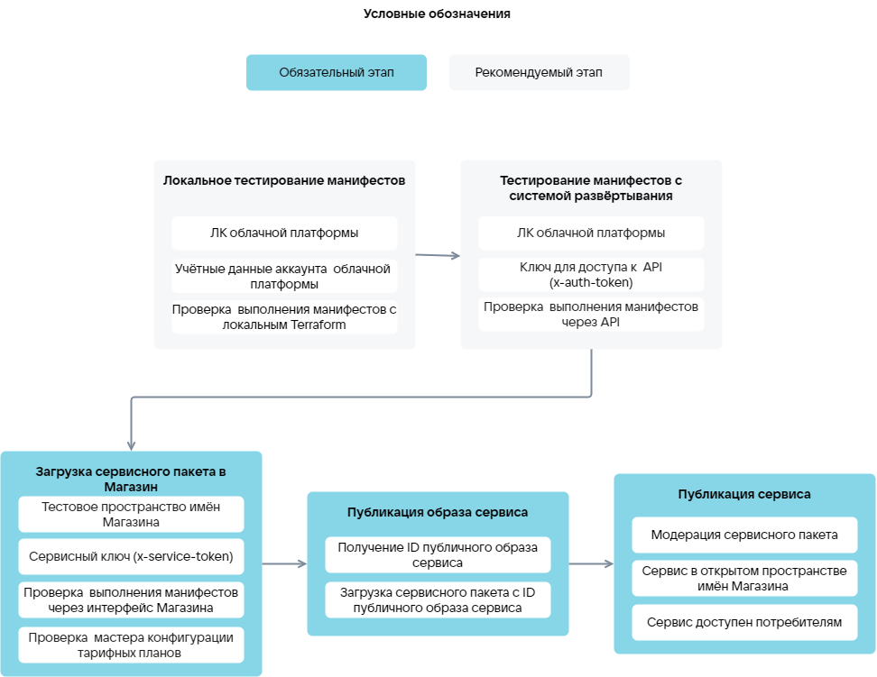

{include(/kz/_includes/_translated_by_ai.md)}

# {heading(Қызметті жүктеу кезеңдері)[id=ibservice_upload_phases]}

image-based қолданбасын жүктеу кезеңдері ({linkto(#pic_upload_phases)[text=%number сурет]}):

1. {linkto(../ibservice_upload_localtest#ibservice_upload_localtest)[text=%text]}.
1. {linkto(../ibservice_upload_deploysystemtest#ibservice_upload_deploysystemtest)[text=%text]}.
1. {linkto(../ibservice_upload_package#ibservice_upload_package)[text=%text]}.
1. {linkto(../ibservice_upload_publish_image#ibservice_upload_publish_image)[text=%text]}.
1. {linkto(../ibservice_upload_publish#ibservice_upload_publish)[text=%text]}.

{caption({counter(pic)[id=numb_pic_upload_phases]} сурет — image-based қолданбасын дүкенге жүктеу кезеңдері)[align=center;position=under;id=pic_upload_phases;number={const(numb_pic_upload_phases)} ]}
{params[noBorder=true]}
{/caption}

Terraform манифестерін тестілеу алдында бұлтты платформаның бұрыннан бар ресурстарының параметрлері (мысалы, ВМ түрі, қызмет образы) манифестерде дұрыс көрсетілгенін тексеріңіз. [VK CS провайдерінің деректер көздерін](https://github.com/vk-cs/terraform-provider-vkcs/tree/master/docs/data-sources) пайдаланыңыз. Terraform орнату және баптау {linkto(../ibservice_upload_localtest#ibservice_upload_localtest)[text=%text]} бөлімінде берілген.

{caption(Көрсетілген ВМ түрінің бұлтты платформада бар екенін тексеру мысалы)[align=left;position=above]}
```hcl
data "vkcs_compute_flavor" "compute" {
flavor_id = "4e115a9b-XXXX-95cf130d63c7"
}
```
{/caption}

{note:info}

Бұлтты платформаның қолданыстағы ресурстары параметрлерін тексеру манифестерді тестілеу уақытын қысқартады және қате конфигурациямен ресурстарды құру әрекеттерін болдырмайды.

{/note}
