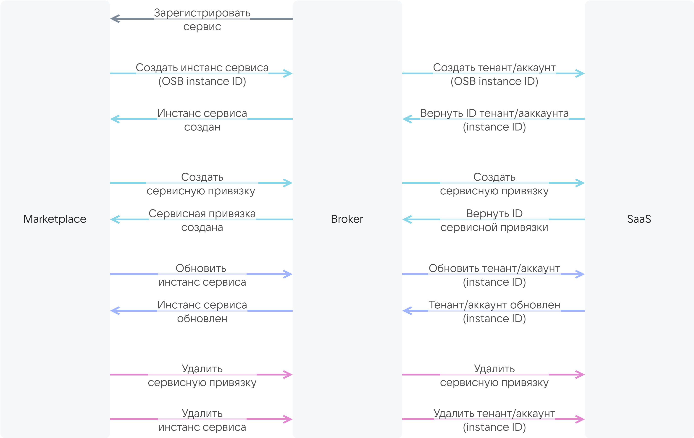

# {heading(SaaS-қосымшасына арналған брокер)[id=saas_broker]}

{include(/kz/_includes/_translated_by_ai.md)}

Дүкен сервиспен брокердің көмегімен өзара әрекеттеседі.

VK OSB протоколы бойынша SaaS-қосымшасына арналған брокерді әзірлеңіз. VK OSB протоколын алу үшін [marketplace@cloud.vk.com](mailto:marketplace@cloud.vk.com) мекенжайына хат жіберіңіз. Брокер сервис инстанстарының өмірлік циклін сипаттайтын әдістерді іске асыруы тиіс ({linkto(#pic_saas_broker)[text=сурет %number]}).

{caption(Сурет {counter(pic)[id=numb_pic_saas_broker]} — Брокердің дүкенмен және SaaS-қосымшасымен өзара әрекеттесуі)[align=center;position=under;id=pic_saas_broker;number={const(numb_pic_saas_broker)} ]}
{params[noBorder=true]}
{/caption}

Брокерде сенімді сертификаттау орталығы берген сертификаты бар қауіпсіз HTTPS протоколы бойынша basic-аутентификация бапталуы тиіс.

{note:err}

Өздігінен қол қойылған сертификаттарды пайдалануға тыйым салынады.

{/note}

Брокерді дүкен мен брокер арасындағы өзара әрекеттесу әлдеқашан іске асырылған шаблон негізінде әзірлеуге болады. Шаблонды нақты SaaS-қосымшасымен брокердің өзара әрекеттесуін сипаттау арқылы толықтыру қажет.

Шаблон негізінде брокерді әзірлеу үшін:

1. Брокер шаблонын алу үшін [marketplace@cloud.vk.com](mailto:marketplace@cloud.vk.com) мекенжайына хат жіберіңіз. Шаблон Python тілінде [FastAPI](https://fastapi.tiangolo.com/tutorial/first-steps/) фреймворкі негізінде әзірленген.
1. Сервис API-імен өзара әрекеттесуге арналған клиентті әзірлеңіз.
1. Брокер мен сервистің өзара әрекеттесуін сипаттайтын сервистік менеджерді әзірлеңіз:

   1. Кіріс ретінде мыналарды қабылдайтын tenant/account жасау әдісін іске асырыңыз:

      * Сервисті қосу кезінде дүкен қалыптастыратын сервис инстансының OSB ID идентификаторы. OSB ID SaaS-қосымшасына беріледі, осылайша SaaS-қосымшасы сервис инстансының ID идентификаторын қалыптастырады. Сервис инстансының ID идентификаторы төменде сипатталған әдістерде пайдаланылады.
      * Тарифтік жоспардың ID идентификаторы.
      * JSON-файлдағы `plans.schemas.service_instance.create` секциясында сипатталған жоспардың тарифтік опциялары.
      * Контекст (опционалды). Контекст пайдаланушы туралы ақпаратты қамтиды (email, OpenStack PID).

   1. Кіріс ретінде мыналарды қабылдайтын tenant/account жаңарту әдісін іске асырыңыз:

      * Сервис инстансының ID идентификаторы.
      * Тарифтік жоспардың ID идентификаторы.
      * JSON-файлдағы `plans.schemas.service_instance.update` секциясында сипатталған жоспардың тарифтік опциялары.

   1. Кіріс ретінде сервис инстансының ID идентификаторын қабылдайтын tenant/account алу және жою әдістерін іске асырыңыз.
   1. Кіріс ретінде мыналарды қабылдайтын сервистік байланыстыруларды жасау әдісін іске асырыңыз:

      * Сервис инстансының ID идентификаторы.
      * JSON-файлдағы `plans.schemas.service_binding.create` секциясында сипатталған сервистік байланыстыру параметрлері.
      * Контекст (опционалды). Контекст пайдаланушы туралы ақпаратты қамтиды (email, OpenStack PID).

   1. Кіріс ретінде мыналарды қабылдайтын сервистік байланыстыруларды алу және жою әдістерін іске асырыңыз:

      * Сервис инстансының ID идентификаторы.
      * Сервистік байланыстырудың ID идентификаторы.

1. Клиентті сервистік менеджерге интеграциялаңыз.
1. Брокерде аутентификацияны баптаңыз.

Егер SaaS-қосымшасында кейін төленетін тарифтік опциялар болса және олар бойынша метрикалар pull-моделі бойынша жиналса (толығырақ — {linkto(#billing)[text=%text]} бөлімінде), қосымша әрекеттерді орындаңыз:

1. Сервистік менеджерде SaaS-қосымшасының нақты пайдаланылған ресурстары бойынша есепті алу әдісін іске асырыңыз. Сұрауға жауап ретінде брокер дүкенге есепті жіберуі тиіс.

   {caption(SaaS-қосымшасының нақты пайдаланылған ресурстары туралы есептің мысалы)[align=left;position=above]}
   ```json
   {
     "batch_id": 35,
     "data": [
        {
         "kind": "vms",
         "type": "cb",
         "unit": "month",
         "price": 600.0,
         "value": 1.0,
         "plan_uuid": "2f070fe3-3e31-4482-bad4-a4d0c36bab31",
         "instance_uuid": "d1dff97c-df6c-45a7-95e1-b539a8d77721"
       },
       {
         "kind": "storage",
         "type": "cb",
         "unit": "GB-month",
         "price": 3.3,
         "value": 2.4474525451660156,
         "plan_uuid": "2f070fe3-3e31-4482-bad4-a4d0c36bab31",
         "instance_uuid": "d1dff97c-df6c-45a7-95e1-b539a8d77721"
       },
       {
         "kind": "vms",
         "type": "cb",
         "unit": "month",
         "price": 600.0,
         "value": 0.0,
         "plan_uuid": "354df2fa-5ec3-45e1-b99b-7d45840cf3df",
         "instance_uuid": "3910e993-63f0-4a90-95d7-5eea35785c29"
       },
       {
         "kind": "storage",
         "type": "cb",
         "unit": "GB-month",
         "price": 3.3,
         "value": 0.0,
         "plan_uuid": "354df2fa-5ec3-45e1-b99b-7d45840cf3df",
         "instance_uuid": "3910e993-63f0-4a90-95d7-5eea35785c29"
       },
       {
         "kind": "storage",
         "type": "cb",
         "unit": "GB-month",
         "price": 7.0,
         "value": 0.0,
         "plan_uuid": "d719f348-3497-4341-8465-a438bfcc2d96",
         "instance_uuid": "f10e67be-dfd7-4dcd-917c-4bfd3cd64ce2"
       }
     ]
   }
   ```
   {/caption}

   Мұнда:

   * `batch_id` — брокер қалыптастырған есептің ID идентификаторы.
   * `kind` — тарифтік опцияның атауы. Сервис конфигурациясы бар файлда пайдаланылатын атауға сәйкес келуі тиіс.
   * `type` — сервис атауы. Сервис конфигурациясы бар файл атауында көрсетілген `SERVICE_NAME` мәніне сәйкес келуі тиіс (`catalog_<SERVICE_NAME>.json`).
   * `unit` — опцияның өлшем бірлігі.
   * `price` — айына опция бірлігінің құны. Сервис конфигурациясы бар файлда көрсетілген нақты опцияның `plans.billing.options.cost` мәніне сәйкес келуі тиіс.
   * `value` — SaaS-қосымшасы қалыптастырған ай ішіндегі опцияның нақты пайдаланылған саны.
   * `plan_uuid` — тарифтік жоспардың ID идентификаторы.
   * `instance_uuid` — сервистің инстансының (tenant/account) ID идентификаторы.

1. Сервистік менеджерде брокерге есептің өңделгені туралы хабарлау әдісін іске асырыңыз (есеп бойынша ақшаны есептен шығару орын алды немесе жоспарланған).
