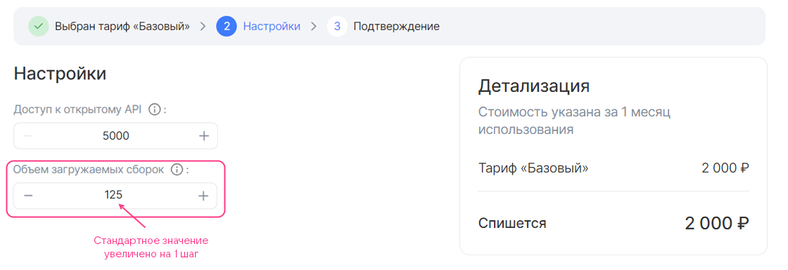

## {heading(Құрылым)[id=saas_plan_structure]}

{include(/kz/_includes/_translated_by_ai.md)}

`plans` секциясында сервис тарифтік жоспарларын келесі құрылым бойынша сипаттаңыз:

```json
      "plans": [
        {
          <PLAN_PARAMETERS>,
          "display": {
          },
          "billing": {
          },
          "schemas": {
          }
        },
        ...
      ]
```

Мұнда:

* `<PLAN_PARAMETERS>` — жоспар параметрлері (толығырақ {linkto(#saas_plan_param)[text=%text]} бөлімінде).
* `display` секциясы — нақты тарифтік жоспардың конфигурация шеберін сипаттайды (толығырақ {linkto(#saas_plan_display)[text=%text]} бөлімінде).
* `billing` секциясы — жоспардың және оның опцияларының құнын сипаттайды (толығырақ {linkto(#saas_plan_billing)[text=%text]} бөлімінде).
* `schemas` секциясы — жоспардың тарифтік опцияларын сипаттайды (толығырақ {linkto(#saas_plan_schema)[text=%text]} бөлімінде).

## {heading(Тарифтік жоспар параметрлері)[id=saas_plan_param]}

Тарифтік жоспар үшін {linkto(#tab_plan_params)[text=%number кестесінде]} келтірілген параметрлерді көрсетіңіз.

{caption(Кесте {counter(table)[id=numb_tab_plan_params]} — Тарифтік жоспар параметрлері)[align=right;position=above;id=tab_plan_params;number={const(numb_tab_plan_params)}]}
[cols="2,4,2,1,2", options="header"]
|===
|Атауы
|Сипаттамасы
|Форматы
|Міндетті
|Әдепкі мәні

|id
|
UUID4 генераторының көмегімен жасалған UUID4 тарифтік жоспар идентификаторы (ID)
|string (UUID4)
| 
| 

|revision
|
Тарифтік жоспар ревизиясы. Тарифтік жоспар ревизиясы мен ID тіркесімі оның сервистегі бірегейлігін анықтайды. Қалған параметрлер тарифтік жоспардың нақты ревизиясының сипаттамаларын сипаттайды
|string, 255 таңбаға дейін
| 
| 

|name
|
Дүкен интерфейсінде көрсетілмейтін тарифтік жоспардың техникалық атауы. Бос орындардың орнына төменгі сызықша белгісін пайдаланып, латын әріптерімен көрсетілуі тиіс
|string, 255 таңбаға дейін
| 
| 

|description
|
Дүкен интерфейсінде көрсетілетін тарифтік жоспар атауы
|string, 255 таңбаға дейін
| 
| 

|free
|
Тарифтік жоспардың тегін екенін не еместігін анықтайды
|boolean
| 
| 

|plan_updateable
|Пайдаланушы сервисті жоймай-ақ бір тарифтік жоспардан екіншісіне өте ала ма, соны анықтайды.

Сервистің осы аттас параметрінде берілген мәнді қайта анықтайды
|boolean
| 
| 

|metadata
|Тарифтік жоспар қолжетімді болатын дүкеннің тестілік және ашық атаулар кеңістіктерін анықтайды.

Тестілік атаулар кеңістіктері `test_ns` кілтінде беріледі.

Ашық атаулар кеңістіктері `prod_ns` кілтінде беріледі.

Атаулар кеңістіктерінің атауларын алу үшін [marketplace@cloud.vk.com](mailto:marketplace@cloud.vk.com) мекенжайына хат жіберіңіз.

Егер атаулар кеңістіктері берілмесе, сервистің осы аттас параметрінде көрсетілген мәндер пайдаланылады (толығырақ — {linkto(../saas_param#saas_param)[text=%text]} бөлімінде)
|map, кілттер — string
| 
| 
|===
{/caption}

{note:err}

Тарифтік жоспар ID мен ревизиясының тіркесімі сервис шегінде бірегей болуы керек. Егер осы сервисте дәл осындай идентификаторы мен ревизиясы бар жоспар бұрыннан бар болса, тарифтік жоспар жаңартылмайды.

{/note}

## {heading(`display` секциясы)[id=saas_plan_display]}

`display` секциясында тарифтік жоспардың конфигурация шеберін (толығырақ {linkto(/kz/tools-for-using-services/vendor-account/manage-apps/concepts/about#xaas_wizard)[text=%text]} бөлімінде) келесі құрылым бойынша сипаттаңыз:

```json
"display": {
  "pages": [
    {
      <PAGE_PARAMETERS>,
      "groups": [
        {
          <GROUP_PARAMETERS>,
          "parameters": [
            {
              <OPTION_PARAMETERS>
            },
            ...
          ]
        }
        ...
      ]
    },
  ...
  ]
}
```

Мұнда:

* `pages` секциясы — тарифтік жоспар конфигурациясы шеберінің беттерін сипаттайды. Бос болуы мүмкін.
* `<PAGE_PARAMETERS>` — бір беттің параметрлері.
* `groups` секциясы — бір бет шеңберіндегі тарифтік опциялар топтарын сипаттайды.
* `<GROUP_PARAMETERS>` — тарифтік опциялар тобының параметрлері.
* `parameters` секциясы — бір топ шеңберіндегі тарифтік опцияларды анықтайды.

   {note:warn}

   Бір тарифтік опция тек бір топта ғана көрсетілуі мүмкін.

   {/note}
* `<OPTION_PARAMETERS>` — тарифтік опциялар параметрлері.

`display` секциясында тарифтік жоспар конфигурациясы шеберінің бірінші және соңғы беттерінен басқа барлық беттері сипатталады. Беттердің ең көп саны — 5.

Беттердің, топтардың және топтардағы тарифтік опциялардың параметрлері бірдей және {linkto(#tab_plan_params)[text=%number кестесінде]} келтірілген.

{caption(Кесте {counter(table)[id=numb_tab_plan_params]} — Тарифтік жоспар конфигурациясы шеберіне арналған беттердің, топтардың және тарифтік опциялардың параметрлері)[align=right;position=above;id=tab_plan_params;number={const(numb_tab_plan_params)}]}
[cols="2,5,4,2", options="header"]
|===
|Атауы
|Сипаттамасы
|Форматы
|Міндетті

|name
|
JSON-файлдағы беттің, топтың немесе тарифтік опцияның атауы.

{note:warn}

Дүкен интерфейсінде тарифтік опциялар осы опциялардың `description` параметрінде берілген атаулармен көрсетіледі (`plans.schemas` секциясы).

{/note}
|
string.

Бет атауы — 32 таңбаға дейін.

Топ атауы — 255 таңбаға дейін
| 

|index
|
Беттің, беттегі топтың немесе топтағы тарифтік опцияның реттік нөмірі
|
integer
| 
|===
{/caption}

{linkto(#pic_wizard_saas)[text=%number суретінде]} келтірілген тарифтік жоспар конфигурациясы шебері `display` секциясының келесі мазмұнына сәйкес келеді:

```json
"display": {
  "pages": [
    {
      "name": "Настройки", // Имя страницы
      "index": 0,
      "groups": [
        {
          "name": "", // Имя группы
          "index": 0,
          "parameters": [
            {
              "name": "api_requests_daily_limit", // Имя тарифной опции в JSON-файле
              "index": 0,
            },
            {
              "name": "groups",
              "index": 1,
            },
            {
              "name": "products",
              "index": 2,
            },
            {
              "name": "reports",
              "index": 3
            }
          ]
        }
      ]
    }
  ]
}
```

{caption(Сурет {counter(pic)[id=numb_pic_wizard_saas]} — Тарифтік жоспар конфигурациясының шебері)[align=center;position=under;id=pic_wizard_saas;number={const(numb_pic_wizard_saas)} ]}

{/caption}

Әдепкі бойынша тарифтік жоспар конфигурациясы шеберінде `groups` тарифтік опцияларының барлық топтары көрсетіліп, бапталады. Топ тек белгілі бір шарттарда ғана көрсетілуі үшін `when` конструкциясын қолданыңыз. Конструкция сипаттамасы {linkto(/kz/tools-for-using-services/vendor-account/manage-apps/ibservice_add/ibservice_configure/ib_display#IBdisplay_when)[text=%text]} бөлімінде келтірілген.

{note:warn}

Брокер `when` конструкцияларында берілген шарттарды ескере отырып, сервис инстансын жасауды қолдауы керек.

{/note}

{caption(JSON форматындағы `when` құрылымы)[align=left;position=above]}
```json
{
  "when": {
    "in": { // Или "not_in"
      "key": {
        "param": "<OPTION>" // Или "const": "<VALUE>"
      },
      "values": [
        {
          "const": "<VALUE>"
        },
        {
          "param": "<OPTION>"
        },
      ...
      ]
    }
  },
  "parameters": [
  ...
  ]
}
```
{/caption}

Мұнда:

* `<OPTION>` — JSON-файлдағы тарифтік опцияның атауы.
* `<VALUE>` — тұрақтының мәні.

`pages` секциясындағы `when` конструкциясы image-based қосымшалардағыдай қолданылады (толығырақ {linkto(/kz/tools-for-using-services/vendor-account/manage-apps/ibservice_add/ibservice_configure/ib_display#IBdisplay_when_in_pages)[text=%text]} бөлімінде).

{caption(`pages` секциясында when конструкциясын пайдалану мысалы)[align=left;position=above]}
```json
{
  "pages": [
    {
      "name": "Настройки бекапа", // Имя страницы
      "groups": [
        {
          "name": "High-frequency бекап", // Имя группы тарифных опций
          "parameters": [
            {
              "name": "frequency_per_day" // Имя тарифной опции в JSON-файле
            }
          ],
          "when": {
            "in": {
              "key": {
                "param": "backup_method" // Имя тарифной опции в JSON-файле
              },
              "values": [
                {
                  "const": "high-frequency"
                }
              ]
            }
          }
        }
      ]
    }
  ]
}
```
{/caption}

Жоғарыдағы мысалда high-frequency әдісі үшін бэкаптарды жасау жиілігі бапталады: егер `backup_method` тарифтік опциясының мәні `high-frequency` болса, тарифтік жоспар конфигурациясы шеберінде `frequency_per_day` тарифтік опциясы бар `High-frequency бекап` тобын көрсету керек.

`backup_method` тарифтік опциясы:

* Басқа топтарда `when` конструкциясында қолданылуы мүмкін.
* Басқа топтағы `parameters` ішінде берілуі тиіс.

`frequency_per_day` тарифтік опциясын басқа топтарда қолдануға болмайды:

* `when` конструкциясында, себебі тәуелділіктер иерархиясының бір деңгейі ғана қолдау көрсетіледі.
* `parameters` ішінде, себебі бір тарифтік опция тек бір топта ғана көрсетілуі мүмкін.

## {heading(`billing` секциясы)[id=saas_plan_billing]}

`billing` секциясында мыналар көрсетіледі:

* Нақты тарифтік жоспардың құны.
* Тарификацияға арналған есептік кезеңнің ұзақтығы.
* Marketplace брокерден ресурстарды пайдалану туралы есептерді қандай жиілікпен сұрататыны.
* Пайдаланылмаған бонустармен жасалатын әрекеттер тәртібі.
* `integer` типті тарифтік опциялар үшін пайдаланушылық өзгерту қадамы.
* Жоспардың тарифтік опцияларының құны. Келесі типтегі опциялар ақылы болуы мүмкін:

  * Сандық (`integer`, `number`). Алдын ала төленетін және кейін төленетін тарификацияға қолдау көрсетіледі.
  * Логикалық (`boolean`). Алдын ала төленетін тарификацияға қолдау көрсетіледі.

Тарификация түрлері туралы толығырақ {linkto(/kz/tools-for-using-services/vendor-account/manage-apps/concepts/about#xaas_billing)[text=%text]} бөлімінде сипатталған.

{note:warn}

Бір тарифтік жоспар шеңберінде тек бір типтегі тарификация опцияларына рұқсат етіледі: алдын ала төленетін опциялары бар тарифтік жоспар немесе кейін төленетін опциялары бар тарифтік жоспар.

{/note}

Қолданылатын тарификация тәсілі `plans.schemas` секциясындағы тарифтік опциялардың сипатталу орнына қарай анықталады (толығырақ {linkto(#saas_plan_schema)[text=%text]} бөлімінде):

* Егер опциялар `service_instance.create` және `service_instance.update` секцияларында сипатталса, алдын ала төленетін тарификация қолданылады.
* Егер опциялар `service_instance.resource_usages` секциясында сипатталса, кейін төленетін тарификация қолданылады.

`billing` секциясын келесі құрылым бойынша сипаттаңыз:

```json
"billing": {
            "cost": <COST>,
            "billing_cycle_flat": <PERIOD>,
            "billing_cycle_step": <STEP>,
            "refundable": <IS_REFUNDABLE>,
            "options": {
              "<OPTION>": {
                <OPTION_BILLING>
                },
              ...
              }
            }
```

Мұнда:

* `cost` параметрі — ақылы тарифтік опцияларды есепке алмағанда, `<COST>` есептік кезеңіне арналған жоспар құнын анықтайды. Дүкен өрістетілген елдің валютасында беріледі. Егер жоспар тегін болса, `0` көрсетіледі. Тек алдын ала төленетін тарификацияға қолдау көрсетіледі.
* (Қосымша) `billing_cycle_flat` параметрі — тарификацияға арналған есептік кезеңнің ұзақтығын анықтайды. Тек алдын ала төленетін тарифтік жоспар үшін көрсетуге болады. Әдепкі бойынша — `1 mons 0 days`.

  Келесі форматта беріледі: `<АЙЛАР_САНЫ> mons <КҮНДЕР_САНЫ> days`, мысалы: `1 mons 15 days`, `30 days`. `mons` айындағы күндер саны күнтізбелік мән негізінде есептеледі, сондықтан `1 mons 0 days` және `0 mons 31 days` кезеңдері өзара тең емес.

* (Қосымша) `billing_cycle_step` параметрі — дүкен брокерден өңделмеген есептердің бар-жоғын қандай кезеңмен сұрайтынын анықтайды (толығырақ [Тарификация](../../../concepts/about#xaas_billing) бөлімінде). Тек кейін төленетін тарифтік опциялары бар тарифтік жоспар үшін көрсетуге болады. Әдепкі бойынша — `1 mons 0 days`.

  Келесі форматта беріледі: `<АЙЛАР_САНЫ> mons <КҮНДЕР_САНЫ> days`, мысалы: `1 mons 15 days`, `30 days`. `mons` айындағы күндер саны күнтізбелік мән негізінде есептеледі, сондықтан `1 mons 0 days` және `0 mons 31 days` кезеңдері өзара тең емес.

* (Қосымша) `refundable` параметрі — егер пайдаланушы тарифтік жоспарды өзгерткен немесе сервис инстансын жойған болса, есептік кезеңнің қалған күндері үшін қаражатты жобаның бонустық шотына қайтару керек пе, соны анықтайды. Тек алдын ала төленетін тарифтік жоспар үшін көрсетуге болады. Әдепкі бойынша — `true`.

  Параметр пайдаланушы тарифтік жоспарды өзгерткен кезде (тарифтік опцияларды өңдегенде немесе жаңасына өткенде) сервис үшін төлемді есептен шығару күніне әсер етеді:

  * Егер мән `true` болса, күн өзгермейді.
  * Егер мән `false` болса, күн тарифтік жоспар өзгерген күнге жаңартылады.

* (Қосымша) `options` секциясы — ақылы тарифтік опциялардың құнын сипаттайды.

  * `<OPTION>` — JSON-файлдағы тарифтік опцияның атауы.
  * `<OPTION_BILLING>` — тарифтік опция құны және `integer` типті опция үшін өзгерту қадамының параметрлері. Тарифтік опцияның өзі (типі, мәнді баптау параметрлері) {linkto(#saas_plan_schema)[text=%text]} секциясында сипатталады.

{note:info}

Дүкенде сервисті тестілеу және жөндеу үшін берілетін бонустарды тиімді пайдалану үшін (толығырақ {linkto(../../saas_upload/saas_upload_testmarketplace#saas_upload_testmarketplace)[text=%text]} бөлімінде), тарифтік жоспар мен оның опцияларының тестілік құнын көрсетіңіз.

{/note}

### {heading(Пайдаланушылық өзгерту қадамы бар `integer` типті тегін тарифтік опциясы бар `billing` секциясы)[id=option_int_step_free]}

`<OPTION_BILLING>` ішіндегі `integer` типті тарифтік опцияның өзгерту қадамы image-based қосымшадағыдай параметрлермен сипатталады (толығырақ {linkto(/kz/tools-for-using-services/vendor-account/manage-apps/ibservice_add/ibservice_configure/iboption#iboption_billing)[text=%text]} бөлімінде).

Опция тегін болуы үшін `billing.options.<OPTION>.cost` параметрінде `0` көрсетіңіз.

{caption(Өзгерту қадамы бар `integer` типті тегін тарифтік опциясы бар жоспар үшін `billing` секциясын сипаттау мысалы)[align=left;position=above]}
```json
"billing": {
  "cost": 2000,  // Стоимость тарифного плана
  "options": {
    "quantity": { // Имя опции в JSON-файле
      "base": 25, // Стандартное значение опции
      "cost": 0, // Стоимость шага изменения опции
      "unit": {
        "size": 100 // Шаг изменения опции
      }
    }
  }
}
```
{/caption}

Жоғарыда сипатталған тарифтік жоспар мен опция тарифтік жоспар конфигурациясы шеберінде қалай көрсетілетіні 1, 2, 3-суреттерде келтірілген.

{caption(Сурет {counter(pic)[id=numb_pic_option_int_step_prepayed]} — Өзгерту қадамы бар `integer` типті тегін опциясы бар тарифтік жоспар (base = 25, size = 100))[align=center;position=under;id=pic_option_int_step_prepayed;number={const(numb_pic_option_int_step_prepayed)} ]}
{params[width=90%]}
{/caption}

{caption(Сурет {counter(pic)[id=numb_pic_option_int_step_free]} — Өзгерту қадамы бар `integer` типті тегін опциясы бар тарифтік жоспар, опция мәні 1 қадамға арттырылған (base = 25, size = 100))[align=center;position=under;id=pic_option_int_step_free;number={const(numb_pic_option_int_step_free)} ]}
{params[width=90%]}
{/caption}

{caption(Сурет {counter(pic)[id=numb_pic_option_int_step_free1]} — Өзгерту қадамы бар `integer` типті тегін опциясы бар тарифтік жоспар, опция мәні 2 қадамға арттырылған (base = 25, size = 100))[align=center;position=under;id=pic_option_int_step_free1;number={const(numb_pic_option_int_step_free1)} ]}
{params[width=90%]}
{/caption}

### {heading(Өзгерту қадамы бар `integer` типті алдын ала төленетін тарифтік опциясы бар `billing` секциясы)[id=option_int_step_prepaid]}

`<OPTION_BILLING>` ішіндегі `integer` типті алдын ала төленетін тарифтік опцияның құны мен өзгерту қадамы image-based қосымшадағыдай параметрлермен сипатталады (толығырақ {linkto(/kz/tools-for-using-services/vendor-account/manage-apps/ibservice_add/ibservice_configure/iboption#iboption_billing)[text=%text]} бөлімінде).

Опция алдын ала төленетін болуы үшін `billing.options.<OPTION>.cost` параметрінде 1 өзгерту қадамының құнын көрсетіңіз.

{caption(Өзгерту қадамы бар `integer` типті алдын ала төленетін тарифтік опциясы бар жоспар үшін `billing` секциясын сипаттау мысалы)[align=left;position=above]}
```json
"billing": {
  "cost": 2000, // Стоимость тарифного плана
  "options": {
    "quantity": { // Имя опции в JSON-файле
      "base": 25, // Стандартное значение опции
      "cost": 150, // Стоимость шага изменения опции
      "unit": {
        "size": 100 // Шаг изменения опции
      }
    }
  }
}
```
{/caption}

Жоғарыда сипатталған тарифтік жоспар мен опция тарифтік жоспар конфигурациясы шеберінде қалай көрсетілетіні 4, 5, 6-суреттерде келтірілген.

{caption(Сурет {counter(pic)[id=numb_pic_option_int_step_prepayed4]} — Өзгерту қадамы бар `integer` типті алдын ала төленетін опциясы бар тарифтік жоспар (base = 25, size = 100))[align=center;position=under;id=pic_option_int_step_prepayed4;number={const(numb_pic_option_int_step_prepayed4)} ]}
{params[width=90%]}
{/caption}

{caption(Сурет {counter(pic)[id=numb_pic_option_int_step_prepayed1]} — Өзгерту қадамы бар `integer` типті алдын ала төленетін опциясы бар тарифтік жоспар, опция мәні 1 қадамға арттырылған (base = 25, size = 100))[align=center;position=under;id=pic_option_int_step_prepayed1;number={const(numb_pic_option_int_step_prepayed1)} ]}
{params[width=90%]}
{/caption}

{caption(Сурет {counter(pic)[id=numb_pic_option_int_step_prepayed2]} — Өзгерту қадамы бар `integer` типті алдын ала төленетін опциясы бар тарифтік жоспар, опция мәні 2 қадамға арттырылған (base = 25, size = 100))[align=center;position=under;id=pic_option_int_step_prepayed2;number={const(numb_pic_option_int_step_prepayed2)} ]}
{params[width=90%]}
{/caption}

### {heading(`boolean` ауыстырғыш тарифтік опциясы бар алдын ала төленетін `billing` секциясы)[id=option_boolean]}

`boolean` ауыстырғыш опциясы алдын ала төленетін болуы үшін `billing.options.<OPTION>.cost` параметрінде құнын көрсетіңіз.

{caption(`boolean` ауыстырғыш алдын ала төленетін тарифтік опциясы бар жоспар үшін `billing` секциясын сипаттау мысалы)[align=left;position=above]}
```json
"billing": {
  "cost": 2000, // Стоимость тарифного плана
  "options": {
    "notifications": { // Имя опции в JSON-файле
      "cost": 50 // Стоимость опции
    }
  }
}
```
{/caption}

{linkto(#pic_option_bool)[text=%number суретінде]} жоғарыда сипатталған тарифтік жоспар мен опция тарифтік жоспар конфигурациясы шеберінде қалай көрсетілетіні келтірілген.

{caption(Сурет {counter(pic)[id=numb_pic_option_bool]} — `boolean` ауыстырғыш алдын ала төленетін опциясы бар тарифтік жоспар)[align=center;position=under;id=pic_option_bool;number={const(numb_pic_option_bool)} ]}
{params[width=90%]}
{/caption}

### {heading(Сандық кейін төленетін тарифтік опциясы бар `billing` секциясы)[id=option_number]}

`<OPTION_BILLING>` ішіндегі `integer` немесе `number` типті кейін төленетін опцияның құны {linkto(#tab_option_number)[text=%number кестесінде]} келтірілген параметрлермен сипатталады.

{caption(Кесте {counter(table)[id=numb_tab_option_number]} — Сандық кейін төленетін тарифтік опция параметрлері)[align=right;position=above;id=tab_option_number;number={const(numb_tab_option_number)}]}
[cols="2,5,2,2", options="header"]
|===
|Атауы
|Сипаттамасы
|Форматы
|Міндетті

|cost
|
Тарифтік опция бірлігінің құнын анықтайды.

{note:warn}

Егер метрикаларды жинау pull-моделі бойынша жүргізілсе, құн дүкенге есепті беру үшін брокер әдісінде көрсетілген `price` мәніне сәйкес болуы тиіс (толығырақ {linkto(../../saas_broker#saas_broker)[text=%text]} бөлімінде).

{/note}
|float64, >= 0
| 

|unit
|
Опцияның өлшем бірліктерін анықтайды
| 
| 

4+|`unit` секциясының параметрлері

|unit.size
|
Опцияны тарификациялау қадамы. Мәні `1` болуы тиіс
|integer
| 

|unit.measurement
|
Опцияның өлшем бірліктерін анықтайды
|string, 255 таңбаға дейін
| 
|===
{/caption}

{note:warn}

Кейін төленетін тарифтік опциялар тек тегін тарифтік жоспарда ғана болуы мүмкін.

{/note}

{caption(Кейін төленетін `storage` тарифтік опциясы бар жоспар үшін `billing` секциясын сипаттау мысалы)[align=left;position=above]}
```json
"billing": {
  "cost": 0, // Стоимость тарифного плана
  "options": {
    "storage": { // Имя опции в JSON-файле
      "cost": 7,
      "unit": {
      "size": 1,
      "measurement": "ГБ"
      }
    }
  }
}
```
{/caption}

Жоғарыдағы мысалда тарифтік жоспар тегін, `storage` тарифтік опциясының бірлігі 7 ақша бірлігіне тең ({linkto(#pic_option_postpaid)[text=%number сурет]}).

{caption(Сурет {counter(pic)[id=numb_pic_option_postpaid]} — Кейін төленетін опциясы бар тарифтік жоспар (billing.cost = 7, billing.unit.size = 1))[align=center;position=under;id=pic_option_postpaid;number={const(numb_pic_option_postpaid)} ]}
{params[width=70%]}
{/caption}

## {heading(`schemas` секциясы)[id=saas_plan_schema]}

`schemas` секциясында нақты жоспардың тарифтік опцияларын (толығырақ {linkto(/kz/tools-for-using-services/vendor-account/manage-apps/concepts/about#xaas_option_types)[text=%text]} бөлімінде) келесі құрылым бойынша сипаттаңыз:

```json
"schemas": {
            "service_instance": {
              "create": {
                "parameters": {
                  "$schema": "http://json-schema.org/draft-04/schema#",
                  "type": "object",
                  "properties": {
                  }
                }
              },
              "update": {
                "parameters": {
                  "$schema": "http://json-schema.org/draft-04/schema#",
                  "type": "object",
                  "properties": {
                  }
                }
              },
              "resource_usages": {
                "parameters": {
                  "$schema": "http://json-schema.org/draft-04/schema#",
                  "type": "object",
                  "properties": {
                  }
                }
              }
            },
            "service_binding": {
              "create": {
                "parameters": {
                  "type": "object",
                  "properties": {
                  }
                }
              }
            }
          }
```

Мұнда:

* `service_instance` секциясы — жоспардың тарифтік опцияларын сипаттайды және ақылы опциялар үшін қаражатты есептен шығару тәсілін анықтайды.

   * `service_instance.create` секциясы — сервисті қосу кезінде тарифтік жоспар конфигурациясы шеберінде белсенді болатын тегін және алдын ала төленетін тарифтік опцияларды сипаттайды.
   * `service_instance.update` секциясы — сервис тарифтік жоспарын жаңарту кезінде тарифтік жоспар конфигурациясы шеберінде белсенді болатын тегін және алдын ала төленетін тарифтік опцияларды сипаттайды.
   * `service_instance.resource_usages` секциясы — кейін төленетін тарифтік опцияларды сипаттайды.

   {note:warn}

   Барлық кейін төленетін тарифтік опциялар брокерде сипатталуы тиіс (толығырақ {linkto(../../saas_broker#saas_broker)[text=%text]} бөлімінде).

   {/note}
* `service_binding` секциясы — сервистік байланыстарды жасауды сипаттайды.

{note:warn}

Бір тарифтік жоспар шеңберінде тек бір тарификация типіндегі опциялар ғана болуы мүмкін. Мыналар сипатталуы мүмкін:

* Тек `service_instance.create` және `service_instance.update` секциялары (екеуі де немесе тек біреуі).
* Немесе тек `service_instance.resource_usages` секциясы.

{/note}

`schemas` ішіндегі барлық секциялар JSON-файлда жариялануы міндетті. Секциялар бос болуы мүмкін.

Тарифтік опция параметрлері JSON-схемалармен сипатталады. Ақылы опциялардың құны, сондай-ақ `integer` типті опция үшін өзгерту қадамы `plans.billing.options` секциясында сипатталады (толығырақ {linkto(#saas_plan_billing)[text=%text]} бөлімінде).

SaaS-қосымша үшін `datasource` түрінен басқа барлық тарифтік опция типтеріне қолдау көрсетіледі (толығырақ {linkto(/kz/tools-for-using-services/vendor-account/manage-apps/concepts/about#xaas_option_types)[text=%text]} бөлімінде). Тарифтік опциялар image-based қосымшадағыдай параметрлермен сипатталады (толығырақ {linkto(/kz/tools-for-using-services/vendor-account/manage-apps/ibservice_add/ibservice_configure/iboption#iboption_schema)[text=%text]} бөлімінде). Опция құны {linkto(#saas_plan_billing)[text=%text]} секциясында сипатталады.

Дүкен интерфейсінде әртүрлі опция типтерінің көрсетілу мысалдарымен `schema` секциясын толтыру {linkto(/kz/tools-for-using-services/vendor-account/manage-apps/ibservice_add/ibservice_configure/ibopt_fill_in#IB_option_fill_in)[text=%text]} бөлімінде сипатталған.

Төменде `JSON` форматында әртүрлі опция типтерін сипаттау мысалдары келтірілген.

{caption(Тегін және алдын ала төленетін тарифтік опциялар үшін `schemas` секциясын сипаттау мысалы)[align=left;position=above]}
```json
"schemas": {
            "service_instance": {
              "create": {
                "parameters": {
                  "$schema": "http://json-schema.org/draft-04/schema#",
                  "type": "object",
                  "properties": {
                    "int_const": {  // Тарифная опция-константа типа integer
                      "type": "integer",
                      "description": "Размер системного диска",
                      "hint": "В ГБ",
                      "const": 20
                    },
                    "int_enum": {  // Тарифная опция типа integer с выбором значения из списка
                      "type": "integer",
                      "description": "Количество серверов в кластере",
                      "enum": [3, 5, 7],
                      "default": 5
                    },
                    "int_step_1": {  // Тарифная опция типа integer с шагом изменения 1
                      "type": "integer",
                      "description": "Количество участников",
                      "hint": "Количество сотрудников компании заказчика, которые могут использовать инфраструктуру тестирования и обрабатывать отчеты от тестировщиков VK Testers.",
                      "default": 20,
                      "minimum": 20
                    },
                    "int_step_user": {  // Тарифная опция типа integer с пользовательским шагом изменения. Параметры шага описываются в секции billing
                      "type": "integer",
                      "description": "Объем загружаемых сборок",
                      "hint": "На платформу можно загружать тестовые сборки приложений для раздачи сотрудникам заказчика и тестировщикам VK Testers. Чем больше хранилище, тем больше версий ваших продуктов можно сохранять на платформе тестирования. Поддерживаемые платформы: iOS, Android, Windows, MacOS, Linux.",
                      "default": 0
                    },
                    "string_const": {  // Тарифная опция-константа типа string
                      "type": "string",
                      "description": "Логин администратора",
                      "const": "admin@example.ru"
                    },
                    "string_input": {  // Тарифная опция типа string с вводом значения
                      "type": "string",
                      "description": "Email администратора",
                      "hint": "Email для выпуска SSL-сертификата"
                    },
                    "string_enum": {  // Тарифная опция типа string с выбором значения из списка
                      "type": "string",
                      "description": "OS тип",
                      "hint": "Операционная система",
                      "enum": ["Ubuntu 20.4", "Windows 8.1", "Windows 10"],
                      "default": "Windows 8.1"
                    },
                    "boolean_const": {  // Тарифная опция-константа типа boolean
                      "type": "boolean",
                      "description": "Premium поддержка",
                      "hint": "Техническая поддержка 24/7",
                      "const": false
                    },
                    "boolean": {  // Тарифная опция-переключатель типа boolean
                      "type": "boolean",
                      "description": "Уведомления об обновлениях",
                      "hint": "Получать ли на почту уведомления о новых версиях сервиса.",
                      "default": true
                    }
                  }
                }
              },
              "update": {
                "parameters": {
                  "$schema": "http://json-schema.org/draft-04/schema#",
                  "type": "object",
                  "properties": {
                  }
                }
              },
              "resource_usages": {
                "parameters": {
                  "$schema": "http://json-schema.org/draft-04/schema#",
                  "type": "object",
                  "properties": {
                  }
                }
              }
            },
            "service_binding": {
              "create": {
                "parameters": {
                  "type": "object",
                  "properties": {
                  }
                }
              }
            }
}
```
{/caption}

{caption(Кейін төленетін тарифтік опциялар үшін `schemas` секциясын сипаттау мысалы)[align=left;position=above]}
```json
"schemas": {
            "service_instance": {
              "create": {
                "parameters": {
                  "$schema": "http://json-schema.org/draft-04/schema#",
                  "type": "object",
                  "properties": {
                  }
                }
              },
              "update": {
                "parameters": {
                  "$schema": "http://json-schema.org/draft-04/schema#",
                  "type": "object",
                  "properties": {
                  }
                }
              },
              "resource_usages": {
                "parameters": {
                  "$schema": "http://json-schema.org/draft-04/schema#",
                  "type": "object",
                  "properties": {
                    "storage": {
                      "description": "Хранение в ДЦ Киберпротект для продуктов Бэкап Облачный",
                      "type": "number"
                    }
                  }
                }
              }
            },
            "service_binding": {
              "create": {
                "parameters": {
                  "type": "object",
                  "properties": {
                  }
                }
              }
            }
          }
```
{/caption}

{note:warn}

Егер метрикаларды жинау pull-моделі бойынша жүргізілсе, JSON-файлдағы опция атауы дүкенге есепті беру үшін брокер әдісінде көрсетілген `kind` мәніне сәйкес болуы тиіс (толығырақ {linkto(../../saas_broker#saas_broker)[text=%text]} бөлімінде).

Егер метрикаларды жинау push-моделі бойынша жүргізілсе, JSON-файлдағы опция атауы метрикаларды беру жөніндегі API-сұраудағы `param` мәніне сәйкес болуы тиіс (толығырақ {linkto(/kz/tools-for-using-services/vendor-account/manage-apps/concepts/about#billing_push)[text=%text]} бөлімінде).

{/note}
